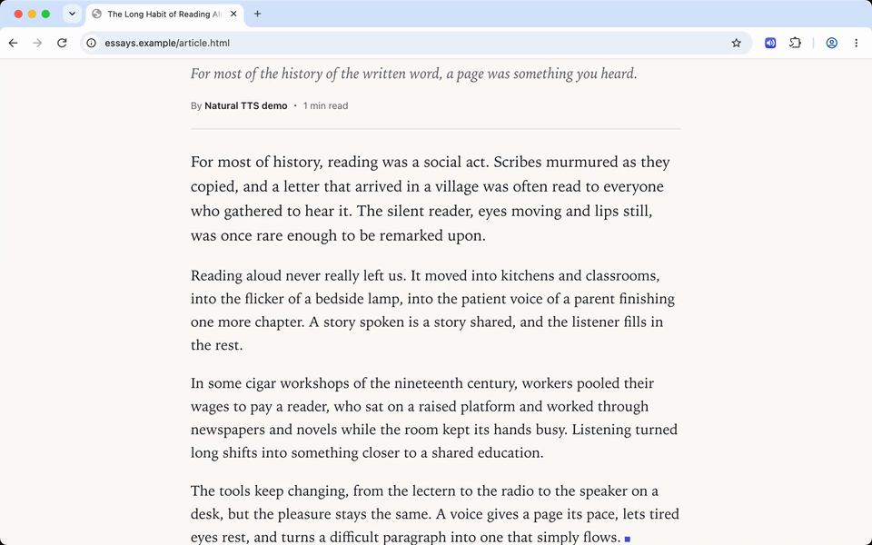
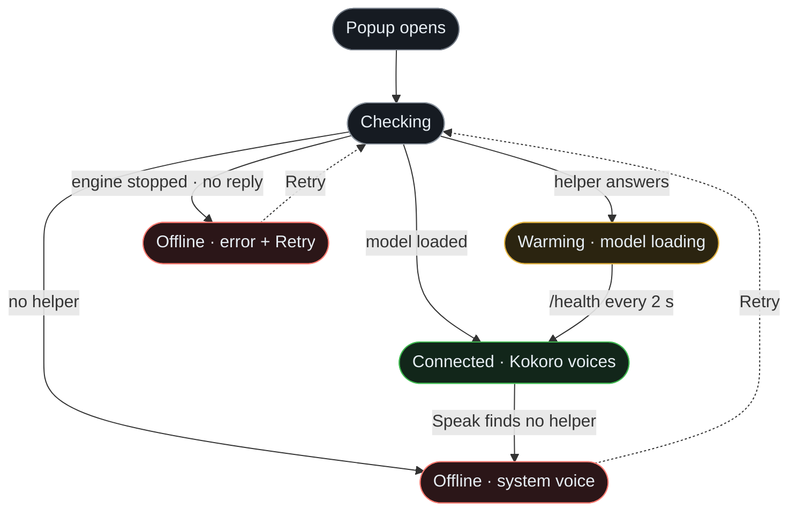
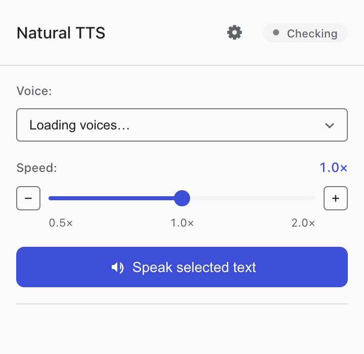
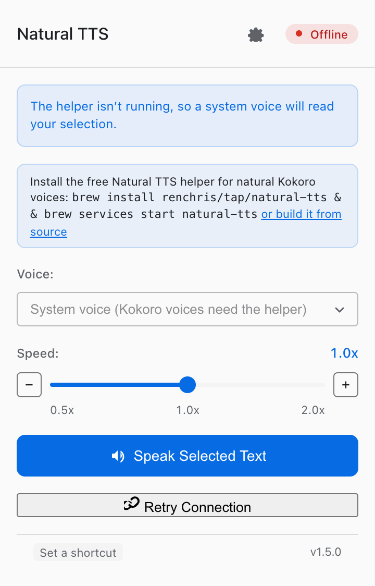
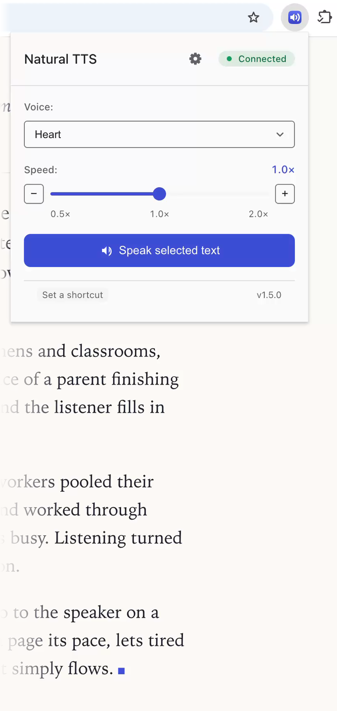
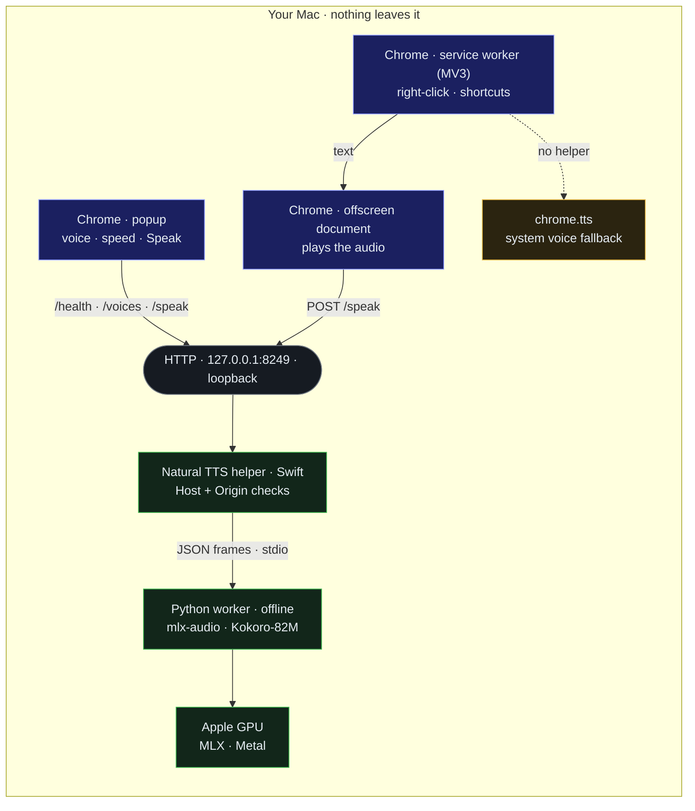
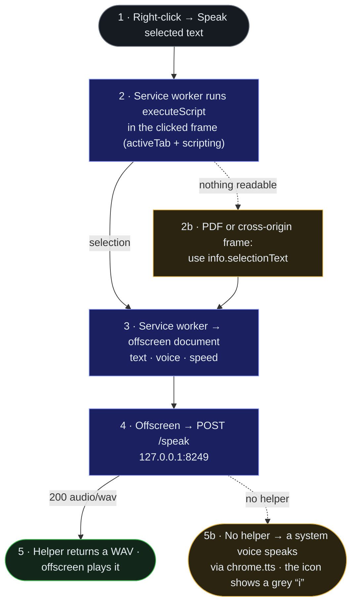

<p align="center">
  
</p>

<h1 align="center">Natural TTS: Private Kokoro Voices for Mac</h1>

<p align="center">
  <b>Select text in Chrome and hear it in a natural Kokoro voice, made on your Mac's GPU, not in the cloud.</b>
</p>

<p align="center">
  <a href="https://github.com/renchris/natural-text-to-voice-extension/actions/workflows/ci.yml"></a>
  <a href="LICENSE"></a>
</p>

- **Natural.** It sounds like a person reading, not a machine, in any of 28 English voices from Kokoro-82M, an open
  voice model. It also plays about as loud as your Mac's own voices.
  [The voices](#natural-a-person-reading-as-loud-as-your-macs-voices)
- **Private.** Nothing you select leaves your Mac. It goes only to a small helper app on this Mac (`127.0.0.1`) that
  makes the voice offline; when the helper isn't running, your Mac's built-in voices read it instead.
  [Check it yourself](#private-nothing-you-select-leaves-your-mac)
- **Fast.** On an M1 Max a sentence is ready in about 0.4 seconds and a 400-word page in about 7 to 8 seconds; the
  sound starts once the whole selection is ready. [How that was measured](#fast-a-sentence-in-under-half-a-second)

**Runs on** a Mac with Apple silicon and macOS 14.5 or later, in Chrome or another Chromium browser, version 148 or
later. Today you install it from source: one script builds the helper on your Mac, and Chrome loads the extension in
Developer mode. Once [v1.5.0 is released](https://github.com/renchris/natural-text-to-voice-extension/releases), Homebrew and a release zip can do the same. [Install](#install)

<!-- hero-video -->
<p align="center">
  <a href="assets/media/hero.mp4"></a>
</p>

<p align="center">
  <b>▶ Click to watch with sound.</b><br>
  <sub>Recorded on an M1 Max with voice af_heart (Heart) at speed 1.0× through helper 1.5.0. The voice is the helper's real output for the paragraph on screen; the picture above is a silent preview that opens <a href="assets/media/hero.mp4">the MP4 with sound</a>.</sub>
</p>

<details>
<summary>Transcript of the hero video</summary>

> Reading aloud never really left us. It moved into kitchens and classrooms, into the flicker of a bedside lamp, into
> the patient voice of a parent finishing one more chapter. A story spoken is a story shared, and the listener fills
> in the rest.

</details>

## Install

Install the helper, then the extension, and Chrome reads your selections in Kokoro voices. If the helper isn't
running, the extension still reads them, with your Mac's built-in voices.

**You need:**

- a Mac with Apple silicon, on macOS 14.5 (Sonoma) or later;
- Chrome, or another Chromium browser such as Edge, Brave, Opera, Vivaldi, Arc or Dia, version 148 or later;
- [Homebrew](https://brew.sh) and the Xcode 16.2+ Command Line Tools (`xcode-select --install`), because the helper
  is built on your Mac whichever way you install it;
- [Bun](https://bun.sh) 1.3 or later, to build the extension from source;
- about 1 GB of disk for the voice engine and its model, and room in memory for the engine to peak at about 3.7 GB
  while it reads a long selection (it settles back to about 0.7 GB).

### 1. Install the helper

If you already run a helper from before 1.5, [update it](#updating-a-helper-installed-from-source) instead.

**From source.** This works today.

```bash
git clone https://github.com/renchris/natural-text-to-voice-extension.git
cd natural-text-to-voice-extension
native-helper/Scripts/quickstart.sh
```

`quickstart.sh` installs what it needs with Homebrew (uv, espeak-ng, tmux, jq), builds the locked Python 3.12
environment and the release binary, downloads the model once, tests the helper, and leaves it running in a tmux
session named `natural-tts-helper`. It does not start again when you restart your Mac: until you run `quickstart.sh`
again, Chrome reads with a macOS voice and the toolbar icon shows a grey "i". Stop it with
`native-helper/Scripts/teardown.sh`. Step by step: [native-helper/QUICKSTART.md](native-helper/QUICKSTART.md).

**With Homebrew, once v1.5.0 is released.** The formula is published with the [v1.5.0 release](https://github.com/renchris/natural-text-to-voice-extension/releases); until then,
`brew install` does not find it.

```bash
brew install renchris/tap/natural-tts
brew services start natural-tts
```

Homebrew builds the helper and downloads the Kokoro model once, at install time; after that the helper never goes
online. `brew services` starts it now and at every login; `brew services stop natural-tts` stops it. Details:
[packaging/homebrew/README.md](packaging/homebrew/README.md).

### 2. Add the extension

**From your clone.** This works today. In the clone from step 1, build it with Bun:

```bash
cd chrome-extension && bun install && bun run build
```

Then open `chrome://extensions`, turn on **Developer mode**, choose **Load unpacked**, and select
`chrome-extension/dist`.

**From the release zip, once v1.5.0 is released.** Download `natural-tts-1.5.0.zip` from [Releases](https://github.com/renchris/natural-text-to-voice-extension/releases),
double-click it to unzip, and load the unzipped folder the same way.

**From the Chrome Web Store, once it is listed.** The listing is not live yet.

The extension finds the helper by itself, on this Mac (`127.0.0.1`), ports 8249 to 8260.

### 3. Speak a selection

Select text on a page or in a PDF, right-click, and choose **Speak selected text**. Or click the toolbar button to
open the popup, pick a voice and a speed, and press **Speak selected text**; the button turns into **Stop** while it
plays. To use the keyboard, assign keys to **Speak the selected text** and **Stop speaking** at
`chrome://extensions/shortcuts`. None are set by default, so nothing takes over a shortcut you already use.

One selection can hold up to 5,000 characters, about 750 words. A longer one is refused, with a message to select less.

### Updating a helper installed from source

A helper older than 1.5 was installed from source, and the extension shows "Update the Natural TTS helper" when it
finds one. In your checkout, run:

```bash
git pull && native-helper/Scripts/quickstart.sh
```

It rebuilds the helper, moves a pre-1.5 Python environment aside once, and restarts the helper in its tmux session.
If you started the old helper some other way, stop it first so the new one can take port 8249:
`lsof -nP -iTCP:8249 -sTCP:LISTEN` shows its PID, and `kill <PID>` stops it (or press Ctrl-C in the terminal it runs
in). To move to Homebrew once v1.5.0 is released, stop the source helper with `native-helper/Scripts/teardown.sh`
before `brew services start natural-tts`: while the old helper still answers on port 8249, the extension keeps using
it.

### Fixing what the popup or the toolbar icon reports

When Chrome doesn't read in a Kokoro voice, the pill at the top of the popup, the toolbar icon or a notice in the
popup says why, and each has one fix. Two commands check the helper itself.

<!-- Diagram source: assets/diagrams/popup-status.mmd. Edit it, run `bun run diagrams`, commit the SVGs. -->
<picture>
  <source media="(prefers-color-scheme: dark)" srcset="assets/diagrams/popup-status-dark.svg">
  
</picture>

<details>
<summary>Interactive Diagram</summary>

<!-- mermaid-fence: assets/diagrams/popup-status.mmd (auto-synced by `bun run diagrams`) -->


<sup><a href="assets/diagrams/popup-status-dark.svg?raw=true">full-screen dark</a> · <a href="assets/diagrams/popup-status-light.svg?raw=true">light</a> · <a href="assets/diagrams/popup-status.mmd">source</a></sup>

</details>

| Pill | What it means | What to do |
|---|---|---|
| **Checking** | The popup is looking for the helper on `127.0.0.1`, ports 8249 to 8260 | Nothing; it takes well under a second |
| **Warming** | The helper answered and is still loading the model | Wait a few seconds; the popup checks again every 2 s |
| **Connected** | Kokoro voices are ready | Speak |
| **Offline**, "a system voice will read your selection" | No helper answered, so a macOS voice reads instead | Start the helper: `native-helper/Scripts/quickstart.sh`, or `brew services start natural-tts` with Homebrew |
| **Offline**, with an error and **Retry connection** | The helper's voice engine stopped, the helper did not reply, or system voices are turned off in Options | Restart the helper (`quickstart.sh`, or `brew services restart natural-tts`), then press **Retry connection** |

<table>
  <tr>
    <td align="center" valign="top"><br><sub>Checking, then Connected</sub></td>
    <td align="center" valign="top"><br><sub>Offline, reading with a system voice</sub></td>
  </tr>
</table>

The toolbar icon and the popup's update notice:

- **A red "!" on the icon:** a right-click or shortcut failed. Hover over the icon for the reason.
- **A grey "i" on the icon:** the last selection was read in a system voice. Start or install the helper for Kokoro
  voices; the next Kokoro speech clears it.
- **"Update the Natural TTS helper":** your helper is older than 1.5. See
  [Updating a helper installed from source](#updating-a-helper-installed-from-source).

The two commands:

- **Is the helper up?** `curl -s http://127.0.0.1:8249/health` answers with a `status` of `ok` and the helper's
  `version`. If port 8249 was taken, the helper moved to the next free port up to 8260, and the extension finds it
  there.
- **Its log:** from source, `tmux attach -t natural-tts-helper` (detach with Ctrl-B, then D); with Homebrew,
  `$(brew --prefix)/var/log/natural-tts.log`.

## Why it's natural, private and fast

Each of the three claims at the top rests on something you can hear, read or run yourself.

### Natural: a person reading, as loud as your Mac's voices

The recording at the top is Heart, the default voice, reading a paragraph as the helper made it. There are 28 voices
in all, 20 American and 8 British, and the British ones use British pronunciation. Any of them reads at 0.5× to 2×
speed.

<p align="center">
  
</p>

Kokoro now plays about as loud as your Mac's own voices, so when the extension falls back to a system voice, or comes
back to Kokoro, you don't reach for the volume. It used to play noticeably quieter: 7 to 12 LU below the system
voice (a loudness unit, LU, is one decibel of loudness), where it is now 0 to 5 LU. The helper turns every response
up toward a loudness of −16 LUFS, but never lets its loudest peak past −1.5 dBTP, just under the most a file can
hold, so most speech lands between about −16 and −25 LUFS ([how that was measured](docs/research/2026-09-upgrade/W2-integration-measurements.md#10-loudness-normalization-w4-measured-2026-09-24)).

### Private: nothing you select leaves your Mac

Nothing you select leaves your Mac, and you don't have to take that on trust. Your selection makes one hop, to the
helper on this Mac (`127.0.0.1`): the extension hands it over, the helper's Python worker turns it into speech with
Kokoro-82M on the Apple GPU, and Chrome plays the WAV that comes back. If no helper answers, Chrome reads it with a
macOS voice instead, through `chrome.tts`. You can check the extension, the helper and its voice engine on your Mac,
and the fallback in its code.

<!-- Diagram source: assets/diagrams/architecture.mmd. Edit it, run `bun run diagrams`, commit the SVGs. -->
<picture>
  <source media="(prefers-color-scheme: dark)" srcset="assets/diagrams/architecture-dark.svg">
  
</picture>

<details>
<summary>Interactive Diagram</summary>

<!-- mermaid-fence: assets/diagrams/architecture.mmd (auto-synced by `bun run diagrams`) -->


<sup><a href="assets/diagrams/architecture-dark.svg?raw=true">full-screen dark</a> · <a href="assets/diagrams/architecture-light.svg?raw=true">light</a> · <a href="assets/diagrams/architecture.mmd">source</a></sup>

</details>

**The extension** can reach one host, `127.0.0.1`. It has no content scripts; it reads a page's selection only after
you ask it to speak. This is the path of a right-click:

<!-- Diagram source: assets/diagrams/right-click-flow.mmd. Edit it, run `bun run diagrams`, commit the SVGs. -->
<picture>
  <source media="(prefers-color-scheme: dark)" srcset="assets/diagrams/right-click-flow-dark.svg">
  
</picture>

<details>
<summary>Interactive Diagram</summary>

<!-- mermaid-fence: assets/diagrams/right-click-flow.mmd (auto-synced by `bun run diagrams`) -->


<sup><a href="assets/diagrams/right-click-flow-dark.svg?raw=true">full-screen dark</a> · <a href="assets/diagrams/right-click-flow-light.svg?raw=true">light</a> · <a href="assets/diagrams/right-click-flow.mmd">source</a></sup>

</details>

These are its permissions, exactly as [`manifest.json`](chrome-extension/public/manifest.json) lists them:

| Permission | What it is used for |
|---|---|
| `storage` | Remembers your voice, speed and fallback setting, and the port the helper was found on, on this device only |
| `contextMenus` | Adds **Speak selected text** to the right-click menu, only when text is selected |
| `activeTab` | Gives access to the current tab only after you choose Speak, press the popup's button or use your shortcut |
| `scripting` | Together with `activeTab`, runs one function in that tab that returns the selected text |
| `offscreen` | A hidden page that plays the helper's audio, because a Manifest V3 service worker cannot |
| `tts` | Reads with a macOS voice when the helper isn't running. Local voices only, never a network voice |
| host `http://127.0.0.1/*` | Sends the text to the helper and gets the audio back. Chrome's only install warning: "Read and change your data on 127.0.0.1" |

**The helper** listens on `127.0.0.1` only, refuses a web page's request to speak or list voices (it answers 403), and
never writes the text to its log. **Its voice engine**, the Python worker, runs offline: the model is downloaded once,
at install time, and the worker forces Hugging Face's offline mode on every start. While the helper runs, check both:

```bash
HELPER=$(lsof -t -a -c natural-tts -iTCP -sTCP:LISTEN) WORKER=$(pgrep -P "$HELPER")
# The helper: only 127.0.0.1, its listening port and any request from Chrome
lsof -nP -a -p "$HELPER" -i
# The voice engine: prints nothing, because it has no network sockets
lsof -nP -a -p "$WORKER" -i
```

The last scene of the [27-second demo](assets/media/demo-30s.mp4) (with sound) runs the same check on camera.

**Without the helper**, Chrome's `chrome.tts` reads the selection with a voice installed on your Mac. The extension
uses only voices macOS marks as local, never a network voice or another extension's, and shows an error rather than
use one. The rule is one function, `isLocalSpeechVoice` in [system-voice.ts](chrome-extension/src/shared/system-voice.ts).
To turn the fallback off, open the extension's Options and set "When the helper isn't running" to "Show an error".

The privacy policy, [chrome-extension/PRIVACY.md](chrome-extension/PRIVACY.md), traces every statement to the code
in [docs/publishing/PRIVACY_TRACEABILITY.md](docs/publishing/PRIVACY_TRACEABILITY.md).

### Fast: a sentence in under half a second

On an M1 Max a sentence is ready in about 0.4 seconds and a 400-word page in about 7 to 8 seconds. The sound starts
only when the whole selection is ready, so the wait grows with what you select; the only other wait is the helper's
3 to 4 seconds to start.

<!-- Diagram source: assets/diagrams/performance.mmd, generated by `node bench/chart.mjs` from bench/results.json. Never edit it by hand. -->
<picture>
  <source media="(prefers-color-scheme: dark)" srcset="assets/diagrams/performance-dark.svg">
  
</picture>

<details>
<summary>Interactive Diagram</summary>

<!-- mermaid-fence: assets/diagrams/performance.mmd (auto-synced by `bun run diagrams`) -->
```mermaid
xychart-beta
    %% GENERATED by bench/chart.mjs from bench/results.json (2026-09-24). Do not edit by hand.
    %% Warm median of 5 runs per text, voice af_heart, speed 1x, helper 1.5.0 (f757198), mlx-audio 0.5.5.
    %% Real-time factor = audio seconds (WAV header) / wall seconds. Time to first audio equals the full synthesis time (no streaming).
    %% bar-label-suffix: ×
    %% x-sublabels: 0.38 s to first audio | 1.2 s to first audio | 7.7 s to first audio | 14.8 s to first audio
    title "Kokoro-82M on M1 Max: seconds of speech per second of work (busy machine)"
    x-axis "Text length · warm median of 5 runs · voice af_heart at 1×" [Sentence (15 words), Paragraph (60 words), Page (407 words), Long article (751 words)]
    y-axis "Times faster than real time" 0 --> 30
    bar [21.9, 23.3, 21.8, 21.6]
```

<sup><a href="assets/diagrams/performance-dark.svg?raw=true">full-screen dark</a> · <a href="assets/diagrams/performance-light.svg?raw=true">light</a> · <a href="assets/diagrams/performance.mmd">source</a></sup>

</details>

The runs came before the loudness step (the helper turning each response up, under Natural), so the last two columns
add it in:

| Text | Words | Busy machine (the chart) | Quiet machine | Loudness step adds | Today, about |
|---|---:|---:|---:|---:|---:|
| Sentence | 15 | 0.39 s | 0.34 s | 0.03 s | 0.4 s |
| Paragraph | 60 | 1.24 s | 1.11 s | 0.09 s | 1.2 to 1.3 s |
| Page | 407 | 7.75 s | 6.47 s | 0.5 s | 7 to 8 s |
| Long article | 751 | 14.8 s | 12.2 s | 1 s | 13 to 16 s |

How the numbers were taken:

- **One Mac.** Every figure comes from one M1 Max (32-core GPU, 64 GB). No other Apple silicon Mac was measured; the
  benchmark below measures yours.
- **Busy machine:** the committed run, [bench/results.json](bench/results.json), 2026-09-24, voice Heart at 1.0×, warm
  median of 5 runs, while another app, the iOS Simulator, kept the GPU 43–57% busy. The file says `"clean": false`,
  and the chart's title says so too.
- **Quiet machine:** the same M1 Max with the GPU otherwise idle, the day before, voice Bella, median of 3 runs, 6 for
  the page ([W2 §3](docs/research/2026-09-upgrade/W2-integration-measurements.md)).
- **The texts** run from 15 to 751 words; the longest, 4,985 characters, is about the most one selection can hold. A
  much shorter line runs at a lower multiple of real time: the 2.5-second line in the helper recording under
  Development took 0.20 s, 12.9 times faster than real time.
- **The loudness step** adds about 7% to each wait at these speeds ([W2 §10](docs/research/2026-09-upgrade/W2-integration-measurements.md#10-loudness-normalization-w4-measured-2026-09-24)).

The helper takes 3 to 4 seconds from launch to ready, because it loads the model and speaks a warm-up sentence before
it answers, so even the first request is warm.

To measure your own Mac, build the helper (step 1, from source), then run the benchmark. It starts its own helper on
the port you give it, never touches yours, and waits for an idle machine:

```bash
node bench/run.mjs --port 18249 --wait 3600 --require-idle && node bench/chart.mjs
```

Options and every measured field: [bench/README.md](bench/README.md).

## Development

Scripts on your Mac can call the helper directly, and one fail-closed gate checks every change to the code. The
[documentation index](docs/README.md) maps the rest, from the [CHANGELOG](CHANGELOG.md) to
[where every image and sound here came from](assets/media/PROVENANCE.md) and [how the project got here](docs/history.md).

### Calling the helper from a script

The helper is a small HTTP API on this Mac (`127.0.0.1`): `GET /health`, `GET /voices`, and `POST /speak`, which takes
JSON (`text`, and optionally `voice` and `speed`) and returns a WAV. A web page cannot make it speak or list voices; a
script on your Mac can. Full reference: [native-helper/README.md](native-helper/README.md).

<p align="center">
  
</p>

### Changing the code

One fail-closed gate, `scripts/verify-all.sh`, checks the whole tree in this order: the Python worker, the Swift
helper, the extension, that the helper and the extension agree, the Homebrew formula and these docs. It runs its own
helper on port 18249 and never touches the one on 8249.

| Path | What it holds |
|---|---|
| `native-helper/` | The helper: a Swift (SwiftNIO) HTTP server and the Python 3.12 worker (mlx-audio 0.5.5, Kokoro-82M) |
| `chrome-extension/` | The Manifest V3 extension, TypeScript 6, built and tested with Bun |
| `packaging/homebrew/` | The Homebrew formula and the script that publishes the tap |
| `bench/` | The benchmark behind the performance chart |
| `assets/` | Diagram sources, README media and their provenance, store images, the icon |
| `scripts/` | The gate, the release program, and the capture rig that recorded every image and video here |

From the repository root:

```bash
# The helper binary, then its Python environment and the model (once)
(cd native-helper && swift build -c release) && native-helper/Scripts/setup-python-env.sh
# The extension: type-check, unit tests, production build
(cd chrome-extension && bun install && bun run type-check && bun test && bun run build)
# The gate: every check, fail-closed
bash scripts/verify-all.sh
# Re-render assets/diagrams/*.mmd after editing one
bun install && bun run diagrams
```

The gate's prerequisites and overrides are in the header of [scripts/verify-all.sh](scripts/verify-all.sh); the
headed end-to-end suite is `bun run test:e2e` in `chrome-extension/`.

<details>
<summary>Watch a full gate run (55 checks)</summary>


</details>

## License

Natural TTS is MIT-licensed ([LICENSE](LICENSE)). The Kokoro-82M model, by hexgrad, is Apache-2.0; the helper
downloads it from Hugging Face at install time. The helper's Python environment and espeak-ng are installed on your
Mac by the setup script or Homebrew, never shipped from this repository; some of those components are GPL or LGPL.
Every component and its licence: [THIRD_PARTY_NOTICES.md](THIRD_PARTY_NOTICES.md).
