# Natural TTS: Private Kokoro Voices for Mac

**Reads selected text aloud in a natural Kokoro voice, generated on your Mac by the free Natural TTS helper.
Without the helper it reads with your Mac's built-in system voices.**

This is the developer README for the extension. Install steps for users are in the
[root README](../README.md#install) and [INSTALL.md](./INSTALL.md).

---

## Features

- **Speak selected text** from the right-click menu on any page, in PDFs and in embedded frames.
- **The popup**: voice, speed and a Speak button that becomes Stop while audio plays. It reads the page's
  current selection; there is no text box.
- **Two keyboard commands**, *Speak the selected text* and *Stop speaking*, shipped with no keys bound.
- **28 English Kokoro voices** (20 American, 8 British), grouped by accent and gender. New installs default to
  **Heart** (`af_heart`).
- **Speed from 0.5× to 2.0×**: a log-scale slider with − and + steps in the popup, and a default speed in Options.
- **System voices when the helper is not running**: Chrome's `chrome.tts` with a local voice of your Mac. Options
  can switch this to "Show an error".
- **PDF ligature cleanup** (for example "tra!c" becomes "traffic") for text selected in a PDF.
- **Visible status**: the popup's status pill (Checking, Warming, Connected, Offline), and a toolbar badge after
  right-click or shortcut speech: a red **!** with the reason when it failed, a grey **i** when a system voice
  stood in for the helper.

---

## Requirements

- **A Mac with Apple silicon on macOS 14 (Sonoma) or later**, for the helper (building it needs 14.5+ with Xcode 16.2
  or its Command Line Tools). Without it the extension still
  speaks, with system voices.
- **Chromium 148 or later** (`minimum_chrome_version`): Chrome, Edge, Brave, Opera, Vivaldi, Arc or Dia.
- **The Natural TTS helper** on `127.0.0.1`. The extension looks for it on ports 8249 to 8260. The helper's
  setup builds a ~0.66 GB Python environment and downloads the ~0.35 GB Kokoro model once; see
  [native-helper/README.md](../native-helper/README.md).

---

## Installation

**Step 1: the helper.** With Homebrew:

```bash
brew install renchris/tap/natural-tts
brew services start natural-tts
```

The `renchris/tap` tap is published together with the store listing; until then, install from source.

From a source checkout, `quickstart.sh` installs uv, espeak-ng, tmux and jq with Homebrew if they are
missing; the build needs Xcode 16.2+ or its Command Line Tools:

```bash
git clone https://github.com/renchris/natural-text-to-voice-extension.git
cd natural-text-to-voice-extension
native-helper/Scripts/quickstart.sh
```

**Step 2: the extension.** From the Chrome Web Store, or build and load it yourself:

```bash
cd chrome-extension
bun install
bun run build
```

Then open `chrome://extensions`, turn on **Developer mode**, choose **Load unpacked** and select
`chrome-extension/dist`.

**Step 3: check it.** Click the toolbar icon: the status pill reads **Connected** once the helper is up
(**Warming** while its model loads). Select text, right-click, choose **Speak selected text**.

Step-by-step, with troubleshooting: [INSTALL.md](./INSTALL.md).

---

## Usage

### Method 1: Context Menu (Recommended)
1. **Select text** on a web page, in a PDF or in an embedded frame
2. **Right-click** the selection
3. **Click** "Speak selected text"
4. **Audio plays** from a hidden offscreen document, so it keeps playing after menus close

If right-click or shortcut speech fails, the toolbar icon shows a red **!**.
Hover over the icon to read why; the badge clears the next time speech works.
If the helper isn't running and a system voice read the selection instead, the
icon shows a grey **i**: its tooltip, and the popup it opens, say how to install
the helper for Kokoro voices. It clears the next time a Kokoro voice speaks.

### Method 2: Popup Interface
1. **Select text** on the page
2. **Click** extension icon in Chrome toolbar
3. **Choose** voice from dropdown (optional)
4. **Adjust** speed slider (optional)
5. **Click** "Speak Selected Text". While it plays, the same button is **Stop**

The popup plays this audio itself, so closing the popup stops it. Right-click and shortcut speech keep playing,
and an open popup offers Stop for them too.

### Method 3: Keyboard Shortcuts
Two commands ship with **no keys bound**, so they never collide with macOS
Option-key typing (for example ⌥⇧S types "Í"):

- **Speak the selected text** (`speak-selection`)
- **Stop speaking** (`stop-speaking`) stops speech started from the context
  menu, a shortcut or the popup, and settles the pending request

Bind them at `chrome://extensions/shortcuts`. The popup footer shows the key
you bound, or **Set a shortcut**, which opens that page. A shortcut reads the
selection in the current tab; it cannot reach PDFs or cross-origin iframes, so
use the context menu there.

### Settings & Customization

**Open Options:** click the gear icon in the popup, or right-click the toolbar icon → **Options**.

**Settings:**
- **Default voice**: the 28 English Kokoro voices, grouped American/British,
  female/male (an older helper offers only the voices it has)
- **Default speed**: 0.5× to 2.0×
- **When the helper isn't running**: "Use system voices" (the default) or "Show an error"

Settings live in `chrome.storage.local` on this computer. They are not synced through your Chrome account.

---

## How It Works

### Architecture Overview

<!-- Diagram source: assets/diagrams/architecture.mmd. Edit it, run `bun run diagrams` at the repo root, commit the SVGs. -->
<picture>
  <source media="(prefers-color-scheme: dark)" srcset="../assets/diagrams/architecture-dark.svg">
  
</picture>

### Components

**Extension** (`src/`):
- **Popup** (`popup/`): voice, speed, status pill and Speak/Stop. It calls the helper and plays the audio itself.
- **Options** (`options/`): default voice, default speed, and what to do when the helper isn't running.
- **Service worker** (`background/`): the context menu and keyboard commands. It reads the selection, hands it to
  the offscreen document, and runs the `chrome.tts` system-voice fallback (`system-voice-engine.ts`).
- **Offscreen document** (`offscreen/`): created with the `AUDIO_PLAYBACK` and `BLOBS` reasons. It calls
  `POST /speak` and plays the WAV, and is closed after 60 s idle.
- **Shared** (`shared/`): the API client and port discovery, the 28-voice catalogue (`voices.ts`), on-demand
  selection reading (`selection.ts`), error messages, the toolbar badge, and PDF text cleanup.

**Helper** (`../native-helper/`, same repository):
- **Swift HTTP server** (SwiftNIO) on `127.0.0.1`, port 8249 or the next free one up to 8260. It accepts only
  loopback `Host` headers, and refuses web-page `Origin`s on `/speak` and `/voices`.
- **Python worker**: Kokoro-82M through mlx-audio, fed length-prefixed JSON over stdin/stdout, offline.
- **MLX** runs the model on the Apple GPU (Metal).

### API Endpoints
- `GET /health`: status, `model_loaded`, `version` and `apiVersion`
- `GET /voices`: the voices the helper offers
- `POST /speak` `{text, voice, speed}`: returns `audio/wav` (24 kHz, mono, 16-bit), or a JSON error with a code
  such as `unknown_voice` or `text_too_long`

Full reference: [native-helper/README.md](../native-helper/README.md#api-documentation).

---

## Troubleshooting

### What the status pill means

<!-- Diagram source: assets/diagrams/popup-status.mmd. Edit it, run `bun run diagrams` at the repo root, commit the SVGs. -->
<picture>
  <source media="(prefers-color-scheme: dark)" srcset="../assets/diagrams/popup-status-dark.svg">
  
</picture>

### Common Issues

#### "Offline" in the popup
**Cause**: no helper answers on 127.0.0.1, ports 8249 to 8260.
**Solution**: start it. A Homebrew helper: `brew services start natural-tts`. A source install: run
`native-helper/Scripts/quickstart.sh` again, which starts it in the tmux session `natural-tts-helper`.
If the popup says the helper's voice engine stopped, the helper is running but gave up restarting its Python
worker: restart the helper.

#### Popup says "Update the Natural TTS helper"
**Cause**: The running helper predates this extension (its `/health` has no
`apiVersion` 2). Speech still works with the voices that helper offers.
**Solution**: the notice shows the command for how that helper was installed.
A helper older than 1.5 was installed from source, not Homebrew (`brew upgrade`
fails for it): in your checkout run `git pull && native-helper/Scripts/quickstart.sh`,
then reopen the popup. To switch to Homebrew instead, stop the old helper first
(`tmux kill-session -t natural-tts-helper`), then
`brew install renchris/tap/natural-tts && brew services start natural-tts`; while
the old helper still answers on port 8249 the extension keeps using it. A
Homebrew helper updates with `brew upgrade natural-tts && brew services restart natural-tts`.

#### "Extension not loading" in Chrome
**Cause**: Wrong folder selected or build not complete
**Solution**:
1. Ensure you selected the `dist/` folder (not `chrome-extension/` root)
2. Run `bun run build` first to create dist folder
3. Check console for errors: chrome://extensions → "Errors" button

#### No audio plays when clicking "Speak"
**Possible causes**:
- System volume muted → check macOS sound settings
- Nothing selected, or the selection is in a PDF or a frame from another site → the popup and the shortcut
  read only the tab's top frame; right-click the selection instead
- The popup closed → popup speech stops with the popup; right-click speech does not

#### PDF text has garbled characters
**Expected**: the extension fixes common ligature errors in PDF text (e.g., "tra!c" → "traffic").
**If still garbled**: some PDFs carry encoding errors that cannot be repaired from the selected text alone.

#### Long selections take a while to start
The helper returns the whole WAV before playback starts, so time to first audio is the full synthesis time:
about 0.34 s for a 15-word sentence and 6.5 s for 400 words on an idle M1 Max (~26× faster than real time;
[measurements](../docs/research/2026-09-upgrade/W2-integration-measurements.md)), and 0.38 s and 7.7 s with other
GPU work running (~22×, [bench/results.json](../bench/results.json), the chart in the root README). The first request after the
helper starts is not slower: it warms its model before it reports ready.

### Getting Help
- [GitHub Issues](https://github.com/renchris/natural-text-to-voice-extension/issues)
- Helper logs: `native-helper/Scripts/logs.sh` for a source install (tmux session `natural-tts-helper`), or
  `$(brew --prefix)/var/log/natural-tts.log` for Homebrew
- Extension logs: `chrome://extensions` → Natural TTS → "Inspect views: service worker"

---

## Development

### Project Structure
```
chrome-extension/
├── src/
│   ├── popup/           # Popup UI (click extension icon)
│   ├── options/         # Settings page
│   ├── background/      # Service worker (context menu, commands, system-voice fallback)
│   ├── offscreen/       # Offscreen document (calls /speak, plays the audio)
│   └── shared/          # API client, voice catalogue, selection reading, badge, errors
├── public/
│   ├── manifest.json    # Extension manifest (Manifest V3)
│   └── icons/           # Extension icons (16, 32, 48, 128 px), from assets/brand/
├── scripts/             # verify-permissions.cjs, package.mjs (store zip)
├── tests/               # Bun unit tests, opt-in integration, headed e2e
├── build.ts             # tsc-checked sources → dist/ with Bun.build
├── dist/                # Build output (load this in Chrome; gitignored)
└── package.json
```

### Build Commands
```bash
# Production build
bun run build

# Run tests
bun test

# Run tests in watch mode
bun test:watch

# Type checking only
bun run type-check

# Chrome's install-time permission warnings for dist/ (needs Chrome for Testing:
# bunx playwright-core install chromium)
bun run verify:permissions

# Deterministic store zip in release/, re-read and checked
bun run package

# Headed end-to-end suite against a mock helper (builds first; needs Chrome for Testing)
bun run test:e2e
```

### Technology Stack
- **Runtime**: Bun 1.3.0
- **Bundler**: `Bun.build` (see `build.ts`)
- **Language**: TypeScript 6.0.3
- **Testing**: Bun Test with happy-dom
- **Manifest**: Chrome Manifest V3
- **UI**: Vanilla HTML/CSS/TypeScript (no framework)

### Testing
```bash
# Unit tests (the live-helper integration suite is skipped)
bun test

# Integration tests against a running helper: name its port to opt in
NTTS_LIVE_HELPER_PORT=8249 bun test tests/integration

# Headed end-to-end suite: builds dist/, loads it into Chrome for Testing,
# and routes every helper request to tests/e2e/mock-helper.mjs (~1 minute)
bun run test:e2e
```

**Test coverage**:
- ✅ API client (unit, plus opt-in integration)
- ✅ Service worker, offscreen document, popup and options pages
- ✅ Selection reading and the context-menu fallback
- ✅ Message type safety
- ✅ End to end: context-menu speech, a 40 s synthesis, stop, and the helper-down badge

### Code Style
- Use TypeScript strict mode
- Prefer `const` over `let`
- Async/await for promises
- Descriptive variable names
- JSDoc comments for public APIs

---

## Architecture Details

### Extension Contexts
Chrome Manifest V3 uses multiple isolated contexts:

1. **Popup** - Runs when user clicks extension icon (ephemeral)
2. **Options Page** - Runs when user opens settings (persistent tab)
3. **Background Service Worker** - Event-driven; reads the selection on demand
4. **Offscreen Document** - Hidden page for audio playback (Chrome API requirement)

No script is injected into pages ahead of time. When you click the context
menu, the toolbar button or a keyboard command, Chrome grants `activeTab` for
that tab, and the extension runs one `getSelection()` call there through
`chrome.scripting.executeScript`. Where that cannot reach (PDFs, cross-origin
iframes, restricted pages) the context menu's own `selectionText` is used.

### Communication Flow

<!-- Diagram source: assets/diagrams/right-click-flow.mmd. Edit it, run `bun run diagrams` at the repo root, commit the SVGs. -->
<picture>
  <source media="(prefers-color-scheme: dark)" srcset="../assets/diagrams/right-click-flow-dark.svg">
  
</picture>

In code, for a right-click:

1. `chrome.contextMenus.onClicked` fires in the service worker; the click grants `activeTab`.
2. `resolveContextMenuText` (`shared/selection.ts`) runs `getSelection()` in the clicked frame through
   `chrome.scripting.executeScript`. If the frame cannot be scripted or has no selection, it uses
   `info.selectionText`. PDF text gets ligature cleanup.
3. The service worker creates the offscreen document if needed and sends it `SPEAK_IN_OFFSCREEN` with the text,
   the stored voice and speed, and the last known helper port.
4. The offscreen document's API client posts `/speak` to the helper on 127.0.0.1, after `/health` has confirmed
   the port is the helper. The helper answers with binary `audio/wav`.
5. The offscreen document plays it from an object URL and answers `SPEAK_STARTED`; the end arrives later as
   `SPEAK_FINISHED`. If the helper could not be reached, the service worker speaks the text with `chrome.tts`
   instead (unless Options says "Show an error") and shows the grey **i** badge.

Inside the helper, the Swift server passes the request to the Python worker as a length-prefixed JSON frame over
stdin/stdout and gets the WAV back the same way.

### Security Model
- **Content Security Policy**: Manifest V3's default (the manifest sets none): no inline scripts, no `eval`
- **Permissions**: `storage`, `contextMenus`, `activeTab`, `scripting`, `offscreen`, `tts`; no content scripts.
  The only install warning is "Read and change your data on 127.0.0.1" (`bun run verify:permissions`)
- **Host access**: `http://127.0.0.1/*` only
- **No remote code**: every script is bundled into `dist/` at build time

---

## Privacy Policy

See [PRIVACY.md](./PRIVACY.md) for full privacy policy.

**In short**:
- The selected text goes only to the helper on your own computer (127.0.0.1, ports 8249 to 8260), or, as a
  fallback, to a system voice that runs locally
- No analytics, tracking or telemetry; no accounts
- The helper downloads the Kokoro model once, at setup; after that it runs offline

---

## Performance

### Bundle Size
- `dist/` is about 111 KB across 15 files; the four JavaScript bundles total 65 KB (16 KB gzipped), minified by
  `Bun.build` (`minify: true`), with `console.log`/`info`/`debug` dropped
- CSS is copied as-is; `shared/variables.css` holds the design tokens both pages import

### Speech (the helper)
On an M1 Max with helper 1.5.0, voice `af_bella`, speed 1.0: ~26.5× faster than real time at every length
(0.34 s for 15 words, 6.5 s for 407 words), 0.35 s for the first request after start, and 1.95 s from launch to
ready, measured before the British pipeline was also warmed at startup (now about 3-4 s). Method and raw numbers:
[W2-integration-measurements.md](../docs/research/2026-09-upgrade/W2-integration-measurements.md); the re-measured
chart (af_heart, a busy machine, ~22×) is [bench/results.json](../bench/results.json).

---

## Contributing

Contributions are welcome! Please:
1. Fork the repository
2. Create a feature branch (`git checkout -b feature/amazing-feature`)
3. Make your changes with clear commit messages
4. Add tests if applicable
5. Run `bun test` to ensure all tests pass
6. Submit a pull request

### Development Guidelines
- Follow existing code style
- Add TypeScript types for all new code
- Include JSDoc comments for public APIs
- Write tests for new features
- Update documentation as needed

---

## License

MIT License. See [LICENSE](../LICENSE) and, for the helper's dependencies, [THIRD_PARTY_NOTICES.md](../THIRD_PARTY_NOTICES.md).

---

## Acknowledgments

- **Kokoro-82M**: the speech model by [hexgrad](https://huggingface.co/hexgrad/Kokoro-82M) (Apache-2.0), in
  the MLX conversion [prince-canuma/Kokoro-82M](https://huggingface.co/prince-canuma/Kokoro-82M)
- **mlx-audio** and **MLX**: Kokoro inference on the Apple GPU
- **SwiftNIO**: High-performance networking in Swift
- **Bun**: Fast JavaScript runtime and bundler

---

## Links

- **Repository**: [README](../README.md)
- **Native Helper**: [native-helper/README.md](../native-helper/README.md)
- **Issue Tracker**: [GitHub Issues](https://github.com/renchris/natural-text-to-voice-extension/issues)
- **Changelog**: [CHANGELOG.md](../CHANGELOG.md)

---

**Built with ❤️ for privacy and performance**
