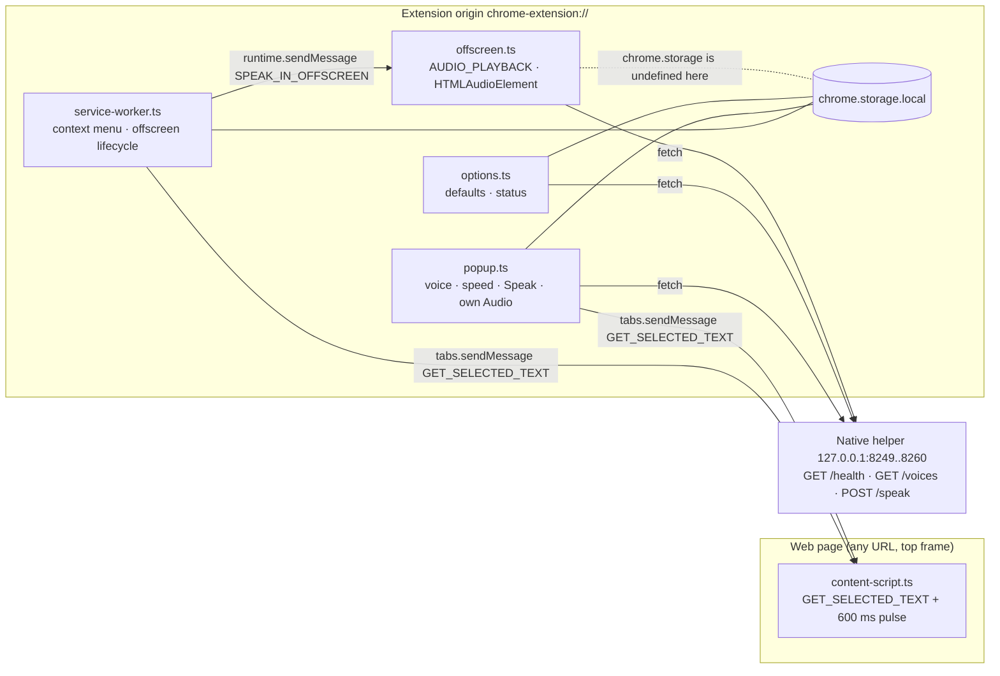
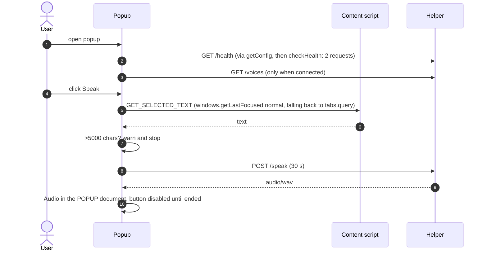
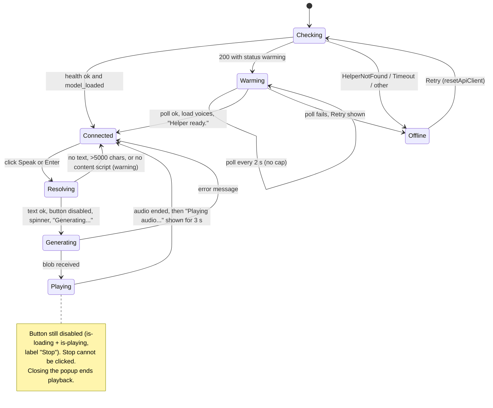

# C1: Chrome extension map (v1.4.0 at `fe2ea58`)

Date: 2026-09-23. Scope: `chrome-extension/`, read in full (every file under `src/`, `public/manifest.json`, `build.ts`, `vite.config.ts`, `tsconfig.json`, `package.json`, `tests/`). The shared helper was up only some of the time during this run, so the native helper appears here only as the client sees it.
Method: every claim comes from one of three sources. **[code]** is a source line reference. **[run]** is a command run in this session. **[probe]** is an instrumented test: a happy-dom harness at `/tmp/ntts-c1/harness/`, or Chrome for Testing 151.0.7922.34 driven over CDP. The probe files are temporary, so their outputs are copied into this doc. Platform claims cite a primary source fetched in this run (see § Sources).

---

## 0. Summary

**The extension builds, typechecks and passes its unit suite. The primary feature (right-click, then "Speak selected text") has four failure modes that give the user no feedback at all. Its tests exercise about 22% of the source. And it carries five Chrome Web Store problems that are fixable before submission: one all-sites content script, one unused permission, several non-working controls, inaccurate privacy and requirements claims, and missing listing assets.**

- **Health:** `tsc` passes, the build passes (16 files, 116 KB), and 122/122 unit tests pass. The 6 live-helper tests only run while a helper is up.
- **Behaviour:** four defects were measured. The right-click path fails whenever the helper is on a fallback port. The popup's Stop button can never be clicked. Pressing Enter sends two `/speak` requests. The saved-voice list silently rewrites any voice outside its six-voice list to `af_bella`.
- **Store:** the content script on `<all_urls>` is used only to read the selection. Chrome already hands that text to the right-click handler, and `activeTab` plus `scripting` covers the popup. Making that swap drops the all-sites host access, which is the permission that brings the longest review.

---

## 1. What was run

| Command (cwd `chrome-extension/`) | Result | Wall time |
|---|---|---|
| `bun test` (bun 1.3.0) | **122 pass, 1 fail**, 303 `expect()`, "Ran 123 tests across 6 files". The one failure is `tests/integration/api-client-live.test.ts`: its `beforeAll` throws `Cannot connect to native helper` (helper not listening then: `curl :8249/health` exit 7), so its 6 tests never ran | 1.092 s |
| `bun test` on the 5 unit files only | **122 pass, 0 fail**, 303 `expect()` | 0.673 s |
| `bun test --coverage` (unit files) | Loaded files only: `api-client.ts` 100% lines · `config.ts` 80.77% · `types.ts` 100% · "All files 96.15%". **Misleading:** the 7 files never loaded do not appear in the report (see § 9) | 0.73 s |
| `bunx tsc --noEmit` (TS 5.9.3) | exit 0, no diagnostics | 1.241 s |
| `bun run build` (`tsc && bun run build.ts`) | exit 0. `dist/` holds 16 files, 116 KB. Largest are `popup.js` 14,445 B, `popup.css` 10,323 B and `options.js` 9,185 B | 1.342 s |
| `bunx vite build --outDir /tmp/...` (the other config in the repo) | **exit 1**: `Rollup failed to resolve import "offscreen.js" from src/offscreen/offscreen.html`. `vite.config.ts` also needs `terser` and `lightningcss`, and neither is installed. **Vite is unused and broken**, yet `"dev": "vite"` still points to it | < 1 s |

Installed toolchain [run]: typescript 5.9.3, vite 5.4.21, vite-plugin-web-extension 4.5.0, @types/chrome 0.0.268, happy-dom 15.11.7, @testing-library/dom 10.4.1, @types/bun 1.3.2. `package.json` uses caret ranges (`^5.5.0` and so on), and `bun.lock` pins the versions actually installed. There is no CI (`.github/` does not exist).

---

## 2. Component map

| Component | File (LOC) | Runs in | Responsibility | Talks to |
|---|---|---|---|---|
| Service worker | `src/background/service-worker.ts` (283) | MV3 SW, `type: module` | Creates the context menu (`onInstalled`, `onStartup`). Handles `contextMenus.onClicked`: gets the text, loads settings, ensures the offscreen doc exists, then sends `SPEAK_IN_OFFSCREEN` | content script (tabs msg), offscreen (runtime msg), `storage.local` |
| Offscreen document | `src/offscreen/offscreen.{ts,html}` (183) | offscreen doc, reason `AUDIO_PLAYBACK` | Receives `SPEAK_IN_OFFSCREEN`, calls `ApiClient.speak`, plays the WAV through `new Audio(blobURL)`, replies after playback **ends** | helper over HTTP |
| Popup | `src/popup/popup.{ts,html,css}` (719 TS) | action popup, 360 px | Health pill, voice `<optgroup>`s, log-scale speed slider with ± buttons, Speak (and a notional Stop), Retry. Plays audio **in the popup document itself** | content script (tabs msg), helper over HTTP, `storage.local` |
| Options page | `src/options/options.{ts,html,css}` (291 TS) | `options_page` (opens in a tab) | Default voice, linear speed slider, *autoPlay* and *helperAutoRetry* checkboxes (both have no effect, see § 8), helper status, Save and Reset | helper over HTTP, `storage.local`, `storage.onChanged` |
| Content script | `src/content/content-script.{ts,css}` (158) | every page, top frame only, `document_idle` | Answers `GET_SELECTED_TEXT` with `getSelection().toString().trim()`. Rejects text with no letters. Draws a 600 ms highlight pulse | (replies only) |
| Shared: API client | `src/shared/api-client.ts` (234) | popup, options, offscreen | Singleton HTTP client: health, voices, speak, retries, error classes | helper |
| Shared: config | `src/shared/config.ts` (154) | same | Port discovery 8249..8260, persisted under the `native_tts_helper_config` key | `storage.local`, helper |
| Shared: settings | `src/shared/settings-defaults.ts` (110) | SW, options | Defaults plus `validateSettings` (**hard-coded 6-voice list**) | `storage.local` |
| Shared: text cleanup | `src/shared/text-cleanup.ts` (94) | SW (PDF branch only) | Repairs ligature characters in PDF text | — |
| Shared: types | `src/shared/types.ts` (145) | all | Wire types, message types, 4 error classes | — |



The popup and the offscreen document are **two independent playback engines**. The popup never messages the service worker or the offscreen doc. Neither the service worker nor the options page ever calls `fetch`.

---

## 3. Messages and flows

There are exactly **two** message types. There is no STOP, no progress and no status message [code: `types.ts:102-145`].

| Message | Sender, then transport | Receiver | Response | Notes |
|---|---|---|---|---|
| `GET_SELECTED_TEXT` | popup (`popup.ts:501`) and SW (`service-worker.ts:172`) via `chrome.tabs.sendMessage(tabId, …)` | content script (`content-script.ts:21-35`) | synchronous `SelectedTextResponse {text, success, error?}` | top frame only (`all_frames` is not set). A tab without the script throws `Could not establish connection. Receiving end does not exist.` [probe: CfT 151] |
| `SPEAK_IN_OFFSCREEN {text, voice, speed}` | SW via `chrome.runtime.sendMessage` (a broadcast to extension pages) | offscreen (`offscreen.ts:34-59`), which returns `true` for an async reply | `OffscreenSpeakResponse {type: SPEAK_COMPLETE\|SPEAK_ERROR, success, error?}`, sent **only after audio `ended`** | SW retries once after 500 ms on `undefined` or a throw (`service-worker.ts:249-270`) |

Type wrinkles: `OffscreenMessage` also includes the response type (`types.ts:145`). The comment on `GetSelectedTextMessage` says "Popup to Content Script", but the SW sends it too.

```mermaid
sequenceDiagram
  autonumber
  actor U as User
  participant SW as Service worker
  participant CS as Content script
  participant OFF as Offscreen doc
  participant H as Helper :8249
  U->>SW: contextMenus.onClicked(info, tab)
  alt tab.id >= 0 (normal tab)
    SW->>CS: GET_SELECTED_TEXT
    CS-->>SW: {success, text} or error
    Note over SW: on any error: console.error and RETURN, no user feedback<br/>(info.selectionText is ignored on this branch)
  else tab.id < 0 or no tab (assumed to be the PDF viewer, unverified)
    SW->>SW: text = cleanupPDFLigatures(info.selectionText)
  end
  SW->>SW: loadSettings() (voice outside the 6-voice list becomes af_bella)
  SW->>OFF: getContexts, or createDocument(AUDIO_PLAYBACK) plus a fixed 300 ms sleep
  SW->>OFF: SPEAK_IN_OFFSCREEN {text, voice, speed}
  OFF->>H: GET /health (stored port, else scan 8249..8260)
  OFF->>H: POST /speak {text, voice, speed} (30 s timeout)
  H-->>OFF: audio/wav (whole body)
  OFF->>OFF: new Audio(blob).play(), then wait for ended
  OFF-->>SW: SPEAK_COMPLETE, or SPEAK_ERROR (logged to the SW console only)
```



---

## 4. `chrome.*` APIs compared with permissions

Manifest [code: `public/manifest.json`]: `permissions: storage, contextMenus, activeTab, offscreen` · `host_permissions: http://127.0.0.1/*` · `content_scripts.matches: <all_urls>` · no `commands`, no `minimum_chrome_version`, no `key`, no `default_locale`, no `action.default_title`.

| API | Where | Permission needed | Min Chrome | Status |
|---|---|---|---|---|
| `runtime.onInstalled` / `onStartup` | SW:37,42 | none | — | ok |
| `contextMenus.removeAll/create/onClicked` | SW:53-71 | `contextMenus` | — | ok |
| `tabs.sendMessage` | SW:172, popup:501 | none | — | ok |
| `runtime.getContexts` | SW:215 | none | **116** | ok, but the manifest declares no minimum version |
| `offscreen.createDocument` | SW:225 | `offscreen` | **109** | ok. `offscreen.hasDocument()` exists from 150 (doc) and was present in CfT 151 [probe] |
| `runtime.sendMessage` / `onMessage` | SW:254, offscreen:34, content:21 | none | — | ok |
| `storage.local.get/set/remove` | config.ts, settings-defaults.ts, popup:674/698 | `storage` | — | ok. **Undefined inside the offscreen doc** [probe: `Object.keys(chrome)` = `csi, loadTimes, runtime`], which causes defect D1 |
| `storage.onChanged` | options:86 | `storage` | — | ok |
| `windows.getLastFocused({populate})`, `tabs.query` | popup:477,486 | none (without `tabs`, `url` and `title` are absent: `tab.url === null` measured [probe]) | — | ok (only `id` and `active` are used) |
| `runtime.openOptionsPage`, `runtime.getManifest` | popup:446,113 · options:63 | none | — | ok |
| `fetch http://127.0.0.1:{8249..8260}` | popup, options, offscreen | `host_permissions http://127.0.0.1/*` (a pattern with no port "match[es] all ports") | — | ok. Local Network Access: extensions with the matching host permission are "not impacted" (Chrome team statement, 2025-11-06) |
| `activeTab` capabilities (`scripting.*` on the tab, tab URL/title) | **nowhere** | `activeTab` | — | **declared but unused** |
| Content script on every site | manifest | `content_scripts.matches` counts as host access and triggers a warning | — | **over-broad** for one `getSelection()` call |

**No permission is used without being declared.** The one declared-but-unused permission is `activeTab`. The broadest effective grant is the `<all_urls>` content script. Recommended target manifest: § 11.

---

## 5. The helper contract, as the client sees it

**Discovery** [code: `config.ts`]:
1. Read `storage.local["native_tts_helper_config"]`. If nothing is stored, default to `{port: 8249, secret: '', default_voice: 'af_bella'}`.
2. Check that port with `GET /health`, 2 s `AbortSignal.timeout`. Any 2xx counts as success. **Nothing checks that the responder is actually the helper.**
3. Otherwise scan ports **8249..8260 in order** at 2 s each, taking the first 2xx and saving it. The worst case, with every port hanging instead of refusing, is 2 + 12×2 = 26 s. Refused ports fail immediately.
4. The result is cached per `ApiClient` singleton for each context: each popup open, each offscreen doc lifetime, each options page. Only the popup's Retry button calls `resetApiClient()`.
The range matches the helper's `Config.preferredPort = 8249` and `portRangeCount = 12` (`Config.swift:17-18`).

**Requests** [code: `api-client.ts`]:

| Call | Method | Timeout | Retries | Body / result |
|---|---|---|---|---|
| `checkHealth()` | GET `/health` | 10 s | 2 (backoff 500 ms, then 1000 ms) on network errors only | `{status, model, model_loaded, uptime_seconds, requests_served}` |
| `getVoices()` | GET `/voices` | 10 s | 2 | `{voices: [{id, name, language}]}` |
| `speak()` | POST `/speak`, JSON `{text, voice, speed}` | **30 s** | 2 (so a POST can be **replayed** after a network error) | the whole response read as a `Blob` (WAV). No streaming |

Client-side checks: text must be non-empty; speed must be 0.5–2.0 (`api-client.ts:176-182`, repeated at `offscreen.ts:80` and `settings-defaults.ts:33-37`). The header `X-Secret` is sent only when `config.secret` is set, and discovery always saves `secret: ''`, **so it is never sent**.

**Error mapping:**

| Condition | Error class | Popup message | Right-click path |
|---|---|---|---|
| Network failure after retries (`message` includes "fetch") | `HelperNotFoundError` | "Helper not found…" | SW console only |
| Abort / timeout | `NetworkTimeoutError` | "Request timed out…" | SW console only |
| Any non-2xx, **response body discarded** | `InvalidResponseError` | "Invalid response from helper. Please try again." | SW console only |
| Discovery fails inside `speak()` (`getConfig` at :184 is **outside** the mapping at :57-65) | raw `ConfigNotFoundError` | "Error: Native TTS Helper not found on ports: 8249, …" | measured as that raw string [probe P4] |

**What the helper actually does**, for contrast [code: `native-helper/.../HTTPServer.swift`]:
- `/health` always returns 200, with `status` either `ok` or `warming`.
- `/speak` and `/voices` return 403 for any `Origin` that is not an extension origin, and echo `Access-Control-Allow-Origin` for extension origins.
- `/speak` returns 400 for an empty body, invalid JSON, empty text, or **>5000 characters** (Swift `String.count`, which counts graphemes; the popup checks UTF-16 `length`).
- `/speak` returns 500 `{error, message, retry_after_seconds}`, with 5 s for `warmup_timeout`. The client ignores all three fields.
- `/speak` sends `X-Audio-Duration`, `X-Generation-Time` and `X-Real-Time-Factor` headers. The client ignores them.
- `/voices` is **hard-coded to 6 voices** (:203-213).
- There is no `OPTIONS` route. The client relies on the host-permission CORS exemption. `GET` was observed working from the popup; `/speak` was not exercised in this run.

---

## 6. Popup UI states



Measured in the happy-dom harness (real `popup.ts` and `popup.html`, with mocked `chrome`, `fetch` and `Audio`):
- **S1**, during playback: `disabled=true class="primary-button is-loading is-playing" text="Stop"`.
- **S2**, clicking "Stop": the audio stays unpaused and no new request is sent. **Stop cannot be reached.** It was added in `5bf4421` "2-state speak button with stop affordance".
- **S3**, after `ended`: `msg="Playing audio..."` appears **after** playback finishes (`popup.ts:430-432`).
- **S4**, keydown Enter on the focused button followed by the click the browser synthesises for a focused `<button>`: **2 `/speak` requests**. `handleKeyboard` (`:452-458`) doubles the native activation, and the `isGenerating` guard is set only after the `await getSelectedText()`.

Also seen live in Chrome for Testing 151: the Connected state with 6 voices, all under one `<optgroup label="American Female">` for `af_*` and so on. The footer shows `⌥⇧S v1.4.0`. Screenshots are in `/tmp/ntts-c1/popup-connected.png` and `options.png` (temporary).

---

## 7. Options page

- It fetches `/voices` and labels each voice from `VOICE_NAMES`. If that fails it falls back to the 6 hard-coded names.
- It saves only through `validateSettings`, the 6-voice list.
- The speed slider is **linear** (`min 0.5 max 2.0 step 0.1`), which puts 1.0× at 33%. The popup slider is **log-scaled**, with 1.0× at the midpoint. Both store the same speed value, so the difference is visual only.
- **Warming** shows as red "Model not loaded" / disconnected, with no polling.
- `storage.onChanged` reloads the whole form on any change, including the config save made during discovery. That throws away unsaved edits.
- The HTML placeholder version is `1.2.0`, replaced at runtime.

---

## 8. Features that exist, compared with what the docs claim

| Claim | Where claimed | Reality |
|---|---|---|
| Right-click → "Speak selected text" | README | **Exists** (`contexts: ['selection']`), with defects D1–D3 |
| PDF support with ligature cleanup | README | Code runs **only** on the `tab.id < 0` branch. That the Chrome PDF viewer produces `tab.id < 0` is **unverified**. Cleanup never runs on the popup path |
| Popup "Type or paste text into input area" / "manual text input" | `chrome-extension/README.md:17,131,180` | **False.** The popup has no text input |
| "Live preview in settings" | README:28 | **False** |
| Keyboard shortcut ⌥⇧S | popup footer chip (`popup.html:123`, commit `315273d`) | **False.** The manifest has no `commands` key, and `git log -S'"commands"'` on the manifest finds nothing ever. README calls shortcuts "future" |
| Stop button | UI, commit `5bf4421` | **Unreachable** (§ 6 S1–S2) |
| "Auto-play audio from context menu" toggle | options page | **No effect.** It is read but never acted on (`service-worker.ts:138-139`: "reserved for future use") |
| "Automatically retry connection" toggle | options page | **No effect.** Nothing reads `helperAutoRetry` |
| Voice and speed synced through Chrome Sync | `PRIVACY.md` table | **False.** Only `chrome.storage.local` is used (no `storage.sync` anywhere) |
| `scripting` permission | `PRIVACY.md` table | **Not declared.** The table also leaves out `<all_urls>` and `offscreen` |
| Chrome 88+ | README requirements | **False.** Needs 109 (offscreen) and 116 (`getContexts`) |
| "Minimal required permissions (storage, contextMenus, activeTab)" | README:346 | Incomplete |
| "128 tests passing, 322 assertions" | README:298 | 122 unit tests plus 6 that need a live helper |
| Accessibility "2.4.5 Multiple Ways ✅ Tab navigation + shortcuts" | `ACCESSIBILITY.md:373` | There are no shortcuts |
| Selection highlight pulse | — | Exists (600 ms), on the content-script path only |
| Warming state with polling, Retry button | — | Exist and work as coded |
| Screenshots | README | "Coming soon". None exist |

---

## 9. Test coverage

| Test file | Tests | Imports real source? | What it actually checks |
|---|---|---|---|
| `api-client.test.ts` | 16 | **Yes**: `ApiClient`, and `config.ts` through it | Health, voices, speak, 404/500, retry, secret header, discovery across ports, singleton. The only substantive unit suite |
| `content-script.test.ts` | 30 | No (types only) | Re-implements `hasActualContent` inside the test file and uses a mock `Selection`. **0% of `content-script.ts` runs** |
| `offscreen.test.ts` | 31 | No (types and error classes) | Mock objects only. **0% of `offscreen.ts` runs** |
| `service-worker.test.ts` | 35 | No (types only) | Checks string literals against themselves. It even asserts `'/offscreen.html'`, while the source uses `'/offscreen/offscreen.html'` (`service-worker.ts:21`) |
| `message-types.test.ts` | 10 | types only | Object shapes |
| `integration/api-client-live.test.ts` | 6 | Yes | Needs a live helper. It sits in the default `bun test` glob, so the suite goes red whenever the helper is down |

Source files **never loaded by any test**: `popup.ts` 719, `options.ts` 291, `service-worker.ts` 283, `offscreen.ts` 183, `content-script.ts` 158, `settings-defaults.ts` 110 and `text-cleanup.ts` 94. That is **1,838 of 2,371 TS lines (77.5%)**. Four sources export `__…TestHelpers` hooks that no test uses, and they ship in `dist` (§ 10, D18).

---

## 10. Defect register (ranked)

| # | Sev | Defect | Evidence | Fix direction |
|---|---|---|---|---|
| D1 | **High** | **The right-click path fails whenever the helper is on a fallback port (8250–8260).** In the offscreen doc `chrome.storage` is undefined, so `saveConfig` throws inside the per-port `try` (`config.ts:91-116`). The found port is skipped as if it failed, and the result is `ConfigNotFoundError` | [probe P9] offscreen-like context: `ConfigNotFoundError … | 13 /health probes | 8250 was probed = true`. The same helper in a context with storage returns `{"port":8250,…}` | Do discovery in the SW and pass `port` in the message, or keep persistence out of the scan loop |
| D2 | **High** | **Right-click errors are invisible.** A missing helper, >5000 chars, or a missing content script ends in `console.error` in the SW and nothing else. There is no badge, notification or sound | [code] SW:93-96, 107-110, 152-156 | `action.setBadgeText` / a short error earcon / `notifications` |
| D3 | **High** | **`info.selectionText` is ignored on normal tabs.** If the content script is absent (tab opened before install, iframes, restricted pages), the SW returns silently even though Chrome already supplied the text | [probe] tabs without the script: `Receiving end does not exist`. [code] SW:89-99 | Use `info.selectionText` (and `info.frameId`) first |
| D4 | **High** | Popup Stop cannot be reached, and "Playing audio…" appears after the audio ends | [probe S1–S3] | Separate the `isGenerating` and `isPlaying` states. Route popup playback through the offscreen doc |
| D5 | Med | Popup playback lives in the popup document, so it is lost when the popup closes (the popup closes on blur) | [code] popup:533-560 (inference: not measured in a headed browser) | One playback engine (offscreen) plus a `STOP` message |
| D6 | Med | Enter on the focused Speak button sends 2 `/speak` requests | [probe S4] | Delete `handleKeyboard`, or set the guard synchronously |
| D7 | Med | Right-click playback has no stop. A second trigger pauses the first audio, but the first promise never settles, leaving an SW response hanging | [code] offscreen:85-88, 137-173 | `STOP` message; settle on pause |
| D8 | Med | The 6-voice list in `settings-defaults.ts:38-45` rewrites any other voice to `af_bella` in the SW and options. The popup reads raw storage, so the popup and right-click voices can differ. This **blocks any voice-list upgrade** | [probe P1] `af_heart` → `{"selectedVoice":"af_bella",…}` | Validate against the helper's `/voices`, not a constant |
| D9 | Med | One voice, three labels: the helper says `af_sarah` = "Sarah (UK)", `en-GB`; the popup files it under "American Female"; the options page says "Sarah (Female, US)" | [probe] live popup and options reads | One source of truth (helper metadata) |
| D10 | Med | The whole text is sent in one request with a 30 s timeout. Time to first audio equals the full synthesis time. 5000 chars (~5 min of speech) at the README's low-end claimed RTF of 8.3× ≈ 40 s, **which would exceed the timeout** | [code] api-client:199. The arithmetic is an estimate | Sentence chunking and streaming (see § 12) |
| D11 | Low | `ConfigNotFoundError` escapes `speak()` unmapped | [probe P4] raw message | Wrap `getConfig` in `speak()` |
| D12 | Low | Every 4xx/5xx body is discarded, so "Text too long", `warming` and `retry_after_seconds` are lost | [code] api-client:95-103 | Parse the `ErrorResponse` JSON |
| D13 | Low | POST `/speak` is retried on network errors, which can synthesise twice | [code] api-client:128-133 | No retry for POST |
| D14 | Low | Ligature cleanup has false positives and dead rules. `Yahoo!Mail` becomes `YahooffiMail`, and `Hello!World` becomes `HelloffiWorld`. The `ffl` rules at :79-80 can never match, because earlier rules already consumed the pattern; `ba!fle` becomes `baffifle`. The letter class is ASCII-only | [probe P2] | Restrict to known-bad fonts, or drop it |
| D15 | Low | `innerHTML` is built from helper-supplied `voice.name` and `id` (`popup.ts:312-315`). Any local process answering `/health` on 8249–8260 is trusted, and `X-Secret` is never sent or checked. MV3's default CSP blocks script, but HTML injection remains | [code] | DOM APIs plus `textContent`. A helper identity check |
| D16 | Low | `ensureOffscreenDocument` sleeps a fixed 300 ms and swallows every error with a misleading log line | [probe] creation 335 ms. [code] SW:236-242 | A ready handshake from the offscreen doc |
| D17 | Low | Options: linear vs log slider, dead toggles, form reset on `onChanged`, placeholder version | § 7 | — |
| D18 | Low | `dist` ships test hooks (`__serviceWorkerTestHelpers` and 3 others) and 66 `console.*` calls. The content script logs on every page, including a 50-character preview of the selection in the page console | [run] grep of `dist` | Drop console and hooks in production builds |
| D19 | Info | The Vite config is broken (exit 1) and unused, yet it is the `dev` script | § 1 | Delete it, or fix it |
| D20 | Info | Release hygiene: the `v1.4.0` tag predates the manifest bump (`af822dd`). 26 extension commits sit on top of the tag. The CHANGELOG `[Unreleased]` section is empty. A SW comment cites "v1.4.1" | [run] `git log v1.4.0..HEAD -- chrome-extension` | Bump to 1.5.0 at submission |

---

## 11. Chrome Web Store: blockers and weakeners

Ranked by likelihood of rejection or delay:

1. **All-sites content script (`<all_urls>`), used only for `getSelection()`.** Content-script `matches` trigger a warning just as `host_permissions` do. `<all_urls>` is named among the patterns that make review take longer. **Fix:** right-click uses `info.selectionText`; the popup uses `activeTab` + `scripting.executeScript({func: () => getSelection().toString()})`. `activeTab` is granted by the action, a context-menu item, and a command shortcut.
2. **`activeTab` is declared and never used.** Policy requires "the narrowest permissions necessary", "Don't attempt to 'future proof'", and asks that unused permissions be removed. Fix #1 makes `activeTab` the thing actually used.
3. **Controls that do nothing, and misleading claims:** the ⌥⇧S chip, the autoPlay and autoRetry toggles, the unreachable Stop, plus the § 8 README and PRIVACY errors. Policy says "Extensions with broken functionality—such as … non-functioning features—are not allowed" and that listings with "false or misleading information" may be removed.
4. **Privacy disclosure.** Selected page text is user data, so it must be disclosed **even though it is processed locally** (User Data FAQ Q3/Q14), and a privacy-policy URL is required. `PRIVACY.md` exists but is wrong on storage sync and on the permission list, leaves out the all-sites script and the stored config, and is not hosted anywhere.
5. **Depends on a companion app.** The extension does nothing without the macOS Apple Silicon helper, which the store does not distribute. The policy line "should not require a local executable" is scoped to *packaged and hosted apps*, not extensions. The real risk is a reviewer judging "broken functionality", so the listing and any reviewer notes must lead with the requirement and a helper download.
6. **Listing assets.** The icon is a full-bleed opaque 128×128 with no alpha channel. Guidance is 96×96 artwork inside 16 px of transparent padding that "work[s] well on both light and dark backgrounds". Its glyph (a white triangle pointing left inside a ring) reads as "back/rewind", not speech. There are **no screenshots** (1280×800 preferred, at least 1) and **no 440×280 small promo tile**.
7. **No `minimum_chrome_version`.** It should be `"116"`, the `getContexts` floor. The README's "88+" should be corrected to match.
8. **Packaging:** there is no zip step and no version bump (D20). Minification is allowed and the code is not obfuscated, which is fine. There is no remotely hosted code, so the remote-code answer is "No".
9. **Not a blocker:** Local Network Access. Chrome 142 introduced the prompt for web pages, and the Chrome team states extensions with the correct host permission are "not impacted". Re-check on Chrome 153 during evidence capture.

Recommended manifest (sketch; the evidence phase must verify the resulting warning text with the Extension Update Testing Tool or a packed `.crx`):
```json
{
  "minimum_chrome_version": "116",
  "permissions": ["storage", "contextMenus", "activeTab", "scripting", "offscreen"],
  "host_permissions": ["http://127.0.0.1/*"],
  "commands": { "speak-selection": { "suggested_key": { "default": "Alt+Shift+S" }, "description": "Speak selected text" } },
  "action": { "default_title": "Natural Text-to-Speech", "default_popup": "popup/popup.html" }
}
```
The `content_scripts` block is removed; the highlight pulse can be injected with `scripting.insertCSS`.

---

## 12. Where a helper or model upgrade touches the extension

Any upgrade (more Kokoro voices, a new model, streaming) must change these places **together**:

| Contract | Extension location | Helper location |
|---|---|---|
| Voice list | `settings-defaults.ts:38-58` (list + labels); `popup.ts:298-303` (only `af/am/bf/bm` get groups, anything else falls to "ungrouped"); `options.ts:140` labels; default `af_bella` hard-coded at 8 code sites (`settings-defaults.ts:23`, `popup.ts:51,284`, `api-client.ts:189`, `config.ts:47,54,105`, plus the list at `settings-defaults.ts:39`) | `HTTPServer.swift:203-213` (hard-coded 6) |
| Speed 0.5–2.0 | `api-client.ts:180`, `offscreen.ts:80`, `settings-defaults.ts:33-37`, `popup.ts:149`, `popup.html` aria min/max | — |
| Max text 5000 | `popup.ts:406` only (none on right-click) | `HTTPServer.swift:151` |
| Audio format | the whole body as a WAV `Blob` (`api-client.ts:106`), played with `new Audio(blobURL)` | `Content-Type: audio/wav` |
| Warm-up protocol | `/health` 200 with `status: 'warming'`, and the popup polls every 2 s | `HTTPServer.swift:110-127` |
| Port range | `config.ts:11-17` | `Config.swift:17-18` |
| Model label | `health.model` is shown verbatim in the pill tooltip and the options page | `"kokoro-82m"` literal |

Streaming or chunked audio (the D10 fix) needs a **new** response contract. Candidates are chunked transfer with WAV or PCM frames through `MediaSource`/`AudioWorklet` in the offscreen doc, or one request per sentence. Either way the extension moves playback into a queue in the offscreen doc.

---

## 13. Notes for evidence capture (README and store phase)

- **Branded Chrome 137+ ignores `--load-extension`.** Chromium and Chrome for Testing still honour it. Measured here: `agent-browser --executable-path "…/ms-playwright/chromium-1234/…/Google Chrome for Testing" --extension chrome-extension/dist` loads the extension cleanly in **CfT 151.0.7922.34**, and the SW registers at `chrome-extension://lahgejbaodkdkgmmjgdbgagkepakpifd/background/service-worker.js`. That ID is derived from the path because there is no `key`.
- Rendering the popup as a tab (`chrome-extension://<id>/popup/popup.html`, 360 px) works for screenshots. A **Speak** recording, though, needs the selection in a *different* normal window, because the popup resolves the last-focused normal window's active tab. Use the real toolbar popup in headed mode, or `chrome.windows.create({type:'popup'})`.
- CDP cannot click native context menus, so the right-click flow needs an OS-level screen recording of a headed browser.
- The offscreen doc disappears after audio stops. Docs give 30 s for `AUDIO_PLAYBACK`, and it was observed gone at the next check.
- The shared helper on :8249 started and stopped several times during this run (another session was using it). Any capture pipeline needs its own helper instance, or a port reservation.

---

## 14. Unverified / open

- Whether the Chrome PDF viewer gives `tab.id < 0` or `tab` undefined in `contextMenus.onClicked`. The code depends on it, and neither the fetched docs nor the git history confirm it. **Probe it in a headed browser.**
- The exact install-warning strings for the current and recommended manifests: pack a `.crx`, or use the Extension Update Testing Tool.
- Whether `/speak` from the popup succeeds without an `OPTIONS` route, i.e. relying on the host-permission CORS exemption. Not exercised in this run.
- D5 (popup close ends playback) is inferred from the document lifecycle, not recorded.
- Service-worker lifetime while `sendToOffscreen` waits for a long playback to end: not measured.

---

## Sources (fetched 2026-09-23)

- Match patterns, "match all ports unless an explicit port is specified": https://developer.chrome.com/docs/extensions/develop/concepts/match-patterns
- Permissions list (warnings; `activeTab`, `contextMenus`, `offscreen`, `storage` show none): https://developer.chrome.com/docs/extensions/reference/permissions-list
- Declare permissions (`content_scripts.matches` triggers warnings): https://developer.chrome.com/docs/extensions/develop/concepts/declare-permissions
- Permission warnings (Extension Update Testing Tool; `activeTab` has no warning): https://developer.chrome.com/docs/extensions/develop/concepts/permission-warnings
- `activeTab` gestures and grants: https://developer.chrome.com/docs/extensions/develop/concepts/activeTab
- Offscreen API (109+, 30 s `AUDIO_PLAYBACK` rule, runtime-only, `hasDocument` 150+): https://developer.chrome.com/docs/extensions/reference/api/offscreen
- Runtime API (`getContexts` 116+): https://developer.chrome.com/docs/extensions/reference/api/runtime
- Scripting API: https://developer.chrome.com/docs/extensions/reference/api/scripting
- Commands API: https://developer.chrome.com/docs/extensions/reference/api/commands
- Context menus API: https://developer.chrome.com/docs/extensions/reference/api/contextMenus
- Local Network Access (prompt in Chrome 142): https://developer.chrome.com/blog/local-network-access
- Chrome team on extensions and LNA (P. Kettner, 2025-11-06): https://groups.google.com/a/chromium.org/g/chromium-extensions/c/pUDh8RiTjJk
- `--load-extension` removed from branded Chrome 137: https://groups.google.com/a/chromium.org/g/chromium-extensions/c/1-g8EFx2BBY/m/S0ET5wPjCAAJ
- CWS permissions policy: https://developer.chrome.com/docs/webstore/program-policies/permissions
- CWS program policies (broken functionality, misleading metadata): https://developer.chrome.com/docs/webstore/program-policies/policies
- CWS review process (`<all_urls>` lengthens review): https://developer.chrome.com/docs/webstore/review-process
- CWS privacy fields: https://developer.chrome.com/docs/webstore/cws-dashboard-privacy
- CWS User Data FAQ (local-only data still disclosed): https://developer.chrome.com/docs/webstore/program-policies/user-data-faq
- CWS Limited Use: https://developer.chrome.com/docs/webstore/program-policies/limited-use
- CWS image specs: https://developer.chrome.com/docs/webstore/images
