# C2: Native helper baseline (measured 2026-09-23)

**Scope.** This is the current (pre-upgrade) state of `native-helper/`: an architecture map, the request lifecycle (the source for the README sequence diagram), and a measured benchmark on this machine. Numbers come from this run unless marked as a claim quoted from the repo. Scratch work, logs and every generated WAV are under `/tmp/ntts-c2/`.

## Bottom line

When the GPU is free, the helper is fast. Warm synthesis runs at **~19–23× real time** (15 words: 0.48 s; 60 words: 1.32 s; 407 words: 7.7 s), and the helper is healthy **5.5 s** after launch. But the design makes the user pay in five ways, all measured here:

1. **No streaming.** Time-to-first-audio is the *whole* generation time: 7.7 s for 400 words and 15–18 s at the 5,000-char cap. Mlx-audio already yields audio per chunk, and the first chunk is ready in ~1.7 s.
2. **One blocking worker serializes everything.** `/health` stalls **6.6 s** behind an in-flight `/speak`, but the extension probes it with a **2 s** timeout. An aborted request still holds the GPU, so the next 15-word request took **8.4 s** instead of 0.48 s. Under GPU contention a 4,985-char request took **45 s**, past the extension's **30 s** `/speak` timeout.
3. **It is not offline or local-only.** Every `/speak` resolves the voice on huggingface.co: ~72 ms online vs 5 ms with `HF_HUB_OFFLINE=1`, plus a live TLS connection held to the Hub. Before this run, **5 of the 6 advertised voices** were not cached at the current model revision and had to be fetched on first use. An uncached voice **fails offline**.
4. **Heavy footprint.** The venv is **2.1 GB** (183 packages, including torch, gradio, opencv and pyarrow, none used). The build copies it a second time into `.build` (4.8 GB total). The worker's physical footprint **peaks at 7.7–8.0 GB** of unified memory and **keeps 4.0 GB** after a long request.
5. **Correctness and robustness defects.** A restart within 30 s silently drifts the port to 8250 and **persists it to `config.json`** (reproduced). Whitespace-only, CJK-only or emoji-only text returns **500** instead of 400. `normalize_text` strips all non-ASCII. The `warming` health state is unreachable. `/voices` serves 6 hard-coded voices with a wrong label, while 54 exist in the cached model.

## 1. Method and conditions

| Item | Value |
|---|---|
| Machine | Apple M1 Max, macOS 15.7.9 (Darwin 24.6.0) |
| Swift | 6.2.4 (swiftlang-6.2.4.1.4); `swift build -c release`: up to date, "Build complete! (8.47s)"; binary 7,245,312 B |
| Python venv | 3.11.4; `pip list` (read-only): mlx 0.29.3, mlx-metal 0.29.3, mlx-audio 0.2.6, misaki 0.9.4, espeakng-loader 0.2.4, phonemizer-fork 3.3.2, soundfile 0.13.1, torch 2.9.0, transformers 4.57.1, spacy 3.8.8, en_core_web_sm 3.8.0, huggingface-hub 0.36.0, numpy 2.2.6, librosa 0.11.0, onnxruntime 1.23.2, numba 0.62.1 (183 packages total) |
| espeak-ng | 1.52.0 (Homebrew), data at `/opt/homebrew/opt/espeak-ng/share/espeak-ng-data` |
| Model | `prince-canuma/Kokoro-82M`, HF cache `refs/main` = `e02c9eada7ce7416798af36b190a8a2dd2ecd566`, cache dir 349 MB |
| Helper state at start | Nothing listening on 127.0.0.1:8249 (`lsof`), so I built and started it myself |
| Texts (from `native-helper/examples/sample-texts.json`) | **S15** = `medium[1]` (15 words, 123 chars) · **M60** = `long[1]` + `medium[0]` (60 words, 408 chars) · **L400** = `long[0..2]` + `technical` + `storytelling` + `poetry` + `medium[0..2]` (407 words, 2,644 chars) · **X4985** = all samples repeated, cut to 4,985 chars (751 words) · `/tmp/ntts-c2/texts.json` |
| Client | `curl` (HTTP code, TTFB, total), plus the response headers `X-Audio-Duration` / `X-Generation-Time` / `X-Real-Time-Factor`. RTF = audio seconds ÷ client wall time. |

**Contention, and which runs count.** Sibling agents were sharing the GPU during this session: a Chrome 153 capture profile at `/tmp/ntts-capture` (remote-debugging 9555), a `bench.py chatterbox-turbo` TTS benchmark, a FluidAudio Swift build, and Playwright. CPU load average reached **82**, and `ioreg` "Device Utilization %" read **99%** while my helper was idle. The runs are therefore split:

| Run | When | Env | Status | Why |
|---|---|---|---|---|
| **run1** | 14:06–14:10 | default | **CLEAN (baseline)** | Low variance (±5%); no foreign requests in the window |
| run2 | 14:11 | default | clean (S15 only) | Second startup and cold sample |
| run3off | 14:12–14:18 | `HF_HUB_OFFLINE=1` | **CONTAMINATED** | Load average 82 and a concurrent chatterbox bench; M60 5× slower than run1. It also fell back to port 8250 (§5.7) |
| run4 | 14:22–14:26 | default | **CONTAMINATED** (latency); memory valid | L400 28 s vs 8 s; one foreign request overlapped X4985 |
| **run5** | 14:26–14:27 | default (run4 process) | **CLEAN (baseline)** | GPU idle (0% for 30 s) beforehand; matches run1 within ±10% |

Caveat: `ioreg` utilization sampled *between* run5 requests read 86–94%. That is a trailing average that includes run5's own back-to-back work, so sibling GPU use during run5 cannot be fully excluded. Its agreement with run1 is the evidence it is clean.

## 2. Architecture map

```mermaid
flowchart LR
  subgraph Chrome["Chrome MV3 extension"]
    CS["content-script.ts<br/>(selection)"]
    SW["service-worker.ts<br/>(context menu, offscreen mgr)"]
    OFF["offscreen.ts<br/>(ApiClient + HTMLAudioElement)"]
    POP["popup.ts<br/>(ApiClient + own Audio)"]
  end
  subgraph Helper["natural-tts-helper (Swift, SwiftNIO 2.88)"]
    HTTP["HTTPServer actor<br/>127.0.0.1:8249 · /health /voices /speak"]
    PW["PythonWorker actor<br/>length-prefixed JSON over stdin/stdout"]
    CFG["Config<br/>~/Library/Application Support/NaturalTTS/config.json"]
  end
  subgraph Py["tts_worker.py (Python 3.11 venv)"]
    K["mlx-audio 0.2.6 Kokoro-82M<br/>misaki G2P + espeak-ng fallback<br/>MLX Metal GPU"]
  end
  HUB[("huggingface.co<br/>prince-canuma/Kokoro-82M")]
  CS -- "GET_SELECTED_TEXT" --> SW
  SW -- "SPEAK_IN_OFFSCREEN" --> OFF
  OFF -- "fetch POST /speak (30 s)" --> HTTP
  POP -- "fetch GET /health (2 s probe), /voices, POST /speak" --> HTTP
  HTTP --> PW
  PW -- "4-byte LE length + JSON" --> K
  K -- "4-byte LE length + JSON{audio_base64}" --> PW
  K -. "per-request voice resolve (HEAD / download)" .-> HUB
  HTTP -. "writes port" .-> CFG
```



| Component | File : lines | Role, and what the baseline actually does |
|---|---|---|
| Entry and startup | `native-helper/Sources/NaturalTTSHelper/App.swift:18-93` | Loads config (`:21`) → port check with fallback 8249..8260 (`:23-34`) → spawns the worker (`:42-43`) → waits ≤60 s for warm (`:47`) → **only then** binds HTTP (`:51-53`) → saves config (`:56`) → SIGTERM/SIGINT graceful handlers (`:67-90`) |
| Config | `Config.swift:3-148` | `preferredPort` 8249, `portRangeCount` 12 (`:17-18`). `isPortAvailable` does a plain `bind()` with **no `SO_REUSEADDR`** (`:49-65`). Python path: `Bundle.main.resourcePath`, then the cwd-relative venv, then `/usr/bin/python3` (`:94-134`). `secret` is a UUID that **is never checked** by the server |
| HTTP server | `HTTPServer.swift:7-277` | `actor`, `MultiThreadedEventLoopGroup(System.coreCount)` (`:25`). Origin gate on `/speak` and `/voices` only (`:88-93`). `/health` **awaits `worker.isReady`** (`:111`). `/speak` validation: non-empty, `text.count <= 5000` Swift Characters (`:147-153`). Response is raw WAV plus `X-Audio-Duration`, `X-Generation-Time`, `X-Real-Time-Factor` (`:169-176`). `/voices` is a **hard-coded list of 6** (`:204-211`). The CORS echo applies to extension origins only (`:219-231`). The connection is **closed after every response** (`:330-332`) |
| Worker bridge | `PythonWorker.swift:4-256` | `actor`. Sets `ESPEAK_DATA_PATH` and inherits the rest of the env (`:37-40`). Python stderr is logged at **debug** level, so it is invisible at the default `info` (`:50`). Warm detection is a substring match on "Model loaded, ready for requests" (`:54`). `generate` = sendMessage + **blocking** `read(upToCount:)` (`:101-139`, `:226`, `:246`). No auto-restart (`:193-197`) |
| Wire models | `Models.swift:5-116` | `SpeakRequest{text, voice?, speed?}`, `HealthResponse`, `ErrorResponse{error, message, retry_after_seconds}`, `GenerateResponse{audio_base64, duration, sample_rate, format, error}` |
| Python worker | `Resources/tts_worker.py:1-257` | Length-prefixed JSON loop (`:23-67`). Eager `load_model("prince-canuma/Kokoro-82M")` (`:84-96`). `normalize_text` = NFKD, then **ASCII-only** (`:99-115`). `model.generate(text, voice=, speed=)` with **no `lang_code`** (`:152`). Concatenate → `sf.write(..., 24000, "WAV")` (PCM_16) → base64 (`:165-194`) |
| Kokoro (mlx-audio 0.2.6, venv) | `site-packages/mlx_audio/tts/models/kokoro/kokoro.py:269-283`, `pipeline.py:129-144, 358-400` | `generate(lang_code="a", split_pattern=r"\n+")`, and **`pipeline.voices = {}` on every call**. The voice is loaded via `hf_hub_download(repo, "voices/{voice}.pt")`. English chunks are split at ≤510 phonemes (~29 s of audio per chunk). The pipeline and G2P are created lazily on the first `generate` |
| Setup scripts | `Scripts/setup-python-env.sh:82-86`, `quickstart.sh`, `status.sh`, `teardown.sh`, `logs.sh`, `demo.sh`, `test-performance-{short,long}.sh` | Setup pins **only** `mlx==0.29.3 mlx-audio==0.2.6 soundfile==0.13.1`; there is no lockfile. `quickstart.sh` runs the helper in tmux session `natural-tts-helper`. The perf scripts **hard-code** audio durations (1.57 s, 21.7 s) instead of reading `X-Audio-Duration` |
| Tests | `native-helper/Tests/NaturalTTSHelperTests/` | **Empty directory**. There are zero Swift tests, and `swift build` warns about the test target |

**Process tree while serving:** `natural-tts-helper` (RSS 9 MB idle) → `Python tts_worker.py` (RSS ~806 MB idle, physical footprint 692 MB after load).

## 3. Request lifecycle (source for the README sequence diagram)

### 3a. Startup

1. `App.swift:21` `Config.load()` reads `~/Library/Application Support/NaturalTTS/config.json`. The existing file pins `port 8249` and absolute venv/script paths.
2. `App.swift:24` `isPortAvailable(8249)`. If a plain bind fails, it scans 8249..8260 **and saves the fallback port to config** (`:31-32`).
3. `PythonWorker.start()` spawns `python-env/bin/python3 tts_worker.py` (`PythonWorker.swift:31-71`).
4. The worker imports `mlx_audio.tts.utils` (**3.2–7.4 s**, the dominant cost; it swings with system load), then `load_model` (**0.9–1.5 s**), then prints "Model loaded, ready for requests" (`tts_worker.py:92`).
5. The Swift stderr handler matches that line and calls `markWarm()` (`PythonWorker.swift:54-58`). `waitUntilReady` polls every 100 ms (`:89-91`).
6. The HTTP server binds 127.0.0.1:8249 (`HTTPServer.swift:40`) and config is saved (`App.swift:56`). **Until this step the port is closed**, so the extension sees *connection refused* rather than `{"status":"warming"}`.
7. Not done at startup: the Kokoro pipeline, G2P and spaCy are initialized on the **first** `/speak`. That is the cold penalty (§4.2).

### 3b. `/speak` (context-menu path; the popup path differs only in who plays audio)

1. The user right-clicks "read aloud". `service-worker.ts:71-160` gets the selection from the content script (`GET_SELECTED_TEXT`), or from `info.selectionText` on PDFs with ligature cleanup (`:88-126`). **No length check on this path.** Only the popup checks >5,000 (`popup.ts:406`).
2. `ensureOffscreenDocument()` creates `offscreen.html` (reason `AUDIO_PLAYBACK`) and then **sleeps 300 ms** (`service-worker.ts:210-243`). `sendToOffscreen` retries once after 500 ms (`:249-271`).
3. In `offscreen.ts:64-99`, `getApiClient().speak()` runs. On first use, `getConfig()` probes `GET /health` with a **2 s** timeout on the stored port, then discovers across 8249..8260 at 2 s each (`config.ts:131-154`, `:89-123`).
4. `api-client.ts:174-199` sends `POST http://127.0.0.1:8249/speak` with `{"text","voice","speed"}`, `Content-Type: application/json`, and a **30 s** `AbortController` timeout. It retries up to 2× on network errors only (`:118-133`). `X-Secret` is sent only if a secret is stored, and it never is (`config.ts:46,104`).
5. NIO `HTTPHandler` accumulates the body and then `Task { await server.handleRequest }` (`HTTPServer.swift:293-338`).
6. `HTTPServer.handleRequest`: the Origin gate (`:88-93`), then `handleSpeak`, which validates and calls `await worker.generate(...)` (`:129-162`).
7. `PythonWorker.generate` (actor-isolated): writes a 4-byte LE length plus JSON to stdin, then **blocks** reading stdout (`PythonWorker.swift:101-113, 199-256`). While blocked, every other call into the worker actor waits, **including `/health`'s `isReady`**.
8. `tts_worker.py`: `normalize_text` (NFKD, then drop non-ASCII) → `model.generate` (G2P via misaki/espeak, `hf_hub_download` of the voice, ≤510-phoneme chunks, MLX Metal inference) → collect **all** chunks → `np.concatenate` → WAV PCM16 24 kHz in memory → base64 → length-prefixed JSON on stdout (`:118-204`, `:238-241`).
9. Swift decodes base64 into `Data` and returns HTTP 200 with `Content-Type: audio/wav`, `Transfer-Encoding: chunked`, the three `X-*` timing headers and, for extension origins, `Access-Control-Allow-Origin: <origin>` plus `Vary: Origin`. It then **closes the connection** (`HTTPServer.swift:169-181, 330-332`).
10. `offscreen.ts:137-173`: `response.blob()` → `URL.createObjectURL` → `new Audio(url).play()` → resolves on `ended`. **The user hears nothing until step 10.**

```mermaid
sequenceDiagram
  autonumber
  actor U as User
  participant SW as Service worker
  participant OFF as Offscreen doc
  participant H as Swift helper (HTTPServer actor)
  participant W as PythonWorker actor
  participant PY as tts_worker.py (Kokoro/MLX)
  participant HF as huggingface.co
  U->>SW: Right-click "read aloud"
  SW->>SW: get selection (content script / selectionText)
  SW->>OFF: ensure offscreen (+300 ms) then SPEAK_IN_OFFSCREEN
  OFF->>H: GET /health (2 s probe, first use)
  H-->>OFF: 200 {"status":"ok"}
  OFF->>H: POST /speak {text, voice, speed} (30 s timeout)
  H->>W: await generate()
  W->>PY: [len LE32][JSON]
  PY->>HF: resolve voices/{voice}.pt (HEAD, or download if uncached)
  HF-->>PY: 200 / cached file
  PY->>PY: G2P, chunk ≤510 phonemes, MLX inference (all chunks)
  PY-->>W: [len LE32][JSON {audio_base64, duration, 24000, wav}]
  W-->>H: AudioData (base64-decoded WAV)
  H-->>OFF: 200 audio/wav (chunked) + X-Audio-Duration, X-Generation-Time
  OFF->>U: HTMLAudioElement.play() (first sound only now)
```

## 4. Baseline benchmark

### 4.1 Startup (launch → `/health` 200 `ok`)

| Sample | Time to healthy | Conditions |
|---|---|---|
| run1 (helper) | 11.90 s | Load rising (sibling work starting); first connect = healthy, since `warming` is unreachable |
| run2 (helper) | 11.73 s | Contended |
| run3off (helper, `HF_HUB_OFFLINE=1`) | ~5 s (log timestamps 14:11:57 → 14:12:02, 1 s resolution) | Fell back to 8250 |
| **run4 (helper)** | **5.54 s** | load1 16.8 |
| Worker alone, spawn → ready, 3× online interleaved with 3× offline | online 4.98 / 4.20 / 4.58 s · offline 4.04 / 4.03 / 5.08 s | load1 19–22. **The offline flag does not change startup**; `import mlx_audio` dominates |
| `import` + `load_model` microbench | import 3.21–4.83 s, `load_model` 0.91–1.50 s | 2× online and 2× offline |

**Baseline: ~5.5 s** on a moderately loaded machine, **~12 s** under heavy contention.

### 4.2 Cold first `/speak` (S15, first request after healthy)

| run1 | run2 | run3off | run4 | Warm median (clean) |
|---|---|---|---|---|
| 4.78 s (RTF 1.9×) | 3.14 s (2.9×) | 2.38 s (3.8×) | 3.00 s (3.0×) | **0.48 s** |

The cold penalty is **~2.5 s** on top of warm. Commit `6565879` ("eager-load Kokoro at startup") loads the weights but not the lazily created `KokoroPipeline` (misaki G2P, spaCy, first Metal kernel compiles; `kokoro.py:258-267`). A one-sentence warm-up `generate` at startup would move this cost off the user's first click.

### 4.3 Warm latency and real-time factor (voice `af_bella`, speed 1.0; 3 runs per size per clean run)

| Text | Words / chars | Audio out | run1 total (3 runs) | run5 total (3 runs) | **Pooled median (n=6)** | **RTF median [range]** | WAV bytes |
|---|---|---|---|---|---|---|---|
| S15 | 15 / 123 | 9.00 s | 0.473 / 0.483 / 0.450 | 0.515 / 0.479 / 0.484 | **0.481 s** | **18.7×** [17.5–20.0] | 432,044 |
| M60 | 60 / 408 | 29.00 s | 1.447 / 1.325 / 1.307 | 1.227 / 1.649 / 1.290 | **1.316 s** | **22.0×** [17.6–23.6] | 1,392,044 |
| L400 | 407 / 2,644 | 171.50 s | 7.630 / 8.113 / 8.308 | 7.223 / 7.837 / 7.385 | **7.733 s** | **22.2×** [20.6–23.7] | 8,232,044 |
| X4985 (single) | 751 / 4,985 | 325.15 s | 17.81 | 15.14 | 15–18 s | 18.3–21.5× | 15,607,244 |

- TTFB ≈ total (e.g., L400 run1 TTFB 7.613 s vs total 7.630 s). The whole WAV is produced before the first byte is sent.
- Spoken rate for `af_bella` at 1.0×: 100 wpm (S15), 124 wpm (M60), 142 wpm (L400).
- `X-Generation-Time` includes **queue wait**. When two requests were concurrent, the second logged "RTF 9.33×" for work that took ~1.3 s.

**Contended (for sensitivity, not baseline):** run3off M60 6.25–6.52 s and L400 11.4–26.9 s. Run4 S15 1.13–2.32 s, M60 2.91–6.21 s, L400 28.3–29.1 s (RTF ~6×), **X4985 45.16 s, over the extension's 30 s `/speak` timeout.** On a GPU shared with other work (a game, video export, another local model), long selections fail.

### 4.4 Where the time goes (worker, in-process; GPU ~86–90% busy with sibling load, so absolute numbers are inflated)

| Text | Chunks | **First chunk ready** | All chunks | MLX gen | concat | WAV encode | base64 | JSON dumps | Worker→Swift message |
|---|---|---|---|---|---|---|---|---|---|
| S15 | 1 | 0.538 s | 0.560 s | 0.594 s | 0.003 | 0.001 | 0.001 | 0.001 | 0.58 MB |
| M60 | 1 | 1.698 s | 1.748 s | 1.649 s | 0.007 | 0.007 | 0.002 | 0.004 | 1.86 MB |
| L400 | 7 | **1.789 s** (29.2 s of audio) | 9.554 s | 10.326 s | 0.012 | 0.128 | 0.020 | 0.030 | 10.98 MB |
| X4985 | 13 | **1.678 s** (29.4 s of audio) | 16.480 s | 15.803 s | 0.027 | 0.065 | 0.024 | 0.050 | 20.81 MB |

MLX inference is **>97%** of worker time, and WAV, base64 and JSON together are under 2%. **This refutes the repo claim** that "Base64 encoding is now the largest bottleneck (~67% of time)" (`TEST_RESULTS_OPTIMIZED.md`, `README.md:429`). **Streaming the first chunk** would cut time-to-first-audio for long text from ~7.7–16 s to **~1.7 s** without any model change. A finer `split_pattern` (per sentence rather than `\n+`) would push it further toward the ~0.5 s single-sentence latency.

### 4.5 Memory

| Metric | Value | How |
|---|---|---|
| Worker RSS idle, after load | 806 MB | `ps -o rss` sampled every 0.2 s (904 samples, run1) |
| Worker RSS peak | 1,187 MB | Same sampler. **RSS undercounts Metal/unified memory** |
| Worker physical footprint after load | 692 MB | `vmmap --summary` |
| Physical footprint **peak** after cold S15 | **4.5 GB** | run4 |
| … after M60 | **7.7 GB** | run4 |
| … after X4985 | current **4.0 GB** retained, peak **8.0 GB** | run4. MLX buffer cache is never limited or cleared |
| run1 lifetime peak | **7.9 GB** (current 885 MB, of which IOAccelerator 318 MB) | `footprint -p`, `vmmap --summary` |
| Swift helper RSS | 9 MB idle, **151 MB** peak (15.6 MB WAV request: 20.8 MB base64 JSON plus decoded copy) | Sampler |

### 4.6 Disk

| Item | Size |
|---|---|
| `Sources/NaturalTTSHelper/Resources/python-env` | **2.1 GB**, 183 packages. Largest: torch 387M, gradio 198M, mlx 124M, pyarrow 121M, transformers 115M, llvmlite 113M, scipy 101M, cv2 99M, sympy 78M, pandas 73M, onnxruntime 68M, av 54M, sklearn 48M |
| `.build/release/NaturalTTSHelper_NaturalTTSHelper.bundle` | **2.1 GB**, a full copy of the venv via `.copy("Resources")` (`Package.swift:29-31`) |
| `.build` total | 4.8 GB |
| HF model cache (`models--prince-canuma--Kokoro-82M`) | 349 MB (two snapshots; `kokoro-v1_0.safetensors` + voices) |
| Release binary | 7.2 MB |

The repo's "~500MB" venv claim (`README.md:143`) is off by 4×. The venv on disk is also **not reproducible from the script**: `setup-python-env.sh` installs 3 packages and deletes `*.dist-info`, yet this venv has 183 packages with intact dist-info (including mlx_lm, mlx_vlm, gradio, torch).

### 4.7 Response format

- **HTTP body:** raw `RIFF` WAV, `pcm_s16le`, **mono, 24,000 Hz, 16-bit** (`ffprobe`, `afinfo`). That is 48 kB per second of audio, or 2.88 MB per minute.
- **HTTP headers:** `Content-Type: audio/wav`, `Transfer-Encoding: chunked` (**no `Content-Length`**), `X-Audio-Duration`, `X-Generation-Time`, `X-Real-Time-Factor`, and for extension origins `Access-Control-Allow-Origin: <origin>` plus `Vary: Origin`. There is no keep-alive; the server closes each connection.
- **Internal pipe:** base64 WAV inside length-prefixed JSON (~1.33× inflation), decoded in Swift. Base64 is only on the stdin/stdout pipe, never on HTTP.
- **Errors:** JSON `{"error": code, "message": text, "retry_after_seconds"?}`.

### 4.8 `/voices`

It returns **6 voices, hard-coded** in `HTTPServer.swift:204-211`: `af_bella` "Bella (US)", `af_sarah` **"Sarah (UK)", en-GB** (wrong: the `af_` prefix means American female), `af_nicole`, `af_sky`, `am_adam`, `am_michael`. The README lists Michael as "(UK)", which contradicts the code. The cached model at `refs/main` holds **54 voice packs** (`.safetensors`), 28 of them English: 11 `af_`, 9 `am_`, 4 `bf_`, 4 `bm_`, plus es/fr/hi/it/ja/pt/zh. Voices outside the list already work if requested by id: `af_heart` 200, `bf_emma` 200. But British voices run through the American G2P, because the worker never passes `lang_code` (`kokoro.py:274`), and mlx-audio logs "Language mismatch".

### 4.9 Error behaviour

| Input | HTTP | Body / result | Time |
|---|---|---|---|
| `text: ""` | 400 | `Text cannot be empty` | 2 ms |
| `text: "   "` (whitespace) | **500** | `generation_failed: need at least one array to concatenate` | 86 ms |
| 20,000 chars | 400 | `Text too long (max 5000 characters)` | 2 ms |
| 5,001 chars | 400 | Same | 3 ms |
| 4,985 chars | 200 | 325.15 s of audio, 15.6 MB | 15.1–17.8 s clean, **45.2 s contended** |
| `你好世界` (CJK only) | **500** | `need at least one array to concatenate`, because `normalize_text` drops every non-ASCII char | 84 ms |
| `🙂🙂🙂` | **500** | Same | 73 ms |
| `Café naïve résumé — “smart quotes” 𝚟𝚒𝚝𝚎` | 200 | 3.95 s; accents are folded, dashes and quotes silently dropped | 321 ms |
| `voice: "zz_nope"` | **500** (should be 400) | Leaks the HF URL and request id: `404 Client Error… huggingface.co/prince-canuma/Kokoro-82M/resolve/main/voices/zz_nope.pt` | 72 ms |
| `speed: 0` | **500** | `[full] Negative dimensions not allowed.` | 127 ms |
| `speed: 5.0` | 200 | Accepted; the server has no range check (the extension enforces 0.5–2.0) | 244 ms |
| `speed: 0.5` / `2.0` | 200 | 7.08 s / 1.93 s of audio for the same 9-word sentence | 0.35 / 0.27 s |
| Invalid JSON · missing `text` · `text: 123` | 400 | All return `Invalid JSON`, so a missing field is misreported | ≤4 ms |
| `Origin: https://evil.example` on `/speak` | 403 | `forbidden: Origin not allowed` | — |
| Same Origin on `/health` | 200 | Open by design (`HTTPServer.swift:83-87`) | — |
| `OPTIONS /speak` (preflight) | 404 | Harmless for the extension (host permission bypasses CORS); matters only for a web client | — |
| `GET /speak`, `/health?x=1` | 404 | Exact-match routing on `head.uri`, so a query string breaks `/health` | — |
| Voice not cached, with `HF_HUB_OFFLINE=1` (`bf_isabella`) | **500** | `cannot find the requested files in the local cache` | 73 ms |

### 4.10 Concurrency and blocking

| Scenario | Measured | Consequence |
|---|---|---|
| `GET /health` issued 1 s into an in-flight L400 `/speak` | **6.64 s** (idle: 2–11 ms) | `handleHealth` awaits `worker.isReady` on an actor blocked in a synchronous pipe read. The extension's 2 s probe (`config.ts:97,141`) fails, falls into discovery over 12 ports, and reports "helper not found" while the helper is busy |
| `GET /voices` during the same `/speak` | 1 ms | Does not touch the worker actor |
| 2 concurrent M60 `/speak` | 1.32 s and 3.11 s; wall 3.19 s | FIFO serialization; the second request's headers claim RTF 9.3× |
| Client aborts L400 after 1 s, then sends S15 | S15 took **8.42 s** (normally 0.48 s) | No cancellation: the abandoned generation runs to completion. A "stop" followed by a new selection waits behind the old one |
| Sibling agent's request queued behind my X4985 (log `14:25:53 Generated 16.82s audio in 45.90s`) | **45.9 s** | A real-world instance of the timeout failure |

## 5. Defects and risks found (ranked by user impact)

1. **No streaming (TTFA = full synthesis).** 7.7 s for 400 words and 15–18 s at the cap, while the first chunk is ready in ~1.7 s (§4.4). `tts_worker.py:155-156` collects every chunk before replying.
2. **Worker actor blocks `/health`** (6.6 s vs a 2 s probe) and **cannot cancel** (next request +8 s). Source: `PythonWorker.swift:101-113, 226, 246`; `HTTPServer.swift:111`.
3. **30 s client timeout vs unbounded generation.** A 4,985-char request takes 15–18 s on an idle M1 Max and 45 s contended. Slower Apple-silicon GPUs or a busy GPU will time out; the helper still finishes the work, and the next request queues behind it.
4. **Network dependency and privacy.** Per-request `hf_hub_download` (~72 ms median online vs 5 ms offline; `/tmp/ntts-c2/hfbench.py`) and an established TLS connection to huggingface.co (52.84.217.102, one of `huggingface.co`'s A records) during and after requests. Voices are lazily downloaded: before this run only `af_bella.pt` resolved at `refs/main`, and `af_sarah/af_nicole/af_sky/am_adam/am_michael` were fetched on first use at 14:09 and 14:27. Offline, any uncached voice returns 500. This conflicts with the manifest description "Privacy-first TTS with local Metal-accelerated processing" (`chrome-extension/public/manifest.json:5`). No text is sent to the Hub, but request timing and voice id are. **Zero-code mitigation:** start the helper with `HF_HUB_OFFLINE=1`, which the worker inherits via `PythonWorker.swift:38`, after pre-fetching the voice packs.
5. **Port drift persisted to config (reproduced).** The server closes connections first, so its port sits in TIME_WAIT for 2×MSL = 30 s (`net.inet.tcp.msl: 15000`). `isPortAvailable`'s plain `bind()` without `SO_REUSEADDR` then fails with `EADDRINUSE` (reproduced on a scratch port: without reuse, FAIL `[Errno 48]`; with reuse, OK). A restart within 30 s of the last request (run3off, started ~10 s after run2 stopped) logged "Falling back to port 8250" and **rewrote `config.json` to 8250**, which later starts reuse. The extension recovers through discovery at up to 2 s per dead port.
6. **Memory.** Physical footprint peaks at 7.7–8.0 GB, and 4.0 GB stays resident after a long request. There is no `mx.set_cache_limit` or `clear_cache`. On 8 GB or 16 GB Macs this competes with Chrome itself.
7. **Disk and reproducibility.** 2.1 GB venv plus a 2.1 GB duplicate in the build bundle. Three pinned packages and no lockfile. The installed set is not what the script produces.
8. **Input handling.** Whitespace-only, CJK and emoji return 500 instead of 400. All non-ASCII is dropped (`tts_worker.py:110`), so non-English text is unusable even though Kokoro ships es/fr/hi/it/ja/pt/zh voices. An unknown voice returns 500 and leaks the Hub URL. `speed` is unvalidated server-side (0 gives 500, 5 is accepted). A missing field is reported as "Invalid JSON". The 5,000 limit counts Swift grapheme clusters (`text.count`) while the popup counts UTF-16 units (`text.length`). The context-menu path has no length check, so >5,000 chars surfaces as the generic "Invalid response from helper".
9. **`warming` is unreachable.** The HTTP server binds only after warmup (`App.swift:47-53`), so commit `b286ef0` ("surface warming state") can never observe it. The extension sees connection-refused for the 5.5–12 s startup.
10. **Cold first request ~2.5 s.** The lazy pipeline is not warmed (§4.2).
11. **Shutdown protocol quirk.** The "zero-length = shutdown" frame is treated as an invalid length and then **blocks** on a 1-byte peek (`tts_worker.py:32-41`). Shutdown works only because Swift also closes stdin (`PythonWorker.swift:149-155`); my first standalone driver hung for exactly this reason.
12. **Auth is inert.** `secret` is generated and stored but never checked. The extension's stored secret is always `''`, so `X-Secret` is never sent. Any local process, or any browser context without an `Origin` header, can call `/speak`.
13. **Observability.** Worker timings are logged at debug and never shown, and `X-Generation-Time` includes queue time.
14. **Docs drift** (for the C3 inventory and the README rewrite):
    - "25x RTF long" (`README.md:5,38,397`) comes from `test-performance-long.sh`, which hard-codes 21.7 s of audio for a 28-word sentence. The 321 KB WAV the same doc reports is ~6.7 s, so the true figure was ~7.9×.
    - "Base64 ~67%" is refuted (§4.4).
    - "~500MB venv" (actual 2.1 GB), "random port" (actual fixed 8249 with fallback), "Michael (UK)" (code says US).
15. **No Swift tests.** `Tests/NaturalTTSHelperTests/` is empty.

## 6. Upgrade levers this baseline exposes (pointers for the R-series; verified only as noted)

| Baseline defect | Lever | Evidence fetched this run |
|---|---|---|
| #4 per-request Hub resolve | Upstream mlx-audio **main** resolves voices local-first: `snapshot_download(..., allow_patterns=["voices/{voice}.safetensors"], local_files_only=True)`, with a network download only as fallback | `https://raw.githubusercontent.com/Blaizzy/mlx-audio/main/mlx_audio/tts/models/kokoro/pipeline.py` (fetched 2026-09-23; `load_single_voice`). `pipeline.voices = {}` is **still** reset per call in upstream `kokoro.py:304`, but local resolution is cheap |
| Versions | mlx-audio latest **0.5.5** (uploaded 2026-09-21T16:09Z) vs pinned 0.2.6; mlx latest **0.32.2** (2026-08-25) vs pinned 0.29.3 | `https://pypi.org/pypi/mlx-audio/json`, `https://pypi.org/pypi/mlx/json` |
| #1 TTFA | Stream per chunk (the generator already yields), e.g. chunked WAV or PCM framing over HTTP, and MSE or AudioWorklet playback in the offscreen doc. Split per sentence for sub-second first audio | §4.4 measurements |
| #2 blocking | Serve `/health` from a nonisolated or atomic readiness flag. Make the worker I/O non-blocking (`AsyncBytes` or NIO pipe bootstrap). Add a cancel frame or request id so the worker can drop abandoned work between chunks | §4.10 |
| #5 port drift | Set `SO_REUSEADDR` in `isPortAvailable` (or let NIO's bind decide), and do not persist a fallback port | §5.5 reproduction |
| #6 memory | Set an MLX cache limit, or clear the cache after each request | §4.5 |
| #7 disk | Clean venv with an explicit lockfile (mlx, mlx-audio, misaki, soundfile only), and stop `.copy("Resources")` of the venv into the build | §4.6 |

## 7. Artifacts (all under `/tmp/ntts-c2/`; keep for README and demo)

**Voice demo set** (same line in 7 voices: *"Select any text on the web, right-click, and hear it read aloud by a natural voice running entirely on your Mac."*; 24 kHz mono PCM16):

- `/tmp/ntts-c2/demo/demo_af_bella.wav` (7.63 s)
- `/tmp/ntts-c2/demo/demo_af_sarah.wav` (7.58 s)
- `/tmp/ntts-c2/demo/demo_af_nicole.wav` (11.50 s)
- `/tmp/ntts-c2/demo/demo_af_sky.wav` (7.10 s)
- `/tmp/ntts-c2/demo/demo_am_adam.wav` (7.23 s)
- `/tmp/ntts-c2/demo/demo_am_michael.wav` (8.33 s)
- `/tmp/ntts-c2/demo/demo_af_heart.wav` (7.28 s; Kokoro's flagship voice, not in `/voices`)

**Benchmark WAVs (best picks):**

- `/tmp/ntts-c2/warm_S15_r1.wav` (9.0 s)
- `/tmp/ntts-c2/warm_M60_r1.wav` (29.0 s)
- `/tmp/ntts-c2/warm_L400_r1.wav` (171.5 s)
- `/tmp/ntts-c2/run5_X4985.wav` (325.15 s, 15.6 MB)
- `/tmp/ntts-c2/speed_0_5.wav` (7.08 s) and `/tmp/ntts-c2/speed_2_0.wav` (1.93 s): the same sentence at 0.5× and 2.0×
- `/tmp/ntts-c2/voice_bf_emma.wav` (British voice through the American G2P)
- `/tmp/ntts-c2/edge_unicode_mixed.wav` (non-ASCII folding)

All 58 WAVs are `/tmp/ntts-c2/*.wav` (cold/warm/runN/edge/conc). Non-200 bodies were renamed `*.error.json`.

**Raw data:**

- `/tmp/ntts-c2/results.jsonl` (every request: code, TTFB, total, bytes, audio_s, server gen, RTF, headers)
- `/tmp/ntts-c2/run4_matrix.txt`, `/tmp/ntts-c2/run5_matrix.txt`
- `/tmp/ntts-c2/rss_run1.log` (0.2 s RSS samples)
- `/tmp/ntts-c2/helper.log` (run1), `helper_run2.log`, `helper_run3off.log`, `helper_run4.log`
- `/tmp/ntts-c2/voices.json`
- `/tmp/ntts-c2/lsof_during.txt`
- `/tmp/ntts-c2/config.json.drifted-8250`

**Scripts:** `/tmp/ntts-c2/{texts.py, bench.py, edge.py, startrun2.sh, rss.sh, hfbench.py, loadbench.py, workerdrive.py, stagebench.py}`.

## 8. Reproduce

```bash
cd native-helper && swift build -c release
/tmp/ntts-c2/startrun2.sh runN                     # refuses if 8249 is busy or in TIME_WAIT; prints healthy_after + pids
/usr/bin/python3 -c "import sys;sys.path.insert(0,'/tmp/ntts-c2');from bench import speak,T;[speak(f'x_{k}',T[k]) for k in ('S15','M60','L400')]"
ioreg -r -d 1 -c IOAccelerator | grep -oE '"Device Utilization %"=[0-9]+'   # confirm GPU idle first
vmmap --summary <worker-pid> | grep 'Physical footprint'
```

## 9. Side effects of this run (all outside tracked files)

- `~/.cache/huggingface/hub/models--prince-canuma--Kokoro-82M`: gained voice `.pt` links for `af_heart, bf_emma, am_michael, af_nicole, af_sarah, af_sky, am_adam` (small; content-addressed blobs), plus a `.no_exist` marker for `zz_nope`.
- `~/Library/Application Support/NaturalTTS/config.json`: drifted to 8250 by run3off (§5.5). **Restored to 8249**, with other fields unchanged (secret verified). The drifted copy is saved at `/tmp/ntts-c2/config.json.drifted-8250`.
- Every helper I started (pids 9164, 49305, 71379, 58258) was stopped with SIGTERM. Each exited cleanly along with its worker, and 8249 was left free. Sibling agents sent `/speak` requests to my helpers at 14:10:53–55 and 14:25:07–14:25:54; none overlapped the clean runs.
- `git status`: no tracked file modified. The only repo write is this file.
