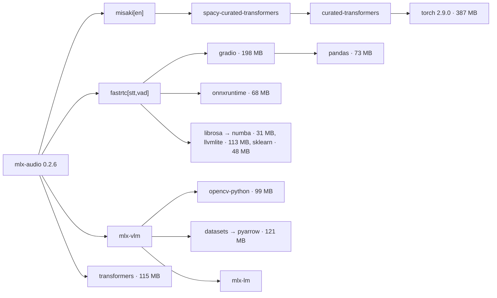

# R02 — MLX Python runtime stack: upgrade research

**Axis:** the Python runtime behind the native helper's worker (`native-helper/Sources/NaturalTTSHelper/Resources/tts_worker.py`): mlx / mlx-metal, mlx-audio, misaki, espeakng-loader, phonemizer-fork, soundfile, huggingface-hub, numpy, and the heavy transitive packages.
**Date:** 2026-09-23 · **Machine:** Apple M1 Max, macOS 15.7.9 · **Method:** every version, date and API claim below was read from PyPI JSON, GitHub releases/PRs/source, Hugging Face's API, or measured in a scratch uv project under `/tmp/ntts-r02/`. No repo file other than this one was written.

---

## Verdict

**Upgrade now to mlx-audio 0.5.5 + mlx 0.32.2 on Python 3.12, managed by uv with a lockfile, and install `misaki` without its `[en]` extra.** Two upstream decoder fixes are audible on our exact model: output was 2.5 dB too quiet, and the pitch path was misaligned. The upgrade also cuts the venv from 2.1 GB to about 0.5 GB, peak worker memory from 1,041 MB to 661 MB, and worker start-to-ready from about 4 s to about 0.5 s. The worker needs **no code change for API reasons.** The loader call, `generate()` and the result object stayed compatible.

Two bugs in our own code should ship in the same change. Both predate the upgrade and I measured both here:

1. **`normalize_text()` damages pronunciation.** Its NFKD-then-ASCII fold deletes curly apostrophes, quotes and dashes. That turns *We’re* into "were", *I’ll* into "ill", *Tech—like AI—moves* into "techlike AImoves" and *3–5 pm* into "thirty-five pm".
2. **The worker depends on Homebrew's espeak-ng without saying so.** espeak-ng keeps its data path in a 160-byte buffer, and the in-repo venv's path is 179 bytes. It falls back to Homebrew through `ESPEAK_DATA_PATH` in `PythonWorker.swift`. Without Homebrew, the whole process exits the first time text is converted to phonemes.

The upgrade forces one product decision: **mlx has shipped macOS 14+ wheels only since v0.30.0**, so the helper's declared floor of macOS 13 (`Package.swift` `.macOS(.v13)`) must rise to 14.

### Ranked recommendations

| # | Item | Current → target | Action | Conviction | Effort |
|---|------|------------------|--------|-----------:|:------:|
| 1 | **mlx-audio** | 0.2.6 → **0.5.5** | upgrade-now | 90% | S |
| 2 | **Fix `normalize_text()`** (NFKC; keep typographic punctuation and newlines) | ASCII fold → NFKC | adopt-new | 92% | S |
| 3 | **Install misaki without the `[en]` extra** + explicit English deps + pinned `en_core_web_sm` wheel | misaki[en] (via mlx-audio 0.2.6) → misaki 0.9.4 base | adopt-new | 90% | S |
| 4 | **Stop deleting `*.dist-info`** in `setup-python-env.sh` (proven crash path) | strip → keep | upgrade-now | 95% | S |
| 5 | **uv + `pyproject.toml` + `uv.lock`** replacing pip pins | pip, 3 pins → uv 0.12.x, 89 locked pkgs | adopt-new | 88% | M |
| 6 | **mlx / mlx-metal** | 0.29.3 → **0.32.2** | upgrade-now | 85% | S |
| 7 | **Raise the helper's minimum macOS 13 → 14**, which mlx ≥ 0.30 forces | `.macOS(.v13)` → `.v14` | operator-decision | 85% (raise it) | S |
| 8 | **Python** | 3.11.4 → **3.12.13** (3.13+ is blocked by misaki on PyPI) | upgrade-now | 85% | S |
| 9 | **Self-contained espeak data path** (worker guard; drop the Homebrew dependency) | Homebrew `ESPEAK_DATA_PATH` → bundled data | adopt-new | 85% | S |
| 10 | **Pick `lang_code` from the voice prefix** | always `"a"` → `voice[0]` | adopt-new | 90% | S |
| 11 | **Warm up the G2P pipeline at startup** | weights only → weights + one tiny generation | adopt-new | 85% | S |
| 12 | **Drop `soundfile`**; write WAV with stdlib `wave` | soundfile 0.13.1 → none | adopt-new | 80% | S |
| 13 | Kokoro model id | keep `prince-canuma/Kokoro-82M` (identical bytes to `mlx-community/Kokoro-82M-bf16`) | hold | 75% | — |
| 14 | `exclude-dependencies = ["transformers","scipy"]` (another −134 MB) | — | evaluate | 60% | S |
| 15 | Quantized Kokoro (4/6/8-bit) | — | reject | 80% | — |
| 16 | Stream Kokoro segments to the extension as they finish | whole-utterance WAV | evaluate | 70% | L |
| 17 | Replace Python with **mlx-audio-swift** (Kokoro in Swift) | — | evaluate | 55% | XL |
| 18 | Transitive packages (torch, gradio, fastrtc, mlx-lm, mlx-vlm, pandas, pyarrow, opencv, onnxruntime, numba …) | installed → **gone** | falls out of #1 + #3 | 95% | — |

**Where conviction sits below 90% and why.** #6 and #8: upstream's own lockfile pairs mlx-audio 0.5.5 with mlx **0.31.2**, not 0.32.2. I validated 0.32.2 myself; see [§2](#2-mlx--mlx-metal-0293--0322). #7 drops Ventura users, which is a product call. #13 is a naming preference, not a defect. #14 overrides dependencies that mlx-audio declares as required.

### Measured before and after (M1 Max, Hugging Face offline, same machine)

| Metric | Today (Py 3.11.4, mlx 0.29.3, mlx-audio 0.2.6) | Proposed (Py 3.12.13, mlx 0.32.2, mlx-audio 0.5.5) |
|---|---|---|
| venv on disk | **2,117 MB**, 181 distributions | **498 MB** fresh (518 MB with bytecode caches), 88 distributions; **364 MB** with #14 |
| `import mlx_audio.tts.utils` | 3.0–4.3 s (imports torch, transformers, pandas, pyarrow, sklearn) | 0.22–0.93 s |
| Process start → model ready | 3.89–4.83 s | 0.44–0.51 s |
| First request (spaCy/G2P init, not warmed) | 1.47–1.59 s | 2.25–3.58 s (lazy imports; #11 moves this into startup) |
| Warm speed, median of 6 on 73.4 s of speech | 4.49–5.85 s (0.061–0.080× real time) | 4.46–5.05 s (0.061–0.069×) — **no regression** |
| Peak memory (RSS) after 1 request | **1,041 MB**, 4,196 modules loaded | **661 MB**, 1,637 modules loaded |
| Output level (af_bella, short) | −28.38 dBFS | −25.89 dBFS (**+2.49 dB**, as PR #859 predicts) |
| Output durations | 4.80 s / 70.28 s | **identical** |
| Peak sample (all runs) | ≤ 0.49 | ≤ 0.61 (no clipping) |

Timing caveat: the machine's load average was 14–41 during these runs because other sessions were active. So compare only the interleaved rows, and read the timings as ranges, not precise figures. Memory, sizes, loudness and durations are unaffected by load.

---

## Why the stack is 2.1 GB today: dependency provenance

Our setup script installs only three pins: `mlx==0.29.3 mlx-audio==0.2.6 soundfile==0.13.1` (`native-helper/Scripts/setup-python-env.sh`). The rest comes from **mlx-audio 0.2.6's required dependencies** ([PyPI 0.2.6 JSON](https://pypi.org/pypi/mlx-audio/0.2.6/json)): `misaki[en]>=0.8.2`, `mlx-vlm>=0.1.27`, `fastrtc[stt,vad]`, `transformers>=4.49.0`, `spacy`, `mistral-common[audio]`, `fastapi`, `uvicorn`, `pytest-asyncio`, and others. I traced each chain with `pip show` against the live venv:



None of these is on the Kokoro inference path. Measured: the new stack serves Kokoro without importing torch, transformers, scipy, pandas, sklearn, mlx-lm or mlx-vlm. The only heavy modules it loads are misaki, phonemizer, spacy and thinc. The fourteen largest of those directories total **1,524 MB** in today's venv.

**What removed them.** mlx-audio cut its dependency graph over several releases: "Remove extra deps" [#373](https://github.com/Blaizzy/mlx-audio/pull/373) (v0.3.0rc1), "Remove librosa" [#662](https://github.com/Blaizzy/mlx-audio/pull/662), pyloudnorm [#667](https://github.com/Blaizzy/mlx-audio/pull/667), pydub [#671](https://github.com/Blaizzy/mlx-audio/pull/671), tiktoken [#673](https://github.com/Blaizzy/mlx-audio/pull/673), and **"Move misaki to an optional install to reduce dependency graph"** [#664](https://github.com/Blaizzy/mlx-audio/pull/664) (all v0.4.3). The PR's own words: *"The `misaki` dependency graph is huge and causes compatibility issues across various python versions."* Core requirements of 0.5.5 are now `huggingface_hub>=1.0, miniaudio, mlx>=0.31.1, numpy, scipy, sounddevice, tqdm, transformers>=5.14.0` ([PyPI JSON](https://pypi.org/pypi/mlx-audio/json)).

**Why torch survives even the new mlx-audio if we copy upstream's advice.** misaki 0.9.4's `en` extra is `espeakng-loader, num2words, phonemizer-fork, spacy, spacy-curated-transformers` ([PyPI JSON](https://pypi.org/pypi/misaki/json)). `spacy-curated-transformers` → `curated-transformers` → **torch**. That extra exists only for `G2P(trf=True)`, the transformer-based spaCy pipeline. mlx-audio always builds `en.G2P(trf=trf, …)` with `trf=False` by default (`mlx_audio/tts/models/kokoro/pipeline.py` in the 0.5.5 wheel). The answer is to install misaki's base package plus the four English dependencies it actually imports: `misaki.en` imports `spacy` and `num2words`, and `misaki.espeak` imports `phonemizer` and `espeakng_loader`.

---

## Per-item detail

### 1. mlx-audio 0.2.6 → 0.5.5

**Current:** 0.2.6 (2025-11-07). **Latest:** 0.5.5, uploaded 2026-09-21 ([PyPI](https://pypi.org/pypi/mlx-audio/json), [release](https://github.com/Blaizzy/mlx-audio/releases/tag/v0.5.5)). There were 23 releases in between.

**Why it matters here: Kokoro audio fidelity.**
- **[#859](https://github.com/Blaizzy/mlx-audio/pull/859) (v0.4.8, merged 2026-08-05): "fix(kokoro, kitten_tts): match PyTorch reference semantics in five decoder paths."** The MLX port diverged from the PyTorch reference (`hexgrad/kokoro`) in five places:
  1. A constant **−2.5 dB** attenuation, because `istft` divided by Σw where the reference divides by Σw².
  2. A symmetric-vs-periodic Hann window mismatch, causing about 3% reconstruction ripple.
  3. A **one-frame misalignment in the F0 (pitch) and energy path**: `F0_pred` relRMSE fell from 0.134 to 0.0000.
  4. The wrong random-phase distribution in `SineGen`.
  5. An out-of-range read in `interpolate1d`.

  The PR measured this on **`prince-canuma/Kokoro-82M`, our exact repo**, over a 55-utterance eval: mel L1 0.601 → 0.187, **MCD 7.29 → 4.09 dB**, **F0 RMSE 11.5 → 5.1 Hz**, speaker cosine 0.996 → 0.999, WER within 0.04 pp of PyTorch, and "Output durations are unchanged". **I reproduced the level change: +2.49 dB on af_bella and af_heart, durations bit-identical.** The PR flags the loudness change as user-facing (×4/3). Our peak samples stayed ≤ 0.61, and the proposed worker clips before converting to int16 anyway.
- **[#958](https://github.com/Blaizzy/mlx-audio/pull/958) (v0.5.5):** corrects `dsp.istft` geometry and output alignment. The PR reports that its 78 tests passed, "including Kokoro/Kitten ISTFT fidelity", and that 120 of 168 PyTorch comparisons failed before the fix and 0 after.
- **[#624](https://github.com/Blaizzy/mlx-audio/pull/624) (v0.4.3):** guards NaN durations, caps expansion at 100 frames per phoneme, and returns silence instead of crashing on empty output. This hardens against odd input.
- **[#348](https://github.com/Blaizzy/mlx-audio/pull/348) (v0.2.10):** the Kokoro module no longer runs `logger.remove()`/`logger.configure()` at import time. 0.2.6 did, which rewired logging in-process.
- **[#745](https://github.com/Blaizzy/mlx-audio/pull/745) (v0.4.4):** Kokoro now works from worker threads. It is needed because mlx 0.31.2 made default streams per-thread. It does not affect us today (single-threaded worker), but it removes a trap.
- **[#364](https://github.com/Blaizzy/mlx-audio/pull/364) (v0.2.10):** voices load from `voices/<name>.safetensors` via `mx.load` instead of a hand-rolled `.pt` unpickler. Both repos we might use carry all 54 voices as `.safetensors` ([HF API](https://huggingface.co/api/models/prince-canuma/Kokoro-82M?blobs=true)). This machine's HF cache already holds all 54 (snapshot `e02c9ead`, `refs/main`), so existing users re-download nothing.
- **[#380](https://github.com/Blaizzy/mlx-audio/pull/380)** adds the `en`/`fr`/`pt` lang aliases. **[#603](https://github.com/Blaizzy/mlx-audio/pull/603)** handles a float voice parameter. **[#548](https://github.com/Blaizzy/mlx-audio/pull/548)** removes a duplicate `audio_samples` field from `GenerationResult`; we never read it.

**Breaking changes that touch our worker: none.** Read from the 0.5.5 wheel and diffed against the installed 0.2.6:

| Surface we use | 0.2.6 | 0.5.5 | Impact |
|---|---|---|---|
| `from mlx_audio.tts.utils import load_model` | `load_model(model_path, lazy=False, strict=True, **kw)` | same signature; `str` repo id still accepted (`base_load_model`) | none |
| `model.generate(text, voice=, speed=)` | generator; `lang_code="a"`, `split_pattern=r"\n+"` | identical signature | none |
| `result.audio` | `mx.array`, 1-D, float32 | same | none |
| `result.sample_rate` | 24000 | 24000 (`ModelConfig.sample_rate`) | none — we can stop hard-coding it |
| stdout side-effects | loguru line to stderr | **`print("Creating new KokoroPipeline …")` to stdout** | stdout protection must stay |
| misaki | hard import at module load | lazy; clear `ImportError` if absent | **install requirement** — see §3 |

**Streaming.** New streaming APIs (`stream=`, `streaming_interval=`, `stream_generate`) landed for Qwen3-TTS, VibeVoice, Voxtral, Higgs, ZONOS2 and others ([release notes](https://github.com/Blaizzy/mlx-audio/releases)). **Kokoro has no new streaming mode.** Its `generate()` swallows those kwargs in `**kwargs` and already yields one `GenerationResult` per segment (newline split plus a 510-phoneme punctuation waterfall). Progressive playback is therefore possible **today** by forwarding each segment, but it needs protocol changes in Swift and the extension. See #16.

**Python support:** `requires_python >=3.10`. The pure-Python wheel works on 3.10–3.14; misaki is the constraint (§8).

**Migration:** version bump plus §3's install change. Verified end to end: the migrated worker served five protocol requests with 0 stray stdout bytes (§ Verification).

### 2. mlx / mlx-metal 0.29.3 → 0.32.2

**Current:** 0.29.3 (2025-10-17). **Latest:** 0.32.2 (2026-08-25) ([PyPI](https://pypi.org/pypi/mlx/json), [release](https://github.com/ml-explore/mlx/releases/tag/v0.32.2)). mlx-audio 0.5.5 requires `mlx>=0.31.1`.

**Changes that matter here:**
- **macOS floor.** v0.30.0 "only build for macos 14 and up" ([#2731](https://github.com/ml-explore/mlx/pull/2731), [v0.30.0 notes](https://github.com/ml-explore/mlx/releases/tag/v0.30.0)). PyPI confirms: **0.29.3 was the last release with `macosx_13_0` wheels**. 0.29.4 onward ships only `macosx_14_0`, `15_0` and `26_0`, and `mlx-metal 0.32.2` likewise. → forces #7.
- **Python.** v0.30.0 "bump python" ([#2694](https://github.com/ml-explore/mlx/pull/2694)) and v0.30.1 "bump minimum required Python version" ([#2891](https://github.com/ml-explore/mlx/pull/2891)) → `requires_python >=3.10`. 0.32.2 has wheels for cp310–cp314 plus free-threaded cp313t/cp314t ([#3812](https://github.com/ml-explore/mlx/pull/3812)).
- **Threading model.** v0.31.2 gives each thread its own default stream ([#3281](https://github.com/ml-explore/mlx/pull/3281)) and makes the command encoder thread-local ([#3348](https://github.com/ml-explore/mlx/pull/3348)). This is why mlx-audio needed #745. It is harmless to our single-threaded worker.
- **Kernels on Kokoro's path** (1-D conv, transposed conv, FFT/iSTFT): "Faster fully depthwise-separable 1D conv" ([#2567](https://github.com/ml-explore/mlx/pull/2567), 0.30.0); "Fix conv_transpose maxBufferLength failures on Metal" ([#3845](https://github.com/ml-explore/mlx/pull/3845)); "Fix Metal FFT for sizes above 2**20" ([#4013](https://github.com/ml-explore/mlx/pull/4013)); "Fix concurrent Metal kernel cache lookup" ([#4043](https://github.com/ml-explore/mlx/pull/4043)), all 0.32.1. The Neural Accelerator work (M5, macOS ≥ 26.2) does not apply to M1 Max.
- **Measured:** warm speed equal within noise (0.061–0.069× vs 0.061–0.080× real time). Model-ready time fell ~9×, mostly because the new mlx-audio import is smaller, not because of mlx itself.

**Pin choice.** mlx-audio's own `uv.lock` at v0.5.5 resolves **mlx 0.31.2** ([uv.lock@v0.5.5](https://github.com/Blaizzy/mlx-audio/blob/v0.5.5/uv.lock)). Our resolver chose 0.32.2, and every measurement in this report ran on 0.32.2. Recommend `mlx>=0.32.2,<0.33` in `pyproject.toml` with the exact version fixed in `uv.lock`. If a regression appears, 0.31.2 is the upstream-tested fallback (`uv lock --upgrade-package mlx==0.31.2`).

### 3. misaki: base package, not `[en]`; pin the spaCy model

**Current:** misaki 0.9.4 with `[en]`, pulled in by mlx-audio 0.2.6. **Latest on PyPI:** still **0.9.4** (2025-04-05), `requires_python <3.13,>=3.8` ([PyPI](https://pypi.org/pypi/misaki/json)). Upstream `main` has one unreleased change since then, "Enable Python 3.13" (commit `fba12365`, 2025-08-11). Its `pyproject.toml` on `main` now declares `<3.14`, adds `pip` as a hard dependency "since Spacy needs pip within Python, uv lacks pip by default", and adds `torch` and `transformers` to `[en]` ([repo](https://github.com/hexgrad/misaki), [pyproject](https://github.com/hexgrad/misaki/blob/main/pyproject.toml)).

**Why pin `en_core_web_sm` explicitly.** `misaki.en.G2P.__init__` runs `if not spacy.util.is_package(name): spacy.cli.download(name)`. `is_package` checks the installed package metadata (`importlib_metadata.distribution`). If that metadata is missing, spaCy 3.8.16 shells out to `pip install` or, failing that, `uv pip install` (`spacy/cli/download.py::_get_pip_install_cmd`). **Proven here:** with `en_core_web_sm`'s `.dist-info` removed, G2P construction exits the process with code 2 ("No virtual environment found; run `uv venv`…"). Pinning the wheel ([en_core_web_sm-3.8.0](https://github.com/explosion/spacy-models/releases/tag/en_core_web_sm-3.8.0), sha256 `1932429d…fb85`, recorded in `uv.lock`) makes the runtime download unreachable. Keeping `.dist-info` (#4) is the other half.

**Transitive versions** after locking, restricted to `sys_platform == 'darwin' and platform_machine == 'arm64'`: spacy **3.8.16** (was 3.8.8; [PyPI](https://pypi.org/pypi/spacy/json), 2026-08-24), thinc 8.3.13, phonemizer-fork **3.3.2** (unchanged; latest, 2025-01-30, [PyPI](https://pypi.org/pypi/phonemizer-fork/json)), espeakng-loader **0.2.4** (unchanged; latest, 2025-01-17, bundles libespeak-ng 1.52.0, [PyPI](https://pypi.org/pypi/espeakng-loader/json)), num2words 0.5.14.

### 4. `setup-python-env.sh` deletes every `*.dist-info` — stop

The script runs `find "$VENV_DIR" -type d -name "*.dist-info" -exec rm -rf {} +` to save space. That makes `spacy.util.is_package("en_core_web_sm")` return False, which triggers the runtime download in §3 and kills the process. transformers also builds its import table from `importlib.metadata.packages_distributions()`. The savings are a few MB against 2.1 GB. The live venv on this machine still has its dist-info (`pip list` works), so this block evidently did not run when that venv was built. Remove it in the uv rewrite (§5).

### 5. uv + `pyproject.toml` + `uv.lock` instead of pip pins

**Yes, move.** Today only three direct pins are recorded, and the other ~178 distributions float to whatever pip resolves on the day. That is how torch and gradio arrived unnoticed. A lock records all 89 (hashes included), is universal, and `uv sync --frozen` reproduces it exactly.

- uv on this machine: 0.11.28 (Homebrew). Latest: **0.12.18** (2026-09-22) ([releases](https://github.com/astral-sh/uv/releases)). Both support everything below.
- `UV_PROJECT_ENVIRONMENT` ([docs](https://docs.astral.sh/uv/reference/environment/#uv_project_environment)) keeps the venv at the path `Config.swift` already probes (`Sources/NaturalTTSHelper/Resources/python-env/bin/python3`). uv venvs provide `bin/python3` (verified), so **no Swift change is needed** for the switch.
- `[tool.uv] environments = ["sys_platform == 'darwin' and platform_machine == 'arm64'"]` keeps Linux and Windows wheels out of the lock.
- `exclude-dependencies` exists ([docs](https://docs.astral.sh/uv/reference/settings/#exclude-dependencies)); see #14.
- For a distributable `.app`: the venv's `python` symlinks to an interpreter outside the bundle. Today that is `/Library/Frameworks/Python.framework/…/3.11`; under uv it would be `~/.local/share/uv/python/cpython-3.12…`. `uv venv --relocatable` ([docs](https://docs.astral.sh/uv/reference/cli/#uv-venv--relocatable)) plus a bundled python-build-standalone interpreter is the route. That belongs to the packaging axis and is not blocking here.

**Proposed `native-helper/python/pyproject.toml`** (locks to 89 packages in 0.4 s; `uv.lock` is 1,042 lines):

```toml
[project]
name = "natural-tts-worker"
version = "1.5.0"
description = "Kokoro-82M (MLX) worker process for the Natural TTS native helper"
requires-python = "==3.12.*"          # misaki 0.9.4 on PyPI declares <3.13
dependencies = [
    "mlx>=0.32.2,<0.33",               # 0.30.0+ ships macOS 14+ wheels only
    "mlx-audio>=0.5.5,<0.6",           # Kokoro decoder fidelity fixes (PR #859, #958)
    # Kokoro G2P. misaki is optional in mlx-audio >= 0.4.3 (PR #664). Base package only:
    # misaki[en] adds spacy-curated-transformers -> curated-transformers -> torch (~390 MB),
    # used only by G2P(trf=True); mlx-audio always constructs G2P(trf=False).
    "misaki==0.9.4",
    "spacy>=3.8.16,<3.9",
    "num2words>=0.5.14",
    "phonemizer-fork==3.3.2",
    "espeakng-loader==0.2.4",
    # Pinned so misaki never runs spacy.cli.download() (pip/uv install at runtime).
    "en-core-web-sm @ https://github.com/explosion/spacy-models/releases/download/en_core_web_sm-3.8.0/en_core_web_sm-3.8.0-py3-none-any.whl",
]

[tool.uv]
package = false
environments = ["sys_platform == 'darwin' and platform_machine == 'arm64'"]
```

**Proposed `setup-python-env.sh` core** (replaces `python3 -m venv` + `pip install` + the dist-info strip):

```bash
command -v uv >/dev/null || { echo "uv not found: brew install uv"; exit 1; }
export UV_PROJECT_ENVIRONMENT="$PROJECT_ROOT/Sources/NaturalTTSHelper/Resources/python-env"
uv sync --project "$PROJECT_ROOT/python" --frozen --python 3.12 --compile-bytecode
"$UV_PROJECT_ENVIRONMENT/bin/python3" -c "import mlx.core as mx, misaki.en, spacy, en_core_web_sm; \
from mlx_audio.tts.utils import load_model; print('mlx', mx.__version__)"
# NO dist-info / __pycache__ stripping: spaCy's is_package() reads dist-info (see R02 §4).
```

**Locked versions of the remaining axis packages:** huggingface-hub **1.32.0** (was 0.36.0; 1.0 moved from `requests` to `httpx` and **removed the `huggingface-cli` command** in favour of `hf`, per the [v1.0.0 notes](https://github.com/huggingface/huggingface_hub/releases/tag/v1.0.0). `git grep huggingface-cli` finds nothing in this repo, so there is no doc impact). transformers **5.17.0** (was 4.57.1; required by mlx-audio core `>=5.14.0`, **not imported** on the Kokoro path). numpy **2.5.3** (was 2.2.6; 2.5.x is `>=3.12`, so a 3.11 env would top out at 2.4.6, [PyPI](https://pypi.org/pypi/numpy/json)). scipy 1.18.1 (core dependency, not imported on the Kokoro path).

### 6. Python 3.11.4 → 3.12.13

- **Ceiling = 3.12.** misaki 0.9.4 on PyPI declares `<3.13`, and uv resolves on requires-python, so a 3.13 environment cannot lock. The unreleased misaki `main` allows 3.13 only; using it means a git dependency on an unreleased commit, and its pyproject would add `pip` and change `[en]`. Not worth it for this workload.
- **Support window:** 3.12 is in security-fix status until **2028-10**, 3.11 until **2027-10** ([devguide versions table](https://devguide.python.org/versions/)).
- **Wheels:** mlx 0.32.2, spacy 3.8.16 and numpy 2.5.3 all ship cp312 macOS arm64 wheels ([PyPI](https://pypi.org/pypi/spacy/3.8.16/json)).
- uv resolves `cpython-3.12.13-macos-aarch64` (`uv python list 3.12`).

### 7. Raise the minimum macOS from 13 to 14 — operator decision

`native-helper/Package.swift` declares `.macOS(.v13)`. Any mlx ≥ 0.29.4 has no macOS 13 wheel (§2), and mlx-audio 0.5.5 needs mlx ≥ 0.31.1. The only ways to keep Ventura are to freeze on mlx-audio 0.2.x (keeping the −2.5 dB and pitch-path defects), or to build mlx from source for macOS 13, which upstream stopped supporting in #2731. mlx-audio-swift also targets macOS 14+ (§17), so no path keeps 13. **Recommendation: raise to `.macOS(.v14)` and say "macOS 14 Sonoma or later" in the store listing.**

### 8. Self-contained espeak-ng data path (drop the Homebrew dependency)

**Finding.** `PythonWorker.swift:37-40` forces `ESPEAK_DATA_PATH=/opt/homebrew/opt/espeak-ng/share/espeak-ng-data`, and `native-helper/README.md` calls `brew install espeak-ng` "REQUIRED". The Python stack already bundles espeak-ng 1.52.0 (espeakng-loader). The bundled copy fails in development because of a path-length limit:
- espeak-ng declares `char path_home[N_PATH_HOME]` with **`N_PATH_HOME_DEF 160` on POSIX** (`src/libespeak-ng/speech.h`). `check_data_path()` `snprintf`s the path into that buffer. If it doesn't fit, `espeak_ng_InitializePath()` falls back to `getenv("ESPEAK_DATA_PATH")`, then `$HOME`, then the compile-time default `/Users/runner/work/espeakng-loader/…`, and **the process exits** ([speech.h@1.52.0](https://github.com/espeak-ng/espeak-ng/blob/1.52.0/src/libespeak-ng/speech.h), [speech.c@1.52.0](https://github.com/espeak-ng/espeak-ng/blob/1.52.0/src/libespeak-ng/speech.c)).
- The in-repo data path is **179 bytes** (`…/Resources/python-env/lib/python3.11/site-packages/espeakng_loader/espeak-ng-data`). An `/Applications/…app/Contents/Resources/…` bundle would be 124 bytes and fit.
- **Measured:** the live venv aborts on "Hello there." without `ESPEAK_DATA_PATH`. So does the *new* stack when synced to a 173-byte path. The new stack at an 84-byte path works with no Homebrew at all. So the cause is path length, not a package version (phonemizer, misaki, espeakng-loader and `libespeak-ng.dylib` are byte-identical across both envs).
- **Fix, verified end to end.** Before the first G2P, the worker checks the bundled data path. If it is longer than 159 bytes, the worker symlinks it at `~/Library/Caches/NaturalTTS/espeak-ng-data` (56 bytes) and exports that as `ESPEAK_DATA_PATH`. A symlink passed through phonemizer does **not** work, because phonemizer calls `Path.resolve()` on the data path. espeak-ng's own `getenv` fallback uses `stat()`, which follows the link. With this guard the migrated worker served all requests on the 173-byte env with `ESPEAK_DATA_PATH` unset, and also with Swift's Homebrew value set; the guard overrides it so data and library versions always match. After this lands, the Homebrew override in `PythonWorker.swift` and the `brew install espeak-ng` steps in three docs can go.

### 9. `normalize_text()` — pronunciation fix

**Finding.** The current code runs `unicodedata.normalize("NFKD", text).encode("ascii","ignore")` and then collapses all whitespace. That deletes every non-ASCII character NFKD cannot decompose: `’ ‘ “ ” — – …`. misaki handles those natively: `SUBTOKEN_REGEX` treats `'‘’` as apostrophes, `PUNCTS` includes `—…"“”`, and `–` becomes `—` (`misaki/en.py`). Kokoro's vocab has `“ ” — …` as tokens (`config.json` `vocab`). Measured through misaki G2P in the new env:

| Input | Current fold → phonemes | NFKC-based → phonemes |
|---|---|---|
| We’re sure you’ll love it — it’s great. | "Were … youll …" → **wˌɜɹ** ("were") | **wˌɪɹ** ("we're"), `—` kept |
| I’ll read “Café Society” on 𝚟𝚒𝚝𝚎… | "Ill …" → **ˈɪl** ("ill") | **ˌIl** ("I'll"), quotes kept, 𝚟𝚒𝚝𝚎 → vite |
| Tech—like AI—moves fast. | "Techlike AImoves" → **tˈɛklIk ə ɪmˈuvz** | tˈɛk—lˈIk ˈAˌI—mˈuvz |
| Don’t stop; it’s 3–5 pm. | "35 pm" → **θˈɜɹTi fˈIv** ("thirty-five") | θɹˈi fˈIv ("three five") |

NFKC still folds the mathematical-alphanumeric case the original comment was written for (𝚟𝚒𝚝𝚎 → vite). The proposed version also keeps newlines, so paragraphs become separate Kokoro segments (`split_pattern=r"\n+"`), and it drops zero-width, format and control characters.

### 10–12. Smaller worker fixes

- **#10 `lang_code` from the voice prefix.** `generate()` defaults `lang_code="a"`. A `bf_*` or `bm_*` voice then runs through American G2P, and mlx-audio logs "Language mismatch". Today the helper exposes only six `a`-prefixed voices (`HTTPServer.swift:205-210`), so this is latent. It becomes live the moment the roster grows. It is one line: `voice[0] if voice[0] in "abefhijpz" else "a"`. Verified with `bf_emma` (British G2P, 5.55 s of speech).
- **#11 Warm-up.** Loading weights does not build the G2P pipeline. The first request pays for spaCy, the lexicon, the voice and Metal kernel compilation: 1.5–1.6 s old, 2.3–3.6 s new, because 0.5.5 imports lazily. One `generate("Ready.")` in `load_mlx_model()` moves that cost into startup. The docstring already promises "first /speak request is instant".
- **#12 Drop soundfile.** mlx-audio no longer depends on it; it uses miniaudio now. We only encode 16-bit mono WAV into a `BytesIO`, which stdlib `wave` does. The proposed encoder clips to [−1, 1] before scaling, which matters with the louder output. soundfile's latest is 0.14.0 (2026-06-06, [PyPI](https://pypi.org/pypi/soundfile/json)) if it is ever wanted back.
- **stdout protection.** 0.5.5 still `print()`s to stdout, so protection must stay. The proposal replaces the per-call `redirect_stdout/redirect_stderr(devnull)` with a one-time fd swap: `os.dup(1)` becomes the protocol channel and fd 1 is pointed at stderr. That also catches C-level writes, and it stops hiding MLX and espeak diagnostics in `/dev/null`. Verified: **0 stray stdout bytes** across five requests.

### 13. Canonical Kokoro model id — hold `prince-canuma/Kokoro-82M`

The mlx-audio README's Kokoro example uses `mlx-community/Kokoro-82M-bf16` ([README](https://github.com/Blaizzy/mlx-audio/blob/main/README.md)), which has 45,153 downloads versus 7,632 for `prince-canuma/Kokoro-82M` ([HF API](https://huggingface.co/api/models/mlx-community/Kokoro-82M-bf16)). But:
- `kokoro-v1_0.safetensors` has the **same sha256** (`4e9ecdf0…02acd8`, 327,115,152 bytes) in both repos, and `config.json` has the same blob id. Switching changes no audio.
- The Kokoro class fetches **voices** from `Model.REPO_ID = "prince-canuma/Kokoro-82M"`. `load_model` never passes `repo_id`, so voices come from `prince-canuma` whichever weights repo you load.
- Existing users have `prince-canuma` cached (349 MB here). A switch re-downloads 327 MB into a second cache directory for byte-identical weights.

Keep it, behind a single `MODEL_ID` constant (`NTTS_MODEL_ID` env override in the proposed worker). Revisit if `prince-canuma/Kokoro-82M` is ever deprecated.

### 14. `exclude-dependencies` for transformers and scipy — evaluate

Verified working: with `exclude-dependencies = ["transformers", "scipy"]`, the lock drops to 86 packages, the venv to **364 MB** (−134 MB), and Kokoro generation still runs at 690 MB peak memory. Risk: both are declared core dependencies, so a future mlx-audio release can import either at module level and break us at runtime. Adopt only together with the smoke test in § Verification running on every `uv lock --upgrade`.

### 15. Quantized Kokoro — reject

`mlx-community/Kokoro-82M-8bit/6bit/4bit` hold 289/286/283 MB weight files against 327 MB for bf16 ([HF API](https://huggingface.co/api/models/mlx-community/Kokoro-82M-4bit)). That is ≤ 13% smaller for an 82M-parameter model, and quantized loading needed its own fix (#624). There is no speed case at our real-time factor of about 0.06.

### 16. Streaming segments — evaluate (architecture axis)

Kokoro already yields per segment (§1). Time-to-first-audio on long pages could fall to one segment's worth, about ⅓ of total generation time on the 3-segment test text. The gain needs the Swift `/speak` response and the offscreen player to accept chunked audio, so it is an architecture change, not a library one.

### 17. mlx-audio-swift — evaluate (would delete Python entirely)

[Blaizzy/mlx-audio-swift](https://github.com/Blaizzy/mlx-audio-swift) (latest v0.1.3, 2026-07-09; macOS 14+) ships Kokoro in Swift (`Sources/MLXAudioTTS/Models/StyleTTS2/Kokoro/`). It covers 54 voices and picks the language from the voice prefix, and it loads `mlx-community/Kokoro-82M-bf16`. Its English G2P is a **`MisakiTextProcessor` re-implementation ("CMUdict + rules")**, not misaki's spaCy-tagged pipeline, and our quality depends on that pipeline for heteronyms such as *read* and *live*. Parity is unmeasured. A spike would compare phonemes on a text corpus against Python misaki before anyone considers it. The payoff is large: no Python, no venv, no 0.5 GB, no espeak path problem.

### 18. Adjacent findings handed to other axes

- **Voice roster (models axis).** The helper exposes `am_adam`, which VOICES.md grades **F+**, and omits **`af_heart`** (grade **A**, the best). It also labels `af_sarah` "(UK)", but the `a` prefix means American English ([VOICES.md](https://huggingface.co/prince-canuma/Kokoro-82M/raw/main/VOICES.md); `HTTPServer.swift:205-210`).
- **Stale docs (README axis).** `native-helper/README.md:101` says "Python 3.12+ not yet supported by MLX", which is false (cp312 wheels exist back to at least mlx 0.29.3). Line 147 lists `phonemizer==3.3.0`, but it is `phonemizer-fork 3.3.2`. Three docs call Homebrew espeak-ng required (§8). README.md:98 describes "Python 3.11 + 100+ ML packages".

---

## Migration plan (one change set; each step is small)

1. Add `native-helper/python/pyproject.toml` (above) and run `uv lock` to generate `uv.lock`. Commit both.
2. Rewrite `setup-python-env.sh` around `uv sync --frozen` into the existing `python-env` path, with no dist-info or `__pycache__` stripping.
3. Apply the `tts_worker.py` diff (Appendix A). **Required** for the upgrade: nothing. **Required** to drop Homebrew: the espeak guard. **Recommended:** NFKC normalisation, lang_code, warm-up, stdlib WAV, fd-level stdout protection, speed validation.
4. `Package.swift`: `.macOS(.v13)` → `.macOS(.v14)` (after the operator agrees, #7).
5. `PythonWorker.swift`: delete the Homebrew `ESPEAK_DATA_PATH` line (harmless to keep because the worker overrides it; remove it for clarity).
6. Docs: remove the Homebrew espeak-ng step and correct the Python and phonemizer lines.

**Rollback:** `git revert` restores the pip script. `./Scripts/setup-python-env.sh` rebuilds the 0.2.6 env; the HF cache still holds the `.pt` voices it uses.

## Verification (what proves the upgrade)

```bash
cd native-helper && ./Scripts/setup-python-env.sh            # uv sync --frozen
env -u ESPEAK_DATA_PATH HF_HUB_OFFLINE=1 \
  Sources/NaturalTTSHelper/Resources/python-env/bin/python3 /tmp/ntts-r02/driver.py \
  Sources/NaturalTTSHelper/Resources/python-env/bin/python3 Sources/NaturalTTSHelper/Resources/tts_worker.py
# expect: 3× "OK … sr=24000 ch=1 width=2", empty_text + invalid_speed errors, "stray_stdout_bytes=0 exit=0"
./Scripts/test-performance-short.sh && ./Scripts/test-performance-long.sh   # existing HTTP-level checks
```

The driver (Appendix B) sends length-prefixed frames exactly as `PythonWorker.swift` does. It decodes every returned WAV, and it fails if a single byte reaches stdout outside a frame. Result on the migrated worker in scratch: **pass** on both an 84-byte and a 173-byte venv path, with and without Homebrew's `ESPEAK_DATA_PATH`.

## Evidence and scratch artifacts

`/tmp/ntts-r02/`: `bench.py` / `old.json` / `new.json` / `new-brew.json` (per-run loudness and speed), `bench2.py` (interleaved cold/warm), `mem.py` (memory and loaded modules), `norm.py` (G2P comparison), `driver.py`, `worker/tts_worker.py` (sha256 `5c5344c2…b1b9`), `worker.diff`, `final/pyproject.toml` + `final/uv.lock`, the mlx-audio 0.5.5 wheel unpacked at `wheels/mlx055/`, and release-note dumps `mlxaudio-releases.norm.json` / `mlx-releases.norm.json`. `/tmp` does not survive a reboot; the numbers that matter are copied into this report.

## Sources

- PyPI JSON (fetched 2026-09-23): [mlx-audio](https://pypi.org/pypi/mlx-audio/json) · [mlx-audio 0.2.6](https://pypi.org/pypi/mlx-audio/0.2.6/json) · [mlx](https://pypi.org/pypi/mlx/json) · [mlx-metal](https://pypi.org/pypi/mlx-metal/json) · [misaki](https://pypi.org/pypi/misaki/json) · [spacy](https://pypi.org/pypi/spacy/json) · [numpy](https://pypi.org/pypi/numpy/json) · [huggingface-hub](https://pypi.org/pypi/huggingface-hub/json) · [transformers](https://pypi.org/pypi/transformers/json) (5.17.0, 2026-09-09) · [torch](https://pypi.org/pypi/torch/json) (2.14.0, 2026-09-02) · [soundfile](https://pypi.org/pypi/soundfile/json) · [espeakng-loader](https://pypi.org/pypi/espeakng-loader/json) · [phonemizer-fork](https://pypi.org/pypi/phonemizer-fork/json) · [mlx-lm](https://pypi.org/pypi/mlx-lm/json) (0.31.3) · [mlx-vlm](https://pypi.org/pypi/mlx-vlm/json) (0.7.2)
- mlx-audio: [releases v0.2.7…v0.5.5](https://github.com/Blaizzy/mlx-audio/releases) · PRs [#859](https://github.com/Blaizzy/mlx-audio/pull/859) [#958](https://github.com/Blaizzy/mlx-audio/pull/958) [#624](https://github.com/Blaizzy/mlx-audio/pull/624) [#664](https://github.com/Blaizzy/mlx-audio/pull/664) [#745](https://github.com/Blaizzy/mlx-audio/pull/745) [#348](https://github.com/Blaizzy/mlx-audio/pull/348) [#364](https://github.com/Blaizzy/mlx-audio/pull/364) [#373](https://github.com/Blaizzy/mlx-audio/pull/373) [#380](https://github.com/Blaizzy/mlx-audio/pull/380) [#548](https://github.com/Blaizzy/mlx-audio/pull/548) [#603](https://github.com/Blaizzy/mlx-audio/pull/603) · [README Kokoro section](https://github.com/Blaizzy/mlx-audio/blob/main/README.md) · [uv.lock @ v0.5.5](https://github.com/Blaizzy/mlx-audio/blob/v0.5.5/uv.lock) · source read from the 0.5.5 wheel (`tts/utils.py`, `utils.py::base_load_model`, `tts/models/kokoro/{kokoro,pipeline,voice}.py`, `tts/models/base.py`)
- mlx: [releases](https://github.com/ml-explore/mlx/releases) · [v0.30.0](https://github.com/ml-explore/mlx/releases/tag/v0.30.0) ([#2731](https://github.com/ml-explore/mlx/pull/2731), [#2694](https://github.com/ml-explore/mlx/pull/2694), [#2567](https://github.com/ml-explore/mlx/pull/2567)) · [v0.30.1](https://github.com/ml-explore/mlx/releases/tag/v0.30.1) ([#2891](https://github.com/ml-explore/mlx/pull/2891)) · [v0.31.2](https://github.com/ml-explore/mlx/releases/tag/v0.31.2) ([#3281](https://github.com/ml-explore/mlx/pull/3281)) · [v0.32.1](https://github.com/ml-explore/mlx/releases/tag/v0.32.1) ([#3812](https://github.com/ml-explore/mlx/pull/3812), [#3845](https://github.com/ml-explore/mlx/pull/3845), [#4013](https://github.com/ml-explore/mlx/pull/4013)) · [v0.32.2](https://github.com/ml-explore/mlx/releases/tag/v0.32.2)
- Hugging Face API: [prince-canuma/Kokoro-82M](https://huggingface.co/api/models/prince-canuma/Kokoro-82M?blobs=true) · [mlx-community/Kokoro-82M-bf16](https://huggingface.co/api/models/mlx-community/Kokoro-82M-bf16?blobs=true) · [-4bit](https://huggingface.co/api/models/mlx-community/Kokoro-82M-4bit?blobs=true) / [-6bit](https://huggingface.co/api/models/mlx-community/Kokoro-82M-6bit?blobs=true) / [-8bit](https://huggingface.co/api/models/mlx-community/Kokoro-82M-8bit?blobs=true) · [hexgrad/Kokoro-82M](https://huggingface.co/api/models/hexgrad/Kokoro-82M) · [VOICES.md](https://huggingface.co/prince-canuma/Kokoro-82M/raw/main/VOICES.md)
- misaki: [repo + unreleased main](https://github.com/hexgrad/misaki) · [pyproject on main](https://github.com/hexgrad/misaki/blob/main/pyproject.toml)
- espeak-ng 1.52.0: [speech.h](https://github.com/espeak-ng/espeak-ng/blob/1.52.0/src/libespeak-ng/speech.h) · [speech.c](https://github.com/espeak-ng/espeak-ng/blob/1.52.0/src/libespeak-ng/speech.c)
- spaCy model: [en_core_web_sm-3.8.0](https://github.com/explosion/spacy-models/releases/tag/en_core_web_sm-3.8.0)
- uv: [releases](https://github.com/astral-sh/uv/releases) · [settings: exclude-dependencies / environments](https://docs.astral.sh/uv/reference/settings/) · [env: UV_PROJECT_ENVIRONMENT](https://docs.astral.sh/uv/reference/environment/) · [cli: uv venv --relocatable](https://docs.astral.sh/uv/reference/cli/)
- Python: [devguide supported versions](https://devguide.python.org/versions/)
- huggingface_hub: [v1.0.0 release notes](https://github.com/huggingface/huggingface_hub/releases/tag/v1.0.0)
- mlx-audio-swift: [repo](https://github.com/Blaizzy/mlx-audio-swift) · [Kokoro README](https://github.com/Blaizzy/mlx-audio-swift/blob/main/Sources/MLXAudioTTS/Models/StyleTTS2/Kokoro/README.md)

---

## Appendix A — `tts_worker.py` migration diff

Protocol, request fields and response fields (`audio_base64`, `duration`, `sample_rate`, `format`) are unchanged, so no Swift or extension change is needed for this diff.

<details><summary>Unified diff (143 insertions, 126 deletions)</summary>

```diff
--- a/native-helper/Sources/NaturalTTSHelper/Resources/tts_worker.py
+++ b/native-helper/Sources/NaturalTTSHelper/Resources/tts_worker.py
@@ -1,29 +1,81 @@
 #!/usr/bin/env python3
 """
 Natural TTS Helper - Python MLX Worker
-Communicates with Swift via stdin/stdout using Native Messaging protocol
+Communicates with Swift via stdin/stdout using a length-prefixed JSON protocol.
+
+Runtime contract (see native-helper/python/pyproject.toml + uv.lock):
+  mlx-audio 0.5.x, mlx 0.32.x, misaki 0.9.4 (base, NOT the [en] extra), Python 3.12.
 """
 
-import sys
-import json
 import base64
+import json
 import logging
+import math
+import os
+import re
+import sys
+import unicodedata
+import wave
 from io import BytesIO
 
-# Setup logging to stderr (captured by Swift)
+# --- Protocol channel ---------------------------------------------------------
+# Claim the real stdout for protocol frames and point fd 1 at stderr. Any print()
+# from mlx-audio (0.5.x still prints "Creating new KokoroPipeline ...") and any
+# C-level write from espeak-ng/MLX now lands on stderr instead of corrupting a
+# length-prefixed frame. Replaces the per-call redirect_stdout/redirect_stderr
+# (which also hid every espeak/MLX diagnostic behind /dev/null).
+_PROTO_OUT = os.fdopen(os.dup(sys.stdout.fileno()), "wb", buffering=0)
+os.dup2(sys.stderr.fileno(), sys.stdout.fileno())
+
 logging.basicConfig(
     level=logging.INFO, format="[%(levelname)s] %(message)s", stream=sys.stderr
 )
 logger = logging.getLogger(__name__)
 
-# Global model cache for reuse across requests
+# Byte-identical weights to mlx-community/Kokoro-82M-bf16 (same sha256), already in
+# existing users' HF cache, and the repo mlx-audio's Kokoro class fetches voices from
+# (kokoro.Model.REPO_ID). One constant so a switch is one line.
+MODEL_ID = os.environ.get("NTTS_MODEL_ID", "prince-canuma/Kokoro-82M")
+DEFAULT_VOICE = "af_bella"
+KOKORO_LANG_CODES = "abefhijpz"  # voice-id prefix == Kokoro lang_code
+ESPEAK_PATH_MAX = 159  # espeak-ng 1.52: char path_home[N_PATH_HOME=160] on POSIX
+
 _model_cache = None
 
 
+def _ensure_espeak_data_path():
+    """Point espeak-ng at the data dir bundled with espeakng-loader, via a short path.
+
+    espeak-ng copies its data path into a 160-byte buffer (speech.h N_PATH_HOME) and,
+    if the path does not fit, silently falls back to $ESPEAK_DATA_PATH, then to its
+    compile-time default, and then exits the whole process. The in-repo venv path is
+    179 bytes, which is why the helper previously depended on Homebrew espeak-ng via
+    ESPEAK_DATA_PATH. phonemizer resolve()s symlinks, but espeak-ng's own getenv()
+    fallback uses stat(), so a short symlink exported as ESPEAK_DATA_PATH works.
+    """
+    try:
+        import espeakng_loader
+    except ImportError:
+        return
+    src = espeakng_loader.get_data_path()
+    if len(src.encode()) <= ESPEAK_PATH_MAX:
+        os.environ["ESPEAK_DATA_PATH"] = src
+        return
+    link_dir = os.path.expanduser("~/Library/Caches/NaturalTTS")
+    link = os.path.join(link_dir, "espeak-ng-data")
+    os.makedirs(link_dir, exist_ok=True)
+    if os.path.islink(link) and os.readlink(link) != src:
+        os.unlink(link)
+    try:
+        os.symlink(src, link)
+    except FileExistsError:
+        pass
+    os.environ["ESPEAK_DATA_PATH"] = link
+
+
 def read_message():
     """Read length-prefixed JSON message from stdin (Native Messaging protocol)"""
     try:
-        # Read 4-byte length prefix (little-endian)
         length_bytes = sys.stdin.buffer.read(4)
         if len(length_bytes) == 0:
             return None
@@ -31,16 +83,8 @@
         length = int.from_bytes(length_bytes, "little")
         if length == 0 or length > 10 * 1024 * 1024:  # Max 10MB message
             logger.error(f"Invalid message length: {length} (0x{length:08x})")
-            # Log next few bytes for debugging
-            try:
-                peek = sys.stdin.buffer.read(min(16, sys.stdin.buffer.readable()))
-                logger.error(f"Next bytes (hex): {peek.hex()}")
-                logger.error(f"Next bytes (ascii): {repr(peek)}")
-            except:
-                pass
             return None
 
-        # Read message body
         message_bytes = sys.stdin.buffer.read(length)
         if len(message_bytes) != length:
             logger.error(
@@ -48,158 +92,141 @@
             )
             return None
 
-        message = json.loads(message_bytes.decode("utf-8"))
-        return message
+        return json.loads(message_bytes.decode("utf-8"))
     except Exception as e:
         logger.error(f"Error reading message: {e}")
         return None
 
 
 def write_message(obj):
-    """Write length-prefixed JSON message to stdout"""
+    """Write length-prefixed JSON message to the protocol channel"""
     try:
         message_bytes = json.dumps(obj).encode("utf-8")
-        length = len(message_bytes).to_bytes(4, "little")
-        sys.stdout.buffer.write(length)
-        sys.stdout.buffer.write(message_bytes)
-        sys.stdout.buffer.flush()
+        _PROTO_OUT.write(len(message_bytes).to_bytes(4, "little") + message_bytes)
+        _PROTO_OUT.flush()
     except Exception as e:
         logger.error(f"Error writing message: {e}")
 
 
+def lang_code_for(voice):
+    """Kokoro voice ids carry their language in the first letter (af_* = American,
+    bf_* = British, ...). mlx-audio's generate() defaults lang_code to "a", which
+    runs a British voice through American G2P."""
+    c = (voice or "a")[0].lower()
+    return c if c in KOKORO_LANG_CODES else "a"
+
+
 def get_cached_model():
     """Get or create cached MLX model instance"""
     global _model_cache
     if _model_cache is None:
         from mlx_audio.tts.utils import load_model
 
-        logger.info("Loading model (first time)...")
-        _model_cache = load_model("prince-canuma/Kokoro-82M")
-        logger.info("Model loaded and cached")
-    else:
-        logger.info("Using cached model")
+        logger.info(f"Loading model {MODEL_ID} (first time)...")
+        _model_cache = load_model(MODEL_ID)
     return _model_cache
 
 
 def load_mlx_model():
-    """Eagerly load Kokoro weights so first /speak request is instant."""
-    global _model_cache
-    try:
-        from mlx_audio.tts.utils import load_model
+    """Load weights AND warm the G2P pipeline so the first /speak is instant.
 
-        logger.info("Eagerly loading Kokoro weights at startup...")
-        _model_cache = load_model("prince-canuma/Kokoro-82M")
-        logger.info("Model loaded, ready for requests")
+    Loading weights alone leaves spaCy, misaki's lexicon, the voice pack and the
+    Metal kernels to the first request (measured ~1.5-3.6 s on M1 Max)."""
+    try:
+        _ensure_espeak_data_path()
+        model = get_cached_model()
+        if os.environ.get("NTTS_WARMUP", "1") != "0":
+            for _ in model.generate("Ready.", voice=DEFAULT_VOICE, lang_code="a"):
+                pass
+        logger.info("Model loaded and warmed, ready for requests")
         return True
     except Exception as e:
         logger.error(f"Failed to load model: {e}", exc_info=True)
         return False
 
 
-def normalize_text(text):
-    """Normalize Unicode text for better TTS pronunciation"""
-    import unicodedata
-    import re
+_PUNCT_MAP = str.maketrans(
+    {
+        "‐": "-",  # hyphen
+        "‑": "-",  # non-breaking hyphen
+        " ": " ",  # no-break space
+        " ": " ",  # narrow no-break space
+        " ": " ",  # thin space
+    }
+)
 
-    # NFKD normalization: converts formatted/mathematical Unicode to ASCII equivalents
-    # e.g., 𝚟𝚒𝚝𝚎 (mathematical monospace) -> vite (normal ASCII)
-    normalized = unicodedata.normalize("NFKD", text)
 
-    # Remove any remaining non-ASCII combining marks
-    # Keep only printable ASCII and common punctuation
-    ascii_text = normalized.encode("ascii", "ignore").decode("ascii")
+def normalize_text(text):
+    """Normalize Unicode text for TTS without destroying what misaki reads.
 
-    # Clean up any excessive whitespace
-    ascii_text = re.sub(r"\s+", " ", ascii_text).strip()
+    NFKC folds compatibility forms (mathematical alphanumerics like 𝚟𝚒𝚝𝚎 -> vite,
+    ligatures, full-width forms) but KEEPS curly apostrophes/quotes, em/en dashes
+    and ellipses. The previous NFKD + ASCII-ignore fold deleted them, turning
+    "We’re" into "Were", "I’ll" into "Ill", "Tech—like AI—moves" into
+    "Techlike AImoves" and "3–5 pm" into "35 pm"; “ ” — … are Kokoro vocab tokens.
+    Newlines are kept so paragraphs become separate Kokoro segments.
+    """
+    t = unicodedata.normalize("NFKC", text).translate(_PUNCT_MAP)
+    t = "".join(c for c in t if c in "\n\t" or unicodedata.category(c)[0] != "C")
+    t = re.sub(r"[^\S\n]+", " ", t)
+    t = re.sub(r"\s*\n\s*", "\n", t)
+    return t.strip()
 
-    return ascii_text
 
+def _to_wav_bytes(audio, sample_rate):
+    """16-bit PCM mono WAV via the stdlib (drops the soundfile/libsndfile dependency).
+    Clips first: mlx-audio >= 0.4.8 output is ~2.5 dB louder (PR #859)."""
+    import numpy as np
 
+    pcm = np.rint(np.clip(audio, -1.0, 1.0) * 32767.0).astype("<i2")
+    buf = BytesIO()
+    with wave.open(buf, "wb") as w:
+        w.setnchannels(1)
+        w.setsampwidth(2)
+        w.setframerate(int(sample_rate))
+        w.writeframes(pcm.tobytes())
+    return buf.getvalue()
+
+
 def generate_audio_mlx(text, voice, speed):
     """Generate audio using MLX with cached model and in-memory processing"""
     try:
         import time
-        import soundfile as sf
-        import os
-        from contextlib import redirect_stdout, redirect_stderr
 
-        t_start = time.time()
+        import numpy as np
 
-        # Normalize Unicode text for better pronunciation
-        original_text = text
+        t_start = time.time()
         text = normalize_text(text)
+        if not text:
+            return {"error": "empty_text"}
+        speed = float(speed)
+        if not math.isfinite(speed) or speed <= 0:
+            return {"error": f"invalid_speed: {speed}"}
+        lang = lang_code_for(voice)
 
-        if text != original_text:
-            logger.info(f"Text normalized: {original_text[:30]}... -> {text[:30]}...")
-
         logger.info(
-            f"Generating: {text[:50]}... [{len(text)} chars] (voice={voice}, speed={speed})"
+            f"Generating: {text[:50]!r} [{len(text)} chars] (voice={voice}, lang={lang}, speed={speed})"
         )
-
-        # Get cached model
-        t_model_start = time.time()
         model = get_cached_model()
-        t_model_end = time.time()
-        logger.info(f"Model retrieval: {t_model_end - t_model_start:.3f}s")
 
-        # Generate audio using cached model
-        t_gen_start = time.time()
-        # Redirect stdout/stderr to prevent MLX/espeak from corrupting the Native Messaging protocol
-        with open(os.devnull, "w") as devnull:
-            with redirect_stdout(devnull), redirect_stderr(devnull):
-                # Use model's direct generate method (returns a generator)
-                # The generator yields one result per sentence/chunk
-                result_gen = model.generate(text, voice=voice, speed=speed)
-                # Collect all audio chunks from the generator
-                audio_chunks = []
-                for chunk in result_gen:
-                    audio_chunks.append(chunk.audio)
-                logger.info(f"Generated {len(audio_chunks)} audio chunks")
-        t_gen_end = time.time()
-        logger.info(f"MLX generation: {t_gen_end - t_gen_start:.3f}s")
+        chunks, sample_rate = [], None
+        for result in model.generate(text, voice=voice, speed=speed, lang_code=lang):
+            chunks.append(np.asarray(result.audio, dtype=np.float32))
+            sample_rate = result.sample_rate
+        if not chunks:
+            return {"error": "no_audio"}
+        sample_rate = sample_rate or getattr(model, "sample_rate", 24000)
+        audio_np = chunks[0] if len(chunks) == 1 else np.concatenate(chunks)
 
-        # Convert to numpy array and concatenate all chunks
-        t_convert_start = time.time()
-        import numpy as np
-
-        if len(audio_chunks) == 1:
-            audio_np = np.asarray(audio_chunks[0])
-        else:
-            # Concatenate all audio chunks
-            audio_np = np.concatenate([np.asarray(chunk) for chunk in audio_chunks])
-        t_convert_end = time.time()
+        wav_bytes = _to_wav_bytes(audio_np, sample_rate)
+        duration = len(audio_np) / float(sample_rate)
         logger.info(
-            f"Array conversion and concatenation: {t_convert_end - t_convert_start:.3f}s"
+            f"Generated {len(chunks)} segment(s), {duration:.2f}s audio in {time.time() - t_start:.3f}s"
         )
-
-        # Write to in-memory BytesIO buffer (no file I/O)
-        t_wav_start = time.time()
-        buffer = BytesIO()
-        sf.write(buffer, audio_np, 24000, format="WAV")
-        wav_bytes = buffer.getvalue()
-        t_wav_end = time.time()
-        logger.info(
-            f"WAV encoding (in-memory): {t_wav_end - t_wav_start:.3f}s ({len(wav_bytes)} bytes)"
-        )
-
-        # Calculate actual duration from audio samples
-        duration = len(audio_np) / 24000.0
-
-        # Base64 encoding
-        t_b64_start = time.time()
-        audio_b64 = base64.b64encode(wav_bytes).decode("utf-8")
-        t_b64_end = time.time()
-        logger.info(
-            f"Base64 encoding: {t_b64_end - t_b64_start:.3f}s ({len(audio_b64)} chars)"
-        )
-
-        t_end = time.time()
-        logger.info(f"Total generation time: {t_end - t_start:.3f}s")
-
         return {
-            "audio_base64": audio_b64,
+            "audio_base64": base64.b64encode(wav_bytes).decode("ascii"),
             "duration": duration,
-            "sample_rate": 24000,
+            "sample_rate": int(sample_rate),
             "format": "wav",
         }
 
@@ -212,12 +239,10 @@
     """Main event loop"""
     logger.info("Natural TTS Helper - Python Worker starting")
 
-    # Load model
     if not load_mlx_model():
         logger.error("Failed to load model, exiting")
         sys.exit(1)
 
-    # Event loop: read requests, generate audio, write responses
     while True:
         try:
             request = read_message()
@@ -225,24 +250,16 @@
                 logger.info("Received shutdown signal")
                 break
 
-            # Extract parameters
             text = request.get("text", "")
-            voice = request.get("voice", "af_bella")
+            voice = request.get("voice", DEFAULT_VOICE)
             speed = request.get("speed", 1.0)
 
             if not text:
                 write_message({"error": "empty_text"})
                 continue
 
-            # Generate audio
-            response = generate_audio_mlx(text, voice, speed)
-
-            # Send response
-            write_message(response)
-
-            if "error" not in response:
-                logger.debug(f"Generated {response.get('duration', 0):.2f}s of audio")
-
         except KeyboardInterrupt:
             logger.info("Interrupted by user")
             break
```

</details>

## Appendix B — protocol driver used for verification

<details><summary>driver.py</summary>

```python
import subprocess, sys, json, struct, base64, io, wave, time, os
py, worker = sys.argv[1], sys.argv[2]
env = dict(os.environ, HF_HUB_OFFLINE="1")
if os.environ.get("DRV_UNSET_ESPEAK") == "1": env.pop("ESPEAK_DATA_PATH", None)
p = subprocess.Popen([py, worker], stdin=subprocess.PIPE, stdout=subprocess.PIPE,
                     stderr=open("/tmp/ntts-driver.stderr", "w"), env=env)
def send(o):
    b = json.dumps(o).encode(); p.stdin.write(struct.pack("<I", len(b)) + b); p.stdin.flush()
def recv():
    n = struct.unpack("<I", p.stdout.read(4))[0]; return json.loads(p.stdout.read(n))
reqs = [
  {"text": "Hello there. This is the migrated worker.", "voice": "af_bella", "speed": 1.0},
  {"text": "We’re sure you’ll love it — it’s great.\n\nTech—like AI—moves fast; 3–5 pm.", "voice": "bf_emma", "speed": 1.2},
  {"text": "Reading 𝚟𝚒𝚝𝚎 docs…", "voice": "af_heart", "speed": 0.9},
  {"text": "", "voice": "af_bella"},
  {"text": "x", "voice": "af_bella", "speed": 0},
]
for r in reqs:
    send(r); resp = recv()
    if "audio_base64" in resp:
        w = wave.open(io.BytesIO(base64.b64decode(resp["audio_base64"])))
        print(f"OK  voice={r['voice']} sr={w.getframerate()} ch={w.getnchannels()} width={w.getsampwidth()} dur={resp['duration']:.2f}s")
    else:
        print(f"ERR voice={r.get('voice')} -> {resp}")
p.stdin.close(); rest = p.stdout.read(); rc = p.wait(timeout=60)
print(f"stray_stdout_bytes={len(rest)} exit={rc}")
sys.exit(1 if rest or rc else 0)
```

Observed on the migrated worker (84-byte venv path, `ESPEAK_DATA_PATH` unset): 3× OK at 24 kHz/mono/16-bit (3.58 s, 5.55 s, 2.00 s of speech), `empty_text`, `invalid_speed: 0.0`, `stray_stdout_bytes=0 exit=0`, 4.5 s total including worker start, load and warm-up.

</details>

---

## Adversarial verification (2026-09-23)

**Method.** Each claim was re-fetched from a primary source (PyPI JSON, `gh api`, the Hugging Face API, python.org, the wheels downloaded and sha256-checked against PyPI) or re-measured in `/tmp/ntts-vr02/`. The measurements used a fresh `uv sync --frozen` of the author's lock and the repo's live venv, read-only. Timings ran at load average 18–25. The only repo change is this appended section.

**Bottom line.** The 12 load-bearing claims hold in substance. Three need small corrections. The upgrade direction stands. **The published worker must not be applied as written:** dropped into the real helper, it fails every `/speak` (M1). Its diff is also not the file that was tested (M2). And two of its fixes, the espeak guard and NFKC, have defects that the author's tests did not reach (M4, M5).

### Verdict table

| # | Claim | Verdict | Primary source | Correction |
|---|---|---|---|---|
| 1 | mlx-audio 0.5.5 (2026-09-21); core drops misaki, spacy, torch, mlx-vlm, fastrtc | confirmed | [PyPI](https://pypi.org/pypi/mlx-audio/json): uploaded 2026-09-21T16:09Z. Core deps: `huggingface_hub>=1.0, miniaudio, mlx>=0.31.1, numpy, scipy, sounddevice, tqdm, transformers>=5.14.0`. PR [#664](https://github.com/Blaizzy/mlx-audio/pull/664) merged 2026-04-21 | misaki is in **no** extra, not `[tts]` or `[all]`, so we must list it ourselves. "23 releases in between" should be 22 (0.2.7 to 0.5.5 inclusive). |
| 2 | 0.2.6 pulled torch, gradio, opencv, pyarrow, onnxruntime, numba; 2,117 MB, 181 dists | confirmed | [PyPI 0.2.6](https://pypi.org/pypi/mlx-audio/0.2.6/json). `importlib.metadata` on the live venv gives these chains: torch ← (spacy-)curated-transformers ← misaki[en]; gradio ← fastrtc; opencv ← mlx-vlm; pyarrow ← datasets ← mlx-vlm; numba ← fastrtc/librosa. `du -sm` = 2117; 181 dists | onnxruntime comes through `fastrtc-moonshine-onnx`, not directly from fastrtc. |
| 3 | PR #859: −2.5 dB and F0-path fixes; MCD 7.29→4.09 dB, F0 RMSE 11.5→5.1 Hz on prince-canuma/Kokoro-82M; +2.49 dB measured | confirmed | [#859](https://github.com/Blaizzy/mlx-audio/pull/859) body matches word for word. Merged 2026-08-05; first release v0.4.8 (compare v0.4.7...v0.4.8). Re-measured on a new sentence, 6 runs: −27.97 → −25.50 dBFS (**+2.47 dB**), 4.95 s on both stacks | — |
| 4 | `load_model(str)` / `generate(text, voice=, speed=, lang_code='a')` unchanged; `.audio`, `.sample_rate` = 24000 | confirmed | Diffed the 0.2.6 and 0.5.5 wheels: `generate` signatures identical; `GenerationResult.audio` / `.sample_rate`. Kokoro `config.json` has no `sample_rate`, so the 24000 default applies. 0.5.5 `print()`s "Creating new KokoroPipeline" to stdout | §1 says #548 "removes" `audio_samples`. The field is still in 0.5.5; #548 only removed a *duplicate* declaration. |
| 5 | mlx 0.29.3 was the last `macosx_13` wheel; macOS 14+ "from v0.30.0"; latest 0.32.2 (2026-08-25) | confirmed, with correction | [PyPI mlx](https://pypi.org/pypi/mlx/json) and [mlx-metal](https://pypi.org/pypi/mlx-metal/json) file lists; `gh api repos/ml-explore/mlx/compare/v0.29.3...v0.29.4` | The cutoff is actually **0.29.4 (2025-11-11)**. It already contains [#2731](https://github.com/ml-explore/mlx/pull/2731) (merged 2025-11-04) and ships only `macosx_14`/`15`; the v0.30.0 notes list the change after the fact. The conclusion is unchanged. |
| 6 | misaki latest 0.9.4, `<3.13`; `[en]` pulls torch through spacy-curated-transformers | confirmed | [PyPI misaki](https://pypi.org/pypi/misaki/json): 0.9.4, 2025-04-05, `<3.13,>=3.8`. [spacy-curated-transformers 2.1.2](https://pypi.org/pypi/spacy-curated-transformers/json) and curated-transformers 2.0.1 both require `torch>=1.12.0`. misaki `main` pyproject: `<3.14`, adds `pip`, and adds torch and transformers to `[en]` (fba12365, 2025-08-11) | — |
| 7 | Both HF repos have a byte-identical `kokoro-v1_0.safetensors` (4e9ecdf0…02acd8); 54 `.safetensors` voices each | confirmed | HF API `?blobs=true` on [prince-canuma](https://huggingface.co/api/models/prince-canuma/Kokoro-82M?blobs=true) and [mlx-community](https://huggingface.co/api/models/mlx-community/Kokoro-82M-bf16?blobs=true): same LFS sha256, 327,115,152 bytes, same `config.json` blobId, 54 `.safetensors` + 54 `.pt` voices. Neither repo has `*.pth`/`*.npz`, so 0.5.5's wider snapshot patterns trigger no new download | — |
| 8 | espeak-ng 1.52 uses a 160-byte POSIX path buffer; the repo path is 179 bytes; without Homebrew the process exits | confirmed | [speech.h@1.52.0](https://github.com/espeak-ng/espeak-ng/blob/1.52.0/src/libespeak-ng/speech.h) `N_PATH_HOME_DEF 160`; [speech.c](https://github.com/espeak-ng/espeak-ng/blob/1.52.0/src/libespeak-ng/speech.c) `check_data_path`. Live path measured at 179 bytes. With `env -u ESPEAK_DATA_PATH`, the live venv exits 1 with `Error processing file '/Users/runner/work/espeakng-loader/…/phontab'` | It exits when `EspeakFallback` is constructed, which happens on the first pipeline build. |
| 9 | `normalize_text` mispronounces We’re, I’ll, em-dash compounds, en-dash ranges; misaki handles them; “ ” — … are vocab tokens | confirmed | All four reproduce through misaki 0.9.4 ("were", "ill", "techlike", "thirty-five"). `misaki/en.py` has `PUNCTS`, `SUBTOKEN_REGEX`, and line 595 maps `–`→`—`. Kokoro [config.json](https://huggingface.co/prince-canuma/Kokoro-82M/raw/main/config.json) vocab has “ ” — … (but not ‘ ’ –) | The claim holds, but the proposed fix regresses other input (challenge #2). |
| 10 | Deleting en_core_web_sm's dist-info → `spacy.cli.download` → uv/pip → exit 2 | confirmed | spaCy `release-v3.8.16` `cli/download.py::_get_pip_install_cmd` and `util.run_command(capture=False)` → `sys.exit(returncode)`. **Re-run:** exit 2, "No virtual environment found; run `uv venv`…" | Exit code 1 if neither pip nor uv exists. When pip exists, the child process inherits fd 1 and can corrupt the protocol. |
| 11 | 498 MB; 661 vs 1,041 MB peak; 0.44–0.51 vs 3.89–4.83 s start-to-ready; equal warm RTF ≈0.061 | confirmed (directionally) | Fresh sync: **498 MB, 88 dists**. Mine: ready 0.36–0.49 s vs 5.4–5.9 s; peak RSS 615–622 vs 970–980 MB (shorter text); 1,636 modules, with no torch, transformers, scipy or sounddevice imported | Warm RTF was not re-measured. "Start-to-ready" leaves out G2P init: **time to first audio** is 7.6–7.8 s → 2.5–4.8 s (about 2–3×, not about 9×). |
| 12 | Migrated worker passes a protocol test (3 WAVs, 24 kHz/mono/16-bit, errors for empty text and speed 0, 0 stray bytes, exit 0) | confirmed | Re-ran the author's driver against `worker/tts_worker.py` (sha256 5c5344c2…b1b9) with `ESPEAK_DATA_PATH` unset, 85-byte path: identical output (3.58 / 5.55 / 2.00 s) | This is a protocol-level test only. It never exercises the Swift readiness handshake (M1). |

### Challenges to recommendations at ≥ 80% conviction

| Rec | Author | Challenge | Adjusted |
|---|---:|---|---:|
| 1 mlx-audio 0.5.5 | 90 | The direction is right, but it cannot ship on its own. Every release from 0.4.3 on requires `mlx>=0.31.1`, which means macOS 14, and #859 first shipped in 0.4.8. So it waits on #7, and it needs a corrected worker (M1, M2). | 85 (conditional) |
| 2 NFKC `normalize_text` | 92 | It fixes the four cases, but it also passes through text the old ASCII fold silently dropped, and misaki's espeak fallback reads that text aloud. Measured: `Great job 😀` → "grinning face"; `Москва` → "em o es ka ve a"; `東京` → "Chinese letter ×2"; `مرحبا` → "arabic meem arabic reh …"; `½` → "one two". Pair it with a filter that drops pictographs (`\p{So}`) and, for `a`/`b` voices, runs outside Latin, Greek and common punctuation. | 70 as written; 90 with filter |
| 3 misaki base + explicit deps | 90 | This holds. The `en_core_web_sm` sha256 `1932429d…fb85` matches the [release asset](https://github.com/explosion/spacy-models/releases/tag/en_core_web_sm-3.8.0). One risk: misaki is dormant, with no release since 2025-04-05 and no commit since 2025-08-11. | 90 |
| 4 keep dist-info | 95 | This holds (`setup-python-env.sh:107`). The same block also deletes `__pycache__`/`.pyc`, so a read-only signed bundle would recompile on every start. Keep `--compile-bytecode`. | 95 |
| 5 uv + lock | 88 | This holds, with gaps. The lock does not pin the interpreter patch: local uv 0.11.28 resolved 3.12.13 even though 3.12.14 exists. Add `.python-version` and `[tool.uv] required-version`. uv becomes the new Homebrew prerequisite. The venv symlinks into `~/.local/share/uv/python`, so `uv python uninstall` or a cache clean breaks it. | 85 |
| 6 mlx 0.32.2 | 85 | Fine, but gated on #7 like #1. Upstream's own lock tests against 0.31.2 (confirmed in `uv.lock@v0.5.5`). | 85 |
| 7 raise macOS floor to 14 | 85 | Stronger than the report says. [Apple's Sonoma list](https://support.apple.com/en-us/105113) includes Mac mini (M1, 2020), iMac (M1, 2021) and Mac Studio (2022). So every Apple Silicon Mac, the only hardware MLX runs on, can run 14. The only users lost are those who have not updated. | 90 |
| 8 Python 3.12.13 | 85 | **The version is stale.** [python.org](https://www.python.org/api/v2/downloads/release/?is_published=true) lists **3.12.14, released 2026-08-12** (cpython tag `v3.12.14`). 3.12 now gets security fixes only ([release-cycle](https://peps.python.org/api/release-cycle.json): `security`, EOL 2028-10). Target 3.12.14. | 85 for 3.12.x |
| 9 espeak guard | 85 | **Reproduced defect.** phonemizer still passes the long *resolved* path first. espeak truncates it at byte 159, and if that prefix is an existing directory, `check_data_path` accepts it. The `ESPEAK_DATA_PATH` fallback never runs, and the process exits (`…/python-env/lib/python3.12/phontab`). The prefix is a directory when byte 159 is `/`: about 9% of simulated path lengths over 159 bytes. **Verified fix:** after `import misaki.espeak`, call `EspeakWrapper.set_data_path(None)`. espeak then gets NULL and reads the short link from `ESPEAK_DATA_PATH`. Alternative: copy the 19 MB data dir. | 60 as written; 85 with fix |
| 10 lang_code from voice prefix | 90 | Safe only for `a`/`b`. `j`/`z` need `misaki[ja]`/`[zh]`, so they raise ImportError on first use. `e/f/h/i/p` go through EspeakG2P, which upstream warns "may truncate long texts unless you split them with '\n'". 26 of the 54 voices are outside `a`/`b`. Gate the voice roster, or map only `a`/`b`. | 75 |
| 11 warm-up | 85 | Right, and also a correctness guard: misaki is now imported lazily, so without warm-up a missing misaki would only surface on the first `/speak`, after `/health` is already green. The warm-up must still log Swift's exact sentinel line (M1). | 85 |
| 12 drop soundfile | 80 | This holds. The new stack never imports soundfile, and the driver decoded the stdlib `wave` output. | 80 |
| 15 reject quantized | 80 | This holds (HF: 282.7 / 286.0 / 289.3 MB vs 327.1 MB). | 80 |

### Missed items

- **M1: the proposed worker breaks the helper (blocking).** Swift marks the worker warm only when a stderr line contains `"Model loaded, ready for requests"` (`PythonWorker.swift:54`), and that is the only path to `isWarm` (lines 13, 56, 176–177). `ensureRunning()` throws `warmupTimeout` when the flag is unset (lines 187–189). The proposed worker logs `"Model loaded and warmed, ready for requests"`, which does not contain that string (checked: `False`). `waitUntilReady` therefore times out after 60 s, and every `/speak` fails. The report's "no Swift or extension change is needed" is false, and its driver cannot catch this. Keep the exact line, or change both sides in the same commit. Also gate the change on the HTTP-level scripts, not only on the driver.
- **M2: Appendix A is not the file that was tested.** The diff deletes `response = generate_audio_mlx(...)` / `write_message(response)` but never adds the `+ write_message(generate_audio_mlx(text, voice, speed))` line that `/tmp/ntts-r02/worker/tts_worker.py` and `worker.diff` contain. Applied as published, the worker never answers a non-empty request. Its `_PUNCT_MAP` also uses invisible literal U+00A0, U+202F and U+2009 characters where the tested file uses `\u` escapes. NFKC already turns those three spaces into U+0020, so those entries do nothing.
- **M3: GPL-3.0 obligations for a self-contained helper.** espeakng-loader is an MIT wrapper, but it ships `libespeak-ng.1.52.0.dylib`, and espeak-ng is GPL-3.0. phonemizer-fork is GPLv3+ and num2words is LGPL (wheel METADATA). Dropping Homebrew and shipping the venv inside a distributed `.app` means redistributing GPL binaries, which brings source-offer and notice duties. Route this to R04/R07 before rec #9 ships.
- **M4: NFKC regressions.** See challenge #2.
- **M5: the espeak guard fails on about 9% of long paths.** See challenge #9. The author's test paths (173 and 179 bytes) happened not to put `/` at byte 159.
- **M6: the start-up headline is overstated.** Once #11 lands, time to first audio improves about 2–3× (7.6–7.8 s → 2.5–4.8 s measured here), not about 9×.
- **M7: §7 misses a third option.** It says there are only two ways to keep macOS 13. A third exists: the −2.5 dB defect is a constant ×4/3 gain, and the other four #859 fixes are small, so they could be backported onto an mlx-audio that still accepts mlx 0.29.3 (0.4.0 or earlier). Not recommended given rec #7.
- **M8: misaki is a strategic dependency risk.** It has had no release in 17 months, and it holds us on a security-only Python. That raises the value of the #17 mlx-audio-swift spike, or of pinning a misaki git commit to reach Python 3.13.

Verifier scratch: `/tmp/ntts-vr02/` (`norm_test*.py`, `guard_test*.py`, `lvl.py`, `first.py`, `long-*/`, `nodist/`).
