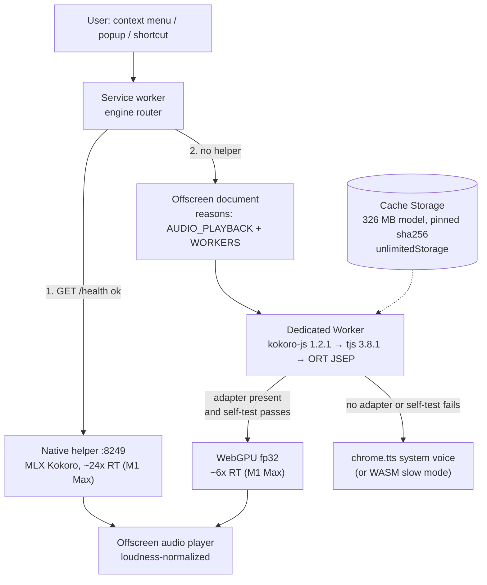

# R03: In-browser (WebGPU) local TTS as of 23 Sep 2026

*Axis R03 of the 2026-09 upgrade program. Research only: no tracked file was edited. The benchmark probes, raw JSON and WAVs are in `/tmp/ntts-r03/` (see §12, Reproduction).*

---

## Verdict

**Build a hybrid, not a replacement.** Add an in-browser Kokoro engine that runs on WebGPU inside the existing MV3 offscreen document, behind the extension's existing `NativeTTSClient` seam (`chrome-extension/src/shared/types.ts:45-62`). Choose the engine automatically, in this order:

1. **Native helper**, when `/health` answers.
2. **In-browser Kokoro on WebGPU (fp32)**, when an adapter exists and a one-sentence self-test passes.
3. **System voices through `chrome.tts`**.

**Conviction: 85%.** This is the only design that keeps the best voice on macOS and still works for a Chrome Web Store user who has no helper, on Windows, ChromeOS, Linux, Intel Macs or Apple Silicon.

Measured on this M1 Max. In-browser Kokoro (WebGPU fp32) runs at a median **~6× real time**, range 4.3–9.1× over six sessions. The helper runs at **~24×** on the same paragraph. Both produce word-exact speech under a local ASR check. The browser path costs a **326 MB one-time model download** plus a **21.6 MB WASM runtime** in the package. It needs no install, no Python and no Homebrew espeak-ng.

### Ranked recommendations

| # | Action | Item | Conviction | Effort |
|---|---|---|---|---|
| 1 | **adopt-new** | Hybrid engine selection (helper → WebGPU Kokoro → `chrome.tts`) with automatic fallback | 85% | L |
| 2 | **adopt-new** | `kokoro-js@1.2.1` as shipped (it resolves `@huggingface/transformers@3.8.1` → `onnxruntime-web@1.22.0-dev.20250409`, JSEP WebGPU), fp32 weights only, hosted in the offscreen document | 85% | L |
| 3 | **hold** | `@huggingface/transformers@4.3.0` / `onnxruntime-web@1.30–1.31` for Kokoro. **Measured 2.2× slower** than the v3 path on Apple Silicon (2.7× vs ~6× real time). Re-measure each release | 80% | S |
| 4 | **adopt-new** (required with #2) | Offscreen `reasons: ['AUDIO_PLAYBACK','WORKERS']`. With `AUDIO_PLAYBACK` alone, Chrome closes the document after 30 s without audio and throws the loaded model away | 92% | S |
| 5 | **adopt-new** (required with #2) | CSP `script-src 'self' 'wasm-unsafe-eval'`, ORT `.wasm` bundled in the package, `wasmPaths` set to `chrome.runtime.getURL(...)`. The library default loads from jsDelivr, which is remotely hosted code and is rejected | 95% | S |
| 6 | **adopt-new** | Model delivery: download on first use from Hugging Face at a **pinned revision + sha256**, cached in Cache Storage, with `unlimitedStorage` (no install warning). **No new host permission is needed**, because HF's CORS allows the extension origin | 85% | M |
| 7 | **adopt-new** | Per-device **self-test** before WebGPU is trusted: NaN count, RMS and zero-crossing rate on a golden sentence. Fall back automatically. fp16/q4f16 corruption and GPU-vendor "bitcrushed/screeching" output are documented | 85% | S |
| 8 | **evaluate** | Cross-origin isolation (`cross_origin_embedder_policy` + `cross_origin_opener_policy`). Doubles the WASM fallback (0.45× → 0.9× real time). Helper-fetch compatibility must be verified | 65% | S |
| 9 | **operator-decision** | Register as a system `chrome.ttsEngine`. Works on desktop (verified: web pages' `speechSynthesis` and other extensions reach it). But the install warning "Read all text spoken using synthesized speech" **cannot be made optional**, and desktop Reading Mode filters it out | 60% | M |
| 10 | **evaluate** | Supertonic 2/3 as the CPU/no-WebGPU fallback: **31–40× real time on WebGPU, 8.8× on WASM** (measured). Against: archived project, OpenRAIL-M licence, thin quality evidence | 45% | M |
| 11 | **evaluate** | `Kokoro-82M-v1.0-ONNX-timestamped` (verified extra `durations` output) for word highlighting and `ttsEngine` `word` events | 60% | M |
| 12 | **reject** | WASM Kokoro as a primary engine (≤1.0× real time even on a 10-core M1 Max). WebGPU `fp16` (NaN), `q8` (0.5×) and `q4f16` (unintelligible) | 90% | — |
| 13 | **reject / hold** | Chrome built-in AI for TTS: none exists; the Prompt API outputs text only. WebNN: origin trial, not shipped | 90% | — |
| 14 | **reject** | Hosting inference in the service worker or the side panel. Both have WebGPU, but the offscreen document is the only host with a controllable lifetime and `<audio>` | 80% | — |

### What would change the verdict

- **Windows integrated-GPU speed was not measured here.** The only numbers found are secondary: Intel UHD 770 at ~0.6× real time with occasional OOM, Arc A380 at ~1.3× ([quick-tts.com, May 2026](https://quick-tts.com/blog/kokoro-webgpu-benchmarks.html); internally inconsistent, low confidence). If a primary measurement confirms Kokoro-WebGPU is sub-real-time on common iGPUs, recommendation #10 (a faster fallback model) moves from *evaluate* to *adopt*.
- **Pronunciation parity.** In the browser, `kokoro-js` uses espeak-ng only. The helper uses misaki (lexicon + spaCy + espeak fallback). On the benchmark paragraph both transcribe word-exactly, but no broad listening test was run.

---

## 1. Measured results (primary, this machine, 23 Sep 2026)

**Setup.** Apple M1 Max (10 cores), macOS 15.7.9, **Chrome for Testing 151.0.7922.34**, `--headless=new`, driven by `playwright-core`. The probe is an unpacked MV3 extension (`/tmp/ntts-r03/ext`, `/tmp/ntts-r03/ext-coi`). Its service worker creates an offscreen document, which runs the engine and reports results back to the worker over `chrome.runtime` messages.

The text is a 50-word paragraph (~17.3 s of audio), voice `af_heart`, speed 1.0. **×RT** = audio seconds ÷ median wall time of 3 warm runs. Sibling agents were loading the GPU and CPU at the same time, so absolute numbers are noisy. The **v3-vs-v4 comparison was interleaved in one session** to control for that.

### 1.1 Kokoro-82M in the browser

| Stack | Device / dtype | Weights | ×RT (median of runs) | Short sentence (2.7 s audio) | First run after load | Output check |
|---|---|---|---|---|---|---|
| kokoro-js 1.2.1 → tjs **3.8.1** → ORT 1.22.0-dev (JSEP) | **WebGPU fp32** | 326 MB | **6.0, 9.1, 4.3, 4.9, 6.6, 8.5** (6 sessions; median ~6.3×) | 518–1,059 ms | 2.4–5.9 s (shader compile) | **ASR word-exact** |
| same | WebGPU fp16 | 163 MB | 9.2× | 479 ms | — | **65,529 NaN samples, peak 0 → silent** |
| same | WebGPU q8 (`model_quantized`) | 92 MB | 0.5× | 6,240 ms | — | not usable (too slow) |
| same | WebGPU q4 | 305 MB | 4.4× | 904 ms | — | no size win; not ASR-checked |
| same | WebGPU q4f16 | 155 MB | 3.2× | 727 ms | — | **ASR empty, ZCR 526/s vs 3,447/s → unintelligible** |
| same | WASM q8, not isolated (1 thread) | 92 MB | 0.5× | 6,064 ms | — | OK |
| same | WASM q8, **cross-origin isolated** (default 4 threads) | 92 MB | 0.9× | 3,010 ms | — | **ASR word-exact** |
| same | WASM q8, isolated, `numThreads=8` | 92 MB | 1.0× | 3,688 ms | — | OK |
| tjs **4.3.0** → ORT 1.31.0-dev.20260914 (native WebGPU EP, `.asyncify.wasm`) | **WebGPU fp32** | 326 MB | **2.7, 2.7, 2.5, 2.7, 2.7** (5 sessions; median 2.7×) | 1,102–1,761 ms | 6.5–9.6 s | OK (peak 0.801) |
| same | WebGPU fp16 | 163 MB | 8.5× | 516 ms | — | **NaN, silent** |
| same | WASM q8 (isolated / not) | 92 MB | 0.9× / 0.4× | ~2.9–6.8 s | — | OK |

**Load times.** Cold load with the 326 MB download took 11.3 s in one session (≈260 Mbit/s link) and 40 s in another. Warm load from the cache took **0.84–1.4 s**. The kokoro-js 1.2.1 README tells WebGPU users to use fp32 ([npm readme](https://registry.npmjs.org/kokoro-js)), and these measurements show why.

### 1.2 Reference points on the same text

| Engine | ×RT | Output check |
|---|---|---|
| **Native helper** (mlx-audio 0.2.6, Metal) | **~24×** (0.69–0.71 s for 16.8 s audio, warm). One 45.9 s outlier under GPU contention, one 4.6 s cold request | ASR word-exact |
| **Supertonic 2** via tjs 4.3.0 `text-to-speech` pipeline, 5 steps, 44.1 kHz, WebGPU | **31.1× / 40.3×** (cold load 12.8 s for 263 MB) | ASR word-exact |
| Supertonic 2, WASM (isolated) | **8.8×** | not ASR-checked |

The sibling report C2 measured the helper at ~19–23× warm (`docs/research/2026-09-upgrade/C2-helper-baseline.md:7`), which agrees with this.

**ASR method.** Parakeet TDT 0.6B v3 via local `whisper.cpp` `parakeet-cli`, audio resampled to 16 kHz. "Word-exact" means all 50 words match the source text, ignoring punctuation and hyphens. Transcripts are in `/tmp/ntts-r03/wav/*.txt`.

**Loudness mismatch (hybrid requirement).** Browser Kokoro fp32 RMS is 0.0758; the helper's is 0.0385 for the same text and voice, so the browser output is **+5.9 dB** louder. Sibling R01 attributes part of the helper's deficit to an mlx-audio 0.2.6 decoder bug (−2.5 dB, fixed in mlx-audio 0.4.8 per `R01-local-tts-models.md:74`). A hybrid must normalize both engines to one loudness target, or volume will jump when the engine changes.

### 1.3 MV3 platform facts, measured

| Question | Result |
|---|---|
| WebGPU in an **offscreen document**? | **Yes.** `navigator.gpu.requestAdapter()` → `{vendor:"apple", architecture:"metal-3"}`, `shader-f16` true |
| WebGPU in the **extension service worker**? | **Yes**, same adapter (also documented since Chrome 124, [New in WebGPU 124](https://developer.chrome.com/blog/new-in-webgpu-124)) |
| Cross-origin isolation in the offscreen document via manifest keys? | **Yes.** `crossOriginIsolated === true` with `cross_origin_embedder_policy: require-corp` + `cross_origin_opener_policy: same-origin`; ORT WASM then runs multi-threaded (2× faster) |
| Storage quota with `unlimitedStorage` | 5,079,547,226,103 bytes reported by `navigator.storage.estimate()` |
| Extension `ttsEngine` voice visible to **web pages** on macOS desktop? | **Yes.** `speechSynthesis.getVoices()` lists it (`localService: true`, index 191 of 192, after all 191 macOS voices). A page's `speak()` reaches the extension's `onSpeak` with `{lang, pitch, rate, voiceName, volume}`, and the page receives `end` |
| Visible to other extensions? | **Yes.** `chrome.tts.getVoices()` returns it with `extensionId`, `remote:false` |
| `ttsEngine.onSpeakWithAudioStream` (Chrome plays the audio) on desktop? | **No.** The voice is listed, but `speak()` is never dispatched (timeout). The Chromium source agrees: `TtsExtensionEngine::Speak` dispatches only `onSpeak` ([tts_engine_extension_api.cc](https://chromium.googlesource.com/chromium/src/+/main/chrome/browser/speech/extension_api/tts_engine_extension_api.cc)) |
| Default en-US system voice (what Reading Mode would keep) | `Samantha`, `default:true` |

---

## 2. Library currency: current vs latest

The extension ships no in-browser TTS library today; its `package.json` has zero runtime dependencies.

| Package | In repo | Latest (primary source) | Notes |
|---|---|---|---|
| `kokoro-js` | — | **1.2.1**, published 2025-05-03 ([npm](https://registry.npmjs.org/kokoro-js)) | Depends on `@huggingface/transformers ^3.5.1` and `phonemizer ^1.2.1`; unpacked 30.4 MB. The GitHub repo was last pushed **2025-08-06**. Three commits after 1.2.1 are **unreleased on npm**: custom cache dir (2025-06-30), `setVoiceDataUrl` (2025-07-09), "crash loading voice" fix (2025-08-06) ([commits](https://github.com/hexgrad/kokoro/commits/main/kokoro.js)). Issue **#320** asks to bump to transformers `^4.2.0` and is still open ([#320](https://github.com/hexgrad/kokoro/issues/320)) |
| `@huggingface/transformers` | — | **4.3.0**, 2026-09-16 (`next` 4.0.0-next.11) ([npm](https://registry.npmjs.org/@huggingface/transformers)). Last v3 is **3.8.1**, 2025-12-02 ([releases](https://github.com/huggingface/transformers.js/releases)) | v4.0.0 (2026-03-30): new C++ WebGPU runtime, `ModelRegistry`, `env.useWasmCache`, `env.fetch`, esbuild, `@huggingface/tokenizers` split out ([4.0.0 notes](https://github.com/huggingface/transformers.js/releases/tag/4.0.0)). v4.1: `q1/q2` dtypes. v4.2: tool calling. v4.3: Safari 26 WebGPU, Cross-Origin Storage via `requestFileHandle()`, "Skip browser cache writes for non-HTTP(S) resources" ([4.3.0 notes](https://github.com/huggingface/transformers.js/releases/tag/4.3.0)). Native **Supertonic** and **Chatterbox** TTS classes (verified in `dist/transformers.web.js`) |
| `onnxruntime-web` | — | **1.30.0** on npm 2026-09-14 (`dev` 1.31.0-dev.20260918) ([npm](https://registry.npmjs.org/onnxruntime-web)). GitHub v1.30.0 2026-09-10 ([release](https://github.com/microsoft/onnxruntime/releases/tag/v1.30.0)) | 1.30 WebGPU EP notes: subgroup-matrix MatMul in WASM builds, Dawn pipeline-compile workers scaled with CPU count, and fixes. Nothing Kokoro-specific. tjs 4.3.0 pins **1.31.0-dev.20260914**; kokoro-js resolves **1.22.0-dev.20250409** |
| Kokoro ONNX weights | — | `onnx-community/Kokoro-82M-v1.0-ONNX`, last modified **2025-02-08**, commit `1939ad2a8e41…` ([HF API](https://huggingface.co/api/models/onnx-community/Kokoro-82M-v1.0-ONNX)) | No newer English Kokoro exists; `hexgrad` has only `Kokoro-82M` and `Kokoro-82M-v1.1-zh` ([HF search](https://huggingface.co/api/models?author=hexgrad&search=kokoro)). Agrees with R01 |

### 2.1 Why v3, not v4, for Kokoro (breaking change and regression)

- **Performance.** Measured median 2.7× (v4.3.0) vs ~6.3× (v3.8.1) real time for the same fp32 graph, voice and text; first-run shader warm-up is also longer (6.5–9.6 s vs 2.4–5.9 s). The difference is v4's switch to the rewritten C++ WebGPU EP, delivered as the `asyncify` build ([4.0.0 notes](https://github.com/huggingface/transformers.js/releases/tag/4.0.0)). A search of the ORT and transformers.js trackers found no report of this for Kokoro. It is new evidence, and worth filing upstream with the `/tmp/ntts-r03` harness.
- **Packaging.** v3 needs `ort-wasm-simd-threaded.jsep.wasm` (**21.6 MB**). v4 needs `ort-wasm-simd-threaded.asyncify.wasm` (**26.9 MB**). The JS bundle is 5.00 MB (v3) vs 4.41 MB (v4).
- **Remote-code default.** v4 sets `wasmPaths` to `https://cdn.jsdelivr.net/npm/onnxruntime-web@<ver>/dist/` unless it is already set. It skips this only inside a `ServiceWorkerGlobalScope` (`transformers.web.js:8731-8742`). v4 also defaults `env.useWasmCache` to true, which turns an **object** `wasmPaths` into a `blob:` module import (`transformers.web.js:8652-8695`). A `blob:` import is not covered by `script-src 'self'`; this was not tested under the extension CSP. Use a **string prefix** `wasmPaths`, which the probe did and which worked, or set `useWasmCache=false`.
- **Dependency conflict.** kokoro-js declares `^3.5.1`, so an app that also depends on v4 gets two copies (the segfault case in Node described in #320). Pin one transformers version for the whole extension.

---

## 3. Kokoro ONNX quantizations: sizes and fitness

From the HF API with `blobs=true`:

| File | Size | WebGPU verdict (measured) |
|---|---|---|
| `model.onnx` (fp32) | **325.5 MB** | **Use this one.** Good output, fastest non-broken option |
| `model_fp16.onnx` | 163.2 MB | Broken: NaN (also [kokoro#74](https://github.com/hexgrad/kokoro/issues/74), open since 2025-02-10) |
| `model_q4f16.onnx` | 154.6 MB | Broken: unintelligible |
| `model_q8f16.onnx` | 86.0 MB | Not loadable via kokoro-js dtypes (`fp32/fp16/q8/q4/q4f16`); fp16 family, so likely the same failure (not tested) |
| `model_quantized.onnx` (q8) | 92.4 MB | 0.5× on WebGPU; **best for WASM** (0.9–1.0× when isolated) |
| `model_q4.onnx` | 305.2 MB | 4.4×, no size advantage |
| `model_uint8.onnx` / `model_uint8f16.onnx` | 177.5 / 114.2 MB | not tested |
| `voices/*.bin` | 55 files × ~0.52 MB | kokoro-js exposes **28 English voices** (`af_*`, `am_*`, `bf_*`, `bm_*`). Its G2P handles only `a`/`b` (en-us/en-gb) ([voices.js](https://github.com/hexgrad/kokoro/blob/main/kokoro.js/src/voices.js), [phonemize.js](https://github.com/hexgrad/kokoro/blob/main/kokoro.js/src/phonemize.js)) |

**Why it matters here:** the WebGPU path costs **326 MB on first use**, not the 92 MB the q8 name suggests. The UX needs a real progress bar; kokoro-js forwards `progress_callback`, and v4 adds a `progress_total` event.

---

## 4. Hosting inside MV3: where inference can run

| Host | WebGPU | Lifetime | Audio | Verdict |
|---|---|---|---|---|
| **Offscreen document** | Yes (measured) | One per extension. Closed after **30 s without audio** *only if every reason is `AUDIO_PLAYBACK`*. Any other reason (e.g. `WORKERS`) uses an always-active enforcer, so the document lives until `closeDocument()` | `<audio>` / WebAudio | **Host here.** Offscreen documents get only the `chrome.runtime` API ([offscreen docs](https://developer.chrome.com/docs/extensions/reference/api/offscreen)) |
| Extension service worker | Yes (measured; [WebGPU 124](https://developer.chrome.com/blog/new-in-webgpu-124)) | Killed after **30 s idle**; any single event or API call that runs past **5 min** is terminated ([SW lifecycle](https://developer.chrome.com/docs/extensions/develop/concepts/service-workers/lifecycle)) | No DOM audio | Reject: reloading ~326 MB of weights after every idle kill |
| Side panel | Yes (it is an extension page) | Only while the user keeps it open | Yes | Reject as host; fine as UI |

**Chromium source for the lifetime rule.** `kReasonAndFactoryMethodPairs` maps `kAudioPlayback → CreateAudioLifetimeEnforcer` and every other reason, including `kWorkers`, to `CreateEmptyEnforcer`, whose `IsActive()` always returns `true` ([lifetime_enforcer_factories.cc](https://chromium.googlesource.com/chromium/src/+/main/extensions/browser/api/offscreen/lifetime_enforcer_factories.cc)). The document closes only when **no** enforcer is active (`OnOffscreenDocumentActivityChanged`, [offscreen_document_manager.cc](https://chromium.googlesource.com/chromium/src/+/main/extensions/browser/api/offscreen/offscreen_document_manager.cc)). The timeout is `base::Seconds(30)` ([audio_lifetime_enforcer.cc](https://chromium.googlesource.com/chromium/src/+/main/extensions/browser/api/offscreen/audio_lifetime_enforcer.cc)).

**Consequence for this repo.** `service-worker.ts:225-229` creates the document with `reasons: ['AUDIO_PLAYBACK']` only. With an in-browser engine, the model would be evicted 30 s after every utterance, and each re-init costs 1–1.4 s of load plus 2.4–5.9 s of shader warm-up. Add `'WORKERS'` and run inference in a dedicated Worker spawned by the offscreen document, which keeps the audio thread free. Then add your own idle-unload timer (e.g. 10 min), because an always-active document otherwise holds the model in memory indefinitely. Memory reference points: ~330–520 MB peak for Kokoro-WebGPU ([quick-tts.com](https://quick-tts.com/blog/kokoro-webgpu-benchmarks.html), secondary), and an open "serious memory leak … only when using WebGPU" report on long streams ([kokoro#275](https://github.com/hexgrad/kokoro/issues/275)).

**Keeping the service worker alive during long reads.** Messages from an offscreen document reset the worker's idle timer (Chrome 110+, [SW lifecycle](https://developer.chrome.com/docs/extensions/develop/concepts/service-workers/lifecycle)). Per-sentence progress messages therefore keep a `ttsEngine` `sendTtsEvent` callback reachable.

---

## 5. CSP, remotely hosted code and packaging

- **CSP.** The documented MV3 default for extension pages is `script-src 'self'; object-src 'self';`, described as "WebAssembly will be disabled". The minimum you may declare is `script-src 'self' 'wasm-unsafe-eval'; object-src 'self';`, and it cannot be relaxed further ([CSP docs](https://developer.chrome.com/docs/extensions/reference/manifest/content-security-policy)). The probe declared exactly that and ORT plus the espeak-ng WASM phonemizer ran. **Add it to `public/manifest.json`.**
- **Remotely hosted code.** The Web Store counts "JavaScript and WASM" loaded from outside the package as RHC; "data or things like JSON" are not ([RHC guide](https://developer.chrome.com/docs/extensions/develop/migrate/remote-hosted-code)). So the **ORT `.wasm` and `.mjs` must be bundled**; both library defaults point at jsDelivr (§2.1). This is the exact failure users hit in [kokoro#115](https://github.com/hexgrad/kokoro/issues/115) ("Cannot find module 'https://cdn.jsdelivr.net/…/ort-wasm-simd-threaded.jsep.mjs'"). The `ort.*.bundle.min.mjs` entry that kokoro-js resolves is meant to embed the JS glue, so the `.wasm` (21.6 MB) is the essential file. The probe shipped both `ort-wasm-simd-threaded.jsep.mjs` (44 KB) and the `.wasm`. The shipped bundle still names the `.mjs` in its loader path, so ship both unless a build without the `.mjs` is tested.
- **Model weights are data**, but MV3 policy also forbids "an interpreter to run complex commands fetched from a remote source, even if those commands are fetched as data" ([MV3 requirements](https://developer.chrome.com/docs/webstore/program-policies/mv3-requirements)). An ONNX graph is weights plus a fixed operator graph executed by bundled code. Pinning revision and sha256 (§6) keeps the "full functionality discernible from the package" argument clean. The fallback is to bundle `model.onnx` in the package, which stays under the **2 GB** package limit ([publish docs](https://developer.chrome.com/docs/webstore/publish)), at the cost of a ~350 MB install and update.
- **Read Aloud does it differently.** The largest open-source TTS extension hosts Supertonic and Piper in **remote iframes** (`https://supertonic.ttstool.com/`, `allow="cross-origin-isolated"`) instead of bundling them ([player.js](https://github.com/ken107/read-aloud/blob/master/js/player.js)). Sandboxed/iframe code is exempt from the RHC rule but is "treated similarly to our policy on communication with external servers" ([MV3 requirements](https://developer.chrome.com/docs/webstore/program-policies/mv3-requirements)). **Do not copy this**: it makes a privacy-first extension depend on a third-party site staying up and honest.

---

## 6. First-load download and caching

- **Where the bytes come from.** `huggingface.co/.../resolve/main/onnx/model.onnx` 302-redirects to `us.aws.cdn.hf.co` (Xet bridge). Both hops return CORS headers for an extension origin: `access-control-allow-origin: chrome-extension://…` on the 302 and `*` on the CDN (verified with `curl -H "Origin: chrome-extension://…"`). So **no `host_permissions` for huggingface.co are needed**, and adding them would put a "Read and change your data on huggingface.co" warning on the listing. Voices come from the same repo (`voices/<id>.bin`, 0.52 MB each).
- **Caching.** transformers.js stores model files in Cache Storage (`transformers-cache`); kokoro-js stores voices in `caches.open("kokoro-voices")` ([voices.js](https://github.com/hexgrad/kokoro/blob/main/kokoro.js/src/voices.js)). Add **`unlimitedStorage`**: it covers Cache Storage, IndexedDB and OPFS, and carries **no install warning** ([permissions list](https://developer.chrome.com/docs/extensions/reference/permissions-list)). The probe reported ~5 TB of quota.
- **Pin what you download.** kokoro-js 1.2.1 hard-codes `resolve/main` for voices (the `setVoiceDataUrl` setter is unreleased, §2), and transformers.js defaults to revision `main`. Pin the model to commit `1939ad2a8e416c0acfeecc08a694d14ef25f2231` and check sha256 against the LFS oids from the HF API: `model.onnx` `8fbea51e…21a34cb`, `model_quantized.onnx` `fbae9257…28a1478`, `af_heart.bin` `d583ccff…c44a8f0b`. Use `env.remotePathTemplate`, or vendor kokoro-js from `main` to get `setVoiceDataUrl`, or mirror the files.
- **Privacy note for `PRIVACY.md`.** The first model download reveals the user's IP to Hugging Face once. Text never leaves the device on either engine.

---

## 7. Platform reach: who gets WebGPU (Chromium)

From the [gpuweb Implementation Status wiki](https://github.com/gpuweb/gpuweb/wiki/Implementation-Status):

| Platform | Status |
|---|---|
| macOS, Windows x86/x64, ChromeOS | Shipped, Chrome **113** |
| Android | ARM/Qualcomm/Intel on Android 12+ since **121**; Imagination on Android 16+ since **139**; Samsung Xclipse "probably 154" |
| Linux | Intel Gen12+ since **144**; NVIDIA (driver ≥ 535.183.01) on Wayland since **147**; **others behind a flag** |
| Windows ARM64 | **Behind a flag** |

**Consequence.** WebGPU covers most Mac, Windows and ChromeOS Chrome users, but not every Linux user or Windows-on-ARM. An adapter can also exist and still produce bad audio: "bitcrushed" on an AMD 5700XT and "horrible screeching" on several Android phones ([HN thread, Feb 2025](https://news.ycombinator.com/item?id=42973769)), and "corrupted audio … with all dtypes" on Android WebGPU while WASM works ([kokoro#193](https://github.com/hexgrad/kokoro/issues/193)). That is why recommendation #7 (self-test, then fall back) is mandatory, not polish.

**Windows iGPU speed.** No primary measurement was possible on this Mac. The only 2026 dataset found ([quick-tts.com](https://quick-tts.com/blog/kokoro-webgpu-benchmarks.html), kokoro-js 1.2.1) reports audio seconds per wall second of: RTX 4070 ~6.5, RTX 3060 laptop ~3.8, **M3 Pro ~3.2, M2 Air ~2.4**, RX 7600 ~2.6, **Arc A380 ~1.3, Intel UHD 770 ~0.6 with occasional OOM**. Treat it as low-confidence: it claims Chrome 134 in "May 2026" and calls the fp32 model "~80 MB", which is wrong (it is 326 MB). The direction is plausible, and it implies **Kokoro-WebGPU is borderline or below real time on typical Intel iGPUs.** Mitigations, in order: sentence-level streaming (already in kokoro-js `stream()`), the WASM fallback with cross-origin isolation (§8), or a faster model (§10).

---

## 8. Cross-origin isolation and the WASM fallback

- ORT's WASM backend uses threads only when the page is cross-origin isolated. The offscreen document becomes isolated through the manifest keys `cross_origin_embedder_policy` and `cross_origin_opener_policy` ([COEP key](https://developer.chrome.com/docs/extensions/reference/manifest/cross-origin-embedder-policy)). Measured: WASM q8 goes **0.45× → 0.9×** real time with isolation, and `numThreads=8` adds only 1.0×.
- **Even isolated, WASM Kokoro is no better than real time on a 10-core M1 Max.** It is not viable as a primary engine anywhere (reject #12). It is only an emergency path for short selections, and must be labelled "slow mode".
- **Risk to verify before enabling isolation:** `require-corp` applies to every fetch from extension pages. The helper at `http://127.0.0.1:8249` must answer CORS for the extension origin (C2 records that it does, `C2-helper-baseline.md:74`). Test `/health`, `/voices` and `/speak` from an isolated build before shipping.

---

## 9. Chrome's own speech surfaces

### 9.1 Built-in AI APIs: no TTS

Chrome's built-in AI set is Translator, Language Detector, Summarizer, Writer, Rewriter, Proofreader and the Prompt API ([built-in APIs](https://developer.chrome.com/docs/ai/built-in-apis)). The Prompt API takes text, image or audio **input**, but "for `expectedOutputs`, the Prompt API allows text only" ([Prompt API](https://developer.chrome.com/docs/ai/prompt-api)). **There is no on-device neural TTS API to call.**

**WebNN** (which could reach NPUs through ORT's WebNN EP) is in origin trial from **M147**, with no shipping milestone on chromestatus (last updated 2026-04-08) ([chromestatus 5176273954144256](https://chromestatus.com/feature/5176273954144256)). Hold.

### 9.2 `chrome.tts` / `chrome.ttsEngine`: can the extension become Chrome's voice?

**Yes on desktop, with three limits.**

- **Works.** Declaring `tts_engine.voices` and registering `onSpeak` + `onStop` publishes the voice to every consumer of Chrome's TTS controller: web pages' Web Speech API and other extensions' `chrome.tts`. Measured on macOS (§1.3). The controller appends extension voices **after** platform voices (`TtsControllerImpl::GetVoices`, [tts_controller_impl.cc](https://chromium.googlesource.com/chromium/src/+/main/content/browser/speech/tts_controller_impl.cc)). Chrome 131–132 added language install/uninstall/status hooks ([ttsEngine API](https://developer.chrome.com/docs/extensions/reference/api/ttsEngine)).
- **Limit 1: install warning, not optional.** `ttsEngine` shows "Read all text spoken using synthesized speech" ([permissions list](https://developer.chrome.com/docs/extensions/reference/permissions-list)). It is on the list of permissions that "can not be specified as optional", alongside `tts` ([permissions API](https://developer.chrome.com/docs/extensions/reference/api/permissions)). It would sit on the main listing for every user.
- **Limit 2: you play the audio yourself.** `onSpeakWithAudioStream` (Chrome-managed playback) is not dispatched on desktop (measured and source-verified, §1.3). The worker must forward the utterance to the offscreen document, play it there, and send `start`/`word`/`end` back through `sendTtsEvent`. Without `end`, "Chrome cannot queue utterances" ([ttsEngine API](https://developer.chrome.com/docs/extensions/reference/api/ttsEngine)).
- **Limit 3: Chrome's Reading Mode will not show it on desktop.** On non-ChromeOS builds, Reading Mode keeps all Google voices plus **one system voice per language: the one flagged `default`, else the first** ([tts_voice_filtering.ts](https://chromium.googlesource.com/chromium/src/+/main/chrome/browser/resources/side_panel/read_anything/read_aloud/tts_voice_filtering.ts)). On this Mac that is `Samantha`; the Kokoro voice (index 191) is filtered out.

**Decision for the operator (#9).** Ship `ttsEngine` in the main extension and accept the warning; ship a separate "Kokoro voices for Chrome" companion extension that talks to the main one over `externally_connectable` messaging; or skip it. Conviction that it is worth doing at all: 60%. The benefit is real (every Web Speech site gets Kokoro), but it is secondary to the core read-aloud feature.

---

## 10. Alternative in-browser models (checked, not adopted)

| Model | Latest | Size | In-browser evidence | Fit |
|---|---|---|---|---|
| **Supertonic 2 / 3** | 3 released 2026-05-06; 31 languages, ~99M params ([card](https://huggingface.co/Supertone/supertonic-3)) | 263 MB (v2 ONNX), 398 MB (v3) | Native in transformers.js ≥ 4 (`SupertonicForConditionalGeneration`). **Measured 31–40× WebGPU, 8.8× WASM, ASR word-exact** | **Fastest browser option by far; the only one that makes CPU-only devices real-time.** But the GitHub project is **archived** ("No updates, bug fixes, security patches", [repo](https://github.com/supertone-oss-archive/supertonic)), the weights are **OpenRAIL-M** with use restrictions, and quality has no independent arena ranking (R01 §4.5). Evaluate as fallback only, after a listening test |
| **Kitten TTS 0.8** | 2026-02-19; nano int8 24.4 MB, micro 41.4 MB, mini 78.3 MB; 8 voices; Apache-2.0 ([HF](https://huggingface.co/KittenML/kitten-tts-nano-0.8-int8)) | 24–78 MB | ONNX-first; no maintained JS package found; not measured here | Tiny download; English only; quality unproven (R01 §4.3). Low-priority evaluate |
| **Kokoro-82M-v1.0-ONNX-timestamped** | 2025-02-21 ([HF](https://huggingface.co/onnx-community/Kokoro-82M-v1.0-ONNX-timestamped)) | same set as main repo | **Verified outputs `['waveform','durations']`** (onnxruntime-node session on `model_q8f16.onnx`) | Same voice plus per-token durations, enabling word highlighting and `ttsEngine` `word` events. kokoro-js does not use it yet. Evaluate for a "follow along" feature |
| Pocket TTS (Kyutai) | ONNX community export ([HF](https://huggingface.co/KevinAHM/pocket-tts-onnx)) | ~12 GB repo (many variants) | none found | Out of scope for a browser extension today |

---

## 11. Architecture recommendation (detail)

### Engine selection contract

1. Generalize `NativeTTSClient` into `TTSEngine { id, checkHealth, getVoices, speak(stream-capable) }`. Keep the helper `ApiClient` as one implementation.
2. Keep the existing helper probe first. If it fails, use the offscreen engine. Probe order and outcome are shown in the popup ("Engine: Helper / In-browser (GPU) / System").
3. **Self-test on first load and on every browser version change.** Synthesize "Hello there, this is a short sentence." and require `nan == 0`, peak > 0.2, RMS > 0.02, zero-crossing rate > 1,500/s. Good fp32 output measured 3,447/s; broken q4f16 measured 526/s. Store the verdict per GPU adapter (`vendor`, `architecture`).
4. Stream by sentence (`TextSplitterStream`) so first audio arrives in ~0.5–1.1 s on M1 Max. The helper collects all chunks into one WAV before responding today (`C2-helper-baseline.md:105`).
5. Normalize loudness across engines (§1.2: +5.9 dB delta measured).
6. Voice mapping: kokoro-js exposes 28 English voices. The helper's list is hard-coded to 6 (R01 line 16). Use one voice ID space (`af_heart` etc.) so the popup's grouped-by-prefix menu works for both.

### Migration steps (for the implementation session)

1. `chrome-extension/package.json`: add `kokoro-js@1.2.1` as a runtime dependency. Pin transformers through `overrides` to `3.8.1` so a later `bun install` cannot pull v4 in.
2. `build.ts` / vite: copy `node_modules/onnxruntime-web/dist/ort-wasm-simd-threaded.jsep.wasm` into `dist/ort/`. Set `env.wasmPaths = chrome.runtime.getURL('ort/')` before first use.
3. `public/manifest.json`: `"content_security_policy": {"extension_pages": "script-src 'self' 'wasm-unsafe-eval'; object-src 'self';"}`, `"permissions": [..., "unlimitedStorage"]`. Optionally the COOP/COEP keys (after §8 verification). **No new host permissions.**
4. `service-worker.ts:225-229`: `reasons: ['AUDIO_PLAYBACK', 'WORKERS']`. Update the justification string to name both uses.
5. New `src/offscreen/kokoro-worker.ts` (dedicated Worker) plus a message protocol (`LOAD`, `SPEAK`, `STOP`, progress events). Add an idle-unload timer.
6. Pin model revision and sha256 (§6). Add a first-run download UI with progress and a "delete voice data" button in Options.
7. Tests: unit-test the router with a fake adapter; keep bun + happy-dom for logic. Real WebGPU needs a browser, so reuse the `/tmp/ntts-r03/bench/drive*.mjs` Playwright pattern as an integration smoke test.

### How to prove it works

`node /tmp/ntts-r03/bench/drive3.mjs` against the built extension, adapted to load `chrome-extension/dist`. It must print a WebGPU fp32 run with `nan: 0` and ×RT ≥ 2, then pass the WAV through `parakeet-cli` for a word-exact transcript. Separately, with the helper stopped, context-menu "read aloud" must still speak.

---

## 12. Reproduction

Everything is under `/tmp/ntts-r03/` and nothing touches the repo.

| Path | What |
|---|---|
| `bench/` | `kokoro-js@1.2.1` (→ tjs 3.8.1, ORT 1.22.0-dev), `playwright-core`; drivers `drive.mjs`, `drive-coi.mjs`, `drive2.mjs` (interleaved), `drive3.mjs` (saves WAVs), `drive-tts.mjs` |
| `bench4/` | `@huggingface/transformers@4.3.0` with kokoro-js overridden onto it; `st-src.js` (Supertonic) |
| `ext/`, `ext-coi/`, `ext-tts/` | Probe extensions: plain, cross-origin isolated, and `onSpeakWithAudioStream` only |
| `results-*.json`, `coi*.log` | Raw results |
| `wav/` | Saved WAVs and Parakeet transcripts |
| `docs/` | Fetched Chrome docs and Chromium sources quoted above |

Example: `cd /tmp/ntts-r03/bench && PLAN='v3|webgpu:fp32;v4|webgpu:fp32' UDD=/tmp/ntts-r03/udd-coi node drive2.mjs`

---

## 13. Incidental findings (outside this axis, for the owners)

- **The helper's espeak-ng dependency is a Homebrew path.** `PythonWorker.swift:37-39` sets `ESPEAK_DATA_PATH=/opt/homebrew/opt/espeak-ng/share/espeak-ng-data`. Without it, `espeakng-loader` points at a CI build path (`/Users/runner/work/espeakng-loader/…/phontab`) and the espeak C library exits the process (reproduced with the helper venv's Python). This strengthens the case for a zero-install in-browser engine.
- **Helper state during this run.** The shared helper (started by a sibling agent at ~14:22) stopped listening at ~14:28. The cause was not determined: my standalone reproduction of the same inputs did not crash, and sibling C2 documents starting and stopping its own helper. I **restarted it at 14:30** (`native-helper/.build/release/natural-tts-helper`, PID 31790, log `/tmp/ntts-r03/helper-restart.log`). Another client has used it since (4 `/speak` calls at 14:35), so it was left running.
- `/health` did not answer within 15 s while the helper was busy. This is the same actor-serialization issue C2 documents (`C2-helper-baseline.md:10`).

---

## Sources

**Primary: registries, releases, model cards (fetched 2026-09-23)**
- npm: https://registry.npmjs.org/kokoro-js · https://registry.npmjs.org/@huggingface/transformers · https://registry.npmjs.org/onnxruntime-web · https://registry.npmjs.org/@xenova/transformers
- transformers.js releases: https://github.com/huggingface/transformers.js/releases/tag/4.0.0 · /4.1.0 · /4.2.0 · /4.3.0
- ONNX Runtime v1.30.0: https://github.com/microsoft/onnxruntime/releases/tag/v1.30.0
- Kokoro ONNX: https://huggingface.co/api/models/onnx-community/Kokoro-82M-v1.0-ONNX · https://huggingface.co/onnx-community/Kokoro-82M-v1.0-ONNX · https://huggingface.co/onnx-community/Kokoro-82M-v1.0-ONNX-timestamped
- kokoro-js source and issues: https://github.com/hexgrad/kokoro/tree/main/kokoro.js/src · issues [#74](https://github.com/hexgrad/kokoro/issues/74), [#115](https://github.com/hexgrad/kokoro/issues/115), [#193](https://github.com/hexgrad/kokoro/issues/193), [#275](https://github.com/hexgrad/kokoro/issues/275), [#320](https://github.com/hexgrad/kokoro/issues/320)
- Supertonic: https://huggingface.co/Supertone/supertonic-3 · https://huggingface.co/onnx-community/Supertonic-TTS-2-ONNX · https://github.com/supertone-oss-archive/supertonic
- Kitten TTS: https://huggingface.co/KittenML/kitten-tts-nano-0.8-int8 · https://huggingface.co/KittenML/kitten-tts-mini-0.8
- Read Aloud source: https://github.com/ken107/read-aloud/blob/master/js/player.js · https://github.com/ken107/read-aloud/blob/master/js/tts-engines.js

**Primary: Chrome docs**
- Offscreen: https://developer.chrome.com/docs/extensions/reference/api/offscreen
- CSP: https://developer.chrome.com/docs/extensions/reference/manifest/content-security-policy
- COEP key: https://developer.chrome.com/docs/extensions/reference/manifest/cross-origin-embedder-policy
- ttsEngine / tts: https://developer.chrome.com/docs/extensions/reference/api/ttsEngine · https://developer.chrome.com/docs/extensions/reference/api/tts
- Permissions list / optional permissions: https://developer.chrome.com/docs/extensions/reference/permissions-list · https://developer.chrome.com/docs/extensions/reference/api/permissions
- Service worker lifecycle: https://developer.chrome.com/docs/extensions/develop/concepts/service-workers/lifecycle
- Remotely hosted code / MV3 requirements / publish: https://developer.chrome.com/docs/extensions/develop/migrate/remote-hosted-code · https://developer.chrome.com/docs/webstore/program-policies/mv3-requirements · https://developer.chrome.com/docs/webstore/publish
- WebGPU in service workers: https://developer.chrome.com/blog/new-in-webgpu-124
- Built-in AI and Prompt API: https://developer.chrome.com/docs/ai/built-in-apis · https://developer.chrome.com/docs/ai/prompt-api
- WebNN status: https://chromestatus.com/feature/5176273954144256

**Primary: Chromium source (main, fetched 2026-09-23)**
- https://chromium.googlesource.com/chromium/src/+/main/extensions/browser/api/offscreen/lifetime_enforcer_factories.cc
- https://chromium.googlesource.com/chromium/src/+/main/extensions/browser/api/offscreen/offscreen_document_manager.cc
- https://chromium.googlesource.com/chromium/src/+/main/extensions/browser/api/offscreen/audio_lifetime_enforcer.cc
- https://chromium.googlesource.com/chromium/src/+/main/content/browser/speech/tts_controller_impl.cc
- https://chromium.googlesource.com/chromium/src/+/main/chrome/browser/speech/extension_api/tts_engine_extension_api.cc
- https://chromium.googlesource.com/chromium/src/+/main/chrome/browser/resources/side_panel/read_anything/read_aloud/tts_voice_filtering.ts

**Primary: platform status**
- https://github.com/gpuweb/gpuweb/wiki/Implementation-Status

**Secondary (low confidence, labelled where used)**
- https://quick-tts.com/blog/kokoro-webgpu-benchmarks.html
- https://news.ycombinator.com/item?id=42973769

**Sibling reports (this program)**
- `docs/research/2026-09-upgrade/C2-helper-baseline.md` · `docs/research/2026-09-upgrade/R01-local-tts-models.md`

---

## Adversarial verification (2026-09-23)

*Independent verifier pass. Every claim was re-fetched from a primary source and, where possible, re-measured on this M1 Max. Scratch work, harnesses, WAVs and logs are in `/tmp/ntts-v03/`. The author's `/tmp/ntts-r03/` artifacts were read, never modified. No tracked file other than this one was touched.*

**Bottom line.** Every load-bearing fact survives. Three findings change the recommendations:

1. **The pinned runtime is the wrong pin.** The same `kokoro-js@1.2.1` + `@huggingface/transformers@3.8.1` stack, with `onnxruntime-web` overridden to **stable 1.30.0**, still uses JSEP and ran **12.1×, 13.7× and 9.5×** real time. The author's pin, `1.22.0-dev.20250409`, ran 8.8×, 9.4× and 5.3× in the same interleaved sessions, so 1.30.0 is 1.4–1.8× faster. Output is word-exact under Parakeet and waveform-identical (Pearson r = 0.998, same RMS 0.0758, ZCR 3,446 vs 3,447/s).
2. **`kokoro-js@1.2.1` has three reproduced defects that matter for a read-aloud extension.** `generate()` silently truncates. `stream(string)` never finishes. `TextSplitterStream` freezes the thread on an `@mention` or URL followed by a newline. Vendor and patch it; do not depend on the npm build.
3. **The in-browser path would ship GPL-3.0 code.** It distributes espeak-ng (GPL-3.0) inside `phonemizer.js`, which is labelled Apache-2.0. The extension is MIT.

### Re-measurements (this pass)

| Run | Stack | ×RT (warm median of 3) | Notes |
|---|---|---|---|
| CfT 151.0.7922.34, fresh profile, **no `host_permissions`**, cross-origin isolated | tjs 3.8.1 + ORT 1.22-dev | 7.3, 9.3 | 326 MB cold download succeeded with no HF host permission under COEP `require-corp` |
| same session, interleaved | tjs 4.3.0 + ORT 1.31-dev (native EP) | 3.2, 3.0 | |
| CfT 153.0.8010.12 (= installed stable major) | tjs 3.8.1 + ORT 1.22-dev | 8.5, 4.9 | |
| same session, interleaved | tjs 4.3.0 + ORT 1.31-dev | 2.9, 2.6 | one warm run took **77.2 s** for 17.35 s of audio |
| CfT 151, interleaved, 3 pairs | **tjs 3.8.1 + ORT 1.30.0 (JSEP)** | **12.1, 13.7, 9.5** | ASR word-exact; fp16 **still NaN** (65,529 samples, peak 0) |
| same sessions | tjs 3.8.1 + ORT 1.22-dev | 8.8, 9.4, 5.3 | ASR word-exact |
| Offscreen document → **dedicated module Worker** | tjs 3.8.1 + ORT 1.30.0, not isolated | 10.6 | adapter `apple`, nan 0; **`chrome.runtime` is undefined in the worker** |
| Native helper, `POST /speak`, 5 sequential requests | mlx-audio 0.2.6 | 15.4, 23.8, 18.1, 22.5, 22.5 (0.71–1.09 s for 16.85 s) | median **22.5×** |
| Offscreen lifetime, empty page, no audio | `['AUDIO_PLAYBACK']` | — | document present at 25 s, **gone at 30 s** |
| same | `['AUDIO_PLAYBACK','WORKERS']` | — | still present at 45 s |

### Verdicts on the load-bearing claims

| # | Claim | Verdict | Primary source (this pass) | Correction / nuance |
|---|---|---|---|---|
| 1 | WebGPU adapter (`apple`/`metal-3`, `shader-f16`) in offscreen doc and SW, CfT 151 | **Confirmed** | `/tmp/ntts-r03/results-*.json`; re-probed on CfT 151 **and 153**; also in a dedicated Worker spawned by the offscreen doc | Headless CfT only. Headed branded Chrome 153 was not probed, because branded Chrome ignores `--load-extension` |
| 2 | kokoro-js WebGPU fp32 median ~6.3× (4.3–9.1); tjs 4.3.0 2.5–2.7× | **Confirmed (direction and range)** | 3 of 6 v3 sessions and 3 of 5 v4 sessions are on disk (`results-cold/coi/coi2/smoke.json`). The rest came from un-retained background output. Re-measured: v3 4.9–9.4 (median 8.5 over 7), v4 2.6–3.2 | The ~6.3× median is conservative; this pass saw ~8.5×. Both stacks show rare 65–77 s warm-run stalls (tail risk, see missed items) |
| 3 | Helper ~24× warm (0.69–0.71 s / 16.8 s) | **Confirmed, slightly optimistic** | `curl POST http://127.0.0.1:8249/speak` ×5, `X-Generation-Time` headers | Median 22.5×; range 15.4–23.8×. "~24×" is the best case |
| 4 | fp16 → NaN (65,529 samples); q4f16 unintelligible (empty ASR, ZCR 526/s) | **Confirmed** | `results-cold.json` (NaN counted over the full 17.35 s paragraph; the non-NaN samples are exactly 0). ZCR recomputed from `wav/v3_wav_webgpu_q4f16.wav` = 526/s vs 3,447/s; transcript file empty. fp16 NaN **reproduced on ORT 1.30.0**. [kokoro#74](https://github.com/hexgrad/kokoro/issues/74) comments: fp16 NaN is a model/export issue | — |
| 5 | Offscreen: 30 s close only for `AUDIO_PLAYBACK`; `WORKERS` always active | **Confirmed** (source, doc, and empirically) | [lifetime_enforcer_factories.cc](https://chromium.googlesource.com/chromium/src/+/main/extensions/browser/api/offscreen/lifetime_enforcer_factories.cc) (kWorkers → `CreateEmptyEnforcer`, `IsActive()` returns true); [offscreen_document_manager.cc](https://chromium.googlesource.com/chromium/src/+/main/extensions/browser/api/offscreen/offscreen_document_manager.cc) `any_active`; [offscreen API doc](https://developer.chrome.com/docs/extensions/reference/api/offscreen): "All other reasons don't set lifetime limits"; lifetime probe above | The source comment says bespoke enforcement "can be added on as-appropriate basis". This is keep-alive by omission |
| 6 | MV3 minimum CSP `script-src 'self' 'wasm-unsafe-eval'`; remote JS/WASM = RHC | **Confirmed** | [CSP doc](https://developer.chrome.com/docs/extensions/reference/manifest/content-security-policy); [RHC doc](https://developer.chrome.com/docs/extensions/develop/migrate/remote-hosted-code) | The RHC doc also says reviewers search the **compiled** code for `http://`/`https://` strings (see missed item 8) |
| 7 | fp32 325,532,232 B; q8 92,361,116; fp16 163,234,740; commit 1939ad2a8e41, 2025-02-08 | **Confirmed** (exact bytes) | [HF API `?blobs=true`](https://huggingface.co/api/models/onnx-community/Kokoro-82M-v1.0-ONNX?blobs=true): sha `1939ad2a8e416c0acfeecc08a694d14ef25f2231`, lastModified 2025-02-08T12:15:27Z; LFS sha256 of `model.onnx` = `8fbea51e…c21a34cb`, `af_heart.bin` = `d583ccff…c44a8f0b` | Card licence apache-2.0 |
| 8 | kokoro-js 1.2.1 (2025-05-03, `^3.5.1`); tjs 4.3.0 (2026-09-16); ORT-web 1.30.0 (2026-09-14) | **Confirmed** | [npm kokoro-js](https://registry.npmjs.org/kokoro-js), [npm transformers](https://registry.npmjs.org/@huggingface/transformers) (last v3 = 3.8.1, 2025-12-02; 4.3.0 pins ORT-web `1.31.0-dev.20260914-8d85527a0`), [npm onnxruntime-web](https://registry.npmjs.org/onnxruntime-web) (latest 1.30.0 2026-09-14T20:20Z; dev 1.31.0-dev.20260918); `gh api repos/microsoft/onnxruntime/releases/tags/v1.30.0` published 2026-09-10 | [#320](https://github.com/hexgrad/kokoro/pull/320) is a **PR**, not an issue (still open) |
| 9 | ttsEngine voice visible to page `speechSynthesis` and `chrome.tts`, gets `onSpeak`; `onSpeakWithAudioStream` not dispatched on desktop | **Confirmed** (reproduced) | Re-run on CfT 151: 192 voices, Kokoro at index 191, `localService:true`; page got `start,end`; `onSpeak` received `{lang,pitch,rate,voiceName,volume}`. The audio-stream-only probe was listed but `speak()` timed out with no dispatch. [tts_engine_extension_api.cc](https://chromium.googlesource.com/chromium/src/+/main/chrome/browser/speech/extension_api/tts_engine_extension_api.cc): `GetVoices` accepts either listener, but `Speak` dispatches only `kOnSpeak` | The [ttsEngine doc](https://developer.chrome.com/docs/extensions/reference/api/ttsEngine) lists `onSpeakWithAudioStream` as "Chrome 92+" with no platform caveat, so the doc is misleading. First probe run without a settle delay: the voice was **absent** until the SW had registered its listeners |
| 10 | `ttsEngine` warning "Read all text spoken using synthesized speech"; `tts`/`ttsEngine` not optional | **Confirmed** | [permissions list](https://developer.chrome.com/docs/extensions/reference/permissions-list); [permissions API](https://developer.chrome.com/docs/extensions/reference/api/permissions) "Permissions that can not be specified as optional" | `unlimitedStorage` confirmed to carry no warning |
| 11 | WebGPU: Mac/Win/ChromeOS 113; Linux Intel Gen12+ 144, NVIDIA Wayland 147, others flag; Win ARM64 flag | **Confirmed** | [gpuweb wiki raw](https://raw.githubusercontent.com/wiki/gpuweb/gpuweb/Implementation-Status.md) | Adapter presence says nothing about output correctness (see rec #7) |
| 12 | Prompt API text-only outputs; no built-in TTS | **Confirmed** | [Prompt API](https://developer.chrome.com/docs/ai/prompt-api) "For `expectedOutputs`, the Prompt API allows text only"; [built-in APIs](https://developer.chrome.com/docs/ai/built-in-apis) lists no speech API; [chromestatus WebNN](https://chromestatus.com/api/v0/features/5176273954144256): OT from 147, status "Proposed", updated 2026-04-08 | — |

Also re-verified: the HF `resolve` 302 returns `access-control-allow-origin: chrome-extension://…`, and the Xet CDN returns `*` (curl). This matters in the browser too: the probe above loaded with **no** `host_permissions`. Supertonic's GitHub repo is archived (code MIT); its HF weights are `openrail`, 31 languages, created 2026-05-06.

### Challenges to recommendations with conviction ≥ 80

| Rec | Challenge: what would make it wrong for this project | Adjusted |
|---|---|---|
| **#1 Hybrid** (85) | Engine selection keyed on `/health` will **flap**. C2 measured `/health` stalling 6.6 s behind an in-flight `/speak` against a 2 s probe (`C2-helper-baseline.md:10`). A busy helper would then read as "down", and the router would switch mid-session to a different G2P (espeak-only vs misaki), a +5.9 dB louder engine, and possibly a 326 MB download prompt. Selection must be sticky per session and must never fall back on a probe timeout while a `/speak` is in flight. Also count the new GPL-3.0 obligation and the stalled upstream (below) | 80 |
| **#2 kokoro-js 1.2.1 as shipped, ORT 1.22.0-dev** (85) | (a) The pin is a 17-month-old *dev* snapshot. Stable 1.30.0 keeps JSEP in its default entry (`ort.bundle.min.mjs` → `ort-wasm-simd-threaded.jsep.wasm`), which is what tjs 3.8.1 imports (`from "onnxruntime-web"`), and it measured **1.4–1.8× faster**, word-exact. Cost: jsep.wasm grows 21.6 → 28.3 MB. (b) kokoro-js has had no release since 2025-05-03 and carries reproduced defects (missed items 2–4). **Vendor** its ~11 KB source (Apache-2.0), patch it, and use `overrides: { "onnxruntime-web": "1.30.0" }` | 60 as written; ~85 as amended |
| **#3 Hold tjs 4.x** (80) | Holding is right (re-measured 2.6–3.2×). But the v3 line is also frozen (3.8.1, 2025-12-02), so "hold v4" means owning an unmaintained branch. The ORT 1.30 override removes most of that staleness. The regression now appears to be **EP-specific**: ORT 1.30 JSEP is fast, the ORT 1.31 native EP is slow. File it upstream against the WebGPU EP, not transformers.js | 80 (unchanged) |
| **#4 `AUDIO_PLAYBACK` + `WORKERS`** (92) | Empirically correct today. The risk is that Chromium adds a `WORKERS` enforcer, which the source comment anticipates. Store review also expects the reason to be real, so the Worker must actually exist. The always-alive document then holds 326 MB of weights plus GPU buffers, so the idle-unload timer is mandatory, not optional | 90 |
| **#5 CSP + bundled ORT + local `wasmPaths`** (95) | (a) Overriding `wasmPaths` at runtime leaves the literal `https://cdn.jsdelivr.net/npm/@huggingface/transformers@${…}/dist/` in the compiled bundle (verified in `offscreen-v3.js`). The RHC doc says reviewers grep compiled code for URLs, so strip the literal at build time with a replace plugin. (b) Migration step 2's `env.wasmPaths = chrome.runtime.getURL('ort/')` **throws inside the recommended Worker** (`chrome` is undefined there, measured). Compute it in the offscreen document and `postMessage` it in | 90 |
| **#6 Pinned-revision download + sha256, no host permission** (85) | No host permission: **strengthened** (measured). Weakened elsewhere: kokoro-js `from_pretrained` does not forward `revision`; voices are hard-coded to `resolve/main`. A sha256 check needs tjs `env.useCustomCache`/`customCache` (present in 3.8.1) and a whole-buffer `crypto.subtle.digest`, which adds ~326 MB of transient memory; nothing here demonstrated it. MV3 policy says external resources "must not contain any logic", and an ONNX graph is arguably a program, so this remains a review risk. Keep the bundle-the-weights fallback ready | 75 |
| **#7 Self-test (NaN/peak/RMS/ZCR)** (85) | The thresholds come from one GPU. "Bitcrushed" output *raises* ZCR, so it would pass a ZCR floor. A stronger test is cheap: synthesize the golden sentence once on WASM fp32 and once on WebGPU fp32, then require a waveform correlation of ≥ 0.99. Two fp32 backends agreed at r = 0.998 here | 75 |
| **#12 Reject WASM primary / fp16 / q8 / q4f16** (90) | Holds. fp16 NaN reproduced on ORT 1.30.0, so the defect is in the model, not the runtime. The WebGPU q8 output is also off, not just slow (19.65 s of audio vs 17.35 s, peak 0.37) | 90 |
| **#13 Reject built-in AI / WebNN** (90) | Holds (primary sources above) | 90 |
| **#14 Reject SW / side-panel hosting** (80) | Holds, and is strengthened: the offscreen → dedicated-Worker topology was untested in R03 and now measures 10.6× with WebGPU inside the worker | 85 |

### Missed items

1. **Pin `onnxruntime-web@1.30.0`, not `1.22.0-dev`.** Measured 1.4–1.8× faster, same output (above).
2. **`generate()` silently truncates at 512 tokens** (`tokenizer(…, {truncation:true})`, `model_max_length: 512`). Measured with q8 in Node: 48 words gave 17.35 s of audio; **96 and 192 words both gave 25.18 s**. The extension accepts 5,000 characters per request, so every call must be chunked. A single long sentence still truncates, even under `stream()`.
3. **`stream(string)` drops the last sentence and never completes.** The internal splitter is never `close()`d. Reproduced: 2 of 3 sentences, then a hang. The fix PR [#296](https://github.com/hexgrad/kokoro/pull/296) was **closed unmerged**, and `main` is still unfixed. Workaround: pass your own `TextSplitterStream` and call `close()`.
4. **`TextSplitterStream` infinite-loops synchronously** on `@handle\n` or `https://…\n` ([#343](https://github.com/hexgrad/kokoro/issues/343), open). Reproduced: plain text returns in 1 ms; the mention and URL inputs hit the 8 s timeout (exit 124). A read-aloud extension reading x.com selections would freeze its engine. Run inference in the Worker behind a watchdog `terminate()`, or replace the splitter.
5. **Other upstream signals.** Open PRs: [#358](https://github.com/hexgrad/kokoro/pull/358) "unbounded native memory growth in `from_pretrained`" and [#361](https://github.com/hexgrad/kokoro/pull/361) `session_options` passthrough. Open issue: [#275](https://github.com/hexgrad/kokoro/issues/275) (WebGPU memory leak). The repo was last pushed 2025-08-06. Treat kokoro-js as vendored code you own.
6. **GPL-3.0 in the package.** `phonemizer@1.2.1` ("Simple text to phones converter using eSpeak NG", declared Apache-2.0) embeds espeak-ng and its data, and [espeak-ng is GPL-3.0](https://github.com/espeak-ng/espeak-ng). Shipping it through the Chrome Web Store creates GPL-3 distribution duties (licence text, corresponding source) for an MIT extension. Record this in the publishing checklist, or find a non-GPL G2P.
7. **Tail-latency stalls.** Single warm runs of 65.2 s (R03, v3) and 77.2 s (this pass, v4, CfT 153) for 17 s of audio. Add per-chunk timeouts and a fallback. The cause is unknown; GPU contention from sibling agents is likely.
8. **CDN URL literal in the bundle.** See challenge #5(a).
9. **The ttsEngine voice appears only after the SW registers its listeners.** A fresh-install probe without a settle delay saw 191 voices and no Kokoro voice. This matters only for the #9 operator decision.
10. **`manifest.json` has no `minimum_chrome_version`.** The design needs ≥ 116 (`runtime.getContexts`, WebGPU in SW ≥ 124 if ever used).
11. **Package size.** The ORT 1.30 `jsep.wasm` is 28.3 MB, not the 21.6 MB quoted for 1.22-dev.

**Minor corrections.** The benchmark paragraph is 49 words, not 50. #320 is a PR.
