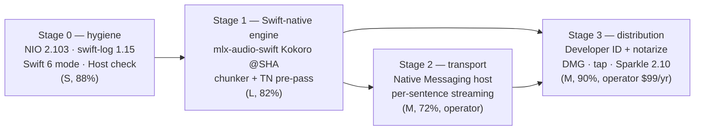
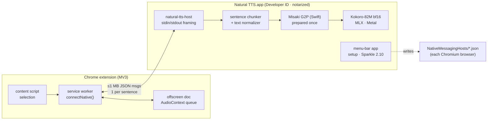

# R04: Native helper architecture and distribution

**Date:** 2026-09-23 · **Axis:** native-helper-architecture · **Machine:** Apple M1 Max, 64 GB, macOS 15.7.9, Xcode 26.3 (Swift 6.2.4), Chrome 153
**Scope:** the macOS helper in `native-helper/` (Swift + SwiftNIO HTTP on `127.0.0.1:8249`, driving a Python 3.11 `mlx-audio` Kokoro-82M subprocess). This report covers the engine, the HTTP layer, the extension-to-helper transport, and how the helper reaches real users.

Every version and API claim below comes from a primary source fetched on 2026-09-23 (GitHub API, PyPI JSON, the Hugging Face API, vendor docs, local man pages), or from a measurement taken on this machine the same day. Sources are listed at the end.

---

## Verdict

**Short version:** the Python subprocess can now be replaced. A Swift-only Kokoro on MLX (`Blaizzy/mlx-audio-swift`) exists, builds on this machine, and in our measurements ran about 1.5–2× faster than the current helper once warm, used about half the memory, and started playing audio in about 0.2 s because it works sentence by sentence. It is not ready to drop in, though. Four gaps have to be wrapped first: a model-loading bug, a 9 MB file copy on every call, a hard 510-token limit with no chunking, and weaker handling of numbers, currency and URLs. Chrome's new Local Network Access rules **do not** break the current `fetch` to 127.0.0.1; we tested this on Chrome 153 with a two-arm probe. Moving to Native Messaging is therefore a security and UX upgrade, not something Chrome is forcing. Nothing reaches real users until the helper is signed with a Developer ID and notarized. That is a $99/yr decision for the operator, and both Gatekeeper on macOS 15+ and Homebrew now enforce it.

### Ranked recommendations

| # | Recommendation | Action | Conviction | Effort |
|---|---|---|---|---|
| 1 | Replace the Python subprocess with a **Swift-native Kokoro engine on MLX** (`mlx-audio-swift` pinned to a SHA, or its MIT Kokoro + Misaki G2P sources vendored), with our own sentence chunker, a Misaki processor prepared once, a curated local model directory, and a text-normalization pre-pass | adopt-new | **82%** | L |
| 2 | Stage-0 hygiene on the current helper: swift-nio 2.88.0 → **2.103.0**, swift-log 1.6.4 → **1.15.1**, `swift-tools-version` 5.9 → 6.x in Swift 6 language mode (**1 compile error** to fix), stop blocking the cooperative pool with pipe reads, validate `Host`, and remove or implement the dead `X-Secret` | upgrade-now | **88%** | S |
| 3 | **Ship a Developer ID-signed and notarized `.app`** (DMG + zip), first through GitHub Releases and our own Homebrew tap, then `homebrew/cask` once eligible. Unsigned or ad-hoc builds are no longer a real-user channel. | operator-decision (needs the $99/yr Apple Developer Program) | **90%** that it is required; the spend is the operator's call | M |
| 4 | Move the extension↔helper transport from HTTP-on-loopback to **Chrome Native Messaging** (`connectNative`, per-sentence audio chunks under 1 MB), after #1 lands | operator-decision | **72%** | M |
| 5 | Bundle the model **inside the app** (bf16 Kokoro 327 MB + 54 voices 28 MB + G2P 9 MB ≈ 364 MB) instead of downloading from Hugging Face at runtime | operator-decision | **70%** | S |
| 6 | Launch model: with Native Messaging, **no login item** (Chrome spawns the host on demand). If we stay on HTTP, use `SMAppService.agent` plus launchd **socket activation**, not a resident 1 GB process. | adopt-new (conditional on #4) | **75%** | M |
| 7 | Auto-update with **Sparkle 2.10.0** (EdDSA-signed appcast) inside the helper app | adopt-new (after #3) | **78%** | M |
| 8 | Stay on SwiftNIO (or drop HTTP entirely per #4). Hummingbird 2.27 is fine but buys little for 3 routes. Network.framework `NWListener` would be a rewrite with nothing gained. | hold (Hummingbird) / reject (NWListener) | **65%** / **80%** | — |
| 9 | FluidAudio `KokoroAne` (CoreML/ANE) as the engine: **hold**. On this M1 Max it was slower than MLX (long text 11.6 s vs 5.5 s warm), used about 2 GB RSS, needed 34 s of first-run ANE compile, and ships an Apple BNNS crash advisory. Its NeMo text normalizer is worth borrowing (see #1). | hold | **75%** | — |
| 10 | `mlalma/kokoro-ios`: reject (last push 2026-01-10, pins `mlx-swift` exactly 0.30.2, English only). `sherpa-onnx` Kokoro: reject (espeak-ng GPL-3.0 data path, CPU ONNX). | reject | **85%** | — |
| 11 | Shipping the current Python venv to users: reject. It is 2.1 GB, its interpreter is a **symlink to the python.org framework** (not relocatable), it holds **587 Mach-O files** that would each need signing, and it bundles GPL-3.0 `libespeak-ng`. | reject | **92%** | — |

### Staged plan



Stage 0 is independent and can land today. Stage 1 is the load-bearing change. Stages 2 and 3 each need one operator decision: whether to accept the permission warning, and whether to spend $99/yr.

---

## 1. What the helper is today (read from the source)

- `Package.swift`: `swift-tools-version: 5.9`, macOS 13, deps `swift-nio from: 2.65.0` (resolved **2.88.0**) and `swift-log from: 1.5.0` (resolved **1.6.4**).
- `App.swift`: loads `~/Library/Application Support/NaturalTTS/config.json`, tries ports 8249…8260, spawns Python, waits up to 60 s for the stderr line `Model loaded, ready for requests`, then binds SwiftNIO on 127.0.0.1.
- `PythonWorker.swift`: an `actor` that talks length-prefixed JSON over stdin/stdout. `receiveMessage` calls blocking `FileHandle.read(upToCount:)` from inside the actor, so a Swift-concurrency cooperative thread is blocked for the whole generation. It sets `ESPEAK_DATA_PATH=/opt/homebrew/opt/espeak-ng/...`, which is a **hard dependency on a Homebrew espeak-ng install**.
- `HTTPServer.swift`: `/health` is open; `/speak` and `/voices` reject a non-extension `Origin` but **accept requests with no Origin** (any local process). The `X-Secret` path is **dead**: the server never checks it, and the extension always sends `secret: ''` because it cannot read the config file (`chrome-extension/src/shared/config.ts:46,53,104`). The `Host` header is not validated.
- `tts_worker.py`: loads `prince-canuma/Kokoro-82M` via `mlx_audio.tts.utils.load_model`, runs the whole text, concatenates the chunks, then returns **one base64 WAV**. The browser cannot start playing until the entire text has been synthesized.
- The venv (`Resources/python-env`) is **2.1 GB**. `bin/python3.11` is a symlink to `/Library/Frameworks/Python.framework/Versions/3.11/bin/python3.11`, and `pyvenv.cfg` has `home = /Library/Frameworks/Python.framework/...`. The largest packages are torch 387 MB, mlx 124 MB, transformers 115 MB and scipy 101 MB. There are 587 `.so`/`.dylib` files, including `espeakng_loader/libespeak-ng.1.52.0.dylib`.

### Swift 6 readiness (measured)

A scratch copy compiled with `swift-tools-version: 6.0` (Swift 6 language mode) gives **exactly 1 error**:

```
HTTPServer.swift:319:13: error: passing closure as a 'sending' parameter risks causing data races
```

This is the `Task { … context.eventLoop.execute { context.write … } }` in `HTTPHandler.channelRead`. It captures a non-Sendable `ChannelHandlerContext` and `HTTPHandler`, and that is a real race: the handler's state is touched off its event loop. The fix is `NIOLoopBound`, or better, move to `NIOAsyncChannel` (added in NIO 2.6x; performance improved in 2.96.0).

---

## 2. Engine: can we drop Python? (MLX Swift and Swift-native Kokoro)

### 2.1 Landscape, current vs latest

| Package | Latest (date) | License | Kokoro? | G2P | Notes |
|---|---|---|---|---|---|
| `ml-explore/mlx-swift` | **0.31.6** (2026-07-02) | MIT | — | — | Python `mlx` is at **0.32.2** (2026-08-25), so Swift trails by one minor. README: *"SwiftPM (command line) cannot build the Metal shaders so the ultimate build has to be done via Xcode"* (or `xcodebuild`). |
| `ml-explore/mlx-swift-lm` | **3.31.4** (2026-06-30) | MIT | — | — | LLM/VLM libraries split out of `mlx-swift-examples` (last tag 2.29.1, 2025-10-16). Pulled in transitively by mlx-audio-swift. |
| **`Blaizzy/mlx-audio-swift`** | **v0.1.3** (2026-07-09); `main` is **25 commits ahead** (HEAD `01dec7c`, 2026-09-18) | MIT | **Yes.** Added in PR #124 (2026-03-25), shipped in v0.1.3 | **Swift-native, no espeak.** English = Misaki port (CMUdict gold/silver lexicons + BART OOV fallback, from HF `beshkenadze/kitten-tts-g2p`, MIT, 9.1 MB). ES/FR/IT/PT/… = gruut IPA lexicons. JA/HI/ZH = ByT5 neural G2P. | `swift-tools-version:6.2`, **macOS 14+**. 54 voices, 9 languages. `main` exposes per-phoneme durations (#239, 2026-08-16), which is useful for word highlighting. |
| `FluidInference/FluidAudio` | **v0.17.1** (2026-09-23) | Apache-2.0 | **Yes**, `KokoroAneManager` (7-stage CoreML, 4 stages on the ANE) | CoreML BART for English OOV + Misaki lexicon, plus **NeMo text normalization** (prebuilt Rust xcframework `text-processing-rs` v0.3.1) | Plain `swift build` works (no Metal toolchain). ≤510 phonemes per pass, no streaming, no SSML or custom lexicon on the ANE path. The code ships an OS advisory for Apple BNNS crashes (issues #844 closed, #889 open for iOS 27). |
| `mlalma/kokoro-ios` | tag 1.0.11; last push **2026-01-10** | MIT | Yes | MisakiSwift (eSpeak option commented out) | Pins `mlx-swift` **exact: 0.30.2**, iOS 18 / macOS 15, English only. Stale. |
| `k2-fsa/sherpa-onnx` | v1.13.8 (2026-09-10) | Apache-2.0 (code) | Yes (ONNX) | Requires `espeak-ng-data` (espeak-ng is **GPL-3.0**) | CPU onnxruntime. Its own docs show RTF 3.2–7.6 for Kokoro on their CPU test, far behind MLX on Apple Silicon. |
| Python `mlx-audio` (current) | **0.5.5** (2026-09-21); we pin 0.2.6 | MIT | Yes | misaki 0.9.4 + **espeak fallback** (`phonemizer-fork` GPL-3.0, `espeakng-loader` bundling libespeak-ng) | Upgrading the Python path is axis R01/R02's topic. This axis asks whether we need Python at all. |

### 2.2 Measured head-to-head on this M1 Max (2026-09-23)

**Method.** Same three texts for every engine (88 / 517 / 2,072 chars), voice `af_heart`, speed 1.0, 4 runs each, **warm median = runs 1–3**. The Python arm drove the existing `tts_worker.py` + venv directly over its stdin protocol (isolated from the shared port-8249 helper, which sibling agents were using). The Swift arms are small harnesses linked against `mlx-audio-swift@01dec7c` (built with `xcodebuild`, Release) and `FluidAudio@5c51c5c` (`swift build -c release`). Both Swift arms chunk text by sentence with `NLTokenizer`. TTFA (time to first audio) = time until the first sentence's samples exist. **Caveats:** n = 3 warm runs, one machine (M1 Max), and a sibling helper shared the GPU intermittently. Treat differences under about 20% as noise.

| Engine | Load / init | Short (88 ch) warm | Medium (517 ch) warm | Long (2,072 ch) warm | TTFA (long) | RSS |
|---|---|---|---|---|---|---|
| **Current**: Python mlx-audio 0.2.6 worker | **6.16 s** cold | 0.358 s (16.6×) | 2.047 s (15.6×) | 7.353 s (17.2×) | **= full wall** (≈7.4 s; one WAV) | **1,132 MB** (+ 80 MB Swift helper) |
| **mlx-audio-swift, Misaki prepared once** | **0.26 s** | **0.187 s (31.8×)** | **1.071 s (30.9×)** | **5.522 s (23.9×)** | **0.215 s** | **366 → 601 MB** |
| mlx-audio-swift, stock processor | 0.08 s | 0.311 s (19.1×) | 1.777 s (18.6×) | 8.073 s (16.4×) | 0.274 s | 361 → 619 MB |
| FluidAudio KokoroAne (first run) | **34.10 s** (download + ANE compile) | 0.489 s | 2.385 s | 15.472 s (8.6×) | 0.599 s | 804 → **2,037 MB** |
| FluidAudio KokoroAne (second run) | 2.94 s | 0.594 s | 3.219 s | 11.591 s (11.4×) | 0.485 s | 819 → 2,042 MB |

*(× = audio seconds per wall second. The first-ever `generate` after a fresh build took 6.0 s for MLX Swift, which is Metal pipeline compilation. A later process launch paid only 0.88 s, so the Metal shader cache persists across launches.)*

**What this means here:**

1. **Latency.** Today the extension waits the full 7.4 s for a 2,000-character selection before any sound. Sentence-streamed Swift starts in **about 0.2 s**. That is the largest user-visible gain on the table, and it comes from the architecture (chunked streaming), not the language. It is available with either Swift engine, and with Python too if we rewrote the worker. Python, however, pays a 6 s cold start.
2. **Memory.** About 1.2 GB resident drops to about 0.4–0.6 GB. On-demand spawning (§4) also becomes practical, because load time falls from 6.2 s to under 0.3 s.
3. **Packaging.** No Python, no venv, no Homebrew espeak-ng, no GPL-3.0 espeak binaries. The weights are loaded from a directory we control.

### 2.3 What must be wrapped before `mlx-audio-swift` can ship (found by running it)

| # | Defect (at `01dec7c` + its pinned `swift-huggingface` **0.8.1**) | Evidence | Mitigation |
|---|---|---|---|
| a | **Stock `TTS.loadModel("mlx-community/Kokoro-82M-bf16")` fails** with `MLXNN.UpdateError.unhandledKeys(... keys: ["voice"])` | The snapshot copy puts the 54 `voices/*.safetensors` **also at the model root**, and `KokoroModel.loadWeights` loads every top-level `*.safetensors` (it only excludes names containing "voices"). Reproduced on a clean cache. | Load with `KokoroModel.fromModelDirectory(<bundled dir>)` from a curated directory: `config.json`, `kokoro-v1_0.safetensors`, `voices/`. We want this anyway for offline and privacy reasons (§5). Report upstream. |
| b | **Every English `generate()` re-copies the 9.1 MB G2P repo** (`Downloading model beshkenadze/kitten-tts-g2p...` on every call) | `ModelUtils.resolveOrDownloadModel` only returns early when a `config.json` exists. `kitten-tts-g2p` has none, so the cache check falls through. `KokoroModel.generateWithDurations` calls `processor.prepare(for:)` on **every** call. Cost measured: long text 8.07 s vs 5.52 s. | Pass `textProcessor: MisakiTextProcessor()` so it is prepared once at load (measured above), or vendor the code. The copy comes from the local hub cache (a network-denied `sandbox-exec` run still succeeded once the cache existed), so this is I/O waste, not a network leak. |
| c | **Hard 510-token cap, no chunking**: `guard tokens.count <= maxTokenCount` throws | `KokoroModel.swift:22,196`. `generateStream` yields the whole utterance as one chunk; it is not real streaming. | Our own sentence/clause chunker, targeting ≤ ~400 tokens. It doubles as the streaming unit (§4). |
| d | **G2P parity gaps vs Python misaki+espeak** on non-prose text | 15-sentence corpus: **6/15 byte-identical** phoneme strings, mean similarity **0.941**. Plain prose matches exactly. Divergences: `$45.99` **dropped entirely**, `2024` → "twenty four", URLs and emails mangled, hyphens rendered as em-dash pauses, `PostgreSQL`/`Reykjavík` OOV guesses, and `read` tense. FluidAudio's NeMo normalizer gets currency, years and URLs right ("forty five dollars … twenty twenty four"). | Add a text-normalization pre-pass before G2P. Options: extend `chrome-extension/src/shared/text-cleanup.ts`, or link FluidInference `text-processing-rs` (Apache-2.0, Swift wrapper, the NeMo TN FluidAudio uses). Gate on an ASR round-trip WER check (§8). |
| e | **Build toolchain**: MLX's Metal shaders need `xcodebuild` plus Xcode 26's separate **Metal Toolchain** component | The first build failed with `cannot execute tool 'metal' due to missing Metal Toolchain`. `xcodebuild -downloadComponent MetalToolchain` (704.6 MB) fixed it. A clean Release build then took 6 min 17 s. | Replace `swift build` in `Scripts/*` and CI with `xcodebuild -scheme … -configuration Release`. Ship `mlx-swift_Cmlx.bundle` (3.6 MB `default.metallib`) inside the `.app`. |
| f | **Dependency weight**: 31 transitive SwiftPM packages (async-http-client, swift-nio-ssl, swift-crypto, swift-transformers, swift-huggingface, …). A harness binary linking all of `MLXAudioTTS` is 108.8 MB. | `/tmp/ntts-r04/spm/checkouts` count; binary size | Prefer **vendoring** the ~4,300 lines of MIT sources (StyleTTS2 blocks + Kokoro + Misaki G2P) on top of `mlx-swift` alone. That removes the HF/networking stack from a privacy product and cuts supply-chain surface. Otherwise pin by SHA, not `branch: "main"` as the README suggests. |

**Why 82% and not higher:** the library is 0.1.x with one main Kokoro contributor, and defects a–d are real. Every one is wrappable in our code, though, and we measured the wrapped version working on this machine. Hardened runtime is not a blocker: Apple's own `mlx-swift-examples` apps set `ENABLE_HARDENED_RUNTIME = YES` and run under App Sandbox without an `allow-jit` entitlement.

### 2.4 Why not FluidAudio (yet)

Its benchmarks (M5 Pro, macOS 26.6: 31× RTFx, 881 MB) do not carry over to M1 Max. We measured 8.6–11.4× on long text with 2 GB RSS and a 34 s first-run ANE compile. The code warns that macOS 26.4–26.5 have *"a known Apple BNNS bug that can intermittently crash Kokoro synthesis … macOS 26.6 fixes it"*, and that no Core ML route is known to be safe on iOS 27 (issue #889, open). Those crashes are uncatchable in-process. Revisit if a large share of users run M4/M5 hardware. Its NeMo text normalizer is the part worth borrowing now.

---

## 3. HTTP layer: swift-nio, Hummingbird, Network.framework, Swift 6

| Item | Current | Latest | What changed that matters here |
|---|---|---|---|
| swift-nio | 2.88.0 | **2.103.0** (2026-09-17) | The minimum Swift is now **6.1** for 2.98+ (the README table; 2.98.0 dropped Swift 6.0). The local toolchain is 6.2.4, so this is fine. 2.96.0 improved `NIOAsyncChannel` performance. 2.91.0 fixed lock/continuation hazards in `NIOThrowingAsyncSequenceProducer`. Nothing is SemVer-major (NIO 2 is still "supported for the foreseeable future"). |
| swift-log | 1.6.4 | **1.15.1** (2026-09-08) | The package manifest is now `swift-tools-version:6.2`. |
| Hummingbird | — | **2.27.0** (2026-09-21) | Requires **Swift 6.2** (2.27 dropped 6.1), and its API availability is macOS 14. It is async/await and built on NIO. |
| Swift | 6.2.4 local | **6.4.0** (2026-09-15) | Swift 6.2 added "approachable concurrency" (default main-actor isolation opt-in, `nonisolated` async running in the caller's context, `@concurrent`) and the `Subprocess` package (**swift-subprocess 1.0.0**, 2026-08-04). Subprocess is only relevant if we keep Python in Stage 0. |
| Network.framework `NWListener` | — | macOS 10.14+ | We would hand-write an HTTP/1.1 parser. No benefit over NIO for three routes. |

**Recommendation (65% hold on Hummingbird):** for three routes, Hummingbird saves about 150 lines of handler code but adds a framework and a Swift 6.2 floor. The better move is to fix the one Swift 6 error with `NIOAsyncChannel` in Stage 0. If Stage 2 (Native Messaging) lands, the HTTP server is deleted anyway. Keep a stdin/stdout loop, which is about 60 lines and the same framing the Python worker already uses.

**Stage-0 migration steps (S, 88%):**
1. `Package.swift`: `// swift-tools-version: 6.0` (language mode 6), `swift-nio from: "2.103.0"`, `swift-log from: "1.15.1"`.
2. Replace `HTTPHandler`'s `Task { context… }` with `ServerBootstrap.bind(... ) -> NIOAsyncChannel` and handle each connection in a `withThrowingDiscardingTaskGroup`.
3. `PythonWorker`: move the blocking `read(upToCount:)` off the actor, either with `Subprocess` or with `FileHandle.bytes` async sequences.
4. Security: reject requests whose `Host` is not `127.0.0.1:<port>`/`localhost:<port>` (DNS-rebinding hygiene), and require an `Origin` of `chrome-extension://<our-id>` on `/speak` and `/voices` instead of *any* extension scheme. Delete the unused `X-Secret` plumbing or implement it properly; the extension currently never has the secret.

---

## 4. Transport: HTTP on loopback vs Chrome Native Messaging

### 4.1 Does Chrome's Local Network Access (LNA) break us? **No (verified).**

- LNA shipped in **Chrome 142**. It gates *public → local/loopback* and *local → loopback* requests behind a permission. Chrome 145 split the permission into `local-network` / `loopback-network`, and Chrome 147 extended it to WebSocket/WebTransport (chromestatus 5152728072060928, updated 2026-07-15).
- Google's extensions DevRel said on the chromium-extensions list (2025-11-06): *"as long as an extension has the correct host permissions, then they will not be impacted by this."* Two extension bugs were fixed by Chrome ≥ 144.0.7512.0.
- **Our two-arm probe on Chrome for Testing 153.0.8010.12** used a throwaway extension with `host_permissions: ["http://127.0.0.1/*"]` fetching a loopback server:

| Arm | Extension page | Extension service worker | Web page (control) |
|---|---|---|---|
| A: page origin forced to **public** (`--ip-address-space-overrides`) | `PAGE_OK 200` | `SW_OK 200` | **`WEB_FAIL TypeError: Failed to fetch`** |
| B: no override (loopback → loopback) | `PAGE_OK 200` | `SW_OK 200` | `WEB_OK type=opaque` |

The control shows the probe can detect a block, and the extension contexts pass in both arms. Our real fetches run in the offscreen document and popup, which are extension origins. Match patterns cover every port unless one is specified, so `http://127.0.0.1/*` covers 8249–8260.

So LNA is **not** a reason to migrate. The reasons are below.

### 4.2 Trade-off

| | HTTP on 127.0.0.1 (today) | Native Messaging (`connectNative`) |
|---|---|---|
| Who can call the helper | Any local process (no-Origin requests are accepted), and any browser page in browsers without LNA (blocked on `/speak` by the Origin check) | Only extension IDs listed in the host manifest's `allowed_origins` (no wildcards). Chrome passes the caller's origin as argv[1]. |
| Impersonation | Any process that binds 8249 first gets the user's selected text (the extension trusts whatever answers `/health`) | Chrome execs the absolute `path` in the manifest. Same-user malware could still rewrite the manifest, so equal against local malware, but there is no port race. |
| Process lifecycle | A resident daemon must already be running (login item / LaunchAgent / tmux today) | Chrome starts the host on `connectNative` and keeps it alive while the port is open. The port also keeps the MV3 service worker alive (Chrome 105+). `sendNativeMessage` spawns a new process **per message**, so it is unusable for a warm model. |
| Message limits | None (the helper returns a whole WAV) | **1 MB per message host → extension**; 64 MiB extension → host. PCM16 24 kHz base64 ≈ 64 KB/s, so one message carries at most ~16 s of audio. Per-sentence chunks (3–10 s) fit, but a maximum 510-token pass (~25–30 s) must be split. |
| Browsers | Works in every Chromium browser with no per-browser setup | The host manifest must be written into **each** browser's `NativeMessagingHosts` dir (Chrome `~/Library/Application Support/Google/Chrome/NativeMessagingHosts/`, Edge `~/Library/Application Support/Microsoft Edge/NativeMessagingHosts/`, and similar for Brave/Arc/Dia). Edge docs: the extension ID differs per store, so list both. |
| Install-time permission | Host permission `http://127.0.0.1/*` (narrow) | `nativeMessaging` → warning *"Communicate with cooperating native applications."* It can be put in **`optional_permissions`** (it is not on the cannot-be-optional list) and requested at onboarding. |
| CWS review | Neutral. The *"Require a local executable"* rule applies **only to Chrome Apps**, not extensions. | Same policy position, plus one more permission to justify in the Privacy tab. Our `<all_urls>` content script is the bigger review-time factor (CWS: *"Reviews may take longer for extensions that request broad host permissions"*); cross-reference R-CWS axis. |
| Enterprise | LNA policies (`LocalNetworkAccessRestrictionsTemporaryOptOut` removed in Chrome 156) do not affect extensions | `NativeMessagingUserLevelHosts=false` blocks user-level hosts (1Password documents the same failure) |
| macOS local-network privacy (macOS 15+, TN3179) | Loopback in a signed `.app` has not been verified. TN3179 auto-allows launchd daemons and Terminal tools. | No socket at all, so not applicable |
| Precedent | **Ollama**: loopback HTTP with an Origin allow-list (`envconfig.AllowedOrigins`: localhost/127.0.0.1/0.0.0.0, `app://`, `file://`, `tauri://`, `vscode-webview://`) | **1Password** (*"Native messaging ports allow 1Password to verify the connection … code signature validation makes sure the browser is properly signed"*), **Apple Passwords** and **Adobe Acrobat** hosts are installed on this machine under `/Library/Google/Chrome/NativeMessagingHosts/` |

**Recommendation (72%, operator-decision):** after Stage 1, move to Native Messaging. The host is the same Swift binary (`--native-messaging` mode, or detect `chrome-extension://` in argv[1]). It streams one message per sentence (`{seq, sampleRate, pcm16_b64}`, each under 700 KB), and the service worker relays them to the offscreen document. That removes the port scan, CORS/Origin/Host code, the daemon, the login item and a 1 GB resident process. The 28% against is real: one more permission warning, per-browser manifest registration, and a 1 MB framing constraint. That is why this is the operator's call and not a default.

---

## 5. Distribution to real users

### 5.1 Signing and notarization are no longer optional (90%)

- **Gatekeeper (macOS 15+):** *"users will no longer be able to Control-click to override Gatekeeper when opening software that isn't signed correctly or notarized. They'll need to visit System Settings > Privacy & Security"* (Apple Developer News, 2024-08-06).
- **Notarization** requires a Developer ID certificate, hardened runtime, and `notarytool` (altool uploads rejected since 2023-11-01). It covers apps, DMGs and flat pkgs.
- **Homebrew 5.0.0** (2025-11-12): *"Casks without codesigning are deprecated"* and *"Homebrew will disable all Homebrew/homebrew-cask casks that fail Gatekeeper checks in September 2026"*. That is **this month**. `--no-quarantine` is deprecated. `Acceptable-Casks` now states that executables *"must pass Homebrew's Gatekeeper checks"*, and the notability rules still apply to `homebrew/cask`.
- **Cost:** the Apple Developer Program is *"99 USD per membership year"*. The only codesigning identity on this machine today is a self-signed `"VoiceInk Dev"`, which is not a Developer ID. **This is the operator's decision**, and nothing below ships to strangers without it.
- **macOS 27 "Golden Gate"** was released 2026-09-14 and is **Apple Silicon only** (secondary: MacRumors). MLX and Kokoro-on-Metal were already arm64-only, so drop any Intel story. Homebrew moves Intel to Tier 3 from September 2026.

### 5.2 Packaging shape

```
Natural TTS.app/                          (Developer ID, hardened runtime, notarized, stapled)
  Contents/MacOS/NaturalTTS               SwiftUI MenuBarExtra (macOS 13+) — setup, status, voices, updates
  Contents/MacOS/natural-tts-host         the engine (Native Messaging host  — or HTTP server if #4 is declined)
  Contents/Resources/mlx-swift_Cmlx.bundle   default.metallib (3.6 MB)
  Contents/Resources/Kokoro-82M-bf16/     config.json, kokoro-v1_0.safetensors (327 MB), voices/ (28 MB)
  Contents/Resources/g2p-en/              us_gold.json, us_silver.json, us_bart.safetensors (9 MB)
  Contents/Library/LaunchAgents/…plist    only if HTTP is kept (SMAppService.agent, BundleProgram-relative)
```

- **First launch** writes the Native Messaging host manifest into every installed Chromium browser's `NativeMessagingHosts` dir (absolute `path` into the `.app`, `allowed_origins` = the CWS ID, plus the Edge Add-ons ID if published there). It also offers an "Open Chrome Web Store" button.
- **Model weights in the bundle (70%, operator-decision):** the 4-bit/6-bit/8-bit MLX variants save almost nothing (283–289 MB vs 327 MB for bf16), so keep bf16. Bundling means **zero network at runtime**, which is the product promise. The cost is roughly a 400 MB download. The alternative, a first-run Hugging Face download, adds a network dependency and runs into defect 2.3a.
- **Channels:** GitHub Releases (DMG for humans, zip for Sparkle) → own tap `brew install --cask <owner>/tap/natural-tts` → `homebrew/cask` once notability qualifies. Ollama (cask `ollama-app`, auto_updates) and LM Studio (cask `lm-studio`, auto_updates) both ship a notarized app plus a cask.

### 5.3 Launch-at-login (only if HTTP is kept)

- **`SMAppService.agent(plistName:)`** (macOS 13+): the plist lives in `Contents/Library/LaunchAgents`, `Program` becomes a bundle-relative `BundleProgram`, and `register()` bootstraps it immediately and at every login. The user can revoke it in Login Items (`status == .requiresApproval`; `openSystemSettingsLoginItems()`). **Ollama does exactly this** (`app_darwin.m`: `[SMAppService agentServiceWithPlistName:@"com.ollama.ollama.plist"]`).
- **Add launchd socket activation** (`Sockets` key in `launchd.plist(5)`, `launch_activate_socket(3)`). launchd owns `127.0.0.1:8249`, starts the helper on the first connection, and the helper adopts the fd via SwiftNIO `ServerBootstrap.withBoundSocket(_:)` (present in NIO 2.103.0). Nothing is resident until the user speaks, and with Swift-native load at 0.26 s a cold start is cheap. *Unverified:* that an `SMAppService` agent plist honors `Sockets`. Test it before relying on it.

### 5.4 Auto-update: Sparkle 2.10.0 (78%)

Sparkle **2.10.0** (2026-09-13): minimum deployment **macOS 12**, CocoaPods dropped, and a delta-compression fix for macOS 27. Setup: `generate_keys` puts an Ed25519 key in the login Keychain and `SUPublicEDKey` goes in Info.plist. Sign every archive and delta. Sparkle notes that Library Validation (part of the hardened runtime required for notarization) needs the Sparkle framework correctly signed. Ollama rolls its own updater (`app/updater/updater_darwin.m`); for a small team, Sparkle is the lower-risk choice. A Native Messaging host inside the `.app` is updated with the app, and Chrome re-execs the new binary on the next `connectNative`.

---

## 6. Target architecture



---

## 7. Detail: why each rejected option is rejected

- **Keep Python, but bundle it:** needs a relocatable CPython (the current venv points at `/Library/Frameworks/Python.framework`), signing of 587 Mach-O files under the hardened runtime, 2.1 GB of payload (torch alone is 387 MB and unused by MLX inference), and a GPL-3.0 `libespeak-ng` whose distribution would put copyleft obligations on the bundle. The Homebrew espeak-ng path in `PythonWorker.swift` also fails on any machine without Homebrew. **Reject (92%).**
- **kokoro-ios:** frozen on `mlx-swift` 0.30.2 (exact pin) and English only; mlx-audio-swift supersedes it. **Reject.**
- **sherpa-onnx:** its Kokoro path ships `espeak-ng-data` (GPL-3.0 engine) and runs on CPU ONNX. **Reject.**
- **Network.framework HTTP:** a rewrite for no gain. **Reject (80%).**

---

## 8. Verification (commands that prove each step)

| Step | Proof |
|---|---|
| Stage 0 | `cd native-helper && swift build -c release` with tools 6.0 → 0 errors. `curl -s -H 'Host: evil.test:8249' http://127.0.0.1:8249/voices` → 403. `curl -s -H 'Origin: chrome-extension://someoneelse' …/speak` → 403. |
| Stage 1 build | `xcodebuild -downloadComponent MetalToolchain` (once), then `xcodebuild build -scheme natural-tts-host -configuration Release -destination 'platform=macOS,arch=arm64'` → `** BUILD SUCCEEDED **`. |
| Stage 1 parity | Replay the 15-sentence corpus (numbers, currency, URLs, tech terms) through the new frontend and diff phonemes against Python misaki+espeak (baseline today: 6/15 identical, 0.941 similarity). Then run an **ASR round-trip WER** on 100 MiniMax English phrases (mlx-audio-swift ships Parakeet/Whisper STT) and gate on WER within +0.5 pp of the Python baseline. |
| Stage 1 perf | Same 3-text harness. Gate: warm long-text ≤ Python, TTFA ≤ 0.4 s, RSS ≤ 700 MB, offline run under `sandbox-exec -p '(version 1)(allow default)(deny network-outbound (remote ip "*:*"))'` succeeds. |
| Stage 2 | Chrome for Testing 153 with the built extension: `connectNative` → 3 sentence messages, each < 1,048,576 bytes; host exits when the port closes; SW stays alive during playback. |
| Stage 3 | `codesign --verify --deep --strict "Natural TTS.app"`, `xcrun notarytool submit … --wait` → Accepted, `xcrun stapler validate`, `spctl --assess --type execute -vv` → accepted, source=Notarized Developer ID; `brew audit --cask --online <tap>/natural-tts`. |

---

## 9. Sources

**Code and registries (fetched 2026-09-23)**
- mlx-swift releases / README: https://github.com/ml-explore/mlx-swift/releases · https://github.com/ml-explore/mlx-swift#swiftpm
- mlx-swift-lm: https://github.com/ml-explore/mlx-swift-lm/releases · mlx-swift-examples: https://github.com/ml-explore/mlx-swift-examples/releases (entitlements and `ENABLE_HARDENED_RUNTIME` in `mlx-swift-examples.xcodeproj/project.pbxproj`)
- mlx-audio-swift: https://github.com/Blaizzy/mlx-audio-swift (Package.swift, `Sources/MLXAudioTTS/Models/StyleTTS2/Kokoro/{README.md,KokoroModel.swift,KokoroMultilingualProcessor.swift}`, `Sources/MLXAudioCore/ModelUtils.swift`, `G2P/MisakiTextProcessor.swift`), releases https://github.com/Blaizzy/mlx-audio-swift/releases/tag/v0.1.3, PR #124, #239, issue #242
- FluidAudio: https://github.com/FluidInference/FluidAudio (README, `Documentation/TTS/KokoroAne.md`, `Documentation/TTS/Benchmarks.md`, `KokoroAneManager.swift`), issues https://github.com/FluidInference/FluidAudio/issues/844 · /889
- kokoro-ios: https://github.com/mlalma/kokoro-ios (Package.swift)
- sherpa-onnx Kokoro: https://k2-fsa.github.io/sherpa/onnx/tts/pretrained_models/kokoro.html
- PyPI: https://pypi.org/pypi/mlx/json · https://pypi.org/pypi/mlx-audio/json · https://pypi.org/pypi/phonemizer-fork/json · espeak-ng license https://github.com/espeak-ng/espeak-ng
- Hugging Face: https://huggingface.co/api/models/mlx-community/Kokoro-82M-bf16 · …-8bit · …-4bit · …-6bit · https://huggingface.co/api/models/beshkenadze/kitten-tts-g2p · https://huggingface.co/api/models/FluidInference/kokoro-82m-coreml · https://huggingface.co/api/models/hexgrad/Kokoro-82M
- swift-nio: https://github.com/apple/swift-nio/releases/tag/2.103.0 · README "Swift Versions" table · `Sources/NIOPosix/Bootstrap.swift` (`withBoundSocket`)
- swift-log: https://github.com/apple/swift-log/releases/tag/1.15.1 · Hummingbird: https://github.com/hummingbird-project/hummingbird/releases/tag/2.27.0
- Swift: https://github.com/swiftlang/swift/releases (6.4.0) · https://www.swift.org/blog/swift-6.2-released/ · https://github.com/swiftlang/swift-subprocess/releases
- Sparkle: https://github.com/sparkle-project/Sparkle/releases/tag/2.10.0 · https://sparkle-project.org/documentation/
- Ollama: https://github.com/ollama/ollama (`app/cmd/app/app_darwin.m`, `app/darwin/Ollama.app/Contents/Library/LaunchAgents/com.ollama.ollama.plist`, `envconfig/config.go`, `app/updater/`) · casks https://formulae.brew.sh/api/cask/ollama-app.json · https://formulae.brew.sh/api/cask/lm-studio.json

**Vendor documentation**
- Chrome Native Messaging (updated 2026-09-16): https://developer.chrome.com/docs/extensions/develop/concepts/native-messaging
- Edge Native Messaging: https://learn.microsoft.com/en-us/microsoft-edge/extensions/developer-guide/native-messaging
- chrome.permissions (optional list, updated 2026-09-11): https://developer.chrome.com/docs/extensions/reference/api/permissions
- Permission warnings (updated 2026-09-09): https://developer.chrome.com/docs/extensions/reference/permissions-list
- SW lifecycle (connectNative keep-alive): https://developer.chrome.com/docs/extensions/develop/concepts/service-workers/lifecycle
- Match patterns (ports): https://developer.chrome.com/docs/extensions/develop/concepts/match-patterns
- LNA: https://chromestatus.com/feature/5152728072060928 · https://developer.chrome.com/blog/local-network-access · https://groups.google.com/a/chromium.org/g/chromium-extensions/c/pUDh8RiTjJk
- CWS: https://developer.chrome.com/docs/webstore/program-policies/minimum-functionality · https://developer.chrome.com/docs/webstore/review-process · https://developer.chrome.com/docs/webstore/cws-dashboard-privacy
- Apple: https://developer.apple.com/documentation/servicemanagement/smappservice · …/smappservice/agent(plistname:) · …/smappservice/register() · https://developer.apple.com/documentation/servicemanagement/updating-helper-executables-from-earlier-versions-of-macos · https://developer.apple.com/documentation/security/notarizing-macos-software-before-distribution · https://developer.apple.com/news/?id=saqachfa · https://developer.apple.com/programs/whats-included/ · https://developer.apple.com/documentation/swiftui/menubarextra · https://developer.apple.com/documentation/network/nwlistener · https://developer.apple.com/documentation/technotes/tn3179-understanding-local-network-privacy · local `man launchd.plist` (Sockets) and `man launch_activate_socket`
- Homebrew: https://brew.sh/2025/11/12/homebrew-5.0.0/ · https://docs.brew.sh/Acceptable-Casks
- 1Password: https://support.1password.com/1password-browser-security/
- macOS 27 release (secondary): https://www.macrumors.com/2026/09/10/macos-27-golden-gate-release-date/

**Measurements (this machine, 2026-09-23; scratch in `/tmp/ntts-r04/`, which does not survive a reboot)**
- `baseline-python.json`, `bench-swift-mlx-m1.json`, `bench-swift-mlx-m0.json`, `bench-swift-fluid-run1.json`, `bench-swift-fluid.json`, `phonemes-{swift,python,fluid}.json`, `build-mas*.log`, `helper6.log` (Swift 6 compile), `lna/drive3.mjs` (LNA probe).
- Side effects outside `/tmp`: Xcode's **Metal Toolchain** component (704.6 MB, system asset, needed for any MLX Swift build) was downloaded. SwiftPM's shared cache was used. A FluidAudio cache the harness wrote to `~/.cache/fluidaudio` was moved into `/tmp/ntts-r04/`.

---

## Adversarial verification (2026-09-23)

*Independent verifier, appended. The author's content above is unchanged. I re-fetched every source, re-read the code at the pinned SHAs, and re-ran four of the local experiments. Scratch files are in `/tmp/ntts-verifier-r04/`, which does not survive a reboot.*

**Bottom line.** 10 of 12 load-bearing claims hold. Claim 3 is **refuted as stated**, and claim 4 holds but its privacy reading is **wrong**. Both errors sit in the same place, the Hugging Face download layer under `mlx-audio-swift`, and they change how recommendation #1 has to be carried out:

- **The model-loading bug does not reproduce with a normal cache location.** It only happens when the Hugging Face cache sits under a symlinked path such as `/tmp`, which is where this study put it.
- **The stock setup contacts huggingface.co for every sentence spoken**, and even the author's suggested fix contacts it once each time the helper starts. For a privacy-first product, vendoring the code (or patching it) is therefore required, not just preferred.

### Verdict table

| # | Claim (short) | Verdict | Primary evidence (fetched or re-run 2026-09-23) |
|---|---|---|---|
| 1 | mlx-audio-swift ships a Swift-native Kokoro with a Misaki G2P port and no espeak. It came in PR #124 and v0.1.3 (2026-07-09), and needs tools 6.2 and macOS 14. | **Confirmed** | `gh api repos/Blaizzy/mlx-audio-swift/releases`: v0.1.3 published 2026-07-09T16:58Z. PR #124 *"feat: add Kokoro TTS with multilingual support"* merged 2026-03-25; its merge commit `4aaf7cd` is 51 commits behind v0.1.3 and was not in v0.1.2. `Package.swift` at v0.1.3 and at `01dec7c` reads `swift-tools-version:6.2` and `.macOS(.v14)`. English G2P is `MisakiTextProcessor` (CMUdict gold/silver plus a BART fallback). The only "espeak" string in the Kokoro code is a comment about gruut lexicons. License MIT. `main` is 25 commits ahead of v0.1.3. |
| 2 | Measured on M1 Max: Swift took 0.187 / 1.071 / 5.522 s vs Python 0.358 / 2.047 / 7.353 s, time to first audio ≈ 0.2 s, memory 366–601 MB vs 1,132 MB, load 0.26 s vs 6.16 s. | **Confirmed, with a correction** | I recomputed the medians of runs 1–3 from `/tmp/ntts-r04/bench-swift-mlx-m1.json` and `baseline-python.json` and got exactly these numbers. **But on the long text the speed-up is 1.33×, not "1.5–2×"**, and it sits inside Python's own spread: its three warm runs took 5.85, 7.35 and 8.82 s. An earlier run of the same Misaki-prepared-once setup (`bench-swift-mlx-misaki.json`) took **7.81 s** on the long text, level with Python; the report does not mention it. The baseline is also the stale Python pin (mlx 0.29.3, mlx-audio 0.2.6), not the upgrade candidate (mlx **0.32.2**, 2026-08-25, and mlx-audio **0.5.5**, 2026-09-21, both from PyPI JSON). The load time, memory and first-audio gains are robust. The warm speed-up on long text is not. |
| 3 | Stock `TTS.loadModel("mlx-community/Kokoro-82M-bf16")` fails with `unhandledKeys(voice)` because the snapshot copy puts `voices/*.safetensors` at the model root. | **Refuted** (true only in an unusual environment) | **Root cause:** `swift-huggingface` `HubClient+Files.swift` `relativePath(from:baseDirectory:)` (same code in 0.8.1 and 0.11.0) only rewrites `/private/var/…` paths. `FileManager.enumerator` returns `/private/tmp/…` URLs for a base of `/tmp/…`, so the prefix check fails, the code falls back to `url.lastPathComponent`, and every sub-directory gets flattened. **Two-arm re-run** with the author's own `ntts-bench` binary: `HF_HUB_CACHE=/private/tmp/…/hub` (the real path) → *"load_s=0.44"*, 1 top-level safetensors, **loads fine**. `HF_HUB_CACHE=/tmp/…/hub` (through the symlink) → *"Fatal error: … UpdateError.unhandledKeys(… keys: ["voice"])"*, **55** top-level safetensors. The default cache `~/.cache/huggingface/hub` is not a symlink on this machine. The author's own cache dir still shows the same fingerprint: the `samples/*.wav` files flattened into the root. The bug is real but belongs upstream in **swift-huggingface**, and it only bites cache roots reached through a symlink. |
| 4 | Kokoro throws above 510 tokens and does no chunking. Every English `generate()` calls `prepare()`, which re-copies the config-less `kitten-tts-g2p` repo. | **Confirmed, and the privacy conclusion is refuted** | At `01dec7c`, `KokoroModel.swift:22` sets `maxTokenCount = 510` and `:199` has the `guard` that throws. `:185-189` calls `multilingual.prepare(for:)` on every call. `TTSModel.swift:207` makes `KokoroMultilingualProcessor` the default. `MisakiTextProcessor.prepare()` has no "already prepared" check. `ModelUtils.resolveOrDownloadModel` only returns early when `config.json` exists, and the HF API tree for `beshkenadze/kitten-tts-g2p` has no `config.json` (only `us_bart_config.json`; 9.12 MB total). **What the report gets wrong:** mlx-audio-swift passes `revision: "main"`. swift-huggingface's offline fast path (`cachedSnapshotPath`) only runs when `isCommitHash(revision)` is true (40 hex characters), so every `prepare()` calls `listFiles` over the network first. Measured with `lsof -i` on the running binary: 16 per-sentence `generate()` calls opened **10+ separate TLS connections to 52.84.217.102:443**, one of the `dig huggingface.co` addresses. The `sandbox-exec` test only proved there is an offline *fallback*. It did not prove the helper stays offline when a network is available. |
| 5 | SwiftPM on the command line cannot build MLX's Metal shaders, so `xcodebuild` is needed; Xcode 26.3 also needs the Metal Toolchain (704.6 MB). | **Confirmed** | mlx-swift README (main): *"SwiftPM (command line) cannot build the Metal shaders so the ultimate build has to be done via Xcode."* `/tmp/ntts-r04/build-mas.log:3417` reads *"cannot execute tool 'metal' due to missing Metal Toolchain"*. `metal-dl.log` shows "704.6 MB". `xcodebuild -showComponent MetalToolchain` → `Status: installed`. |
| 6 | Under Local Network Access on Chrome 153, extension pages and service workers with `http://127.0.0.1/*` can reach loopback, while a public page is blocked. | **Confirmed (I re-ran it independently)** | My own two-arm run on Chrome for Testing **153.0.8010.12** (headless, fresh profiles, `/tmp/ntts-verifier-r04/lna/run.sh`). Arm A, with `--ip-address-space-overrides=127.0.0.1:18612=public`: `PAGE_OK 200` / `SW_OK 200` / `WEB_FAIL TypeError: Failed to fetch`. Arm B: `PAGE_OK` / `SW_OK` / `WEB_OK type=opaque`. The chromestatus API for feature 5152728072060928 shows desktop 142, the 145 permission split, WebSocket and WebTransport added in 147, and an update on 2026-07-15. The chromium-extensions thread says *"as long as an extension has the correct host permissions, then they will not be impacted"*. In our code, `fetch` only happens in `offscreen.ts`, `popup.ts` and `options.ts`, all extension origins. The content script never fetches. |
| 7 | Native Messaging limits host→extension messages to 1 MB, allows no wildcards in `allowed_origins`, spawns a process for each `sendNativeMessage`, and `connectNative` keeps the service worker alive. | **Confirmed** | native-messaging doc (last updated 2026-09-16): *"maximum size of a single message from the native messaging host is 1 MB"*, *"allowed_origins values can't contain wildcards"*, *"Chrome starts a new native messaging host process for each message"*. SW lifecycle doc, "Chrome 105": *"connectNative() will keep a service worker alive"*. |
| 8 | The `nativeMessaging` warning reads "Communicate with cooperating native applications", and the permission can be optional. | **Confirmed** | permissions-list (2026-09-09) has that exact warning text. The API permissions page (2026-09-11) lists only debugger, declarativeNetRequest, devtools, geolocation, mdns, proxy, tts, **ttsEngine** and wallpaper as unable to be optional. |
| 9 | Homebrew disables homebrew/cask casks that fail Gatekeeper in Sept 2026 and deprecated `--no-quarantine`; Sequoia removed the Control-click override. | **Confirmed (as an announcement)** | Homebrew 5.0.0 post: *"We will disable all Homebrew/homebrew-cask casks that fail Gatekeeper checks in September 2026."* and *"--no-quarantine and --quarantine flags have been deprecated"*. **Homebrew 6.0.0 (2026-06-11)** repeats that it *"remain[s] on track"*. **Homebrew 7.0.0 (2026-09-13; now at 7.0.6)** does not mention it. The disable is announced, not observed. The Apple news item of 2024-08-06 is quoted correctly. |
| 10 | swift-nio 2.103.0 (2026-09-17) needs Swift 6.1+ from 2.98.0; the helper has exactly one data-race error in Swift 6 mode. | **Confirmed, and re-run against the target versions** | GitHub releases list 2.103.0 at 2026-09-17T12:06Z. The README table has the row `2.98.0 ... → 6.1`. The 2.98.0 notes say *"Drop Swift 6.0"*. The author's run used **NIO 2.88.0**, so I rebuilt a scratch copy on `swift-tools-version: 6.0` with **swift-nio 2.103.0 and swift-log 1.15.1**. It resolved and gave **exactly one error**, the same `HTTPServer.swift:319:13` "sending" closure, plus 4 Sendable warnings (`/tmp/ntts-verifier-r04/h6new.log`). |
| 11 | FluidAudio KokoroAne: 34.1 s first init, 11.6–15.5 s warm on the long text, ≈ 2.0 GB of memory, and a BNNS advisory for macOS 26.4–26.5. | **Confirmed** | JSON: `init_s` 34.10; long-text medians 15.472 and 11.591; `rss_mb` 2037 and 2042. `KokoroAneManager.swift` (main): `isBnnsCrashProneOS` flags macOS **26.4–26.5 only**, says 26.6 fixes it, and does not flag macOS 27. Issue #844 is closed and #889 (iOS 27) is open. License Apache-2.0. The advisory is mostly about iOS. For our macOS-only helper it is a weak reason to hold. |
| 12 | The venv interpreter is a symlink to the python.org framework; there are 587 `.so`/`.dylib` files including libespeak-ng; espeak-ng is GPL-3.0. | **Confirmed** | `bin/python3.11 -> /Library/Frameworks/Python.framework/Versions/3.11/bin/python3.11`. **587 regular files** (0 symlinks) plus 4 more Mach-O executables. `espeakng_loader/libespeak-ng.1.52.0.dylib` is present. 2.1 GB. `gh api repos/espeak-ng/espeak-ng` → `GPL-3.0`. |

### Other statements in the body I checked (outside the 12)

- **sherpa-onnx "RTF 3.2–7.6 on their CPU test".** That table is labelled *"RTF on **Raspberry Pi 4** Model B Rev 1.5"*, run with 1–4 threads. It says nothing about M1 Max performance. The rejection still holds on licence grounds alone: the multi-language Kokoro path needs `--kokoro-data-dir …/espeak-ng-data`.
- **"Loopback in a signed `.app` has not been verified" (§4.2, macOS local-network row).** TN3179 already answers this. A local network is one *"associated with a broadcast-capable network interface"* (Wi-Fi, Ethernet; loopback is not one), and *"Listening for and accepting incoming TCP connections"* is marked **"no"** (no privilege needed). The HTTP helper does not need the Local Network privilege. This removes a risk from the HTTP option.
- **"The library is 0.1.x with one main Kokoro contributor."** The commits touching the Kokoro directory come from 6 different authors (Blaizzy leads the repo overall with 126 commits, then lucasnewman with 75). The bus-factor worry is about the whole repo, not the Kokoro code specifically.
- **"Its pinned swift-huggingface 0.8.1".** That is pinned only when mlx-audio-swift is built as the root package, which is how the harness was built (`Sources/Tools/ntts-bench` inside the clone). **A package that depends on it does not inherit its `Package.resolved`.** It would resolve `upToNextMajor(from: "0.8.1")`, which today means **0.11.0** (2026-09-19). The same applies to mlx-swift: see missed item 3.
- The bf16/4/6/8-bit sizes (327 / 283 / 286 / 289 MB) and 54 voice safetensors (28.2 MB) match the HF tree API. The same `voices/` folder also holds 54 `.pt` duplicates (another 28.3 MB) that a curated bundle should leave out.

### Challenges to recommendations rated ≥ 80%

| Rec | Challenge | Adjusted |
|---|---|---|
| **#11 Reject shipping the Python venv (92%)** | Holds. Every fact is confirmed. The one counter-argument is that a relocatable CPython exists (python-build-standalone) and could fix the symlink. But the GPL-3.0 `libespeak-ng`, the 587 libraries to sign and the 2.1 GB size all remain. | 90 |
| **#3 Developer ID + notarization (90%)** | Required for non-technical users who download a DMG in a browser, yes. It would be wrong in three cases. **(a)** A *formula* built from source in our own tap, or a binary fetched by `curl`, never gets the quarantine flag, so Gatekeeper never checks it. That is a $0 channel for technical early adopters. Homebrew 7.0.0 also notes it *"permits Metal shader compilation inside the macOS sandbox"*, which makes a from-source MLX build plausible, though untested here. **(b)** If R03's hybrid (in-browser WebGPU Kokoro as a fallback) ships first, the helper becomes an optional accelerator and the $99 can wait until there is demand. **(c)** The Homebrew September 2026 disable has been announced twice but not observed, and the 7.0.0 notes are silent on it. | 85 |
| **#2 Stage-0 hygiene (88%)** | Confirmed buildable: 1 error against NIO 2.103 and swift-log 1.15.1. Three risks: **(a)** if #4 (Native Messaging) lands, the `NIOAsyncChannel` refactor is thrown away, so do only the cheap parts first (version bumps, the Host check, the X-Secret decision, `NIOLoopBound`); **(b)** tying `Origin` to one extension ID breaks unpacked dev builds unless the manifest carries a fixed `"key"`, so allow both the store ID and the dev ID; **(c)** the helper has **no unit tests**: `Tests/NaturalTTSHelperTests` has no tracked files, and SwiftPM warns about it during the build, so the Swift 6 refactor has nothing to catch regressions. | 85 |
| **#10 Reject kokoro-ios and sherpa-onnx (85%)** | kokoro-ios: confirmed (last push 2026-01-10T21:57Z, `mlx-swift exact: "0.30.2"`, eSpeak commented out). sherpa-onnx: the speed evidence is a Raspberry Pi 4 table (see above), so reject it on licence grounds only. It is also the only one of these with Windows and Linux builds. If the program ever wants a native helper beyond macOS, re-open it. | 80 |
| **#1 Swift-native Kokoro on MLX (82%)** | Still the right direction, but less certain and harder to execute than stated. **(a)** Of the "four gaps", defect (a) is really a swift-huggingface bug that only bites symlinked cache paths. **(b)** Defect (b) is a network call, not just wasted disk work. **The author's fix of passing `MisakiTextProcessor()` still sends one HF API request each time the helper starts** (measured: a connection to 52.84.217.102 during load, and the log printed *"Downloading model beshkenadze/kitten-tts-g2p..."*). `MisakiTextProcessor` has only `public init()` and a private `resourceDirectory`, so there is no supported way to point it at bundled files. **Vendoring the code (or a patch that takes a local directory) is required for the "zero network" promise, not optional.** Native Messaging would start the host on demand, so this call would happen at the start of every session. **(c)** The long-text speed claim is fragile (see claim 2). The durable reasons to switch are packaging, a 0.26 s load, about half the memory, and first audio in ~0.2 s, and that last one comes from streaming sentence by sentence, which a rewritten Python worker could also do. **(d)** The G2P gaps are a user-visible *correctness* regression for a read-aloud product: `"$45.99"` disappears entirely and `2024` is read as "twenty four". The text-normalization pre-pass has no effort estimate. **(e)** The macOS minimum rises from 13 to 14 for users. **(f)** The newest mlx-swift cannot be built with our local toolchain (missed item 3). | 76 |

### Items the author missed

1. **Report upstream to the right project.** The flattening bug (claim 3) is in `huggingface/swift-huggingface` `relativePath`, which only rewrites `/private/var`. It is still there in 0.11.0. It affects any cache root reached through a symlink (`/tmp`, `HF_HOME` on a symlinked volume), not only Kokoro. Stage-1 tests must use a cache path with no symlinks, or they will reproduce a bug users never hit.
2. **`revision: "main"` skips swift-huggingface's offline fast path.** Passing a 40-character commit hash, or loading only from a bundled directory, is what keeps runtime traffic at zero. Add this as a Stage-1 gate: run the host with `lsof -i -a -p <pid>` and expect **0 connections**. That is a stronger check than the `sandbox-exec` test, which cannot tell "stayed offline" apart from "tried the network and fell back".
3. **mlx-swift ≥ 0.31.5 needs swift-tools 6.3.** Its `Package.swift` reads `// swift-tools-version: 6.3;(experimentalCGen)`, and the 0.31.5 notes say *"this may require a newer Xcode to build"*. The local toolchain is Swift 6.2.4 (Xcode 26.3). The benchmark ran on **mlx-swift 0.31.4** (from `/tmp/ntts-r04/mas/Package.resolved`). The report's "latest mlx-swift 0.31.6" therefore needs a toolchain upgrade (Swift 6.4.0 was released 2026-09-15). Stage 1 must pin the whole dependency graph in *our* `Package.resolved`.
4. **The "bf16" Kokoro weights are actually float32.** I parsed the safetensors header of `mlx-community/Kokoro-82M-bf16/kokoro-v1_0.safetensors`: 548 tensors, **81,763,410 parameters, all `F32`** (327.1 MB). The 4-bit variant is 276.1 MB F32 plus 6.6 MB U32. The quantized variants only save a little because they quantize a small share of the tensors; the lever the author missed is dtype. A genuine fp16/bf16 cast would bring the bundled model to about **164 MB** and roughly halve recommendation #5's download. Its quality needs checking: R03 saw fp16 NaNs on WebGPU/ONNX, so the MLX path needs its own ASR round-trip check.
5. **CWS risk with no helper installed.** The report calls CWS review "Neutral". Under current policy (updated 2025-05-22), *"Extensions with broken functionality … non-functioning features—are not allowed"*. The troubleshooting page's "Yellow Magnesium" section says extensions *"should provide the functionality described in their listings and, if they cannot, communicate that to the user"*. A reviewer who installs the extension without the helper sees an extension that does nothing. Mitigations: fill in the dashboard's **"Provide test instructions"** field, show a clear "helper not found" onboarding screen, or ship R03's in-browser fallback so the extension works on its own. Coordinate this with the CWS axis.
6. **TN3179 settles the loopback-privacy question** in favour of HTTP (see above). It is no longer an open risk.
7. **Homebrew 6.0.0 (2026-06-11) and 7.0.x (7.0.6, 2026-09-21) are not cited.** They are the current versions, and 7.0.0 changes how casks and formulae are built in the sandbox.
8. **The benchmark reports its best run.** `bench-swift-mlx.json` and `bench-swift-mlx-misaki.json` (earlier runs, probably with the GPU shared) show much slower Swift results (long text 11.79 s and 7.81 s). Stage-1's performance gate should require n ≥ 10 on a quiet machine, compared against **upgraded** Python (mlx 0.32.2 / mlx-audio 0.5.5), not the November 2025 pins.
9. **`ttsEngine` cannot be optional** (same permissions page). This matters for the transport and permission discussion if the program adopts R03's `chrome.ttsEngine` idea. A helper-backed engine would carry a permission warning that cannot be deferred.

**Verifier sources (fetched 2026-09-23):** `gh api` for mlx-audio-swift (releases, pulls/124, pulls/239, compare, Package.swift, Package.resolved, and the Kokoro/G2P/ModelUtils/TTSModel sources at `01dec7c9`), `huggingface/swift-huggingface` `Sources/HuggingFace/Hub/HubClient+Files.swift` at 0.8.1 and 0.11.0, ml-explore/mlx-swift (releases 0.31.5/0.31.6, and Package.swift at 0.30.6/0.31.4/0.31.5/0.31.6), mlx-swift-lm 3.31.4, apple/swift-nio (2.103.0, the 2.98.0 notes, README), swift-log, hummingbird, sparkle 2.10.0, FluidAudio (`KokoroAneManager.swift`, #844, #889), mlalma/kokoro-ios, swiftlang/swift releases, espeak-ng, hexgrad/misaki · https://pypi.org/pypi/{mlx,mlx-audio,espeakng-loader}/json · https://huggingface.co/api/models/{mlx-community/Kokoro-82M-bf16,…-4bit,…-6bit,…-8bit,beshkenadze/kitten-tts-g2p,hexgrad/Kokoro-82M} (+ `/tree/main`) · https://chromestatus.com/api/v0/features/5152728072060928 · https://groups.google.com/a/chromium.org/g/chromium-extensions/c/pUDh8RiTjJk · https://developer.chrome.com/docs/extensions/develop/concepts/native-messaging · …/service-workers/lifecycle · …/reference/permissions-list · …/reference/api/permissions · https://developer.chrome.com/docs/webstore/program-policies/policies · …/troubleshooting · …/review-process · https://brew.sh/2025/11/12/homebrew-5.0.0/ · https://brew.sh/2026/06/11/homebrew-6.0.0/ · https://brew.sh/2026/09/13/homebrew-7.0.0/ · https://developer.apple.com/news/?id=saqachfa · https://developer.apple.com/documentation/technotes/tn3179-understanding-local-network-privacy · https://k2-fsa.github.io/sherpa/onnx/tts/pretrained_models/kokoro.html. **Re-run on this machine:** the two-arm cache-path load (`run-arm.sh`, `arm-*.log`), the `lsof` network sampling (`lsof-net.txt`, `lsof-mis2.txt`), the Swift 6 + NIO 2.103 build (`h6new.log`), the LNA probe (`lna/run.sh`), the snapshot-copy repro (`flat-test.swift`), and the safetensors dtype parse (`h4.json`).
