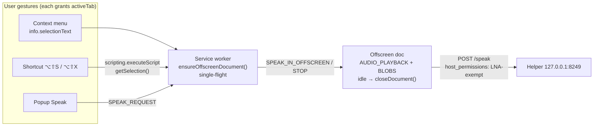

# R05: Chrome extension platform changes for Natural TTS (Chrome 131 → 156)

*Axis R05 of the 2026-09 upgrade program. Researched 2026-09-23. Scope: `chrome-extension/` v1.4.0 (MV3). Every version, date and API claim below links to a primary source fetched in this run, or to a measurement made in this run (tagged **[M1]–[M7]**, defined in the appendix).*

---

## Verdict

**Nothing in the platform is forcing a breaking change on this extension, but 2025–2026 Chrome changes expose two latent bugs and a store-listing problem that should be fixed before the first Chrome Web Store (CWS) submission.**

1. **The offscreen document can be killed while it is still waiting for synthesis.** An `AUDIO_PLAYBACK` offscreen document is closed 30 s after it is created, or 30 s after audio last stopped, unless it becomes audible first. That is Chromium's `AudioLifetimeEnforcer`, and I measured it here: the document was gone at 34 s **[M3]**. A `/speak` call that runs past that window (long text, or a new request made 25 s after the previous one finished) is torn down mid-flight.
2. **The static `<all_urls>` content script is the only reason for the "Read and change all your data on all websites" warning.** Measured: removing it and adding `scripting` leaves exactly one warning, "Read and change your data on 127.0.0.1" **[M1]**. It is also the named trigger for a slower CWS review.
3. **Local Network Access needs no change.** Chrome 142+ does not apply LNA to extensions that hold host permissions. That is documented; I measured it on Chromium 149 **[M2]** and branded Chrome 153 **[M4][M5]**. There is no `local-network-access` manifest permission.

Everything else is adoption of new capabilities (commands, `minimum_chrome_version`, i18n, `browser` namespace), dev/test tooling (branded Chrome can still load unpacked builds through CDP), or one operator decision (`ttsEngine`).

### Ranked recommendations

| # | Recommendation | Action | Conviction | Effort |
|---|---|---|---|---|
| 1 | Make the offscreen document survive synthesis: `reasons: ['AUDIO_PLAYBACK','BLOBS']` plus an explicit idle `closeDocument()`, and a single-flight `creating` guard in place of the 300 ms sleep | **upgrade-now** | 90% | S |
| 2 | Delete the `<all_urls>` content script. Context menu: use `info.selectionText` first. Popup and shortcut: `activeTab` + `scripting.executeScript` | **upgrade-now** | 92% | S–M |
| 3 | Stop inferring PDFs from `tab.id < 0`. The GuestView PDF viewer is gone by M155 (OOPIF only), so prefer `info.selectionText`, which Blink fills from the PDF plugin | **upgrade-now** | 80% | S |
| 4 | Route popup "Speak" through the SW → offscreen path. The popup closes on blur, and today its audio dies with it | **upgrade-now** | 85% | M |
| 5 | Keep `host_permissions: ["http://127.0.0.1/*"]` as is. Add nothing for LNA. Never move `fetch` into a content script | **hold** (no change) | 95% | — |
| 6 | Add `commands`: `speak-selection` (⌥⇧S), `stop-speaking` (⌥⇧X), `_execute_action` (⌥⇧N). Verified to bind on Chrome 153 **[M6]** | **adopt-new** | 80% | S |
| 7 | Add `minimum_chrome_version: "148"`. The hard floor is 116 (`runtime.getContexts`); 148 matches the `browser` namespace guidance for new extensions. Nobody is stranded because the extension is unpublished | **adopt-new** | 70% (for 148; 95% for ≥116) | S |
| 8 | Upgrade `@types/chrome` 0.0.268 → 0.3.0, a prerequisite for typing the new APIs. Measured: 3 type errors, all `storage.get` narrowing **[M7]** | **upgrade-now** | 85% | S |
| 9 | Dev/test/capture on **branded** Chrome with CDP `Extensions.loadUnpacked` + `--enable-unsafe-extension-debugging`. Verified on Chrome 153 **[M4]**. Chrome for Testing / Chromium keep `--load-extension` | **adopt-new** | 90% | S |
| 10 | Add `_locales/en/messages.json` + `default_locale` + `action.default_title`. This unlocks per-locale CWS descriptions and screenshots. Verified to load **[M6]** | **adopt-new** | 65% | S |
| 11 | Pin the helper to this extension's origin: manifest `key` for a stable dev ID, and an exact-origin allowlist in the helper (today it admits any `chrome-extension://`) | **adopt-new** | 70% | S–M |
| 12 | Keep `return true` in `onMessage` listeners. Promise-returning listeners (Chrome 148) are "rolling out gradually". Do not opt into structured-clone messaging yet; nothing needs it | **hold** | 85% | — |
| 13 | Register as a `chrome.ttsEngine` so Kokoro voices appear in every page's `speechSynthesis` and to other extensions. Cost: a non-optional permission and a new install warning. Decide **before** first publish | **operator-decision** | 60% | L |
| 14 | Side panel "reader" UI (persistent player; `close()`/`onOpened` 141, `onClosed` 142) | **evaluate** | 55% | M–L |
| 15 | No action needed: `userScripts` changes, MV2 removal, SW-lifetime rules (unchanged since 120), alarms name limit, `publicSuffix`, tab-strip context menus, `addHostAccessRequest` | **hold** | 90% | — |

**Cross-axis corrections.**

- **R07 and C1 recommend `minimum_chrome_version: "116"`.** That is the correct floor. #7 argues for 148; either is acceptable, and the choice is free to change before first publish.
- **R07's offscreen justification says the document "closes itself after 30 s of silence".** If #1 lands, that justification must change, because `BLOBS` removes the timer.
- **R07/C1 say branded Chrome can't load unpacked builds.** That is true for `--load-extension`, but **not for CDP `Extensions.loadUnpacked`** (#9). R09 capture can therefore run on real branded Chrome.

---

## Platform context (what "current" means today)

- **Release cadence changed.** Chrome moved to a **two-week** stable cadence starting with Chrome 153 on 2026-09-08, and Extended Stable stays on 8 weeks ([Chrome blog, 2026-03-03](https://developer.chrome.com/blog/chrome-two-week-release)). Schedule: 153 stable 2026-09-08, **154 stable 2026-09-22**, 155 on 2026-10-06, 156 on 2026-10-20 ([chromiumdash](https://chromiumdash.appspot.com/fetch_milestone_schedule?mstone=154)). Chrome for Testing reports Stable 154.0.8037.57, Beta 155.0.8059.12, Canary 156.0.8070.0 ([CfT JSON](https://googlechromelabs.github.io/chrome-for-testing/last-known-good-versions.json)). The versionhistory API already lists 155.0.8059.12 on the mac stable channel ([versionhistory](https://versionhistory.googleapis.com/v1/chrome/platforms/mac/channels/stable/versions)), which is consistent with an early-stable rollout.
- **This machine runs Chrome 153.0.8010.53**, one milestone behind stable. Playwright's bundled Chromium is CfT 151.0.7922.34, and the Chromium launched by `playwright-core` 1.61.1 reports 149 **[M1]**.
- **Consequence for testing:** a milestone now lasts two weeks, so "latest stable" goes stale fast. Pin the test matrix by `minimum_chrome_version` and current stable, not by a remembered number.
- Extensions changelog used throughout: [What's new in Chrome extensions](https://developer.chrome.com/docs/extensions/whats-new). Entries since Chrome 131: 132 `tabs.frozen` and DevTools storage viewer, 135 `userScripts.execute()`, 139 flag removals, 140 `sidePanel.getLayout()`, 148 `browser` namespace, 148 structured-clone messaging opt-in, 149 `userScripts` sync validation and DevTools promises, 150 tab-strip context menus and alarm-name limit, 153 `publicSuffix` API and a default-pinning experiment.

---

## 1. Offscreen document: reasons and lifetime (bug; upgrade-now, 90%)

**Current.** `ensureOffscreenDocument()` (`src/background/service-worker.ts:213-243`) creates the document with `reasons: ['AUDIO_PLAYBACK']`, then `setTimeout(300)`. It never closes the document. The offscreen doc then does the whole `/speak` fetch (30 s timeout, `src/shared/api-client.ts:174-199`) **before** any audio plays (`src/offscreen/offscreen.ts:91-99`).

**What the platform does.**
- Docs: "The `AUDIO_PLAYBACK` reason sets the document to close after 30 seconds without audio playing. All other reasons don't set lifetime limits." ([offscreen API](https://developer.chrome.com/docs/extensions/reference/api/offscreen))
- Source: `AudioLifetimeEnforcer` posts a 30 s timeout **in its constructor**, with the comment "allows the extension some time to load the audio resource… marks it as inactive if it doesn't play audio after a certain amount of time". It re-arms the timer each time audio goes inaudible ([audio_lifetime_enforcer.cc](https://chromium.googlesource.com/chromium/src/+/main/extensions/browser/api/offscreen/audio_lifetime_enforcer.cc)).
- A document with several reasons is closed only when **no** enforcer is active (`OnOffscreenDocumentActivityChanged`, [offscreen_document_manager.cc](https://chromium.googlesource.com/chromium/src/+/main/extensions/browser/api/offscreen/offscreen_document_manager.cc)). Every non-audio reason, `BLOBS` included, maps to `EmptyLifetimeEnforcer`, whose `IsActive()` always returns `true` ([lifetime_enforcer_factories.cc](https://chromium.googlesource.com/chromium/src/+/main/extensions/browser/api/offscreen/lifetime_enforcer_factories.cc)).
- **Measured [M3]:** `AUDIO_PLAYBACK` alone gave 1 context at t=0 and **0 at t=34 s**. `['AUDIO_PLAYBACK','BLOBS']` gave 1 at t=0 and **1 at t=34 s**.
- `offscreen.hasDocument()` is new in **Chrome 150** (docs). `runtime.getContexts()` (116) remains the portable check.

**Why it matters here.** Two failure modes follow from the enforcer, and both fit the "listener-registration race" symptoms the recent commits defended against (`767725b`, `9f915ab`):
- **Fresh document:** if synthesis takes ≥ ~30 s, the document dies before playback. C1 estimates 5,000 chars ≈ 40 s at the low-end RTF (C1-extension-map D10).
- **Warm document:** a request made *k* seconds after the previous playback ended has only 30 − *k* seconds of synthesis budget. `ensureOffscreenDocument()` sees the document, skips creation, and the document is then closed mid-fetch. `sendMessage` rejects, the retry hits "Receiving end does not exist", and the user hears nothing. This is an intermittent bug that grows with text length and with time since the last playback.

**Breaking changes.** None from Chrome. Adding `BLOBS` removes the auto-close, so the extension must close the document itself.

**Migration** (`src/background/service-worker.ts`). `BLOBS` is truthful here: the document uses `URL.createObjectURL`.

```ts
let creating: Promise<void> | null = null;            // docs' single-flight pattern
async function ensureOffscreenDocument(): Promise<void> {
  const url = chrome.runtime.getURL(OFFSCREEN_DOCUMENT_PATH);
  const open = await chrome.runtime.getContexts({ contextTypes: ['OFFSCREEN_DOCUMENT'], documentUrls: [url] });
  if (open.length) return;
  creating ??= chrome.offscreen.createDocument({
    url: OFFSCREEN_DOCUMENT_PATH,
    reasons: ['AUDIO_PLAYBACK', 'BLOBS'],             // BLOBS: object-URL playback; lifts the 30 s pre-audio kill
    justification: 'Plays speech generated by the local helper, via object URLs, independent of the popup',
  }).finally(() => { creating = null; });
  await creating;                                      // resolves after "initial page load" (docs), so the sleep goes
}
// offscreen.ts: after playback ends, arm e.g. a 60 s idle timer, then
// chrome.runtime.sendMessage({type:'OFFSCREEN_IDLE'}); SW handler → chrome.offscreen.closeDocument().
```

- The docs example uses a module-level `creating` promise "to avoid concurrency issues" and filters `getContexts` by `documentUrls` ([offscreen API](https://developer.chrome.com/docs/extensions/reference/api/offscreen)). Today two quick clicks can race `createDocument`, and the resulting error is swallowed by the bare `catch` at line 240.
- `createDocument` "resolves when the offscreen document is created and has completed its initial page load". Module scripts execute before load completes, so the 300 ms sleep is not needed once the race above is fixed. If a race is still observed, replace the sleep with a ready handshake: the offscreen doc posts `OFFSCREEN_READY`.
- **Verification:** unit test with `chrome.offscreen.createDocument` asserting `reasons` contains `BLOBS`. E2E: speak, wait 25 s, speak a ~2,000-char selection, and assert audio plays. Re-run probe [M3].

---

## 2. Permission-warning minimisation: remove the `<all_urls>` content script (upgrade-now, 92%)

**Current.** `content_scripts.matches: ["<all_urls>"]` injects `content/content-script.js` + CSS into every page at `document_idle`. Its only job is to answer `GET_SELECTED_TEXT` with `window.getSelection().toString()` and flash an overlay (`src/content/content-script.ts:20-35, 112-147`). `activeTab` is declared but unused (C1 §5).

**What the platform says.**
- `content_scripts.matches` and `host_permissions` both drive warnings: "Adding or changing match patterns in the `host_permissions` and `content_scripts.matches` fields… will also trigger a warning" ([declare permissions](https://developer.chrome.com/docs/extensions/develop/concepts/declare-permissions)).
- `activeTab` "displays no warning message during installation". It is granted by "Executing an action", "Executing a context menu item" and "Executing a keyboard shortcut from the commands API". It enables `scripting.executeScript()` on that tab when `scripting` is declared ([activeTab](https://developer.chrome.com/docs/extensions/develop/concepts/activeTab)).
- CWS: "Reviews may take longer for extensions that request broad host permissions… Host permissions patterns like `*://*/*`, `https://*/*`, and `<all_urls>`" ([review process](https://developer.chrome.com/docs/webstore/review-process)).
- **Measured [M1]** with `chrome.management.getPermissionWarningsByManifest`, which needs no `management` permission ([management API](https://developer.chrome.com/docs/extensions/reference/api/management)):

| Manifest variant | Install warnings |
|---|---|
| v1.4.0 as shipped | `Read and change all your data on all websites` |
| no `content_scripts`, + `scripting`, + `commands` | `Read and change your data on 127.0.0.1` |
| same, host pinned to `:8249` | `Read and change your data on 127.0.0.1` (pinning the port gains nothing) |
| same, + `sidePanel` | `Read and change your data on 127.0.0.1` (side panel is warning-free) |
| same, + `tabs` | adds `Read your browsing history`, so do **not** add `tabs` |
| same, − `host_permissions` | *(none)*, but see §5 for why the host permission stays |

**Why it matters here.** Beyond the warning, there are three concrete wins:
1. It removes the CWS slow-review trigger.
2. It removes the "Could not access page content. Please refresh the page" failure (`popup.ts:516-522`). Static content scripts are absent from tabs opened before install or update. `executeScript` has no such gap.
3. It stops running code in every page the user visits, for a feature used on demand.

**Breaking changes.**
- `executeScript` fails on restricted pages (`chrome://`, the Web Store). "Access is not granted to restricted pages" ([activeTab](https://developer.chrome.com/docs/extensions/develop/concepts/activeTab)). The static script could not run there either, so this is parity.
- **Adding a warning-bearing permission in an update disables the extension until the user accepts** ([permission warnings](https://developer.chrome.com/docs/extensions/develop/concepts/permission-warnings)). Since this extension is unpublished, the permission set chosen for v1 is free. Get it right before first publish.

**Migration.** Add `"scripting"` to `permissions`, delete `content_scripts`, move the overlay flash into the injected function (or drop it), and delete `src/content/*` plus its build steps (`build.ts`, `vite.config.ts` inputs).

```ts
// shared: read the selection on demand. activeTab was granted by the click/shortcut that got us here.
export async function readSelection(tabId: number): Promise<string> {
  try {
    const [res] = await chrome.scripting.executeScript({
      target: { tabId },
      func: () => window.getSelection()?.toString() ?? '',
    });
    return String(res?.result ?? '').trim();
  } catch {
    return ''; // restricted page (chrome://, Web Store) or the PDF viewer frame
  }
}
```

- **Popup** (`popup.ts:467-529`): replace `chrome.tabs.sendMessage(tab.id, GET_SELECTED_TEXT)` with `readSelection(tab.id)`. Opening the popup from the action or from `_execute_action` grants `activeTab`.
- **Verification:** `bun test` with a mocked `chrome.scripting`. Manual: install, open an already-open tab without reloading, select text, click Speak. Re-run [M1] and assert exactly `["Read and change your data on 127.0.0.1"]`.

---

## 3. PDFs: the OOPIF viewer replaced GuestView (upgrade-now, 80%)

**Current.** `service-worker.ts:88-127` sends `tab.id >= 0` to the content script and treats `tab.id < 0` as "PDF → use `info.selectionText` + ligature cleanup". If the content script reports no selection, the handler `return`s. There is no fallback to `info.selectionText`.

**What changed.**
- The enterprise policy `PdfViewerOutOfProcessIframeEnabled` reads: "deprecated in M152 and will be removed in M155. The GuestView PDF viewer is being removed, and the out-of-process iframe (OOPIF) PDF viewer architecture will always be used" ([policy definition](https://chromium.googlesource.com/chromium/src/+/main/components/policy/resources/templates/policy_definitions/Miscellaneous/PdfViewerOutOfProcessIframeEnabled.yaml)). The `tab.id < 0` heuristic dates from the GuestView era.
- Blink fills the context-menu `selected_text` from `plugin->SelectionAsText()` for plugin (PDF) hit-tests ([context_menu_controller.cc](https://chromium.googlesource.com/chromium/src/+/main/third_party/blink/renderer/core/page/context_menu_controller.cc)), and the extension menu manager forwards it as `selectionText` ([menu_manager.cc](https://chromium.googlesource.com/chromium/src/+/main/chrome/browser/extensions/menu_manager.cc), lines 731-732). No truncation appears in either file at HEAD.

**Why it matters here.** Under OOPIF a right-click in a PDF plausibly arrives with a real `tab.id ≥ 0`. The top-frame content script then sees no selection, because the text lives in the viewer's frame, and the handler silently returns. **Not measured:** a native context-menu click can't be driven headlessly. This is PLAUSIBLE, so check it by hand (below). The fix is correct whichever way the heuristic behaves.

**Migration.** The browser already hands you the text for every frame type:

```ts
let text = info.selectionText?.trim() ?? '';
if (!text && tab?.id !== undefined && tab.id >= 0) text = await readSelection(tab.id); // §2 helper
if (/\.pdf($|[?#])/i.test(info.pageUrl ?? '')) text = cleanupPDFLigatures(text);        // replaces tab.id<0 test
```

The pdf regex is a heuristic, so keep the unit tests in `text-cleanup` that guard against false positives. Keyboard shortcuts can't read PDF selections: `activeTab` can't inject into the viewer's extension frame. Document that the context menu is the PDF path.

**Verification (manual, Chrome ≥ 155):** open any PDF, select a sentence, right-click → "Speak selected text", and confirm audio plays. Before the fix, add a `console.log(tab?.id, info.frameUrl)` to record which branch runs.

---

## 4. Popup lifetime: route popup speech through the offscreen document (upgrade-now, 85%)

**Current.** The popup fetches `/speak` and plays audio **inside the popup** (`popup.ts:415-430`, `playAudio` at 533).

**Platform rule.** "Popups automatically close when the user focuses on some portion of the browser outside of the popup. There is no way to keep the popup open after the user has clicked away" ([add a popup](https://developer.chrome.com/docs/extensions/develop/ui/add-popup)).

**Why it matters here.** Clicking back into the page to keep reading kills the audio. The context-menu path already solves this with the offscreen doc. Unifying both paths gives one playback owner, one stop control (§6) and one lifetime policy (§1).

**Migration.**
- The popup sends `{type:'SPEAK_REQUEST', text, voice, speed}` to the SW. The SW runs `ensureOffscreenDocument()` and forwards the request.
- The popup shows state from `chrome.storage.session` or from messages rather than owning an `<audio>` element. Keep `resetApiClient` and the health UI in the popup.
- **Verification:** click Speak in the popup, click the page, and confirm audio continues.

---

## 5. Local Network Access / Private Network Access (hold: no change, 95%)

**Current.** `host_permissions: ["http://127.0.0.1/*"]`. The SW, offscreen document and popup `fetch` `http://127.0.0.1:8249..8260` (`config.ts:17`, `api-client.ts:43-45`). Match patterns "match all ports unless an explicit port is specified" ([match patterns](https://developer.chrome.com/docs/extensions/develop/concepts/match-patterns)), so the single entry covers the discovery range.

**What changed on the web platform.**

| Milestone | Change | Source |
|---|---|---|
| 138 | LNA behind `chrome://flags#local-network-access-check` | [blog](https://developer.chrome.com/blog/local-network-access) |
| **142** | LNA ships: fetch, subresources and subframes from public to local/loopback need a permission prompt. Supersedes Private Network Access preflights | [chromestatus](https://chromestatus.com/feature/5152728072060928), [blog](https://developer.chrome.com/blog/local-network-access) |
| 144 | `fetch("http://localhost")` can be used to trigger the prompt | [LNA adoption guide](https://docs.google.com/document/d/1QQkqehw8umtAgz5z0um7THx-aoU251p705FbIQjDuGs/edit) |
| 145 | Permission split into `local-network` and `loopback-network` | [chromestatus](https://chromestatus.com/feature/5152728072060928), guide |
| 146 | Enterprise policies `LocalNetworkAccessIpAddressSpaceOverrides` and `LocalNetworkAccessPermissionsPolicyDefaultEnabled` | chromestatus |
| 147 | WebSocket and WebTransport also gated | chromestatus, guide |
| 156 | `LocalNetworkAccessRestrictionsTemporaryOptOut` policy removed | chromestatus |

**The extension answer, from the primary source.** The LNA adoption guide (last updated 2026-05-18) says: "**We do not currently have plans to apply LNA restrictions to extensions. Currently, extensions that have the necessary host permissions are allowed to make local network requests.**" The extension permission list (updated 2026-09-09) has **no** `local-network*` or `loopback*` permission ([permissions list](https://developer.chrome.com/docs/extensions/reference/permissions-list)). `local-network`/`loopback-network` are web Permissions-API and permissions-policy names, not manifest permissions.

**Measured.**
- **[M2]** Chromium 149: SW `fetch` → 200 and offscreen `fetch` → 200 against a loopback test server. The same fetch from a page on `https://example.com` failed with `TypeError: Failed to fetch`, `loopback-network` state `prompt`, and the server logged no request.
- **[M4]** Branded Chrome 153 (LNA enforced): extension page fetch → 200 with no prompt.
- **[M5]** Branded Chrome 153 **without** `host_permissions`: GET and POST still succeed, but only through CORS, with a preflight `OPTIONS` before the POST and an `Origin: chrome-extension://…` header on both. With host permissions there was no preflight, and the GET carried no `Origin` header.

**Why keep the host permission (hold, 95%).**
- (a) The documented exemption is conditional on "the necessary host permissions". The no-permission success in [M5] is current behaviour, not a contract.
- (b) The helper does not answer `OPTIONS` (`HTTPServer.swift:95-107` routes only GET /health, POST /speak, GET /voices), and it emits no `Access-Control-Allow-Headers`. Dropping the host permission would therefore break `/speak` (JSON content type + `X-Secret` ⇒ preflight).
- (c) The warning it costs ("…on 127.0.0.1") is narrow and honest.

**Never move the helper `fetch` into a content script:** content-script fetches are page-origin requests and are gated, as the page probe shows.

**Future-proofing.** If the helper ever moves to WebSockets for streaming, the Chrome 147 gating applies to web pages, not to extensions with host permissions (guide). Re-run [M4] on each milestone; it is a 20-second probe.

---

## 6. Keyboard commands (adopt-new, 80%)

**Current.** No `commands`. There is no way to stop speech except the popup Stop button, and none at all for context-menu speech.

**Platform facts** ([commands API](https://developer.chrome.com/docs/extensions/reference/api/commands)):
- At most **four** suggested shortcuts.
- Must include Ctrl or Alt; Ctrl+Alt is not allowed. On macOS `Alt` = Option, and `Ctrl` is converted to Command.
- `_execute_action` opens the popup and dispatches no `onCommand`.
- `onCommand` receives `(command, tab?)`.
- Shortcuts grant `activeTab` ([activeTab](https://developer.chrome.com/docs/extensions/develop/concepts/activeTab)).
- Users can rebind at `chrome://extensions/shortcuts`.

**Measured [M6].** On Chrome 153 `chrome.commands.getAll()` returned `_execute_action ⌥⇧N`, `speak-selection ⌥⇧S`, `stop-speaking ⌥⇧X`: all bound, none dropped for conflict.

**Migration.**

```jsonc
"commands": {
  "_execute_action":  { "suggested_key": { "default": "Alt+Shift+N" } },
  "speak-selection":  { "suggested_key": { "default": "Alt+Shift+S" }, "description": "__MSG_cmdSpeak__" },
  "stop-speaking":    { "suggested_key": { "default": "Alt+Shift+X" }, "description": "__MSG_cmdStop__" }
}
```

```ts
chrome.commands.onCommand.addListener(async (command, tab) => {
  if (command === 'stop-speaking') return void chrome.runtime.sendMessage({ type: 'STOP_IN_OFFSCREEN' });
  if (command === 'speak-selection' && tab?.id !== undefined) {
    const text = await readSelection(tab.id);               // §2; empty on chrome:// and in PDFs (use the menu there)
    if (text) await speakViaOffscreen(text);
  }
});
```

The offscreen doc needs a `STOP_IN_OFFSCREEN` handler (`currentAudio.pause()`). Conviction on the specific key choices is lower (~60%). The mechanism is 80%.

---

## 7. `minimum_chrome_version` (adopt-new, 70% for "148"; 95% that a floor ≥ "116" must exist)

**Current.** Not set. The code already needs Chrome **116** (`runtime.getContexts`, [runtime API](https://developer.chrome.com/docs/extensions/reference/api/runtime)) and 109 (offscreen).

**Platform rules** ([minimum_chrome_version](https://developer.chrome.com/docs/extensions/reference/manifest/minimum-chrome-version)):
- Older Chrome sees "Not compatible" in the store.
- Existing users below the floor silently stop receiving updates.
- The `browser` namespace guide says: "If you're building a new extension, set `minimum_chrome_version` to `"148"` and use `browser` unconditionally" ([browser namespace](https://developer.chrome.com/docs/extensions/develop/concepts/browser-namespace)).

**Why 148 here.**
- The extension is **unpublished**, so no user can be stranded.
- The real-user matrix is macOS on Apple Silicon with an auto-updating Chrome now at 154/155.
- 148 is the lowest version where the whole 2026 messaging surface exists: `browser`, promise-returning `onMessage` and structured-clone opt-in.
- Features this report adds need less: `commands` and `scripting` are old, and `sidePanel.close()` is 141.

**Counter-view.** R07 and C1 pick "116", the strict technical floor. That is defensible, and the choice can be revised freely until first publish. **Verification:** load the built extension in Chrome for Testing at the chosen floor (CfT publishes per-version builds) and run the E2E smoke.

---

## 8. Service-worker lifetime (hold, 90%)

**Nothing changed since Chrome 120** ([SW lifecycle](https://developer.chrome.com/docs/extensions/develop/concepts/service-workers/lifecycle)). The page's version history ends at 120 (30 s alarms). The rules are:
- terminate after 30 s idle;
- a single event/API call may run 5 min;
- `fetch` must respond within 30 s;
- messages from an offscreen document reset the timers (109).

**Relevance here.**
- The SW `await`s `runtime.sendMessage` until playback **ends** (`offscreen.ts` replies after `onended`). For audio longer than 5 minutes the SW may be terminated mid-await. That is harmless today, because the offscreen doc keeps playing and the SW only logs.
- The cleaner shape: the offscreen doc acknowledges immediately (`{accepted:true}`), then reports completion or failure with a separate message.
- Never `fetch` the helper from the SW for long synthesis, because of the 30 s fetch rule. The offscreen doc is the right owner.

---

## 9. `--load-extension` removed from branded Chrome: dev, test and capture (adopt-new, 90%)

**What changed.**
- Chrome **137** removed `--load-extension` from branded builds. It still works in **Chromium and Chrome for Testing**. The listed alternatives are `chrome://extensions` "Load unpacked", CDP, and WebDriver BiDi `webExtension.install`, which needs `--enable-unsafe-extension-debugging` and `--remote-debugging-pipe` ([PSA, 2025-04-04](https://groups.google.com/a/chromium.org/g/chromium-extensions/c/1-g8EFx2BBY/m/S0ET5wPjCAAJ)).
- Chrome **139** also removed `--disable-extensions-except` and `--extensions-on-chrome-urls` from branded builds ([What's new](https://developer.chrome.com/docs/extensions/whats-new)).
- CDP now has an `Extensions` domain: `loadUnpacked(path, enableInIncognito)`, `uninstall`, `getExtensions`, `triggerAction(id, targetId)` (opens the action) and `get/set/remove/clearStorageItems` ([protocol JSON](https://raw.githubusercontent.com/ChromeDevTools/devtools-protocol/master/json/browser_protocol.json), rolled 2026-09-22; [docs](https://chromedevtools.github.io/devtools-protocol/tot/Extensions/)).
- Puppeteer exposes `enableExtensions` / `browser.installExtension()` ([Puppeteer guide](https://pptr.dev/guides/chrome-extensions)). Playwright's docs say to use its bundled Chromium ([Playwright](https://playwright.dev/docs/chrome-extensions)).

**Measured [M4].**
- `playwright-core` `chromium.launch({channel:'chrome', args:['--enable-unsafe-extension-debugging'], ignoreDefaultArgs:['--disable-extensions']})` → `Extensions.loadUnpacked` → **loaded on branded Chrome 153.0.8010.53**. The SW target registered and the popup rendered with title "Natural TTS".
- **Gotcha:** without `ignoreDefaultArgs: ['--disable-extensions']`, `loadUnpacked` still returns an ID, but the extension is inert (`getExtensions` → `[]`, and the popup is a `chrome-error://` page).

**Why it matters here.**
- CWS screenshots and videos should show **real branded Chrome UI** at current stable, not "Chrome for Testing" chrome. CDP loading makes that scriptable. `Extensions.triggerAction` can open the popup for a recording without a human click.
- For CI, prefer Playwright's Chromium with `--load-extension` (simpler, documented).
- Use manual "Load unpacked" for day-to-day development.

---

## 10. `userScripts` and other deprecations (hold, 90%)

- **`userScripts`:** Chrome 138 replaced the Developer-mode requirement with a per-extension "Allow User Scripts" toggle ([userScripts API](https://developer.chrome.com/docs/extensions/reference/api/userScripts)). 135 added `execute()` and 149 added synchronous validation. **Not used here, so no action.**
- **MV2:** gone from Chrome; the extension is already MV3. No action.
- **Chrome 150:** `alarms.create()` rejects names over 1,024 bytes. No alarms are used. The new `contextMenus` `"tab"` context (tab-strip right-click) is a possible future "Read this tab" entry, but it would need page-content extraction. Hold.
- **Chrome 132:** `tabs.frozen`; messages to frozen tabs are queued. It is irrelevant once §2 removes tab messaging.
- **Chrome 153:** experiment that **pins** extension action icons by default. This is free discoverability, and there is nothing to do ([What's new](https://developer.chrome.com/docs/extensions/whats-new)).
- **New extensions menu and `permissions.addHostAccessRequest()`:** these give users per-site control over host access ([blog](https://developer.chrome.com/blog/new-extensions-menu-testing)). With `activeTab`-only page access (§2) there is no persistent site access to withhold, so no adoption is needed.

---

## 11. i18n and the store listing (adopt-new, 65%)

**Platform facts.**
- `_locales/<code>/messages.json` + `__MSG_key__` in the manifest. "If an extension has a `/_locales` directory, the manifest must define `default_locale`" ([i18n API](https://developer.chrome.com/docs/extensions/reference/api/i18n); [i18n guide](https://developer.chrome.com/docs/extensions/develop/ui/i18n)).
- In the CWS dashboard, "each locale corresponds to one of the `_locales/LOCALE_CODE` directories". You can localise the **detailed description, screenshots and promo video**, but not the small or marquee tiles ([store listing](https://developer.chrome.com/docs/webstore/cws-dashboard-listing)).
- Summary ≤ 132 characters, plain text ([best listing](https://developer.chrome.com/docs/webstore/best-listing)). `name` ≤ 75 characters ([What's new, 2024-02-29](https://developer.chrome.com/docs/extensions/whats-new)).

**Why here.** The manifest `description` is the store summary, and today it is jargon ("…local Metal-accelerated processing"). Moving the strings to `messages.json` gives one place to write the copy, and makes localized listings possible later.
- `action.default_title` is missing: there is no toolbar tooltip, which is also an accessibility gap.
- The context-menu title (`'Speak selected text'`, `service-worker.ts:58`) should read `chrome.i18n.getMessage('menuSpeak')`.

**Measured [M6].** A manifest with `default_locale: "en"`, `__MSG_extName__`, `__MSG_extDescription__` (97 chars) and `__MSG_actionTitle__` loaded on Chrome 153, and `chrome.i18n.getMessage('extName')` resolved.

Conviction is 65% because the value scales with whether you will localize. The cost is one file.

---

## 12. Other 2026 items

**12a. `browser` namespace, promise listeners and structured clone (hold on adoption details, 85%).**
- From Chrome 148 every API is also under `browser`, with `chrome === browser` per API object ([browser namespace](https://developer.chrome.com/docs/extensions/develop/concepts/browser-namespace)). Measured present (`typeof browser === 'object'`) on Chrome 153 **[M4]**.
- Promise-returning `onMessage` listeners exist from 148, but "This update is rolling out gradually… Using `return true;` will continue to work" ([messaging](https://developer.chrome.com/docs/extensions/develop/concepts/messaging)). **Keep `return true`** in `offscreen.ts:54`.
- Structured-clone serialization is opt-in via `"message_serialization": "structured_clone"`. It can carry `Blob`/`Map`, but `ArrayBuffer` is copied, not transferred, and extensions with mismatched formats can't message each other ([blog, 2026-04-22](https://developer.chrome.com/blog/structured-clone-messaging)). Only text crosses contexts today, so there is no need. Revisit if audio ever moves between contexts, for example SW-side fetch.

**12b. `@types/chrome` 0.0.268 → 0.3.0 (upgrade-now, 85%).**
- 0.0.268 is from 2024-05-10. 0.3.0 was published 2026-09-15 ([npm](https://registry.npmjs.org/@types/chrome)).
- 0.3.0 types `declare var browser`, `offscreen.hasDocument`, `sidePanel.close/getLayout/onOpened` and `runtime.getVersion`. 0.0.268 predates all of them.
- **Measured [M7]:** `tsc --noEmit` on a scratch copy gave **3 errors**, all from typed `chrome.storage.local.get` results (`popup.ts:677,681`, `config.ts:39`). Fix them with a generic, e.g. `chrome.storage.local.get<{ selectedVoice?: string }>(...)`.
- The JS-dependency axis may own the bump. It is listed here because §§2, 6 and 14 need the new typings.

**12c. Pin the helper to this extension's origin (adopt-new, 70%).**
- The helper admits **any** `chrome-extension://`, `moz-extension://` or `safari-web-extension://` origin (`HTTPServer.swift:219-223`), and lets requests without an `Origin` header through.
- **Measured [M5]:** with host permissions, the extension's GETs carry **no** `Origin` header, while POSTs do. Origin gating therefore only protects POST /speak, and any other installed extension can drive the helper.
- The manifest `key` gives a stable ID during development, and the docs name "configure a server to only accept requests from your Chrome Extension origin" as the use case ([manifest key](https://developer.chrome.com/docs/extensions/reference/manifest/key)).
- Plan: after the first CWS draft upload, copy the dashboard public key into a **dev-only** manifest overlay. Then make the helper accept exactly `chrome-extension://<cws-id>` (plus the dev ID) on POST, and keep the `X-Secret` path for GETs. This straddles R04 (helper).

**12d. Chrome Web Store platform changes in 2026.** These are facts for R07; no manifest change is implied.
- Pre-submission installation testing on upload.
- A **default of two extension slots** per new publisher.
- Rating weighted to recent reviews.
- The "Featured" badge is being sunset ([2026-08-20](https://developer.chrome.com/blog/cws-review-updates-2026)).
- Policy updates enforced from **2026-08-01**: Limited Use (data "strictly necessary" to the single purpose), prominent disclosure of **all** data collection, and disclosure of later changes ([2026-07-01](https://developer.chrome.com/blog/cws-policy-updates-2026)).
- 2-step verification is required to publish, and the API is v2 at `chromewebstore.googleapis.com/v2/publishers/…` ([using the API](https://developer.chrome.com/docs/webstore/using-api)).
- Optional **Verified CRX Uploads** ([update](https://developer.chrome.com/docs/webstore/update)).
- Dashboard roles (2026-04-30), in-dashboard appeals (2026-04-08) and private publishing to external organizations (2026-02-20) ([What's new](https://developer.chrome.com/docs/extensions/whats-new)).
- For this extension, selected text goes only to `127.0.0.1`. State that in the disclosure and the privacy tab so the Limited Use and Disclosure policies are met plainly.

---

## 13. `chrome.ttsEngine`: be a system voice (operator-decision, 60%)

**What it is.** An extension declaring `ttsEngine` plus a `tts_engine.voices` manifest list, and registering **both** `onSpeak` and `onStop`, receives every `tts.speak()` that matches its voices ([ttsEngine API](https://developer.chrome.com/docs/extensions/reference/api/ttsEngine)). `updateVoices()` replaces the list at runtime. `onSpeakWithAudioStream` (Chrome 92+) lets Chrome do playback from Float32 PCM buffers the engine supplies. 131/132 added language install and status events (`TtsClientSource` = `chromefeature | extension`).

**Reach, verified in source, on desktop too.**
- Web-page `speechSynthesis` is served by `SpeechSynthesisImpl`, which calls `TtsController::GetVoices` ([speech_synthesis_impl.cc](https://chromium.googlesource.com/chromium/src/+/main/content/browser/speech/speech_synthesis_impl.cc)).
- `TtsControllerImpl::GetVoices` merges `engine_delegate_->GetVoices(...)`, i.e. extension engines ([tts_controller_impl.cc](https://chromium.googlesource.com/chromium/src/+/main/content/browser/speech/tts_controller_impl.cc), line 474).
- Chrome's own "Google US English" web voices are an MV3 component extension using `ttsEngine` + `offscreen` ([network_speech_synthesis manifest](https://chromium.googlesource.com/chromium/src/+/main/chrome/browser/resources/network_speech_synthesis/mv3/manifest.json)).
- So registering would put Kokoro voices in **every site's** `speechSynthesis.getVoices()` and in other TTS extensions.

**Costs.**
- **Measured [M1]:** adds the warning "Read all text spoken using synthesized speech".
- `ttsEngine` is flagged `kFlagCannotBeOptional` ([chrome_api_permissions.cc](https://chromium.googlesource.com/chromium/src/+/main/chrome/common/extensions/permissions/chrome_api_permissions.cc)), so it can't be requested later via `optional_permissions`.
- Adding it after publish disables the extension for existing users until they accept.
- The engine must be event-driven from the SW, with playback via the offscreen doc (or `onSpeakWithAudioStream`, whose macOS behaviour is **unverified** here).
- Web pages would get a helper-dependent voice that fails when the helper is down.
- It is a product-scope expansion, from "read my selection" to "system voice provider".

**Decision needed:** ship v1 as a focused reader (no `ttsEngine`), or become a system voice from day one. If "yes", run a spike first: manifest voice list plus `updateVoices` from `/voices`, `onSpeak` → offscreen, and a page calling `speechSynthesis.speak` with a Kokoro voice. **Verification:** `speechSynthesis.getVoices()` on any page lists the Kokoro voices, and `speak()` plays through the helper.

---

## 14. Side panel (evaluate, 55%)

**API state** ([sidePanel](https://developer.chrome.com/docs/extensions/reference/api/sidePanel)):
- `open()` 116 (needs a user gesture: action, context menu, or a click in an extension page or content script)
- `getLayout()` 140
- `close()` and `onOpened` 141
- `onClosed` 142
- `setPanelBehavior({openPanelOnActionClick})`
- `default_path` for a global panel

**Measured [M1]:** `sidePanel` adds no warning.

**Fit here.** A side panel is a persistent surface, which the popup is not (§4). It could host a "reader" with play/pause, progress, voice/speed and a queue, surviving navigation. But §4 already fixes the lifetime problem for the core flow. Evaluate the side panel as the v2 home for longer-form reading (article mode, queue), not as a v1 requirement.

---

## Proposed manifest (v1.5.0) — measured to load and bind on Chrome 153 [M6]

```jsonc
{
  "manifest_version": 3,
  "name": "__MSG_extName__",
  "short_name": "__MSG_extShortName__",
  "version": "1.5.0",
  "description": "__MSG_extDescription__",
  "default_locale": "en",
  "minimum_chrome_version": "148",
  "permissions": ["storage", "contextMenus", "activeTab", "scripting", "offscreen"],
  "host_permissions": ["http://127.0.0.1/*"],
  "background": { "service_worker": "background/service-worker.js", "type": "module" },
  "action": {
    "default_title": "__MSG_actionTitle__",
    "default_popup": "popup/popup.html",
    "default_icon": { "16": "icons/icon16.png", "48": "icons/icon48.png", "128": "icons/icon128.png" }
  },
  "commands": {
    "_execute_action": { "suggested_key": { "default": "Alt+Shift+N" } },
    "speak-selection": { "suggested_key": { "default": "Alt+Shift+S" }, "description": "__MSG_cmdSpeak__" },
    "stop-speaking":   { "suggested_key": { "default": "Alt+Shift+X" }, "description": "__MSG_cmdStop__" }
  },
  "options_page": "options/options.html",
  "icons": { "16": "icons/icon16.png", "48": "icons/icon48.png", "128": "icons/icon128.png" }
}
```

- `content_scripts` is gone.
- Install warnings: exactly `["Read and change your data on 127.0.0.1"]`.
- `chrome.commands.getAll()` → `⌥⇧N`, `⌥⇧S`, `⌥⇧X`.
- `_locales/en/messages.json` holds `extName`, `extShortName`, `extDescription`, `actionTitle`, `cmdSpeak`, `cmdStop` and `menuSpeak`.



---

## Appendix A: measurements (reproducible; scratch under `/tmp/ntts-r05/`)

All probes used `playwright-core` 1.61.1, with copies of `chrome-extension/dist` (v1.4.0) in `/tmp`. No repository file was modified.

- **[M1] Permission warnings.** Playwright Chromium (UA `HeadlessChrome/149`), `--load-extension`. The SW called `chrome.management.getPermissionWarningsByManifest(JSON.stringify(variant))`. Raw output:

```
A current (v1.4.0) => ["Read and change all your data on all websites"]
B proposed (no content_scripts, +scripting, +commands) => ["Read and change your data on 127.0.0.1"]
C proposed minus host_permissions => []
D proposed + ttsEngine => ["Read and change your data on 127.0.0.1","Read all text spoken using synthesized speech"]
E proposed + sidePanel => ["Read and change your data on 127.0.0.1"]
F proposed + tabs => ["Read and change your data on 127.0.0.1","Read your browsing history"]
G proposed, host pinned to :8249 => ["Read and change your data on 127.0.0.1"]
H current + ttsEngine => ["Read and change all your data on all websites","Read all text spoken using synthesized speech"]
```

- **[M2] LNA, Chromium 149.** A loopback server was on `127.0.0.1:18249`. SW fetch: `{"ok":true,"status":200}`. Offscreen fetch (`reasons:['BLOBS']`): `{"ok":true,"status":200}`. Page `https://example.com` fetch: `{"loopbackPermission":"prompt","fetch":{"ok":false,"error":"TypeError: Failed to fetch"}}`. The server log shows `/sw` and `/offscreen`, and no `/page`.
- **[M3] Offscreen lifetime.** `{"audioOnly_t0":1,"audioOnly_t34s":0,"audioPlusBlobs_t0":1,"audioPlusBlobs_t34s":1}` (count of `OFFSCREEN_DOCUMENT` contexts).
- **[M4] Branded Chrome 153.0.8010.53 via CDP.**
  - Launch: `chromium.launch({channel:'chrome', headless:true, args:['--enable-unsafe-extension-debugging'], ignoreDefaultArgs:['--disable-extensions']})`, then `newBrowserCDPSession().send('Extensions.loadUnpacked',{path})` → ID `fgfkobpklhedbjmgjcdnondljdgfjkal`.
  - Targets: `service_worker …/background/service-worker.js` and `page …/popup/popup.html "Natural TTS"`.
  - In the popup: `typeof browser` → `object`, warnings → `["Read and change all your data on all websites"]`, loopback fetch → `status 200`.
  - Without `ignoreDefaultArgs`, the popup URL resolved to `chrome-error://chromewebdata/`.
- **[M5] Host-permission A/B on Chrome 153** (server `127.0.0.1:18250` returns permissive CORS). Both variants: `GET 200`, `POST 200`. Server log:

```
GET /W-get  Origin=None                                   ← with host_permissions: no Origin, no preflight
POST /W-post Origin=chrome-extension://fgfkobpklhedbjmgjcdnondljdgfjkal
GET /N-get  Origin=chrome-extension://jpnanmedibkfleelniglhjeolfennnfd   ← without: CORS mode
OPTIONS /N-post Origin=chrome-extension://jpnanmedibkfleelniglhjeolfennnfd  ← preflight the helper can't answer
POST /N-post Origin=chrome-extension://jpnanmedibkfleelniglhjeolfennnfd
```

- **[M6] Proposed manifest on Chrome 153.** `loadUnpacked OK`. Result: `{"name":"Natural Text-to-Speech","i18nName":"Natural Text-to-Speech","commands":[["_execute_action","⌥⇧N"],["speak-selection","⌥⇧S"],["stop-speaking","⌥⇧X"]],"warnings":["Read and change your data on 127.0.0.1"],"browserNs":"object","scripting":"function"}`.
- **[M7] `@types/chrome` 0.3.0 typecheck.** A scratch copy of `src/`, `tests/` and configs was run with TypeScript 5.9.3 and `@types/chrome` 0.3.0 swapped in. The baseline (0.0.268) passes; 0.3.0 gives `exit=2` with 3 errors: `popup.ts(677,7) TS2322`, `popup.ts(681,7) TS2322`, `config.ts(39,26) TS2339`.

## Appendix B: sources

- Extensions changelog: https://developer.chrome.com/docs/extensions/whats-new
- Two-week release cycle: https://developer.chrome.com/blog/chrome-two-week-release · schedule: https://chromiumdash.appspot.com/fetch_milestone_schedule?mstone=154 · CfT: https://googlechromelabs.github.io/chrome-for-testing/last-known-good-versions.json · versionhistory: https://versionhistory.googleapis.com/v1/chrome/platforms/mac/channels/stable/versions
- LNA: https://developer.chrome.com/blog/local-network-access · https://chromestatus.com/feature/5152728072060928 · adoption guide: https://docs.google.com/document/d/1QQkqehw8umtAgz5z0um7THx-aoU251p705FbIQjDuGs/edit
- Permissions list: https://developer.chrome.com/docs/extensions/reference/permissions-list · declare permissions: https://developer.chrome.com/docs/extensions/develop/concepts/declare-permissions · warnings: https://developer.chrome.com/docs/extensions/develop/concepts/permission-warnings · activeTab: https://developer.chrome.com/docs/extensions/develop/concepts/activeTab · match patterns: https://developer.chrome.com/docs/extensions/develop/concepts/match-patterns · management: https://developer.chrome.com/docs/extensions/reference/api/management
- Offscreen: https://developer.chrome.com/docs/extensions/reference/api/offscreen · Chromium: https://chromium.googlesource.com/chromium/src/+/main/extensions/browser/api/offscreen/ (`offscreen_document_manager.cc`, `lifetime_enforcer_factories.cc`, `audio_lifetime_enforcer.cc`)
- Popup: https://developer.chrome.com/docs/extensions/develop/ui/add-popup · side panel: https://developer.chrome.com/docs/extensions/reference/api/sidePanel · commands: https://developer.chrome.com/docs/extensions/reference/api/commands · runtime: https://developer.chrome.com/docs/extensions/reference/api/runtime
- ttsEngine: https://developer.chrome.com/docs/extensions/reference/api/ttsEngine · Chromium `tts_controller_impl.cc`, `speech_synthesis_impl.cc` (content/browser/speech), `network_speech_synthesis/mv3/manifest.json`, `chrome_api_permissions.cc`
- PDF OOPIF policy: https://chromium.googlesource.com/chromium/src/+/main/components/policy/resources/templates/policy_definitions/Miscellaneous/PdfViewerOutOfProcessIframeEnabled.yaml · `context_menu_controller.cc`, `menu_manager.cc`
- minimum_chrome_version: https://developer.chrome.com/docs/extensions/reference/manifest/minimum-chrome-version · browser namespace: https://developer.chrome.com/docs/extensions/develop/concepts/browser-namespace · messaging: https://developer.chrome.com/docs/extensions/develop/concepts/messaging · structured clone: https://developer.chrome.com/blog/structured-clone-messaging
- SW lifecycle: https://developer.chrome.com/docs/extensions/develop/concepts/service-workers/lifecycle
- `--load-extension` PSA: https://groups.google.com/a/chromium.org/g/chromium-extensions/c/1-g8EFx2BBY/m/S0ET5wPjCAAJ · CDP: https://chromedevtools.github.io/devtools-protocol/tot/Extensions/ · https://raw.githubusercontent.com/ChromeDevTools/devtools-protocol/master/json/browser_protocol.json · Puppeteer: https://pptr.dev/guides/chrome-extensions · Playwright: https://playwright.dev/docs/chrome-extensions
- userScripts: https://developer.chrome.com/docs/extensions/reference/api/userScripts · new extensions menu: https://developer.chrome.com/blog/new-extensions-menu-testing
- i18n: https://developer.chrome.com/docs/extensions/reference/api/i18n · https://developer.chrome.com/docs/extensions/develop/ui/i18n · CWS listing: https://developer.chrome.com/docs/webstore/cws-dashboard-listing · https://developer.chrome.com/docs/webstore/best-listing · https://developer.chrome.com/docs/webstore/images
- Manifest key: https://developer.chrome.com/docs/extensions/reference/manifest/key
- CWS 2026: https://developer.chrome.com/blog/cws-review-updates-2026 · https://developer.chrome.com/blog/cws-policy-updates-2026 · review process: https://developer.chrome.com/docs/webstore/review-process · API: https://developer.chrome.com/docs/webstore/using-api · verified uploads: https://developer.chrome.com/docs/webstore/update
- `@types/chrome`: https://registry.npmjs.org/@types/chrome

---

## Adversarial verification (2026-09-23)

*Appended by an independent verifier. Nothing above this line was changed. I re-fetched every primary source myself rather than reusing the author's cached copies in `/tmp/ntts-r05/`. I also re-ran the load-bearing measurements with my own probe extensions on **branded Chrome 153.0.8010.53** (the author ran M1–M3 on Playwright Chromium 149). Scratch files and probes are in `/tmp/ntts-r05v/` (`probe/run.js` to `run4.js`, `probe/server.log`).*

**Result.** None of the 12 load-bearing claims is refuted, and 12 of 12 are confirmed from a primary source. One claim needs its framing corrected (PDF, V-7), and five recommendations need a caveat or a changed conviction. The biggest finding was missed by the author: **the `/speak` fetch has its own 30 s timeout** (`api-client.ts:199`). Adding `BLOBS` alone therefore does not make long synthesis work.

### Independent measurements (branded Chrome 153.0.8010.53, headless, CDP `Extensions.loadUnpacked`)

| ID | Probe | Result |
|---|---|---|
| V1 | Four probe extensions, each polling `runtime.getContexts` every 2 s | `AUDIO_PLAYBACK` only: `t28:1 → t30:0`. `AUDIO_PLAYBACK+BLOBS`: `1` through `t44` |
| V2 | The same, with the offscreen document blocked on a 40 s `fetch` to a slow loopback server | `AUDIO_PLAYBACK` only: the document was **killed mid-fetch at t≈30 s** and its completion POST never arrived. `+BLOBS`: `offscreenFetchDone afterMs:40012`. This directly shows the warm/fresh-document failure mode in §1 |
| V3 | `management.getPermissionWarningsByManifest` from an extension **without** the `management` permission | v1.4.0 → `Read and change all your data on all websites`. Proposed → `Read and change your data on 127.0.0.1`. Proposed minus `scripting` gives the same single warning, so `scripting` itself adds no warning. v1.4.0 with the content script narrowed to `http://127.0.0.1/*` → the 127.0.0.1 warning only, so `<all_urls>` is the cause. `+ttsEngine` adds `Read all text spoken using synthesized speech`. Adding `http://localhost/*` changes the warning to `…on 127.0.0.1 and localhost` |
| V4 | A `ttsEngine` extension with an `onSpeak` and `onStop` listener, plus an `http://127.0.0.1` page calling `speechSynthesis.getVoices()` | 192 voices, including `Kokoro Probe af_bella|en-US|local=true`. Extension-engine voices reach web pages, and they report `localService=true` |
| V5 | The proposed v1.5.0 manifest (my own build: `dist` minus `content/`, plus my own `_locales/en`) | Loaded. `commands.getAll` → `⌥⇧N`, `⌥⇧S`, `⌥⇧X`. Warnings → `["Read and change your data on 127.0.0.1"]`. `typeof browser` → `object`. `offscreen.hasDocument` → `function` |
| V6 | The same load **without** `ignoreDefaultArgs:['--disable-extensions']` | `loadUnpacked` returns an ID, but `getExtensions` → `[]` and there is no SW target. This reproduces the author's gotcha |
| V7 | `Extensions.triggerAction`, then an SW-side `scripting.executeScript(getSelection)` on an `https://example.com` tab | Before the action: `Cannot access contents of the page…`. After it: `OK sel="This domain is for use in documentation "`. The action grants `activeTab`, and the §2 `readSelection()` design works. `triggerAction` **rejects page targets** (`Action can only be triggered on a tab target`); it needs a `Target.getTargets({filter:[{type:'tab'}]})` id |

### Verdicts on the load-bearing claims

| # | Claim | Verdict | Primary source I used | Note |
|---|---|---|---|---|
| 1 | `AUDIO_PLAYBACK`-only offscreen document closes 30 s after creation or after audio stops; `BLOBS` keeps it alive | **confirmed** | [audio_lifetime_enforcer.cc](https://chromium.googlesource.com/chromium/src/+/main/extensions/browser/api/offscreen/audio_lifetime_enforcer.cc) (`PostTimeoutTask()` in the constructor and on `!audible`), [lifetime_enforcer_factories.cc](https://chromium.googlesource.com/chromium/src/+/main/extensions/browser/api/offscreen/lifetime_enforcer_factories.cc) (`kBlobs → CreateEmptyEnforcer`), [offscreen_document_manager.cc](https://chromium.googlesource.com/chromium/src/+/main/extensions/browser/api/offscreen/offscreen_document_manager.cc) (closes only when no enforcer is active); V1, V2 | Measured edge on branded 153: gone by t=30 s, not only by t=34 s |
| 2 | v1.4.0 → "all websites"; no content script + `scripting` → "…on 127.0.0.1" only | **confirmed** | V3 on branded 153; [management API](https://developer.chrome.com/docs/extensions/reference/api/management) | Also confirmed that the API works without the `management` permission |
| 3 | `activeTab` has no warning and is granted by action, context menu and `commands` | **confirmed** | [activeTab](https://developer.chrome.com/docs/extensions/develop/concepts/activeTab) ("displays no warning message"; the list under "Invoking activeTab"); V7 for the action path | Context-menu and shortcut grants come from the docs only; they cannot be driven headlessly |
| 4 | CWS reviews take longer for broad host permissions such as `<all_urls>` | **confirmed** | [review-process](https://developer.chrome.com/docs/webstore/review-process) ("Reviews may take longer for extensions that request broad host permissions…"; patterns `*://*/*`, `https://*/*`, `<all_urls>`) | That content-script `matches` count as host permissions is an inference, but V3 shows they produce the identical warning |
| 5 | Google has no current plans to apply LNA to extensions that hold host permissions | **confirmed** | [LNA adoption guide](https://docs.google.com/document/d/1QQkqehw8umtAgz5z0um7THx-aoU251p705FbIQjDuGs/export?format=txt), "Last updated: May 18, 2026", verbatim sentence; V1/V2/V4 POSTs from SW, offscreen and pages all reached 127.0.0.1 on 153 | This states intent, not a contract. The author's (a) caveat stands |
| 6 | LNA shipped in 142, split into `local-network`/`loopback-network` in 145, gates WebSockets from 147 | **confirmed** | [chromestatus API](https://chromestatus.com/api/v0/features/5152728072060928) summary (142 / 145 / 146 / 147 / 156); the guide says "Starting in Chrome 147 … WebSockets, WebTransport" | The chromestatus `browsers.chrome.status` field still reads "In development" (desktop 142). The metadata lags the prose, so "shipped" rests on the summary text and the guide |
| 7 | The GuestView PDF viewer is removed from M155, after which OOPIF is always used | **confirmed (framing corrected)** | [PdfViewerOutOfProcessIframeEnabled.yaml](https://chromium.googlesource.com/chromium/src/+/main/components/policy/resources/templates/policy_definitions/Miscellaneous/PdfViewerOutOfProcessIframeEnabled.yaml): "deprecated in M152 and will be removed in M155" | **Missed:** OOPIF has been the default on Windows/macOS/Linux since **M145**. Commit [`30caec7232`](https://github.com/chromium/chromium/commit/30caec7232) "Enable OOPIF PDF by default on Windows/macOS/Linux" (2025-12-08, `#1555769`) falls between the M144 branch (1552494) and the M145 branch (1568190) per [chromiumdash](https://chromiumdash.appspot.com/fetch_milestones?only_branched=true). `pdf_features.cc` at HEAD: `kPdfOopif` is `FEATURE_ENABLED_BY_DEFAULT`. So the `tab.id<0` branch is probably **already dead on this machine's Chrome 153**. M155 only removes the escape-hatch policy |
| 8 | `--load-extension` is gone from branded 137+; CDP `loadUnpacked` + `--enable-unsafe-extension-debugging` works on 153.0.8010.53 | **confirmed** | [PSA 2025-04-04](https://groups.google.com/a/chromium.org/g/chromium-extensions/c/1-g8EFx2BBY/m/S0ET5wPjCAAJ) ("Starting in Chrome 137…"); V5–V7 | The CDP `Extensions` domain is **`experimental: true`** in [browser_protocol.json](https://raw.githubusercontent.com/ChromeDevTools/devtools-protocol/master/json/browser_protocol.json) |
| 9 | `browser` namespace and promise-returning `onMessage` arrived in 148; promise support is rolling out gradually, so `return true` still works | **confirmed** | [browser-namespace](https://developer.chrome.com/docs/extensions/develop/concepts/browser-namespace), [messaging](https://developer.chrome.com/docs/extensions/develop/concepts/messaging) ("From Chrome 148 … rolling out gradually … `return true;` will continue to work") | — |
| 10 | `ttsEngine` cannot be optional and adds a warning; web `speechSynthesis` includes extension-engine voices | **confirmed** | [chrome_api_permissions.cc](https://chromium.googlesource.com/chromium/src/+/main/chrome/common/extensions/permissions/chrome_api_permissions.cc) L136-137 `kFlagCannotBeOptional`; [tts_controller_impl.cc](https://chromium.googlesource.com/chromium/src/+/main/content/browser/speech/tts_controller_impl.cc) L474; [tts_engine_extension_api.cc](https://chromium.googlesource.com/chromium/src/+/main/chrome/browser/speech/extension_api/tts_engine_extension_api.cc) L289-298 (the voice is listed only while `onSpeak`/`onSpeakWithAudioStream` **and** `onStop` listeners exist); [permissions list](https://developer.chrome.com/docs/extensions/reference/permissions-list); V3, V4 | — |
| 11 | Two-week stable cadence from 153 (2026-09-08); 154 stable 2026-09-22 | **confirmed** | [Chrome blog 2026-03-03](https://developer.chrome.com/blog/chrome-two-week-release); chromiumdash `fetch_milestone_schedule` 153 `stable_date 2026-09-08`, 154 `2026-09-22`, 155 `2026-10-06` (early stable 2026-09-23), 156 `2026-10-20`; [CfT](https://googlechromelabs.github.io/chrome-for-testing/last-known-good-versions.json) Stable 154.0.8037.57 | — |
| 12 | Proposed v1.5.0 loads on 153, binds ⌥⇧N/⌥⇧S/⌥⇧X, single warning | **confirmed** | V5 (independent build) | Only in a clean profile; see challenge C6 |

Also re-verified (not load-bearing, all confirmed): `offscreen.hasDocument` Chrome 150+ ([offscreen](https://developer.chrome.com/docs/extensions/reference/api/offscreen)); `runtime.getVersion` Chrome **143+** ([runtime](https://developer.chrome.com/docs/extensions/reference/api/runtime)); `@types/chrome` 0.0.268 = 2024-05-10 and 0.3.0 = 2026-09-15 ([npm](https://registry.npmjs.org/@types/chrome)); the 0.3.0 tarball declares `declare var browser: typeof chrome`, `offscreen.hasDocument`, `sidePanel.close/getLayout/onOpened/onClosed` and `runtime.getVersion`; the commands rules (max four suggested keys, Ctrl or Alt required, no Ctrl+Alt); the popup auto-close rule; the SW lifecycle page ("Last updated 2023-05-02", history ends at Chrome 120).

### Challenges to recommendations with conviction ≥ 80

| # | Recommendation (author conviction) | Challenge: what would make it wrong here | Adjusted |
|---|---|---|---|
| 1 | Offscreen `AUDIO_PLAYBACK`+`BLOBS`, idle close, single-flight (90) | **(a) Incomplete fix.** `/speak` has a hard `AbortController` timeout of 30,000 ms (`src/shared/api-client.ts:199`, built `offscreen.js` `…,30000)`). The "fresh document, synthesis ≥ 30 s" failure therefore also happens with `BLOBS`: it just becomes a `NetworkTimeoutError` instead of a dead document. A fresh document also runs port discovery inside its own window. That is `/health` on the stored port, then up to 12 ports × 2 s (`config.ts:97`), so up to ~26 s before `/speak` even starts when the helper is down or has moved. Raise the `/speak` timeout (or scale it with text length), and bound discovery. **(b) Fragility.** `lifetime_enforcer_factories.cc` says non-audio reasons "do not currently have bespoke lifetime enforcement. This enforcement can be added on as-appropriate basis." `BLOBS` is truthful (`URL.createObjectURL` is used), but its lifetime-lifting effect is not a contract. Add a defence that does not depend on it: on `Receiving end does not exist`, the SW re-creates the document and re-sends once. Today `sendToOffscreen` retries without re-creating. **(c) Streaming.** If R04/R01 move the helper to streamed audio, audio becomes audible within about a second and the pre-audio window stops mattering. Sequence this with that decision. V2 confirms the diagnosis on branded 153 | **85** |
| 2 | Remove the `<all_urls>` content script; `info.selectionText` first (92) | The mechanism is verified (V3, V7). **Order is the risk:** "`info.selectionText` first" for *every* page swaps `getSelection().toString()` for Blink's context-menu `SelectedText(…SkipsUnselectableContent)` string ([context_menu_controller.cc](https://chromium.googlesource.com/chromium/src/+/main/third_party/blink/renderer/core/page/context_menu_controller.cc) ~L756). Whether that string keeps paragraph newlines exactly as `getSelection()` does is **unmeasured**. Kokoro's pipeline splits on newlines, so a whitespace-collapsed selection changes chunking and pauses. Safer order for the context menu: `executeScript` `getSelection()` in `info.frameId` when it is the top frame, and `info.selectionText` for PDFs, cross-origin iframes (which `activeTab` does not cover) and failures. Or measure both on a multi-paragraph page before choosing | **88** |
| 3 | PDF: prefer `info.selectionText`, drop the `tab.id<0` heuristic (80) | Strengthened, not weakened. OOPIF has been the default on macOS since M145 (V-7 row), so this is probably a **live regression on Chrome 153 today**, not an M155 deadline. The §3 manual check ("Chrome ≥ 155") can and should run now, on 153 | **88** |
| 4 | Route popup Speak through SW → offscreen (85) | This depends on #1 landing first. Today the popup path does its own `fetch` and never hits the 30 s offscreen kill. Routing it through an `AUDIO_PLAYBACK`-only document before #1 would **import** the kill into the popup path. The popup also loses direct error and progress state, so specify the status channel (`storage.session` or messages) in the same change | 85 (ordering constraint) |
| 5 | Keep `host_permissions: http://127.0.0.1/*`, hold on LNA (95) | No refutation. The exemption is stated intent ("no current plans"). Also note that the single entry does not cover `localhost` or `[::1]`, which is correct only as long as the helper binds `127.0.0.1` and `config.ts` never falls back to `localhost` | 95 |
| 6 | `commands` ⌥⇧N / ⌥⇧S / ⌥⇧X (80) | **(a)** On macOS, Option+Shift+letter types characters: US layout ⌥⇧S = `Í`, ⌥⇧N = `˜`, ⌥⇧X = `˛`, and on Polish-Pro-style layouts they are capital letters with diacritics. Extension commands are browser-level accelerators, so binding them plausibly swallows those keystrokes in page text fields. **Unverified here** (headless CDP key events bypass browser accelerators). Consider explicit `"mac"` keys and test typing in a real `<textarea>`. **(b)** V5/M6 ran in a clean profile. In a real profile a suggested key that conflicts with another extension is silently left unassigned, so code must tolerate `shortcut === ''` from `commands.getAll()` | **75** |
| 8 | `@types/chrome` 0.0.268 → 0.3.0 (85) | Confirmed. The 0.3.0 `package.json` declares `"typeScriptVersion": "5.6"`, while `chrome-extension/package.json` allows `"typescript": "^5.5.0"`. Raise the range floor to `^5.6` in the same change. The installed 5.9.3 is fine. 0.3.0 also adds a global `declare var browser`, which conflicts with any future `webextension-polyfill` types | 85 |
| 9 | CDP `Extensions.loadUnpacked` on branded Chrome for dev/test/capture (90) | The mechanism is confirmed (V5–V7), but the **capture rationale is overstated**. (a) The `Extensions` domain is `experimental` and can change on any two-week milestone. Pin a probe in CI. (b) `triggerAction` needs a **tab-type** target id (V7), and `getStorageItems` from the browser session fails with `No associated browser context`. (c) Headless mode and `Page.captureScreenshot` capture page content, not browser chrome (toolbar, action icon, the popup anchored to it). "Real branded Chrome UI" CWS screenshots therefore need headed Chrome and OS-level capture (`screencapture` / ffmpeg avfoundation), not a headless CDP screenshot. (d) Use `--enable-unsafe-extension-debugging` only with throwaway profiles | 88 |
| 12 | Keep `return true`; no structured clone (85) | No challenge. The docs say it verbatim, and V5 shows `browser` present on 153 | 88 |
| 15 | Hold on the listed platform items (90) | No challenge. Every item matches [What's new](https://developer.chrome.com/docs/extensions/whats-new) (153 `publicSuffix` 2026-08-25, 153 default-pinning experiment 2026-08-03, 150 tab-strip menus and alarm-name limit, 149, 148, 139, 138 userScripts toggle per [userScripts](https://developer.chrome.com/docs/extensions/reference/api/userScripts)) | 90 |

### Items the author missed

1. **`/speak` 30 s client timeout plus in-window port discovery** (see C1): the real ceiling on long selections, independent of `BLOBS`.
2. **OOPIF PDF has been the default since M145** (commit `30caec7232`): the PDF path is likely broken on the operator's Chrome 153 now. Fix #3 is urgent, not future-proofing.
3. **Selection-text fidelity** (`info.selectionText` vs `getSelection()`: newlines, unselectable content, cross-frame reach): measure before making `selectionText` primary on normal pages.
4. **macOS Option-key character collisions** for the proposed shortcuts, and silent non-assignment on conflict.
5. **CDP capture limits:** the `Extensions` domain is experimental; `triggerAction` needs a `tab` target; headless screenshots contain no browser chrome. This matters for R09/R07 capture plans.
6. **`typescript` range floor ≥ 5.6** is required by `@types/chrome` 0.3.0.
7. **macOS 15 Local Network privacy does not affect the helper**, so no action is needed. Apple [TN3179](https://developer.apple.com/documentation/technotes/tn3179-understanding-local-network-privacy) defines a local network as one "associated with a broadcast-capable network interface" (Wi-Fi/Ethernet), and marks "Listening for and accepting incoming TCP connections" as not requiring access. Loopback `127.0.0.1` is neither, so there is no macOS prompt for Chrome or the helper on this machine (macOS 15.7.9).
8. **`ttsEngine` voices report `localService=true`** to pages (V4), and they are listed only while both speak and stop listeners are registered (`tts_engine_extension_api.cc` L289-298). Feed both facts into the operator-decision spike (#13): a web page will treat a helper-dependent voice as local.
