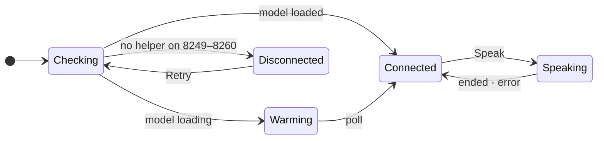

# R08: README visual craft and the beautiful-mermaid pipeline

**Axis:** R08 (readme-visual-craft) · **Date:** 2026-09-23 · **Repo:** `renchris/natural-text-to-voice-extension` @ `fe2ea58` (extension v1.4.0)
**Method:** Every version, limit and rendering behaviour below was checked in this run against a primary source: the npm registry, the GitHub API, the `github/docs` source files, the 1.1.3 tarball, or GitHub's own Markdown renderer (`POST /markdown`, which runs GitHub's real sanitizer). Where a claim rests on my own measurement, the command is in [Appendix A](#appendix-a--reproduce-every-measurement). Scratch work lives in `/tmp/ntts-r08/` (prototype diagrams, screenshots, probes). Nothing in the repo was edited except this file.

---

## Verdict

**The pipeline is already current. What's missing is content that shows and sounds right.**
- beautiful-mermaid **1.1.3 is still the latest release**. Upstream `main` has **zero library changes** since then, and it **already supports sequence and class/ER diagrams**, which our own skill wrongly says are unsupported.
- The big win is **media**. GitHub now renders a `user-attachments` MP4 **with its audio track** as an inline player, and `gh --attach` (v2.99.0+) can upload it without a browser. It is the **only** way to let a reader *hear* a TTS project inside the README.
- The current README is **factually wrong in ten places** and needs a rewrite, not a polish.

| # | Recommendation | Action | Conviction | Effort |
|---|---|---|---|---|
| 1 | **Rewrite the README around a 15–20 s hero MP4 with the real Kokoro audio**, embedded as a bare `github.com/user-attachments/assets/<uuid>` URL on its own line, captioned "press play, then unmute" | adopt-new | **88** | M |
| 2 | **Fix the 10 verified factual defects** in the current README (WebGPU claim, v0.2.0, Native Messaging, dead `phase0-validation` setup, missing LICENSE, 3 dead static badges, …) | upgrade-now | **99** | S |
| 3 | **Keep beautiful-mermaid at exactly 1.1.3.** It is latest. `main` is 12 commits ahead with 0 `src/` changes. Pie/timeline/mindmap exist only as unmerged PRs | hold | **96** | S |
| 4 | **Copy `agent-secrets/scripts/render-diagrams.mjs`** (the superset with @palette tokens and fence sync), **with 3 fixes**: drop `decodeEntities()`, strip *all* `@import`s (`/gm`), keep the post-render font swap. Run it under **bun** from a root `package.json`, plus a CI staleness guard | adopt-new | **90** | S |
| 5 | **Four diagrams**: architecture (`flowchart`) · right-click request (`sequenceDiagram`) · popup/helper states (`stateDiagram-v2`) · speed (`xychart-beta`, **single series**, generated from benchmark JSON). All four were prototyped and rendered today. Keep each ≤ **838 px** intrinsic width | adopt-new | **78–92** (per diagram, §4) | M |
| 6 | **Privacy as a claim readers can check**: a permissions-and-why table, including why Chrome will warn "read and change all your data" (the `<all_urls>` content script) | adopt-new | **90** | S |
| 7 | **Badges: ≤ 4, live data only** (Chrome Web Store version/users once listed, CI once `.github/` exists, license once `LICENSE` exists). Delete the 3 static "Phase" badges now | upgrade-now | **90** | S |
| 8 | **Recording pipeline**: <ul><li>Use Chrome for Testing / Playwright Chromium, **not** branded Chrome 153: `--load-extension` is gone in branded builds since Chrome 137.</li><li>`agent-browser record` is **10 fps VP8 with no audio** (measured), so use it only for silent UI loops.</li><li>Mux the helper's **real** `/speak` WAV into the hero video.</li><li>Use VHS for the terminal install demo.</li></ul> | adopt-new | **80** | M |
| 9 | **Upgrade `gh` 2.96.0 → ≥ 2.99.0** (latest v2.101.0) so the agent can upload the hero video headlessly via `--attach` | upgrade-now | **85** | S |
| 10 | **Fix the GitHub "About" box**: the description is stale ("Evaluating Kokoro (WebGPU) and Parler TTS…"), with 0 topics and no homepage | adopt-new | **90** | S |
| 11 | **Correct the `beautiful-mermaid-docs` skill** (out of repo). Its "flowchart/state/xychart ONLY" and "entities are NOT decoded" facts are false on 1.1.3 | upgrade-now | **97** | S |
| 12 | Do **not** vendor upstream `main` or unmerged PRs (#150/#151/#118) to get pie/timeline charts | reject | **90** | – |

**The one decision that is not mine to make** (it belongs to the operator): the license. `package.json` says MIT, but no `LICENSE` file is tracked. Rec 7's license badge and the README's license line both depend on adding one.

---

## 1 · beautiful-mermaid: current vs latest

### 1.1 Version state (fetched 2026-09-23)

| Fact | Value | Source |
|---|---|---|
| npm `latest` | **1.1.3**, published 2026-02-26T14:23Z | [S1] |
| All versions | 0.1.0–0.1.3 (Jan 28–29) · 1.0.0–1.0.2 (Feb 23) · 1.1.1–1.1.3 (Feb 26) | [S1] |
| GitHub releases | v1.1.2 is the newest *release* object. v1.1.3 exists only as a tag | [S2] |
| Repo activity | 11,136 stars · last push 2026-05-06 · not archived · MIT · 87 open issues+PRs | [S2] |
| `main` vs `v1.1.3` | **12 commits ahead; changed `src/` files: none.** All 12 are the new live web editor (`editor.ts`, `editor/css/*`, 2026-04-17 → 2026-05-06) | [S4] |
| Dependencies | `elkjs ^0.11.0`, `entities ^7.0.1`; unpacked size 2.10 MB | [S1] |
| Exports map | `bun → ./src/index.ts`, `import → ./dist/index.js`, `types → ./dist/index.d.ts` | [S1] |

**Implication:** there is nothing to upgrade to. An exact pin `"beautiful-mermaid": "1.1.3"` (both reference repos already use it) is correct.

**Open upstream work that would matter to us (all unmerged, so don't depend on it):**
- #150 "New diagram types: pie, timeline, mindmap, quadrant" (2026-09-09)
- #151 "Adds Pie chart support" (2026-09-11)
- #118 "Add timeline diagram rendering" (2026-05-23)
- #142 "fix: tolerate trailing semicolon on flowchart class assignments" (2026-08-16), which is the bug our skill documents
- #152 "fix: honor ELK edge container offsets" (2026-09-21)
- #117 "Support Mermaid frontmatter and init config"

[S6]

### 1.2 Supported diagram types: the brief's premise is wrong

The brief and the `beautiful-mermaid-docs` skill both say published 1.1.3 renders "flowchart/state/xychart only". **That is false, and it was never true.**

- **Code:** `detectDiagramType()` in `src/index.ts@v1.1.3` routes `xychart(-beta)`, `sequenceDiagram`, `classDiagram` and `erDiagram` to their own pipelines. Everything else falls through to the flowchart/state parser [S5].
- **Even 0.1.3's `dist/index.js`** already contains the `sequencediagram` / `classdiagram` / `erdiagram` routing (lines 3101–3103) [S7].
- **Render test** (node 22.21.1 on `dist/`, and bun 1.3.0 on `src/`, byte-identical output):

| Header | 1.1.3 result |
|---|---|
| `flowchart` / `graph` (TD/TB/LR/BT/RL) | ✅ renders |
| `stateDiagram-v2` (incl. composite states, `direction LR`) | ✅ renders |
| `sequenceDiagram` (participants, `actor`, `alt/else`, `+/-` activations, notes, self-messages) | ✅ renders |
| `classDiagram` | ✅ renders (emits a 2nd font `@import`, see 1.4) |
| `erDiagram` | ✅ renders (emits a 2nd font `@import`) |
| `xychart-beta` (bar/line/combined/horizontal) | ✅ renders |
| `pie` | ❌ `Invalid mermaid header: "pie title X". Expected "graph TD", "flowchart LR", "stateDiagram-v2", etc.` |
| `gantt`, `timeline`, `mindmap`, `quadrantChart`, `gitGraph`, … | ❌ by code: they fall through to `parseMermaid`, which rejects the header (only `pie` was render-tested) |

### 1.3 API history (`renderMermaidSVG` / `THEMES`)

| Version | Change | Source |
|---|---|---|
| 0.1.x | Exports were `renderMermaid` (**async**, dagre layout), `renderMermaidAscii`, `THEMES`, `DEFAULTS`, `fromShikiTheme`, `parseMermaid` | [S7] |
| **1.0.0** (2026-02-23) | **ELK.js replaces dagre** ("API unchanged, layout results differ"). New **sync `renderMermaidSVG`** + `renderMermaidSVGAsync`. `renderMermaid` / `renderMermaidSync` kept as `@deprecated` aliases. `renderMermaidASCII` added (old casing kept). New `nodeSpacing` / `layerSpacing` / `componentSpacing`. `<br>`, `<b>`, `<i>`, `<u>`, `<s>` in labels. **`decodeXML()` applied to input** | [S3][S5] |
| 1.1.0 (2026-02-26) | `xychart-beta`, `linkStyle`, CJK state names, text-embedded edge labels (`-- Yes -->`), `interactive` option (xychart tooltips) | [S3] |
| 1.1.2 | Ships pre-built JS for webpack/vite/Node | [S2] commit `0fae17b` |
| 1.1.3 | Fixes xychart NaN colours when colours are CSS variables | [S2] commit `65f4e0a` |
| since 1.1.3 | **No API change** (library unchanged) | [S4] |

**`THEMES`** holds 15 entries. `github-light` (`#ffffff`, accent `#0969da`) and `github-dark` (`#0d1117`, accent `#4493f8`) are the two our pipeline uses [S5 `theme.ts:97–151`].

**`RenderOptions`** (1.1.3):
- Colours: `bg, fg, line, accent, muted, surface, border`
- Layout and output: `font` (default `'Inter'`), `padding` (40), `nodeSpacing` (24), `layerSpacing` (40), `componentSpacing`, `transparent`, `interactive`
- Doc/type mismatch: the README table documents a `thoroughness` option, but **the type does not have it**; `layout-engine.ts:48` hard-codes `thoroughness: 3` [S5]. Don't rely on it.

### 1.4 Behaviours that change our render script

1. **Entities.** Since 1.0.0 the library calls `decodeXML(text)` itself [S5 `index.ts`, confirmed present at `v1.0.0` and absent at `04a1b4f`/`3185b9b`].
   - It decodes **XML** entities only (`&lt; &gt; &amp; &quot; &apos;`). In my test, `&lt;all_urls&gt;` rendered as `<all_urls>`.
   - **HTML named entities are still literal**: `&middot;` rendered as the text "&middot;".
   - So both reference scripts' `decodeEntities()` is now **redundant, and a double-decode**: `&amp;lt;` becomes `<` where the author meant the literal text `&lt;`.
   - The comment in both scripts ("beautiful-mermaid does NOT decode entities") is stale.
2. **Fonts.** `buildStyleBlock()` always emits `@import url('https://fonts.googleapis.com/css2?family=Inter…')`. **Class and ER diagrams emit a second `@import`** (JetBrains Mono) [S5 `theme.ts:238–270`; `class/renderer.ts:45`, `er/renderer.ts:45` pass `hasMonoFont=true`].
   - Both reference scripts strip with `/^\s*@import url\([^\n]*\);\s*$\n?/m`, which has **no `g` flag**, so only the first import is removed.
   - Measured: flowchart/state/sequence/xychart SVGs carry 1 import and class/ER carry 2.
   - Fix: use the `/gm` flags.
3. **Don't pass the GitHub font stack via `font:`.** The library writes `text { font-family: '${font}', system-ui, sans-serif; }`, so a whole stack would be quoted as **one** family name. The reference scripts' post-render `replaceAll("'Inter', system-ui, sans-serif", STACK)` is the correct approach.
   - Text width is estimated by font-agnostic character-class buckets (`text-metrics.ts`), so swapping fonts after layout is safe.
4. **Determinism.** Two consecutive renders produce byte-identical SVGs (`shasum` diff clean). **node (dist) and bun (src, via the `bun` export condition) produce byte-identical files** (`--check` passes across runtimes). That makes it safe to render with bun locally and check with node in CI, or the other way round.

### 1.5 Syntax matrix: new findings today (on top of the skill's existing matrix)

| Construct | Result on 1.1.3 | Mitigation |
|---|---|---|
| `sequenceDiagram` + `autonumber` | **silently ignored** (no numbers drawn) | Put numbers in the message text if needed |
| `actor U as You` | stick-figure label **collides with the first message** arrow | Use `participant` |
| `Note over A,B: …` | drawn narrow over one lifeline, **not spanning A..B** | Keep notes short, or use `Note right of` |
| `alt … else … end`, `+`/`-` activations, self-message `SW->>SW` | ✅ render correctly | – |
| xychart categories `["short", …]` | **quotes rendered literally** (`"short"`) | Leave category labels unquoted |
| xychart multi-series | auto legend **"Bar 1 / Bar 2"**; series **cannot be named** (parser: `series.push({type:'bar', data})`) | **Single series only** in the README |
| subgraph title wider than its widest child | title **overflows the group box** (measured with `"Your Mac · 127.0.0.1 only · no internet"`) | Keep titles shorter than the widest node label |
| `A -.-x B` cross edge | creates a **phantom node "x"**, and B is left unconnected | Labelled dotted edge `-. "never" .->` |
| stateDiagram `direction LR` | ✅ honoured (990×248 vs 353×720 for TD) | – |
| `<br/>`, `·`, `→`, `⇄`, `–` in labels | ✅ literal Unicode renders | Don't use `&middot;`-style entities |

### 1.6 Which render script to copy

The two scripts are the same pipeline. `mistral-4-fable-ocr/scripts/render-diagrams.mjs` (101 lines) is `agent-secrets/scripts/render-diagrams.mjs` (133 lines) **minus** the `PALETTE` + `applyPalette()` @token layer. Both pin `beautiful-mermaid 1.1.3` and ship the same path-filtered `diagrams.yml` CI (`npm ci` + `npm run diagrams:check`).

**Copy `agent-secrets`** (conviction 90). This README needs semantic colours (blue = in Chrome, green = on your Mac) that read correctly in both GitHub modes, and only the @palette layer gives that from one source. Apply these fixes, all verified today:

```js
// scripts/render-diagrams.mjs — deltas vs agent-secrets (prototype ran green in /tmp/ntts-r08/proto)
// 1. DELETE decodeEntities() and its call: beautiful-mermaid >=1.0.0 decodes XML entities itself.
// 2. Strip EVERY font import (class/ER emit two):
const githubReady = (svg) => svg
  .replace(/^\s*@import url\([^\n]*\);\s*$\n?/gm, '')          // was /m
  .replaceAll("'Inter', system-ui, sans-serif", GITHUB_FONTS)    // keep: never pass the stack via `font:`
// 3. Keep syncReadmeFences() (dark palette baked into the native ```mermaid fallback fence).
```

**Wiring for this repo.**
- The repo root has no `package.json`, and the extension lives in `chrome-extension/` on bun, so add a **root** `package.json` using bun (the repo's package manager per its lockfiles):

```json
{ "private": true, "type": "module",
  "scripts": { "diagrams": "bun scripts/render-diagrams.mjs", "diagrams:check": "bun scripts/render-diagrams.mjs --check" },
  "devDependencies": { "beautiful-mermaid": "1.1.3" } }
```

- CI: copy `agent-secrets/.github/workflows/diagrams.yml` and swap `setup-node`/`npm ci` for `oven-sh/setup-bun` + `bun install --frozen-lockfile`. This would be the repo's **first** workflow; there is no `.github/` today.

---

## 2 · How GitHub renders README media (measured 2026-09-23)

The method: feed each construct to `POST /markdown` (`mode=gfm`, `context=renchris/natural-text-to-voice-extension`), which runs GitHub's production sanitizer [S17]. Real assets were used where existence matters.

### 2.1 Result matrix

| Construct | What GitHub emits | Verdict |
|---|---|---|
| `<picture><source media="(prefers-color-scheme: dark)" srcset=…></picture>` | kept, wrapped in `<themed-picture data-catalyst-inline>` | ✅ the documented dark/light mechanism [S11][S12] |
| Relative committed `.png/.jpg/.svg/.webp/.avif/.apng` | kept as relative `src`, served from the repo (no camo) | ✅ |
| Relative committed `.gif` | kept **plus `data-animated-image`**, GitHub's play/pause control that honours the OS reduced-motion setting [S16] | ✅ **only GIFs get the pause control**; WebP/AVIF/APNG autoplay without it |
| `raw.githubusercontent.com/…` absolute | not proxied | ✅ |
| Other external image | rewritten to `camo.githubusercontent.com/<hmac>/<hex-url>` | Camo passed **animated WebP (200 image/webp)** and **AVIF (200 image/avif)**, even though the archived `atmos/camo` MIME list the docs link to has no AVIF [S13][S14]. 1.0 MB GIF and 1.6 MB JPEG: 200. **14.7 MB JPEG: 404 "Content length exceeded"** (atmos default 5,242,880 B; production cap sits between 1.6 and 14.7 MB) |
| Committed relative `<video src="docs/media/demo.mp4">` | **stripped** (empty `<p>`) | ❌ |
| `user-attachments` URL **alone on its own line** (bare or `<…>`) | `<details open>` + summary with filename + `<video controls muted … style="max-height:640px; min-height:200px">` | ✅ **the video embed** |
| `<video src="https://github.com/user-attachments/assets/…" autoplay loop>` | player kept; **`autoplay`/`loop` dropped, `muted` forced** | ✅ but no autoplay |
| `` | broken `` of an `.mp4` | ❌ |
| user-attachments URL inside a sentence | plain link | ❌ |
| `<audio controls src=…>` | **stripped** | ❌ |
| Committed `.mp3` in the file viewer | no player, only "View raw" (screenshot, remsky/Kokoro-FastAPI). Raw is served `Content-Disposition: attachment` → the browser **downloads** it | ❌ a "listen" link to a repo file downloads instead of playing |
| ` ```mermaid ` inside `<details>` | `viewscreen.githubusercontent.com/markdown/mermaid` iframe (interactive) | ✅ the interactive fallback works |
| `> [!NOTE]`, `<kbd>`, `<sup>`, `align="center"`, `width=` | kept | ✅ |
| External video hosts | "GitHub does not support externally hosted videos" | ❌ [S13] |

**Consequence for a TTS README.** The **only** way to make a reader *hear* the product without leaving the README is an MP4 with an audio track uploaded as a user attachment.
- It renders **muted with controls** (GitHub forces `muted`) and never autoplays. So the caption must say *"press play, then unmute"*.
- The rendered tag has **no `poster` attribute**, so the **first frame is the thumbnail**. Open on a designed title card, not a blank page.
- Precedent: **kokoro-onnx** (2,739★) does exactly this. Its line 18 is `<https://github.com/user-attachments/assets/00ca06e8-…>`, which is `podcast.mp4`, 1,985,122 B, served as `video/mp4` [S18].

### 2.2 Size and format limits

| Limit | Value | Source |
|---|---|---|
| Uploaded images and GIFs | 10 MB | [S8] |
| Uploaded videos | 10 MB (free plan) · **100 MB (paid plan)**. The owner `renchris` is on **Pro** (`gh api user → plan: pro`) | [S8] |
| Other uploads | 25 MB | [S8] |
| Video types | `.mp4`, `.mov`, `.webm`; "we recommend using H.264 for greatest compatibility" | [S8] |
| Audio uploads | `.mp3`, `.wav` accepted in issue/PR/discussion comments (listed under "Additional file types", not as inline media) | [S8] |
| Committed files | Git warns at **50 MiB**, GitHub blocks at **100 MiB**, browser upload **25 MiB** | [S15] |
| Uploads are public | "For public repositories, uploaded files can be accessed without authentication" | [S8] |
| Headless upload | `gh issue/pr create/edit/comment --attach <file>` since **gh v2.99.0 (2026-09-01)**; needs push access; `` alone in its paragraph is rewritten to the uploaded URL. **Local gh is 2.96.0 (no `--attach`)**; latest is v2.101.0 (2026-09-15) | [S9][S10] |
| README column width | **838 px** at viewports 1280 / 1440 / 1920; **582 px** at 1024 (measured with agent-browser on this repo's page, `article.markdown-body`) | measured |

**Design rule derived from the width:** give diagrams an intrinsic width **≤ 838 px** so they render 1:1. A 1,312 px diagram (my first architecture draft) scales to 0.64×, which puts 13 px labels at about 8 px.

---

## 3 · Best-in-class READMEs: 13 studied, patterns extracted

All fetched via `gh api repos/<r>/readme` on 2026-09-23 [S26].

| Repo | ★ | Lines | Badges | Hero media (first screen) | Install starts at line | Privacy statement | Diagram |
|---|---|---|---|---|---|---|---|
| ollama/ollama | 181,526 | 356 | **0** | logo only | **10** (one command per OS) | – | – |
| open-webui/open-webui | 152,930 | 263 | 9 | `demo.png` (288 KB) | 107 | offline mode section | – |
| excalidraw/excalidraw | 132,732 | 124 | 6 | `<picture>` dark/light cover | 82 | "works offline" | – |
| ggml-org/llama.cpp | 129,329 | 126 | 6 | SVG cover + **2 user-attachments screenshots in a table** | **19** | – | – |
| zed-industries/zed | 90,776 | 48 | 2 | none | **9** | – | – |
| darkreader/darkreader | 22,392 | 225 | 5 | mascot + store buttons | build-only | – | – |
| hexgrad/kokoro | 8,964 | 129 | 0 | none. "[Listen to samples]" → HF `SAMPLES.md` | **6** | – | – |
| n4ze3m/page-assist *(extension + local AI)* | 8,227 | 231 | 2 | store buttons + YouTube thumbnail | **19** | **"All the data is stored locally… You can view the source code and verify it yourself."** + PRIVACY.md | – |
| Blaizzy/mlx-audio | 7,936 | 737 | 5 | none (table of contents first) | 39 | – | – |
| raycast/extensions | 7,766 | 31 | 2 | `header.webp` (104 KB) | 18 | – | – |
| remsky/Kokoro-FastAPI | 5,475 | 917 | 15 | `banner.png` | 44 | – | **2 time-to-first-token perf charts** |
| thewh1teagle/kokoro-onnx | 2,739 | 82 | 9 | **user-attachments MP4 with voice audio** | ~22 | – | – |
| ken107/read-aloud *(TTS extension)* | 1,749 | 133 | 13 (badgen) | 2 demo GIFs (143 KB, 66 KB) | 67 | – | – |

**Patterns, with how each applies here:**

1. **Show the one job on the first screen.** llama.cpp, Open WebUI, Raycast and Excalidraw each put the product itself above the fold. For a TTS product, "the product itself" is a *sound*. kokoro-onnx is the only one that delivers it inline (a user-attachments MP4), and kokoro links out to samples. → Rec 1.
2. **A value sentence of ≤ 20 words directly under the name.** Examples: Ollama "Start building with open models." (5 words); Read Aloud "A **Text to Speech Voice Reader** extension for your browser!"; Page Assist names both the surface (sidebar/web UI) and the dependency ("your local AI model") in one sentence. → The candidate sentence in §5.
3. **Install within the first screen.** Ollama 10, kokoro 6, Zed 9, llama.cpp 19, Page Assist 19. The anti-patterns are Open WebUI (107) and mlx-audio (a table of contents before anything else). Our install has **two** parts (helper + extension), so it has to be two numbered steps, not a wall of text.
4. **Extensions lead with store buttons and keep "build from source" second.** Read Aloud, Page Assist and Dark Reader all do this. Until the listing exists, "Load unpacked" goes first, with the store link added at listing time (Chrome Web Store axis).
5. **Privacy as a claim readers can check, not an adjective.** Page Assist is the only peer that does it well: where the data lives, plus an invitation to verify, plus PRIVACY.md. Our case is stronger because it is *structural* (`host_permissions: ["http://127.0.0.1/*"]`), and a permissions table makes that visible. → Rec 6.
6. **None of the 13 embeds an architecture diagram** (0 mermaid fences; the only chart-like media anywhere is Kokoro-FastAPI's two time-to-first-token timelines). Our privacy argument *is* the architecture: two processes, one loopback hop. A diagram is therefore a differentiator here, not decoration. The TTS peer also picked **time-to-first-audio** as its perf metric, which informs §4.4.
7. **Badge discipline tracks stars.** The five most-starred repos carry 0, 9, 6, 6 and 2 badges. The 13- and 15-badge READMEs are among the smallest projects. Every badge worth keeping is **live data** (version, users, rating, CI); none are static status claims.
8. **Short READMEs that point to deeper docs beat long ones.** Zed (48 lines), Raycast (31), Excalidraw (124) and llama.cpp (126) point to docs. The 700–900-line READMEs bury the install. The current README spends about 40% of its length on the abandoned TTS.cpp/Parler Phase 0 (lines 60–187). That history belongs in `docs/history.md`.
9. **Dark/light parity.** Excalidraw's cover and Open WebUI's star-history both use `<picture>`. Our diagrams get it free from the pipeline. **The extension UI has no dark mode** (no `prefers-color-scheme` in `popup.css`, `options.css`, `variables.css`), so UI screenshots stay single-variant. Frame them on a neutral canvas (rounded corners and a soft shadow via ImageMagick) so a white popup doesn't glare on GitHub dark.

**Live badge check:** shields.io and badgen Chrome Web Store badges both still resolve. Read Aloud's ID returns `chrome web store: v2.24.0`, `users: 6M`, `rating: 4.1/5` [S25]. They need a store ID, so none can exist before the listing.

---

## 4 · The diagrams this README needs

All four were **prototyped, rendered with the fixed script, and screenshotted on GitHub's real `#0d1117` / `#ffffff` backgrounds** (`/tmp/ntts-r08/proto/`). Sizes are intrinsic SVG sizes after the final iteration. Semantic colours: **blue = inside Chrome**, **green = on your Mac**, both through @palette tokens.

| # | Diagram | beautiful-mermaid type | Size | Place in README | Conviction |
|---|---|---|---|---|---|
| D1 | **Architecture**: 4 extension parts → loopback → helper → Python → Kokoro on Metal | `flowchart LR` with `direction TB` subgraphs | 783×836, 10.6 KB | "How it works" (first diagram) | **92** |
| D2 | **Right-click → audio** request path, incl. the PDF branch | `sequenceDiagram` | 867×657, 11.7 KB | "How it works", under D1 | **88** |
| D3 | **What the status pill means**: Checking / Warming / Connected / Disconnected / Speaking | `stateDiagram-v2` with `direction LR` | 990×248, 9.8 KB | "Troubleshooting" | **80** |
| D4 | **Speed**: × faster than real time (or seconds to first audio) by text length | `xychart-beta`, **single series** | 750×464, 38.6 KB | "Performance" | **78** |

**Considered and rejected:**
- `classDiagram`: no reader question it answers.
- `erDiagram`: there is no data model.
- `pie`: unsupported.
- Project-history `timeline`: unsupported, and the history leaves the README anyway.
- A separate "port discovery 8249–8260" flowchart: it belongs in `native-helper/README.md`.

**Accuracy corrections found while prototyping.** Both fixes are in the sources below.
- The **popup does not go through the service worker**. It asks the content script for the selection (`popup.ts:498`), calls the helper itself (`client.speak`, `popup.ts:416`) and plays audio in the popup (`new Audio`, `popup.ts:537`). The **context-menu path** goes service worker → offscreen → helper instead (`service-worker.ts:146`, `offscreen.ts:92`).
- **PDFs skip the content script**: the service worker uses `info.selectionText` plus `cleanupPDFLigatures` (`service-worker.ts:100–125`).
- **There is no keyboard shortcut** (no `commands` in `manifest.json`).

### D1 · `assets/diagrams/architecture.mmd`

```mermaid
flowchart LR
    subgraph chrome["Chrome extension · MV3"]
        direction TB
        CS["Content script<br/>reads your selection"]
        SW["Service worker<br/>right-click menu"]
        OFF["Offscreen document<br/>plays the audio"]
        POP["Popup<br/>voice · speed · Speak"]
        CS -->|"selection"| SW
        CS -->|"selection"| POP
        SW --> OFF
    end
    subgraph mac["Your Mac · offline"]
        direction TB
        HTTP["Native helper<br/>SwiftNIO · 127.0.0.1:8249"]
        PY["Python worker<br/>tts_worker.py"]
        KOK["Kokoro-82M<br/>mlx-audio · Metal GPU"]
        HTTP --> PY --> KOK
    end
    OFF -->|"POST /speak → WAV"| HTTP
    POP -->|"/health · /voices · /speak"| HTTP
    classDef ext fill:@blue-bg,stroke:@blue-fg,color:@text
    classDef local fill:@green-bg,stroke:@green-fg,color:@text
    class CS,SW,OFF,POP ext
    class HTTP,PY,KOK local
```

Iteration record: v1 LR was 1,245 px with a return edge wrapping over the top; v2 used a `-.-x` "Internet" edge and got a phantom "x" node; v3 fit at 1,205 px but staircased; v4 at 912 px had its title overflow. The final version (v6) is 783 px, has no crossings, and is correct to the code.
- Pin `beautiful-mermaid` and treat the numbers as layout-version-specific: ELK layout differs across versions ("layout results differ", 1.0.0 notes).
- The @tokens (`@blue-bg` etc.) come from the agent-secrets PALETTE, reduced to the `text/green/blue` subset.

### D2 · `assets/diagrams/speak-sequence.mmd`

```mermaid
sequenceDiagram
    participant U as You
    participant SW as Service worker
    participant CS as Content script
    participant OFF as Offscreen
    participant H as Helper :8249
    participant K as Kokoro
    U->>SW: right-click → Read aloud
    alt web page
        SW->>CS: GET_SELECTED_TEXT
        CS-->>SW: selected text
    else PDF viewer
        SW->>SW: selectionText + ligature fix
    end
    SW->>OFF: SPEAK_IN_OFFSCREEN
    OFF->>+H: POST /speak {text, voice, speed}
    H->>+K: generate()
    K-->>-H: samples
    H-->>-OFF: audio/wav 24 kHz
    OFF->>U: plays audio
    OFF-->>SW: SPEAK_COMPLETE
    Note over OFF,K: 127.0.0.1 only
```

- `participant`, not `actor`: `actor` collides with the first message.
- No `autonumber`: it is ignored.
- The helper's origin gate (`HTTPServer.swift:88–93` rejects non-`chrome-extension://` origins on `/speak` and `/voices`) belongs in the privacy table rather than in this diagram's labels.

### D3 · `assets/diagrams/helper-states.mmd`



- Grounded in `popup.ts:175–188`: `status==='ok' && model_loaded` → connected, else warming; on fetch failure → disconnected.
- Also grounded in `updateStatusIndicator('connected'|'disconnected'|'checking'|'warming')` (`popup.ts:206`), the warm-up poll timer (`popup.ts:121`) and the 12-port discovery (`config.ts DISCOVERY_PORTS`).
- At 990 px it renders at 0.85×. That's acceptable for a 248 px-tall strip. If the Speaking state is dropped it fits 1:1.
- Conviction is only 80 because this is the diagram most likely to drift: it encodes UI states that the upgrade program may change.

### D4 · `assets/diagrams/perf.mmd`: generate it, don't hand-type it

```mermaid
xychart-beta
    title "Kokoro-82M on M1 Max: times faster than real time (warm)"
    x-axis ["Hello world" (1.6 s audio), 50 words (21.7 s audio)]
    y-axis "× real time" 0 --> 30
    bar [8.3, 25]
```

- The numbers are the **Nov 2025, pre-upgrade** figures from `native-helper/TEST_RESULTS_OPTIMIZED.md:55–100` (warm 0.18 s for 1.57 s of audio; 0.85 s for 21.7 s). They go stale the moment the model/library axes land.
- **Recommendation:** a `scripts/bench.ts` writes `bench/results.json` (≥ 4 text lengths: sentence, paragraph, page, 1,000 words; median of 10 warm runs; cold run reported separately). `render-diagrams` then emits `perf.mmd` from that JSON, so the chart is an output of a measurement.
- **Single series only.** Series can't be named, so two series would show a meaningless "Bar 1 / Bar 2" legend.
- **Which metric:** Kokoro-FastAPI charts **time to first audio**. Our helper returns the whole WAV (no streaming), so time-to-first-audio equals generation time today. Chart seconds until audio starts: that's the number a reader feels. Keep "× real time" as the headline number in prose.

---

## 5 · README skeleton (Minto: pass the 30-second test)

The first screen has to carry the introduction, the main point and the key line (`pyramid-principle-full` non-negotiable, Ch 3 p. 29). Everything below it is support, ordered by reader intent: install, then trust, then understanding.

```text
[icon 96px]  Natural Text-to-Speech
Select text in Chrome and hear it in a natural voice, generated on your Mac's GPU and never sent to a server.
[Chrome Web Store: version] [users] [CI] [license]        ← ≤4, all live; add each only once its source exists

https://github.com/user-attachments/assets/<uuid>           ← hero MP4, alone on its line (renders as a player)
<sub>▶ Press play, then unmute. Every word is Kokoro-82M running locally on an M1 Max; the audio is not re-recorded.</sub>

- Natural: Kokoro-82M, <N> voices                           ← voice count comes from the model axis (R01–R03), not from me
- Private: the extension can only reach 127.0.0.1 (see Privacy)
- Fast: <X>× faster than real time on Apple Silicon (see Performance)

## Install (2 steps)          1) helper  2) extension (store link, or Load unpacked)
## How it works               D1 architecture · D2 right-click sequence (both <picture> + "Interactive Diagram" <details>)
## Privacy: verify it yourself  permissions table (below) · link PRIVACY.md · origin gate · no telemetry
## Performance                D4 (generated) + the command that reproduces it
## Troubleshooting            D3 (what the status pill means) + port 8249–8260 note
## Development                build/test commands, link chrome-extension/ and native-helper/ READMEs
## License                    (needs a tracked LICENSE file)
```

**Privacy table (content verified against `public/manifest.json`):**

| Manifest entry | Why it's there | What Chrome shows |
|---|---|---|
| `host_permissions: http://127.0.0.1/*` | the **only** network destination: your own helper | local host access |
| `content_scripts.matches: <all_urls>` | to read *your selection* when you ask | ⚠ the broad "read and change all your data on all websites" warning. Chromium computes host warnings over `effective_hosts = explicit ∪ scriptable (content-script) hosts` (`permission_set.cc:289–307`) [S22]. **Say so in the README before the reader sees the warning** |
| `activeTab` | the popup reads the current tab's selection | no warning (Chrome docs) [S23] |
| `contextMenus`, `offscreen`, `storage` | the right-click item, audio playback, remembering voice/speed | – |

**Cross-axis flag (not R08's call):** replacing the `<all_urls>` content script with `activeTab` + on-demand `chrome.scripting.executeScript` would remove the broad warning. That belongs to the code/Chrome Web Store axes. The README should describe whichever design ships.

**10 verified defects in the current README (Rec 2):**
1. Tagline says "using **WebGPU** and Metal acceleration". There are **0** WebGPU references in `chrome-extension/src`.
2. Three static shields badges ("Phase 1 Complete", "RTF", "Next Phase 2"), two of them linking to `()`.
3. "Phase 2 In Progress" and "Current Version: v0.2.0", but `manifest.json`/`package.json` say **1.4.0**.
4. "Swift HTTP Server on localhost:**random-port**" and "Length-prefixed JSON (**Native Messaging** protocol)". The code uses **127.0.0.1:8249** with fallback 8249–8260 (`App.swift:23`), over **HTTP**. Length-prefixed JSON is the Swift↔Python pipe (`PythonWorker.swift:208`), not Native Messaging.
5. Setup steps `git clone --recurse-submodules …/YOUR_USERNAME/…` then `cd phase0-validation`. That directory was removed (the README says so itself at line 186), and `YOUR_USERNAME` is a placeholder.
6. "MIT License (see LICENSE)": **no LICENSE file is tracked** (`git ls-files` has none).
7. Repo tree says `chrome-extension/ # Phase 2: Coming soon (TBD)`, but it has **17** tracked source files.
8. Phase 2 checklist still lists "Native Messaging client/handshake" as unbuilt planned work.
9. About 40% of the length is the abandoned TTS.cpp/Parler Phase 0, including "Performance Targets (Untested)" for the dead pipeline.
10. GitHub **About box**: description "Local TTS Chrome Extension: Evaluating Kokoro (WebGPU) and Parler TTS (native Metal)…", **0 topics**, no homepage (`gh api repos/renchris/natural-text-to-voice-extension`).

---

## 6 · Visual evidence pipeline (hero video, loops, screenshots)

| Asset | Tool | Format and target | Why |
|---|---|---|---|
| **Hero** (15–20 s): select a paragraph on a real article → right-click → *Read aloud* → voice plays | Visual: a 30 fps screen capture of **Chrome for Testing / Playwright Chromium** with `--load-extension=chrome-extension/dist`. Audio: the helper's real `/speak` WAV for the exact on-screen text, muxed in | **MP4, H.264 High + yuv420p + AAC 128k + `+faststart`**, 1280×800, **≤ 8 MB** (loads fast, and under the 10 MB free-plan cap if a fork re-uploads) | H.264 is what GitHub recommends [S8]. The first frame is the poster (no `poster` attribute is emitted) → open on a 0.5 s title card |
| Upload | `gh issue comment <n> --body-file body.md --attach hero.mp4` (gh ≥ 2.99) | a `user-attachments` URL | headless, no browser [S9][S10]. The asset is public, so post it on a dedicated "README media" issue |
| Silent UI loops (status pill Checking→Connected, voice switch) | `agent-browser --extension … record start` | WebM → **GIF** via ffmpeg `palettegen`/`paletteuse`, ≤ 2 MB each | **agent-browser records 10 fps VP8 with no audio stream** (measured: 44 frames / 4.4 s, 1 video stream). Fine for UI loops, too choppy for the hero. GIF is the only animated format that gets GitHub's pause control → WCAG 2.2.2 (> 5 s auto-motion needs pause) [S16][S24] |
| Screenshots (popup, options, context menu) | agent-browser `screenshot` | PNG **1280×800**, framed on a neutral canvas | the same files double as Chrome Web Store screenshots (1280×800 or 640×400) [S20] |
| Helper install (terminal) | **VHS** `.tape` (local 0.11.0; latest v0.12.0, 2026-09-09) | GIF/MP4, re-recordable from a script | deterministic and diff-able [S27] |

**Browser choice is load-bearing.** Branded Chrome removed `--load-extension` in **Chrome 137** and later (this machine runs Chrome 153). The flag still works in **Chromium and Chrome for Testing** [S21]. Playwright Chromium builds are present under `~/Library/Caches/ms-playwright` (`chromium-1189…1200`).

**Keep the evidence honest.** The audio must be the bytes `/speak` returned for the text on screen: no voice-over, no music, no re-take splicing. Put a one-line provenance note in the caption ("M1 Max, voice `<id>`, speed 1.0, helper `<sha>`").

Mux sketch (paths illustrative):

```bash
curl -s -X POST http://127.0.0.1:8249/speak -H 'Content-Type: application/json' \
  -d '{"text":"<exact on-screen text>","voice":"af_bella","speed":1.0}' -o speech.wav   # no Origin header → allowed (HTTPServer.swift:84-93)
ffmpeg -i screen.mov -itsoffset <t_play_s> -i speech.wav -map 0:v -map 1:a \
  -c:v libx264 -profile:v high -pix_fmt yuv420p -crf 20 -preset slow -r 30 \
  -c:a aac -b:a 128k -movflags +faststart -shortest hero.mp4
ffprobe -v error -show_entries stream=codec_name,codec_type,width,height -of compact hero.mp4   # verify v:h264 + a:aac
```

- Local tooling (verified): ffmpeg 9.0.1 with `libx264` and `aac`, ImageMagick 7.1.2-18, asciinema 3.2.0, vhs 0.11.0.
- A 30 fps macOS screen capture (`ffmpeg -f avfoundation`) needs the terminal to hold the Screen Recording permission. That's a one-time GUI grant only the operator can give.

---

## 7 · Breaking changes and migration steps

1. **Skill correction (out of repo; Rec 11).** In `~/.claude/skills/beautiful-mermaid-docs/SKILL.md`:
   - Replace the "flowchart/state/xychart ONLY" bullet with the §1.2 table.
   - Replace "HTML entities are NOT decoded" with the §1.4 point 1 nuance: XML entities are decoded, HTML named entities are not, and `decodeEntities()` is now a double-decode.
   - Replace "Do NOT feed sequence/class/ER…" with the class/ER second-`@import` caveat.
   - Add the §1.5 rows.
2. **Pipeline adoption** (commit 1): root `package.json` + `bun.lock`, `scripts/render-diagrams.mjs` (agent-secrets plus the 3 fixes), `assets/diagrams/*.mmd` (§4 sources), rendered SVGs, `.github/workflows/diagrams.yml` (bun). Verify with `bun run diagrams:check`, two renders with a clean `git diff`, and a headless screenshot of each variant on `#0d1117` / `#ffffff`.
3. **README rewrite** (commit 2): the §5 skeleton. Move Phase 0 history to `docs/history.md`, then fix the 10 defects. Verify with `gh api markdown -f mode=gfm -f context=renchris/natural-text-to-voice-extension -F text=@README.md`: every `<picture>` must survive as `<themed-picture>`, and the hero line must render as `<video`.
4. **Media** (commit 3): recorded assets under `docs/media/`. The hero goes to user-attachments, not the repo.
5. **Perf chart generation** runs after the model/library axes land (it depends on them).

---

## Appendix A: reproduce every measurement

```bash
# beautiful-mermaid state
curl -s https://registry.npmjs.org/beautiful-mermaid | jq '."dist-tags", .time'
gh api repos/lukilabs/beautiful-mermaid/compare/v1.1.3...main --jq '.ahead_by, [.files[].filename|select(startswith("src/"))]'
# type support + entity + @import counts (scratch dir with beautiful-mermaid@1.1.3)
node /tmp/ntts-r08/render/probe.mjs && bun /tmp/ntts-r08/render/probe.mjs
# determinism across runtimes
cd /tmp/ntts-r08/proto && node scripts/render-diagrams.mjs && bun scripts/render-diagrams.mjs --check
# GitHub sanitizer (real renderer)
gh api markdown -f mode=gfm -f context=renchris/natural-text-to-voice-extension -F text=@/tmp/ntts-r08/md-probe.md
gh api markdown -f mode=gfm -f context=renchris/natural-text-to-voice-extension -F text=@/tmp/ntts-r08/vid-probe.md
# README column width
agent-browser set viewport 1440 900 && agent-browser open https://github.com/renchris/natural-text-to-voice-extension \
  && agent-browser eval "document.querySelector('article.markdown-body').getBoundingClientRect().width"
# agent-browser recording has no audio
ffprobe -v error -count_frames -show_entries stream=codec_type,codec_name,nb_read_frames:format=duration /tmp/ntts-r08/probe.webm
```

## Sources

- [S1] npm registry, beautiful-mermaid: https://registry.npmjs.org/beautiful-mermaid · tarballs https://registry.npmjs.org/beautiful-mermaid/-/beautiful-mermaid-1.1.3.tgz
- [S2] GitHub repo + commits: https://github.com/lukilabs/beautiful-mermaid · https://github.com/lukilabs/beautiful-mermaid/commits/main
- [S3] Release notes: https://github.com/lukilabs/beautiful-mermaid/releases/tag/v1.0.0 · https://github.com/lukilabs/beautiful-mermaid/releases/tag/v1.1.0
- [S4] Compare: https://github.com/lukilabs/beautiful-mermaid/compare/v1.1.3...main
- [S5] Source @v1.1.3: https://github.com/lukilabs/beautiful-mermaid/blob/v1.1.3/src/index.ts · …/src/theme.ts · …/src/types.ts · …/src/layout-engine.ts · …/src/xychart/parser.ts · …/src/sequence/parser.ts
- [S6] Open PRs: https://github.com/lukilabs/beautiful-mermaid/pull/150 · /pull/151 · /pull/118 · /pull/142 · /pull/152 · /pull/117
- [S7] 0.1.3 tarball: https://registry.npmjs.org/beautiful-mermaid/-/beautiful-mermaid-0.1.3.tgz · https://github.com/lukilabs/beautiful-mermaid/blob/v1.0.0/src/index.ts
- [S8] GitHub Docs, Attaching files (source last changed 2026-09-01): https://docs.github.com/en/get-started/writing-on-github/working-with-advanced-formatting/attaching-files
- [S9] GitHub Docs, Attaching files with GitHub CLI: https://docs.github.com/en/github-cli/github-cli/attaching-files-with-github-cli
- [S10] gh releases: https://github.com/cli/cli/releases/tag/v2.99.0 · https://github.com/cli/cli/releases/tag/v2.101.0
- [S11] GitHub Docs, Basic writing and formatting syntax ("The Picture element"): https://docs.github.com/en/get-started/writing-on-github/getting-started-with-writing-and-formatting-on-github/basic-writing-and-formatting-syntax#images
- [S12] GitHub Docs, Quickstart for writing on GitHub (`prefers-color-scheme` example): https://docs.github.com/en/get-started/writing-on-github/getting-started-with-writing-and-formatting-on-github/quickstart-for-writing-on-github
- [S13] GitHub Docs, About anonymized URLs: https://docs.github.com/en/authentication/keeping-your-account-and-data-secure/about-anonymized-urls
- [S14] atmos/camo (archived) MIME list + length limit: https://github.com/atmos/camo/blob/master/mime-types.json · https://github.com/atmos/camo/blob/master/server.coffee
- [S15] GitHub Docs, About large files + variables: https://docs.github.com/en/repositories/working-with-files/managing-large-files/about-large-files-on-github · https://github.com/github/docs/blob/main/data/variables/large_files.yml
- [S16] GitHub Changelog 2022-05-19, animated images: https://github.blog/changelog/2022-05-19-option-to-prevent-animated-images-from-playing-automatically/
- [S17] GitHub REST, Render a Markdown document: https://docs.github.com/en/rest/markdown/markdown
- [S18] kokoro-onnx README: https://github.com/thewh1teagle/kokoro-onnx · asset https://github.com/user-attachments/assets/00ca06e8-bbbd-4e08-bfb7-23c0acb10ef9
- [S19] Committed-mp3 viewer: https://github.com/remsky/Kokoro-FastAPI/blob/master/examples/voice_samples/speech_af_bella.mp3 · raw headers https://raw.githubusercontent.com/remsky/Kokoro-FastAPI/master/examples/voice_samples/speech_af_bella.mp3
- [S20] Chrome Web Store, Supplying images: https://developer.chrome.com/docs/webstore/images
- [S21] `--load-extension` removal: https://developer.chrome.com/blog/extension-news-june-2025 · PSA https://groups.google.com/a/chromium.org/g/chromium-extensions/c/1-g8EFx2BBY/m/S0ET5wPjCAAJ
- [S22] Chromium `permission_set.cc` (effective hosts): https://github.com/chromium/chromium/blob/main/extensions/common/permissions/permission_set.cc
- [S23] Chrome permission warnings: https://developer.chrome.com/docs/extensions/develop/concepts/permission-warnings
- [S24] WCAG 2.2 SC 2.2.2: https://www.w3.org/WAI/WCAG22/Understanding/pause-stop-hide.html
- [S25] Live CWS badges: https://img.shields.io/chrome-web-store/v/hdhinadidafjejdhmfkjgnolgimiaplp · https://badgen.net/chrome-web-store/users/hdhinadidafjejdhmfkjgnolgimiaplp
- [S26] Peer READMEs: https://github.com/ollama/ollama · https://github.com/open-webui/open-webui · https://github.com/excalidraw/excalidraw · https://github.com/ggml-org/llama.cpp · https://github.com/zed-industries/zed · https://github.com/darkreader/darkreader · https://github.com/hexgrad/kokoro · https://github.com/n4ze3m/page-assist · https://github.com/Blaizzy/mlx-audio · https://github.com/raycast/extensions · https://github.com/remsky/Kokoro-FastAPI · https://github.com/thewh1teagle/kokoro-onnx · https://github.com/ken107/read-aloud
- [S27] VHS: https://github.com/charmbracelet/vhs/releases/tag/v0.12.0
- Local sources (this repo @ `fe2ea58`): `chrome-extension/public/manifest.json`, `chrome-extension/src/popup/popup.ts`, `…/background/service-worker.ts`, `…/offscreen/offscreen.ts`, `…/shared/config.ts`, `native-helper/Sources/NaturalTTSHelper/{HTTPServer,App,PythonWorker,Config}.swift`, `native-helper/TEST_RESULTS_OPTIMIZED.md`; reference scripts `/Users/chrisren/Development/{agent-secrets,mistral-4-fable-ocr}/scripts/render-diagrams.mjs`

---

## Adversarial verification (2026-09-23)

**Verifier:** independent adversarial pass on R08. **Method:** I re-derived each claim from the most primary source I could reach: the npm registry, the GitHub API, the 1.1.3 and 0.1.3 tarballs, Chromium source on googlesource, the `github/docs` source files, GitHub's `POST /markdown` renderer, and fresh measurements. I did not reuse the author's scratch files. Scratch work is in `/tmp/ntts-verifier-r08/`. Nothing else in the repo was touched.

**Bottom line:** all 12 load-bearing claims hold, and several hold more strongly than stated. The weak points are in the recommendations, not the facts:
- the privacy table justifies a permission the code never uses;
- two prototype diagrams contain defects the report itself catalogued;
- the recording plan cannot capture the native Chrome UI that the hero shot depends on;
- "screenshots double as store screenshots" conflicts with the Chrome Web Store's full-bleed rule.

### Verdict table

| # | Claim | Verdict | Primary evidence (fetched or run today) |
|---|---|---|---|
| 1 | beautiful-mermaid npm latest is 1.1.3 (2026-02-26); `main` is 12 ahead with 0 `src/` changes | **confirmed** | `registry.npmjs.org/beautiful-mermaid`: `latest=1.1.3`, `time["1.1.3"]=2026-02-26T14:23:06Z`. `gh api …/compare/v1.1.3...main`: `ahead_by=12, behind_by=0`, no `src/` path. The diff also touches root `index.ts`, `dev.ts`, `package.json` (scripts `editor`/`build:site` only) and `.gitignore`. That is site/editor build plumbing, not the library, so "only the live editor" holds in substance |
| 2 | 1.1.3 renders sequence, class and ER; 0.1.3 dist already routed them; `pie` throws | **confirmed** | `src/index.ts:54-64` in the 1.1.3 tarball. 0.1.3 `dist/index.js:3101-3103`. My own probe under node 22.21.1 and bun 1.3.0 produced byte-identical sizes. `pie`, `gantt`, `timeline` and `mindmap` all throw `Invalid mermaid header` (the author only render-tested `pie`) |
| 3 | Since 1.0.0 `renderMermaidSVG` calls `decodeXML()`; `&middot;` stays literal; reference `decodeEntities()` double-decodes | **confirmed** | `decodeXML` is present at `v1.0.0` (`src/index.ts:29,113`) and absent at `v0.1.3`. The `entities` dependency first appears in 1.0.0. Probe: `&lt;all_urls&gt; &amp;middot; x`. Numeric entities decode too (`&#x2192;` → `→`). Double-decode shown empirically: `&amp;lt;tag&amp;gt;` displays as `&lt;tag&gt;` with the library alone, and as `<tag>` with `decodeEntities()` first. For ordinary `&lt;…&gt;` both paths give identical output, so the fix is hygiene rather than a live bug |
| 4 | Class and ER emit two `@import`s; the reference regex (no `g`) strips one | **confirmed** | `theme.ts` `buildStyleBlock(font, hasMonoFont)`. `class/renderer.ts:45` and `er/renderer.ts:45` pass `true`; the other four pass `false`. Probe: class/ER have 2 imports → 1 left after `/m` → 0 after `/gm`. Both reference scripts use `.replace(/…/m, '')` (`agent-secrets:73`, `mistral-4-fable-ocr:34`) |
| 5 | A bare `user-attachments` line becomes `<video controls muted>`; `autoplay`/`loop` are stripped; relative `<video>`/`<audio>` are stripped | **confirmed** | `gh api markdown` with `context=renchris/natural-text-to-voice-extension`. Bare and `<…>` lines both give `<details open>` + `<video … controls muted … style="max-height:640px; min-height: 200px">`. `<video autoplay loop>` keeps only `controls muted`. Relative `<video>`, relative `<audio>` and `user-attachments` `<audio>` are all stripped. The kokoro-onnx asset is `podcast.mp4`, 1,985,122 B, **h264 + aac** (ffprobe) |
| 6 | Only `.gif` gets `data-animated-image`; camo passes animated WebP and AVIF; 14.7 MB fails with "Content length exceeded" | **confirmed** | Renderer: relative `.gif` and camo'd `.gif` get the attribute; `.webp`/`.png`/`.apng`/`.avif` do not. Camo: WebP 200 `image/webp`, AVIF (jsDelivr) 200 `image/avif`, 1.0 MB GIF 200, 14,679,474 B JPEG → 404 `Content length exceeded`, 18.5 MB → same. The 2022 changelog says "animated images, like GIFs", so the GIF-only behaviour is a renderer fact, not a documented one |
| 7 | Upload limits: 10 MB images; video 10 MB free / 100 MB paid (owner on Pro); H.264 recommended; 50/100 MiB committed | **confirmed** | `github/docs` `attaching-files.md:40-44,61-64` (last commit 2026-09-01, "Document attaching files with GitHub CLI"). `data/variables/large_files.yml`: `warning_size 50 MiB`, `max_github_size 100 MiB`, `max_github_browser_size 25 MiB`. `gh api user` → `plan: pro` |
| 8 | `gh --attach` shipped in v2.99.0 (2026-09-01); local gh is 2.96.0 | **confirmed** | `gh api repos/cli/cli/releases`: v2.99.0 published 2026-09-01T20:25Z, and its body opens with "Attach images and videos to issues and pull requests". v2.98.0 has no mention. The docs page requires push access and lists 6 commands. Local `gh version 2.96.0`, whose `gh issue comment --help` has 0 `--attach`. Homebrew stable is 2.101.0 |
| 9 | README column is 838 px at 1280/1440/1920 and 582 px at 1024 | **confirmed** (logged-out view) | Re-measured with agent-browser: 1024 → 582, 1280 → 838, 1440 → 838, 1920 → 838, 1012 → 570 (`article.markdown-body`, padding 0) |
| 10 | agent-browser `record` produces 10 fps VP8 with no audio | **confirmed** | Fresh recording, ffprobe: one stream, `vp8`, `r_frame_rate=10/1`, 47 frames / 4.7 s, no audio stream. **New:** the default frame is **1280×634**, not 1280×800 |
| 11 | Branded Chrome 137+ removed `--load-extension`; Chromium and CfT keep it | **confirmed** (source only; my live launch test was permission-denied) | Chromium `chrome/browser/extensions/extension_service.cc`: `#if BUILDFLAG(GOOGLE_CHROME_BRANDING) && !BUILDFLAG(IS_CHROMEOS)` logs "--load-extension is not allowed in Google Chrome, ignoring." The PSA says it "only applies to Chrome branded builds… will continue to function… in Chromium and Chrome For Testing". Caveat: non-branded builds also ignore it when Enhanced Safe Browsing is on, or when policy blocks the `command_line` install type |
| 12 | Popup calls the helper directly and plays audio itself; only the context-menu path uses SW + offscreen; PDFs skip the content script | **confirmed** | `popup.ts:415-416` (`client.speak`), `:498` (`tabs.sendMessage GET_SELECTED_TEXT`), `:537` (`new Audio`). `service-worker.ts:88-146`: `tab.id >= 0` → content script; else `info.selectionText` + `cleanupPDFLigatures` → `SPEAK_IN_OFFSCREEN`. `offscreen.ts:92` calls `client.speak` |

### Challenges to recommendations with conviction ≥ 80

| Rec | Author | Verifier | What would make it wrong for this project |
|---|---|---|---|
| 1 Hero MP4 with real audio | 88 | **80** | (a) The shot ("right-click → Read aloud") is a **native macOS context menu**. It is not part of the page frame, so CDP screencasts, Playwright video and headless agent-browser (headless by default) cannot capture it. Only a headed window plus OS-level capture can, and that needs the operator's Screen Recording grant. (b) CfT paints an infobar on every launch: "Chrome for Testing v… is only for automated testing…" (`IDS_CHROME_FOR_TESTING_DISCLAIMER`, `generated_resources.grd:17726`). It is suppressed only by `--test-type=gpu` or the flag-warnings policy (`infobar_utils.cc:178-192`). Playwright also adds the "controlled by automated test software" bar. (c) The Chrome Web Store promo video must be a **YouTube** link (`cws-dashboard-listing`), so this asset cannot be reused there. (d) Record only after the model-upgrade axis lands, or the voice in the hero is stale |
| 2 Fix 10 README defects | 99 | **98** | All ten reproduce: `README.md:3` WebGPU; `:5,:7` badges linking to `()`; `:355` v0.2.0; `:44,:46` random-port / Native Messaging; `:200-201` `YOUR_USERNAME` / `phase0-validation`; `:333` LICENSE with 0 tracked; `:182` "Coming soon" against 17 tracked `chrome-extension/src` files; About box stale. **An 11th:** `git clone --recurse-submodules` with no `.gitmodules` tracked. Note that `:32,:149,:325` mention WebGPU as a future *plan*, which is not a false claim |
| 3 Hold beautiful-mermaid 1.1.3 | 96 | **95** | Correct, but an exact pin does not pin **layout**. `elkjs ^0.11.0` now resolves to **0.11.1**, published 2026-03-03, after 1.1.3 shipped (elkjs 0.12.0 of 2026-07-17 is outside the caret). Both reference lockfiles carry 0.11.1. Commit `bun.lock` and install with `--frozen-lockfile`, otherwise a future 0.11.x drift can make `diagrams:check` go red with no source change |
| 4 Copy agent-secrets script + 3 fixes | 90 | **88** | All three fixes verified. The `decodeEntities()` deletion only changes the literal-entity edge case (see claim 3). The `/gm` fix only matters if class/ER diagrams are ever added, and §4 rejects both |
| D1 Architecture | 92 | **88** | True to today's code. But two other axes would redraw it: replacing the `<all_urls>` content script with `activeTab` + `scripting` (the report's own cross-axis flag), and the model axis changing the "Kokoro-82M · mlx-audio" labels. Render it after those land |
| D2 Right-click sequence | 88 | **80** | The prototype still contains `Note over OFF,K: 127.0.0.1 only`, the construct §1.5 says renders wrong. Re-rendered: the note polygon spans x 615.7–698.9, centred on the Helper lifeline (657), while Offscreen is at 517 and Kokoro at 797. The loopback-boundary message is lost. Use `Note right of H`, or put the boundary in the participant label |
| D3 Status states | 80 | **75** | At 990 px it is wider than the 838 px column, and it encodes UI states the upgrade program is likely to change |
| 6 Privacy permissions table | 90 | **75** | The `activeTab` row ("the popup reads the current tab's selection") **does not match the code**. `grep` finds no `tab.url`/`tab.title`, `chrome.scripting`, `executeScript` or `captureVisibleTab`. The popup uses `chrome.tabs.query` + `tabs.sendMessage`, which need no permission, and the `<all_urls>` content script reads the selection. The CWS "Purple Potassium" rule (updated 2026-07-20) rejects "requesting a permission but not using it". The README must not invent a purpose: remove `activeTab`, or adopt the `activeTab` + `scripting` design. Also, "local host access" is not what Chrome displays; the `<all_urls>` warning subsumes it |
| 7 Badges ≤ 4, live only | 90 | **90** | Holds. shields.io and badgen CWS endpoints return live data today (`chrome web store: v2.24.0`, `users: 6M`) |
| 8 Recording pipeline | 80 | **70** | (a) CfT/Playwright infobars contaminate footage (see Rec 1). (b) The agent-browser default frame is 1280×634, so set the viewport explicitly. (c) **Framed screenshots (rounded corners, padding, shadow) violate the CWS rule "Square corners, no padding (full bleed)"** (`developer.chrome.com/docs/webstore/images`), so they do **not** double as store screenshots. Keep two variants. (d) A better browser option, which the report missed: branded Chrome 153 via CDP `Extensions.loadUnpacked` (trusted pipe client; `--enable-unsafe-extension-debugging` is not in `bad_flags_prompt.cc`). Puppeteer 25.12 wraps this as `enableExtensions` / `browser.installExtension()` plus `page.triggerExtensionAction()` for the popup. That gives real Chrome UI with no CfT banner |
| 9 Upgrade gh ≥ 2.99 | 85 | **85** | Holds (`brew upgrade gh` → 2.101.0). The alternative is one operator drag-and-drop in the browser. Needs push access, which the owner has |
| 10 Fix About box | 90 | **90** | Holds (`description` stale, `topics: []`, `homepage: null`, `license: null`) |
| 11 Correct the skill | 97 | **90** | The types line is plainly wrong. But the skill's "HTML entities are NOT decoded (`&middot;` renders literally)" is **true**. Only its implication for `&lt; &gt; &quot; &amp;` (XML entities, which the library does decode) and the `decodeEntities()` rationale are stale. §7's wording is right; the Verdict-table wording ("false") overstates it |
| License (operator-decision) | 85 | – | `chrome-extension/package.json` and README both already declare MIT, so adding the `LICENSE` file realises stated intent rather than opening a new decision. The part that genuinely needs thought is **third-party notices**: Kokoro-82M weights are Apache-2.0 (`huggingface.co/api/models/hexgrad/Kokoro-82M`), and espeak-ng is **GPL-3.0** (`gh api repos/espeak-ng/espeak-ng`), pulled in through `espeakng-loader` (itself MIT). A README one-liner "MIT" is incomplete once the helper is distributed |
| 12 Reject vendoring main/PRs | 90 | **90** | Holds. `main` has 0 library changes, and pie/timeline/mindmap still throw on 1.1.3 |

### Missed items

1. **Native Chrome UI is invisible to page-level capture.** The context menu, the toolbar action popup and the install-permission dialog are not in the CDP frame. The hero shot needs headed, OS-level capture, which is an operator TCC grant. Or use `triggerExtensionAction` for the popup and accept a cut in place of the right-click.
2. **Chrome for Testing shows a permanent disclaimer infobar** (Chromium `generated_resources.grd:17726`, `infobar_utils.cc:178-192`). Local `ms-playwright/chromium-1200…1243` are all `Google Chrome for Testing.app`; only 1189/1194 are `Chromium.app`. The report lists "1189…1200" and misses 1223/1228/1234/1243.
3. **Branded Chrome can still load an unpacked extension** via CDP `Extensions.loadUnpacked` (Puppeteer `enableExtensions`), so the premise "branded Chrome is unusable" is too strong.
4. **CWS screenshots must be full bleed with square corners**, which conflicts with the framed README style. The **CWS promo video is YouTube-only**.
5. **`activeTab` is requested but unused.** That is a CWS "Purple Potassium" risk, and it breaks the privacy table's claimed purpose.
6. **D2 and D4 prototypes contain defects §1.5 already lists.** D2 has `Note over OFF,K` (narrow note). D4 has the quoted category `"Hello world" (1.6 s audio)`, which renders as `&quot;Hello world&quot; (1.6 s audio)`.
7. **The transitive `elkjs` caret** decides layout. Lockfile discipline is required for a stable `--check`.
8. **The agent-browser default recording frame is 1280×634.**
9. **11th README defect:** `--recurse-submodules` with no submodules.
10. **Third-party license notices** (Apache-2.0 Kokoro weights; GPL-3.0 espeak-ng via `espeakng-loader`) belong in the README License section.
11. **The rendered `<video src>` for a bare line is a short-lived signed `private-user-images.githubusercontent.com` URL** (`X-Amz-Expires=300`). It works on github.com, which re-renders every view. It does not carry over to mirrors (npm, the CWS description, a docs site), which will need their own media.

**Sources added by this pass:**
- Chromium source:
  - https://chromium.googlesource.com/chromium/src/+/refs/heads/main/chrome/browser/extensions/extension_service.cc
  - https://chromium.googlesource.com/chromium/src/+/refs/heads/main/chrome/app/generated_resources.grd
  - https://chromium.googlesource.com/chromium/src/+/refs/heads/main/chrome/browser/ui/startup/infobar_utils.cc
  - https://chromium.googlesource.com/chromium/src/+/refs/heads/main/chrome/browser/ui/startup/bad_flags_prompt.cc
  - https://chromium.googlesource.com/chromium/src/+/refs/heads/main/chrome/browser/devtools/protocol/extensions_handler.cc
- CDP protocol: https://raw.githubusercontent.com/ChromeDevTools/devtools-protocol/master/json/browser_protocol.json (`Extensions.loadUnpacked`, `triggerAction`)
- Puppeteer extension guide: https://pptr.dev/guides/chrome-extensions
- Chrome Web Store docs:
  - https://developer.chrome.com/docs/webstore/images
  - https://developer.chrome.com/docs/webstore/cws-dashboard-listing
  - https://developer.chrome.com/docs/webstore/troubleshooting
- Package and model metadata:
  - https://registry.npmjs.org/elkjs
  - https://huggingface.co/api/models/hexgrad/Kokoro-82M
  - `gh api repos/espeak-ng/espeak-ng`
  - `gh api repos/thewh1teagle/espeakng-loader`
- GitHub docs source: `gh api repos/github/docs/contents/content/github-cli/github-cli/attaching-files-with-github-cli.md`
