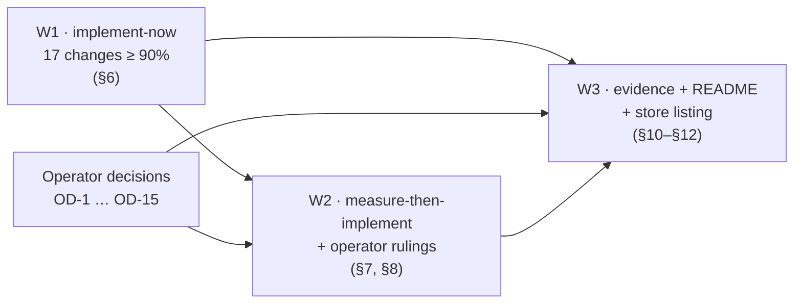

# Natural TTS: the 2026-09 upgrade program (governing document)

*Written 2026-09-23 against `main` @ `fe2ea58`, extension v1.4.0. This document synthesises the 16 artifacts in this
directory. Where an artifact's **Adversarial verification** section disagrees with its body, the verification wins,
and this document follows it.*

**Evidence key.** `[R05 §2]` means `R05-chrome-extension-platform.md` §2. `[R05 ✓]` means that file's *Adversarial
verification* section. Files: R01 local-tts-models · R02 mlx-runtime-stack · R03 in-browser-webgpu-tts · R04
native-helper-architecture · R05 chrome-extension-platform · R06 js-toolchain · R07 chrome-web-store-publishing · R08
readme-visual-craft · R09 capture-recording-tooling · R10 red-team-upgrade-risks · C1 extension-map · C2
helper-baseline · C3 docs-inventory · E1 mlx-audio-latest-probe. Every version and date below was fetched from a
primary source by the cited artifact on 2026-09-23. The artifacts carry the URLs, and §14 lists the load-bearing ones.

---

## The answer

**Keep Kokoro-82M, and ship v1.5.0 by fixing what exists rather than replacing it.**

- **The model stays.** Nothing released since November 2025 is a better permissively licensed default voice [R01 ✓].
- **The runtime underneath it is the upgrade.**
  - Today's runtime is measurably off the reference: 2.65 dB quiet, and spectrally far from PyTorch Kokoro [R01 ✓].
  - The script that installs it is unlocked and, as written, broken [R10 ✓ M1].
  - Rebuild it on mlx 0.32.2 and mlx-audio 0.5.5 in a hash-locked uv environment. That gives correct audio at the same synthesis speed, an environment 4× smaller (2.1 GB → 0.52 GB), a worker ready 10× sooner (3.8 s → 0.4 s), and 54 voices that work offline.
  - The price is a macOS 14 minimum [E1 §3].
- **Fix the extension before anyone installs it.** Its main failures are silent, and its content script triggers Chrome's all-sites install warning.
- **Capture evidence and write the README and store listing last,** because every screenshot, number and sentence depends on the voices, UI and speed that those fixes change.

**What this document hands over:**

- **17 changes clear 90% conviction.** §6 specifies them for an agent to land and verify on this Mac today.
- **15 calls are yours** (§7). Four of them gate publishing:
  - how the helper is distributed;
  - what users without the helper get;
  - the store name;
  - the data-use disclosure.



The four ideas that support the answer:

1. **Kokoro remains the best default, and the runtime upgrade under it fixes a measured fidelity defect. It is not a
   speed win** (§1).
2. **The upgrade is safe only as a locked rebuild of the whole environment.** Seven traps each break it without
   warning, and today's install script already produces a broken environment (§2).
3. **The extension's real risks are silent failures and one over-broad permission.** Every fix is cheap and can be
   verified on this Mac, and most of the JavaScript toolchain upgrade is deletion (§3).
4. **Publishing and evidence come after the code.** What remains after W1 is either your call or a capture job that
   cannot start until W1 lands (§4).

---

## 1. Kokoro stays; the runtime under it is the upgrade, and it fixes fidelity, not speed

**Kokoro is still the right default.** On the Artificial Analysis arena, Kokoro-82M v1.0 scores **1061 ± 11**
(5,232 samples). The only other permissively licensed open-weights model at that level is Magpie (1063 ± 13); AA
flags just these two as commercially usable open weights. Every open model clearly above them is non-commercial:
Breeze TTS 2 (1204), Fish S2 Pro (1120) and Voxtral (1076) [R01 ✓]. On this M1 Max Kokoro was the fastest of 12
models measured, and the best at numbers and dates [R01 §3.2]. There is no Kokoro v1.1-en or v2: `hexgrad/Kokoro-82M`
was last modified 2025-04-10 [R01 ✓, E1 §1].

| Candidate (released Nov 2025 – Sep 2026) | Why it is not the default | Source |
|---|---|---|
| Breeze TTS 2 (#1 open on AA), Fish S2 Pro, Voxtral, Higgs TTS 3, OmniVoice weights, F5/E2, Spark | Non-commercial or research-only weights. OmniVoice's code is Apache-2.0 but its weights are CC-BY-NC. Breeze runs at 0.25× real time here | R01 ✓, R10 §3 |
| Qwen3-TTS, Chatterbox Turbo, VoxCPM2 | Permissive, but 0.9–2.9× real time against Kokoro's ~25×, with 5–18 GB memory peaks and no arena win | R01 §3.2, R01 ✓ |
| Pocket TTS 3.2.0 | The one Kokoro-sized permissive newcomer, and it can clone voices. Without a text normaliser it read "2026" as "226" and "$4.2 million" as "$42 million". It adds capability, not a better default | R01 §4.2, R01 ✓ |
| Kitten 0.8, Soprano 1.1, Supertonic 3, VibeVoice, Dia2 | Kitten is slower and ran away on one input; Soprano mangled text; Supertonic's repo is archived; VibeVoice's TTS code was removed; Dia2 stops at 2 minutes | R01 ✓ |

**What the runtime upgrade changes.** Same weights, same unchanged `tts_worker.py`, same machine:

| Measure | Today: mlx 0.29.3 · mlx-audio 0.2.6 · Python 3.11.4 | Target: mlx 0.32.2 · mlx-audio 0.5.5 · Python 3.12 | Source |
|---|---|---|---|
| Output level vs the PyTorch Kokoro reference | −2.65 dB | −0.20 dB | R01 ✓ |
| Spectral distance to the reference (log-mel L1; the noise floor is run-to-run variation) | 0.428 (floor 0.049) | **0.115**. The author's own metric gives 0.577 → 0.126 (floor 0.058) | R01 ✓ (independent recompute) |
| Pitch path | F0 contour misaligned; upstream measured MCD 7.29 dB and F0 RMSE 11.5 Hz | Fixed by PR #859; upstream reports 4.09 dB and 5.1 Hz | R02 ✓ #3 |
| Warm synthesis speed | — | **Parity.** The reported 17× → 25× gain was machine contention | R01 ✓, E1 §3.1 (pair5), R10 ✓ |
| Worker spawn → ready | 3.83 s | **0.38 s** | E1 §3.1 |
| Spawn → first audio (15 words) | 5.36 s | **2.30 s** | E1 §3.1 |
| Worker RSS once ready | 806–809 MB | **387–388 MB** | E1 §3.1 |
| Python environment | 2.1 GB, 183 packages (torch, gradio, opencv, pyarrow, numba …) | **520 MB, 91 packages, no torch** | E1 §2.1 |
| Hugging Face calls per `/speak` | 1 voice lookup (~72 ms online) | **0** | E1 §3.1, C2 facts |
| Voices usable offline | 8 | **54** | E1 §3.1 |
| Output | 24 kHz mono PCM16 | Same format and identical durations, **+2.45 dB** louder | E1 §6 |

**Honest limits.** No one has done a human listening A/B. The fidelity claim rests on two things: our objective
distance to the PyTorch reference [R01 ✓], and upstream's own MCD and F0 measurements. The loudest voice sample peaks
at **−0.44 dBFS** (`if_sara`); the loudest English voice is `bf_isabella` at −2.09 dBFS. Headroom is thin, so the
worker gets a peak guard (IN-03) [E1 §6]. Kokoro has been deprioritised upstream: a maintainer called it "not a SOTA
model anymore", and release 0.4.4 broke it on most inputs for 33 days. Exact pins plus a probe gate are therefore
mandatory [R10 §2.2, R10 ✓].

**The Swift and WebGPU alternatives.**

- **Kokoro in Swift (mlx-audio-swift).** It loads in 0.26 s against 6.16 s, and uses 0.37–0.60 GB of memory against
  1.13 GB. But its long-text speed-up (1.33×) sits inside Python's own run-to-run spread, and its G2P drops "$45.99"
  and reads 2024 as "twenty four" [R04 §2.2, R04 ✓].
- **In-browser WebGPU Kokoro.** It runs at about 6–8.5× real time here, against the helper's median of 22.5×
  [R03 ✓].

Both are architecture bets, so they are operator decisions (OD-3, OD-2), not upgrades.

---

## 2. The upgrade is safe only as a locked rebuild of the whole environment

`setup-python-env.sh` pins 3 packages and lets the other ~178 float [R10 ✓ M7]. A fresh install today already gets
transformers 5.17.0, huggingface-hub 1.32.0 and torch 2.10.0. None of them is what the working environment runs
[R10 ✓]. Line 107 of the same script deletes every `*.dist-info`, which on a fresh environment breaks
`import transformers` and `load_model`. It also makes `spacy.util.is_package('en_core_web_sm')` return False. Every
documented install path runs that line [R10 ✓ M1, R02 §4]. **So the choice is not "upgrade or keep a working install".
It is "lock a correct environment, or keep shipping an unreproducible, broken one."**

Each of these traps breaks the upgrade silently if it is missed:

| Trap | What happens | Guard (§6) | Source |
|---|---|---|---|
| Bump only the `mlx-audio` pin | The worker logs "ready", `/health` turns green, and then every `/speak` fails because misaki is missing | Declare misaki explicitly, and run a warm-up at startup so a missing dependency fails at launch (IN-01, IN-03) | E1 §2.2 #1 |
| Install `misaki[en]` | It pulls torch 2.14 through spacy-curated-transformers, which is never used | Install base misaki plus its explicit English dependencies (IN-01) | E1 §2.2 #2, R02 §3 |
| `en_core_web_sm` missing, or its dist-info stripped | misaki runs `spacy.cli.download` on the first request, then `sys.exit(2)` | Pin the wheel and keep dist-info (IN-01) | R02 ✓ #10 |
| Target macOS 13 | Dependency resolution fails: mlx 0.29.4 and later ship only macOS 14+ wheels | Raise the floor to 14 (IN-02) | E1 §2.2 #4, R02 ✓ #5 |
| Python 3.13 | pip refuses misaki (`<3.13`), while uv resolves it anyway | Pin 3.12, and lock and install with the same tool (IN-01) | E1 §2.2 #5, R10 ✓ M9 |
| Change the "ready" log line | Swift matches the exact string `Model loaded, ready for requests` (`PythonWorker.swift:54`). Any other wording makes every `/speak` fail with `warmup_timeout` | Keep the exact sentinel (IN-03) | R02 ✓ M1 |
| 0.5.5 `print()`s to stdout | The printed text would be read as a frame length prefix | Keep `redirect_stdout` around every `generate`, including the warm-up (IN-03) | E1 §5 |

Two further facts make the warm-up non-negotiable:

- The first request after a fresh install took **13–17 s**, just inside the extension's 30 s timeout [E1 §3.2].
- With warm-up, time to first audio falls from 7.6–7.8 s to 2.5–4.8 s. That is 2–3× faster, not the ~9× originally
  claimed [R02 ✓ M6].

---

## 3. The extension's real risks are silent failures and one over-broad permission

C1 measured these, most with instrumented harnesses; D5 is inferred from code [C1 §10]:

| Defect | User-visible effect | Fix (§6) |
|---|---|---|
| **The offscreen document dies at 30 s** if nothing has played. Chrome closes an `AUDIO_PLAYBACK`-only document after 30 s without audio, even while it is fetching. Measured: gone at t=30 s, mid-fetch, on branded Chrome 153 | Long selections, or a second request soon after the first, go silent intermittently | IN-09 [R05 §1, R05 ✓] |
| **D1:** the offscreen document has no `chrome.storage`, so the discovery code skips the helper's real port whenever the helper is on a fallback port (8250–8260) | Right-click fails with "not found" while the helper is running | IN-09 [C1 D1] |
| **D3:** `info.selectionText` is ignored on normal tabs | Tabs opened before install, iframes and restricted frames give silence | IN-08 [C1 D3] |
| **D4/D6:** the popup's Stop button is disabled while audio plays, "Playing audio…" appears only after the audio ends, and Enter sends two `/speak` requests | Stop cannot be used, and speech is generated twice | IN-10 [C1 D4, D6] |
| **D8/D9:** a hard-coded list of 6 voices rewrites any other voice to `af_bella`; `af_sarah` has three different labels | This blocks any voice upgrade | IN-06, IN-11 [C1 D8, D9] |
| The helper's `/health` stalls **6.6 s** behind an in-flight `/speak`, while the client gives up after 2 s | "Helper down" is reported while it is busy | IN-05 [C2 §4.10] |
| Restarting within 30 s moves the helper to port 8250 (a TIME_WAIT probe without `SO_REUSEADDR`) | This is what triggers D1 | IN-05 [C2 facts] |

**Permission warning, measured.**

- The v1.4.0 build shows **"Read and change all your data on all websites"**. It comes only from the `<all_urls>`
  content script, which exists only to read the selection. `<all_urls>` also lengthens Web Store review.
- Removing the content script, reading the selection on demand with `activeTab` + `scripting`, and falling back to
  `info.selectionText` leaves exactly **"Read and change your data on 127.0.0.1"**.
- Measured on Chromium 149, CfT 153 and branded Chrome 153 [R05 §2, R05 ✓, R07 ✓].
- Loopback fetches from the extension need **no new permission** under Local Network Access. Extensions with host
  permissions are exempt, and this was measured on Chrome 153 [R05 §5, R04 ✓].

**Most of the toolchain upgrade is deletion.**

- The real build is `tsc && bun run build.ts`. Vite was never used: `vite build` exits 1 [R06 §1, C1 facts].
- The vite chain accounts for **14 of the 16 packages** behind the lockfile's **45 advisories** (2 critical). The
  cleaned toolchain audits at **0** [R06 ✓].
- happy-dom 15.11.7 is inside critical GHSA-37j7-fg3j-429f [R06 ✓].
- `baseUrl` hard-errors on TypeScript 6 and 7, and `@types/chrome` 0.3.0 produces 3 type errors. Removing `baseUrl`
  and adding 2 type generics fixes all of it [R06 ✓, R10 ✓].
- Tests load only 533 of 2,371 source lines (22.5%) [C1 §9, R06 ✓]. Bun's "96% coverage" counts only the files a test
  actually loaded.

---

## 4. Publishing and evidence come after the code; what remains is yours

**Publishing blockers**, from R07 §6 and R10 §5:

- the `<all_urls>` script (fixed in W1);
- `PRIVACY.md` contradicting the code. It claims Chrome Sync and a `scripting` permission, uses placeholder contacts,
  says "zero data", and has no Limited Use statement. The penalty for such a mismatch can be publisher-wide suspension;
- an opaque, full-bleed icon with no transparent padding;
- no speech at all without the macOS helper. This is a Minimum Functionality risk: about 35% as-is, 20% with a
  notarized helper plus reviewer test instructions, and 10% with a fallback engine [R07 §6];
- the CWS API **v1 stops working on 15 Oct 2026**. Any automation must use v2, and the first item must be created by
  hand [R07 ✓].

**Timing.** Plan for **4–5 weeks** from submission until the item can be found in search. That is ≥3 weeks of review
(people report 28-day waits since the 23 Apr 2026 surge post) plus up to 7 days before search indexes it [R07 ✓].

**Evidence.** Every visual target has been captured once on this Mac with a proven rig [R09 §2–4]. Every asset still
waits for W1, because W1 changes the architecture diagram (no content script), the voice list (6 → 28), the popup
states and the performance numbers. The README's "25× RTF" headline is not a measurement: the script hard-codes the
audio duration, and the real figure is about 8× [C3 §5, C2 facts]. The root README is wrong in 11 places [R08 §5,
R08 ✓]. None of the 18 tracked docs describes HEAD [C3 §0].

---

## 5. Ranked upgrade table

Conviction is the post-verification figure. **Action** is one of implement-now (IN-*, §6), W2 (measure first, then
implement, §8), OD (operator decision, §7), hold, or reject.

| # | Item | Current | Target | Action | Conv. | Effort | Verification | Source |
|---:|---|---|---|---|---:|---|---|---|
| 1 | Helper Python environment | pip: 3 pins, ~178 floating, dist-info purge | uv project + hash lock (~88 packages), no purge, spaCy model pinned | IN-01 | 90 | M | `uv lock --check`; `is_package('en_core_web_sm')` | R02 §3–5, R10 ✓, E1 §2 |
| 2 | mlx-audio | 0.2.6 | **0.5.5** (exact pin) | IN-01 | 90 | S | `kokoro_probe.py` 30/30, no NaN | E1 §3, R02 ✓ |
| 3 | mlx / mlx-metal | 0.29.3 | **0.32.2** | IN-01 | 90 | S | same | E1 §1, R02 ✓ |
| 4 | Python | 3.11.4 | **3.12** via uv (3.12.14 is latest; misaki caps at <3.13) | IN-01 | 90 | S | `uv lock --check` | R02 ✓ #8 |
| 5 | misaki | `misaki[en]` via 0.2.6 (pulls torch) | `misaki==0.9.4` base + explicit deps + `en_core_web_sm` 3.8.0 wheel | IN-01 | 90 | S | no `torch` in `uv.lock` | R02 §3, E1 §2.2 |
| 6 | Minimum macOS | 13 (`Package.swift:8`) | **14** | IN-02 | 90 | S | `swift build -c release` | R02 ✓ #7, E1 §2.2 |
| 7 | Worker warm-up + exact sentinel | none; first request pays 1.5–17 s | one `generate` at startup | IN-03 | 90 | S | first `/speak` ≤ 1.5× warm | E1 §3.2, R02 ✓ M1 |
| 8 | Offline model use | Hub lookup on every request | prefetch at setup, then `HF_HUB_OFFLINE=1` | IN-01/03 | 90 | S | 0 connections (`lsof -i`) during `/speak` | E1 §3.1, C2 facts |
| 9 | `lang_code` from voice prefix | always `a` | `a`/`b` from the prefix | IN-03 | 90 | S | `bf_emma` → OK | R02 §10, R02 ✓ |
| 10 | Peak and NaN guard | none | scale peaks above 0.98; error on NaN | IN-03 | 90 | S | probe `max_peak ≤ 0.98` | E1 §6 |
| 11 | `normalize_text` | the ASCII fold deletes ’ “ ” — – … ("We’re" → "were") | keep those 7 characters, fold the rest as today | IN-04 | 90 | S | G2P phoneme check | R02 §9, R02 ✓ M4 |
| 12 | Voice roster | 6 hard-coded (am_adam graded F+; af_heart, graded A, missing) | all 28 English voices (a/b), correct labels | IN-06/11 | 90 | S | `/voices` returns 28 | R01 ✓, C1 D8–9 |
| 13 | `/health` behind `/speak` | stalls 6.6 s | non-blocking readiness | IN-05 | 92 | S | `/health` < 0.1 s mid-`/speak` | C2 §4.10 |
| 14 | Port probe | TIME_WAIT pushes it to 8250 | `SO_REUSEADDR` in the probe | IN-05 | 93 | S | fast restart stays on 8249 | C2 facts |
| 15 | swift-nio / swift-log | 2.88.0 / 1.6.4 | **2.103.0 / 1.15.1** | IN-07 | 90 | S | `swift build` plus curl smoke | R04 ✓ |
| 16 | `<all_urls>` content script | always injected | `activeTab` + `scripting` + `selectionText` fallback | IN-08 | 92 | M | warnings = `["Read and change your data on 127.0.0.1"]` | R05 §2, R07 ✓ |
| 17 | `minimum_chrome_version` | unset (the code needs 116) | **148** | IN-08 | 90 | S | loads on CfT 153 | R05 §7 |
| 18 | Offscreen lifetime | `AUDIO_PLAYBACK` only; killed at 30 s | + `BLOBS`, single-flight create, idle close | IN-09 | 90 | S | alive at t=45 s | R05 §1, R05 ✓ |
| 19 | `/speak` client timeout, POST retry, D1 | fixed 30 s; POST retried; port skipped | scales with text length; no POST retry; save guarded | IN-09 | 90 | S | unit tests | R05 ✓, C1 D1/D13 |
| 20 | Popup Stop, Enter, `innerHTML`, dead toggles | D4, D6, D15, D17 | fixed | IN-10 | 92 | S | `tests/popup.test.ts` | C1 §10 |
| 21 | Keyboard commands and Stop | none; footer chip shows a fake ⌥⇧S | `speak-selection`, `stop-speaking` with no default keys | IN-12 | 90 | S | `commands.getAll()` | R05 §6, R05 ✓ |
| 22 | vite + vite-plugin-web-extension | 5.4.21 / 4.5.0 (never used) | **removed** | IN-13 | 97 | S | `bun audit` = 0 | R06 ✓ |
| 23 | tsconfig `baseUrl` / `paths` | present, 0 uses | removed | IN-13 | 97 | S | `type-check` exit 0 | R06 ✓ |
| 24 | happy-dom | 15.11.7 (critical advisory) | **20.14.5** | IN-13 | 92 | S | 128/128 tests | R06 ✓, R10 ✓ |
| 25 | @types/chrome | 0.0.268 | **0.3.0** + 2 generics | IN-13 | 90 | S | `type-check` exit 0 | R06 ✓ |
| 26 | TypeScript | 5.9.3 | **6.0.3** (7.0.2 deferred) | IN-13 | 90 | S | `type-check`, `build` | R06 ✓ |
| 27 | Build hygiene | `\|\| true` that never runs; 66 `console.*` calls; test hooks shipped; selection text logged | `drop` console.log/info/debug; strip hooks and text logs | IN-14 | 90 | S | `grep` of `dist` | R06 ✓, C1 D18, R07 ✓ |
| 28 | LICENSE, notices, TTS.cpp gitlink | no LICENSE; dangling gitlink | MIT LICENSE + third-party notices; gitlink removed | IN-15 | 90/95 | S | `git ls-files` | C3 §7–8, R08 ✓ |
| 29 | Proven verification and capture tooling | only in `/tmp` (lost on reboot) | committed under `scripts/` | IN-16 | 92 | S | compiles, `node --check` | R09 §6, R05 App. A |
| 30 | Release hygiene | tag predates the bump; empty CHANGELOG | 1.5.0 + CHANGELOG | IN-17 | 90 | S | versions match | C1 D20, C3 §6 |
| 31 | Default voice | `af_bella` (grade A−) | `af_heart` (grade A) | OD-5 | 85 | S | — | R01 ✓ |
| 32 | Helper distribution | build from source | tap → notarized .app | OD-1 | 85 | M–L | `spctl` shows Notarized | R04 §5, R04 ✓ |
| 33 | Engine without the helper | nothing | `chrome.tts` fallback, later WebGPU | OD-2 | 80 | S / L | helper stopped → audio plays | R03 ✓, R07 ✓, R10 §5 |
| 34 | Engine language | Python subprocess | Swift (mlx-audio-swift) spike | OD-3 | 76 | L | phoneme parity + ASR WER | R04 ✓ |
| 35 | Transport | HTTP loopback | Native Messaging | OD-4 | 72 | M | — | R04 §4 |
| 36 | Time to first audio | whole utterance (7.7 s for 407 words) | chunk pipeline, then streaming | OD-6 | 75 | M–L | TTFA ≤ 1 s | E1 §5, C2 §4.3 |
| 37 | Bun | 1.3.0 | 1.4.2 (Rust rewrite; not byte-identical) | W2 | 70 | S | smoke test on 1.4.2 | R06 ✓ |
| 38 | TypeScript 7 | — | 7.0.2 | W2 | 65 | S | editor LSP check | R06 ✓ |
| 39 | espeak without Homebrew | forced Homebrew path | bundled data + `set_data_path(None)` | W2 | 85 | S | guard test on 160–260-byte paths | R02 ✓ #9 |
| 40 | Popup plays through offscreen | popup owns the audio | service worker → offscreen, one owner | W2 | 85 | M | headed test of D5 first | R05 ✓, C1 D5 |
| 41 | Swift 6 language mode | tools 5.9 | Swift 6 + NIOAsyncChannel | W2 | 85 | S | 0 errors | R04 ✓ |
| 42 | Helper origin pin | any extension origin | store ID + dev key | W2 | 65 | M | foreign extension → 403 | R05 ✓, R07 ✓, R10 §10 |
| 43 | beautiful-mermaid | — | **1.1.3** (still latest) | hold | 96 | — | `npm view` | R08 ✓ |
| 44 | gh CLI | 2.96.0 | ≥ 2.99 (2.101.0) for `--attach` | W3 prerequisite | 85 | S | `gh issue comment --help` | R08 ✓, R09 ✓ |
| 45 | agent-browser | 0.27.1 | 0.38.1 | hold | 55 | S | — | R09 ✓ |
| 46 | Kokoro model ID | `prince-canuma/Kokoro-82M` | keep (the bf16 repo is byte-identical; voices always load from prince-canuma) | hold | 90 | — | sha256 match | E1 §4 |
| 47 | Quantized Kokoro | bf16/F32 | reject (at most 13% smaller, 20–60 cents of pitch drift) | reject | 80 | — | — | E1 §4, R02 ✓ |
| 48 | Non-commercial models | — | reject | reject | 95 | — | card licence | R01 ✓ |

---

## 6. Implement-now: 17 changes at ≥ 90%

Every item below can be implemented and verified on this Mac today. None depends on a human ear or on your accounts.
Each is a separate atomic commit. Apply the specs as written here, **not** the diffs in the source artifacts: R02
Appendix A is not the file that was tested, and applied verbatim it never answers a request [R02 ✓ M2].

### 6.0 Phase 0: execution

- **Execution locus, W1: S.** One dispatched session with the goal "IN-01 … IN-17 landed, each verification command
  printed green". That session leads an Agent Team of four teammates in worktrees. Their files do not overlap:

  | Lane | Items | Files it owns |
  |---|---|---|
  | **H-PY** | IN-01, IN-03, IN-04 | `native-helper/python/*`, `Scripts/setup-python-env.sh`, `tts_worker.py` |
  | **H-SWIFT** | IN-02, IN-05, IN-06, IN-07 | `native-helper/Package.swift`, `Package.resolved`, `Sources/NaturalTTSHelper/*.swift` |
  | **EXT-TOOL** | IN-13 | `package.json`, `bun.lock`, `tsconfig.json`, `vite.config.ts`, 2 typed `storage.get` call sites |
  | **EXT-BEHAV** | IN-08 … IN-12, IN-14 | `public/manifest.json`, `src/**`, `build.ts`, `tests/**` |

  The session lead does IN-16 first, then IN-15, then IN-17. It merges smallest diff first: EXT-TOOL → H-SWIFT → H-PY →
  EXT-BEHAV.
- **Shared-state hazard.** Other sessions start and stop a helper on 127.0.0.1:8249, and the helper's
  `~/Library/Application Support/NaturalTTS/config.json` is machine-wide [C1 gaps, C2 facts]. The H-* lanes must stop
  any other helper before their HTTP checks, and must leave `config.json` on port 8249.
- **W2** (§8): locus S, one session per group, after the relevant operator rulings. **W3** (§10–12): locus S, on this
  Mac, because headed capture needs the GUI and this terminal chain's Screen Recording and Accessibility grants
  [R09 §2].
- **Lead budget.** The W1 lead keeps ≥ 50% of its context for merges. Its succession point is after the EXT-BEHAV
  merge, before IN-17.

### IN-01: rebuild the helper's Python environment as a hash-locked uv project on the current stack (90%)

- **Files:** `native-helper/python/pyproject.toml` (new), `native-helper/python/uv.lock` (new, generated),
  `native-helper/python/.python-version` (new, contents `3.12`), `native-helper/Scripts/setup-python-env.sh`.
- **`pyproject.toml`:**
  - `requires-python = "==3.12.*"`.
  - Dependencies, pinned **exactly**: `mlx==0.32.2`, `mlx-audio==0.5.5`, `misaki==0.9.4`, `spacy==3.8.16`,
    `num2words==0.5.14`, `phonemizer-fork==3.3.2`, `espeakng-loader==0.2.4`, `soundfile==0.14.0`.
  - The spaCy model as a direct URL:
    `en-core-web-sm @ https://github.com/explosion/spacy-models/releases/download/en_core_web_sm-3.8.0/en_core_web_sm-3.8.0-py3-none-any.whl`.
  - `[tool.uv]`: `package = false`, `environments = ["sys_platform == 'darwin' and platform_machine == 'arm64'"]`,
    `required-version = ">=0.11.28"`.
  - **Do not** use `misaki[en]` (it pulls torch) [E1 §2.1, R02 §5, R10 ✓ (exact pins, never floats)].
- **Lock:** `cd native-helper/python && MACOSX_DEPLOYMENT_TARGET=14.0 uv lock`. Expect about 88 packages, no `torch`,
  `transformers==5.17.0` (a declared dependency, but never imported on the Kokoro path), and `numpy==2.5.3` [E1 §2.1].
- **Rewrite the core of `setup-python-env.sh`:**
  - Require `uv`. If it is missing, print `brew install uv` and exit 1.
  - Unless `--force` is given, move any existing `Resources/python-env` to `python-env.pre-1.5`. That directory is the
    rollback.
  - Build the environment with
    `UV_PROJECT_ENVIRONMENT="$PROJECT_ROOT/Sources/NaturalTTSHelper/Resources/python-env" uv sync --project "$PROJECT_ROOT/python" --frozen --compile-bytecode`.
    `Config.swift` already looks for this path, and uv environments provide `bin/python3`, so Swift needs no change
    [R02 §5].
  - **Delete the four `find … -exec rm` lines** (dist-info, `__pycache__`, `*.pyc`, `*.pyo`) [R02 §4, R10 ✓ M1].
  - Prefetch the model once, online: `python3 -c "from huggingface_hub import snapshot_download as s; s('prince-canuma/Kokoro-82M', ignore_patterns=['*.pt'])"`
    (weights plus 54 `.safetensors` voices, about 360 MB) [E1 §4, R04 ✓].
  - Run `Scripts/verify_worker.py` (IN-16).
- **Keep Homebrew espeak-ng for now.** At this repo's 179-byte data path, byte 159 is `l`, not `/`. espeak therefore
  rejects the truncated path and falls back to the Homebrew `ESPEAK_DATA_PATH`, which is version 1.52.0 and matches
  the bundled library. Removing Homebrew is W2-3.
- **Rollback:** `rm -rf python-env && mv python-env.pre-1.5 python-env`, then `git revert`.
- **Depends on:** IN-02 (the macOS 14 floor) and IN-16 (the verification scripts).

### IN-02: raise the helper's minimum macOS from 13 to 14 (90%)

- **File:** `native-helper/Package.swift:8`: `.macOS(.v13)` → `.macOS(.v14)`. The doc lines move in IN-17.
- **Why this is decided at 90% rather than asked:**
  - No mlx wheel after 0.29.3 supports macOS 13, and every mlx-audio release with the fidelity fix needs
    `mlx>=0.31.1` [E1 §2.2 #4, R02 ✓ #5].
  - Every Apple-silicon Mac, the only hardware MLX runs on, can run macOS 14 [R02 ✓ #7].
  - The product is unpublished, and its only installed base is this Mac (macOS 15.7.9).
- **If you veto it:** say "keep Ventura". The code path is then a backport of PR #859's 64-line decoder fix onto
  mlx-audio ≤ 0.2.10 [R02 ✓ M7, R10 ✓ M4].

### IN-03: worker hardening for mlx-audio 0.5.5 (90%)

- **File:** `native-helper/Sources/NaturalTTSHelper/Resources/tts_worker.py`.
- **Offline by default.** At module top, before anything imports `huggingface_hub`: `os.environ.setdefault("HF_HUB_OFFLINE", "1")` [E1 §3.1].
- **One model ID.** Add a `MODEL_ID = "prince-canuma/Kokoro-82M"` constant and use it at both `load_model` sites (`:77`, `:91`).
- **Warm-up in `load_mlx_model()`:**
  - After `load_model`, inside `open(os.devnull)` with `redirect_stdout` and `redirect_stderr`, consume `_model_cache.generate("Ready.", voice="af_bella", speed=1.0)` once.
  - **Only then** log the **unchanged** line `Model loaded, ready for requests`, the exact sentinel `PythonWorker.swift:54` matches [R02 ✓ M1, E1 §5].
  - Any exception in load or warm-up is logged with the hint `run Scripts/setup-python-env.sh (model not cached or dependency missing)` and returns False, so the worker exits 1 at startup instead of failing on the first `/speak` [E1 §2.2 #1].
- **`lang_code`.** `lang_code = voice[0] if voice[:1] in ("a", "b") else "a"`, passed to `model.generate(..., lang_code=lang_code)`. Only `a` and `b` voices are exposed; `j` and `z` would need extra misaki extras [R02 ✓ #10].
- **Validate speed.** Reject a non-finite speed or `speed <= 0` with `{"error": "invalid_speed"}` [C2 facts: speed 0 → 500 today].
- **Guard the output** after concatenation. If `np.isnan(audio_np).any()`, return `{"error": "nan_audio"}`. If `peak = np.max(np.abs(audio_np)) > 0.98`, scale by `0.98 / peak` before `sf.write` [E1 §6].
- **Log lengths, never text.** Replace the text previews at `:133` and `:136` with character counts. This is a precondition for the privacy policy's "keeps neither the text" claim [R07 ✓].
- **Keep** the `redirect_stdout`/`redirect_stderr` block around `generate` (`:148-157`) [E1 §5].
- **Depends on:** IN-01, IN-16.

### IN-04: `normalize_text` keeps typographic punctuation (90%)

- **File:** `tts_worker.py:99-115`.
- **Change:** protect exactly `’ ‘ “ ” — – …` (U+2019, U+2018, U+201C, U+201D, U+2014, U+2013, U+2026). Split the text
  on them, apply the existing NFKD-plus-ASCII fold to each other segment, then re-join. The whitespace collapse is
  unchanged.
- **Why this narrow version:**
  - misaki handles those 7 characters natively [R02 §9].
  - Everything the old fold dropped is still dropped: emoji, CJK, Cyrillic, Arabic. The NFKC regressions the verifier
    measured (😀 read as "grinning face", Москва spelled letter by letter, ½ read as "one two") therefore cannot happen
    [R02 ✓ M4].
  - Newlines stay collapsed, because PDF selections carry a hard break on every line.

### IN-05: helper `/health` never waits on synthesis; the port probe survives TIME_WAIT (92%)

- **`PythonWorker.swift`.** Add `nonisolated let readiness = OSAllocatedUnfairLock(initialState: false)`, which is
  Sendable and available on macOS 13+. Set it true in `markWarm()` and false in `handleTermination` and `shutdown`.
  Replace `var isReady` with `nonisolated var isReady: Bool { readiness.withLock { $0 } }`.
- **`HTTPServer.swift:111`.** `let isReady = worker.isReady` (drop the `await`).
- **`Config.swift:49-65`.** Call `setsockopt(sock, SOL_SOCKET, SO_REUSEADDR, &one, socklen_t(MemoryLayout<Int32>.size))`
  before `bind`. The NIO server already sets `so_reuseaddr` (`HTTPServer.swift:30,36`); the probe did not, which is why
  a quick restart moved the helper to 8250 [C2 facts].

### IN-06: the helper exposes all 28 English Kokoro voices with correct labels (90%)

- **Catalogue.** `HTTPServer.swift:203-215` gets the full list, in 4 groups, ordered by the Kokoro grade sheet
  [R01 ✓, `hexgrad/Kokoro-82M` VOICES.md]:
  - **American female:** `af_heart`, `af_bella`, `af_nicole`, `af_aoede`, `af_kore`, `af_sarah`, `af_alloy`,
    `af_nova`, `af_sky`, `af_jessica`, `af_river`.
  - **American male:** `am_fenrir`, `am_michael`, `am_puck`, `am_echo`, `am_eric`, `am_liam`, `am_onyx`, `am_santa`,
    `am_adam`.
  - **British female:** `bf_emma`, `bf_isabella`, `bf_alice`, `bf_lily`.
  - **British male:** `bm_fable`, `bm_george`, `bm_lewis`, `bm_daniel`.
- **Labels.** `a*` voices get `en-US` and "(US)"; `b*` get `en-GB` and "(UK)". This fixes "Sarah (UK)".
- **Unknown voices.** `/speak` returns 400 `unknown_voice` for any ID outside the catalogue. Today such an ID gives a
  500 that leaks the Hub URL [C2 facts].
- **No voice is removed,** so a stored `am_adam` or `af_sky` keeps working [R01 ✓ challenge].
- **Depends on:** IN-03 (British voices need `lang_code` `b`).

### IN-07: swift-nio 2.103.0 and swift-log 1.15.1 (90%)

- **`Package.swift`:** `from: "2.103.0"` and `from: "1.15.1"`, then `swift package update`. Commit
  `Package.resolved`.
- Both are minor versions: NIO 2 has had no major bump. NIO 2.98 and later need a Swift 6.1+ compiler, and this Mac has
  6.2.4 [R04 ✓].
- `swift-tools-version` stays 5.9. Swift 6 language mode is W2-5.
- **If the build fails,** stop and message the lead. Do not force it.

### IN-08: drop the `<all_urls>` content script and read the selection on demand (92%)

- **`public/manifest.json`:**
  - delete `content_scripts`;
  - add `"scripting"` to `permissions`;
  - add `"minimum_chrome_version": "148"`.

  Why 148: the extension is unpublished, so nobody is stranded. Google's guidance is to use 148 for new extensions. It
  makes `@types/chrome` 0.3.0's global `browser` honest. And the tested matrix is Chrome 151–155 [R05 §7, R06 ✓].
- **New `src/shared/selection.ts`.** `readSelection(tabId)` runs
  `chrome.scripting.executeScript({target:{tabId}, func: () => getSelection()?.toString() ?? ''})` and returns `''` on
  any throw (restricted pages, the PDF viewer frame) [R05 §2].
- **`service-worker.ts:83-128`:**
  - if `tab?.id >= 0`, try `readSelection` first. It preserves the page's own `toString()`;
  - if the result is empty, use `info.selectionText`. That covers PDFs, cross-origin iframes and input fields
    [R05 ✓, R07 ✓];
  - apply `cleanupPDFLigatures` only when `/\.pdf($|[?#])/i` matches `info.pageUrl` or `info.frameUrl`. This replaces
    the GuestView-era `tab.id < 0` test, which is probably already dead, because the OOPIF PDF viewer has been the
    default since M145 [R05 ✓].
- **`popup.ts:468-529`.** `getSelectedText()` becomes `readSelection(tab.id)`. Delete the "refresh the page" message.
- **Delete:**
  - `src/content/content-script.ts` and `content-script.css`;
  - their `build.ts` steps;
  - `tests/content-script.test.ts`;
  - the `GET_SELECTED_TEXT` message type.

  The selection-flash overlay goes with them.
- **Depends on:** IN-16 (the warning probe).

### IN-09: offscreen lifetime and client robustness (90%)

- **`service-worker.ts:213-243`:**
  - `reasons: ['AUDIO_PLAYBACK','BLOBS']`. `BLOBS` is truthful, because the document plays through object URLs;
  - justification text: "Plays speech generated by the local helper via object URLs, independent of the popup";
  - a module-level single-flight `creating` promise;
  - `getContexts` filtered by `documentUrls`;
  - errors logged with `console.warn` instead of swallowed.

  **Keep** the 300 ms settle and the `sendToOffscreen` retry. They defend against a listener race that was observed in
  `767725b` [R05 §1, R05 ✓].
- **`offscreen.ts`.** When playback ends or fails, arm a 60 s idle timer. When it fires, send
  `{type:'OFFSCREEN_IDLE'}`; the service worker then calls `chrome.offscreen.closeDocument()`. A new speak request
  cancels the timer. With `BLOBS` the document never closes by itself, so this is mandatory [R05 ✓].
- **`api-client.ts:199`.** The `/speak` timeout becomes `Math.min(120000, 30000 + 15 * text.length)`. C2 measured a
  4,985-character request at 45 s under GPU contention; 30 s was the real ceiling [C2 §4.3, R05 ✓].
- **`api-client.ts:128-133`.** Never retry POST `/speak`; that retry synthesises twice [C1 D13].
- **`config.ts:108-109`.** Wrap `saveConfig(config)` in its own try/catch, so a context without storage still returns
  the port it found [C1 D1].

### IN-10: popup correctness and dead controls (92%)

- **`popup.ts:378-441`:**
  - set the in-flight guard synchronously on entry;
  - clear the loading state as soon as the blob arrives, then call `setPlayingState(true)` with the button **enabled**
    and showing "Stop";
  - `playAudio` resolves when `audio.play()` resolves, and `onended` resets the state;
  - show "Playing audio…" at the start [C1 D4].
- **Enter key.** Delete `handleKeyboard` (`:452-460`) and its listener (`:161`). The native button already turns Enter
  into a click [C1 D6].
- **`popup.ts:292-322`.** Build options with `createElement` and `textContent`, not `innerHTML` [C1 D15].
- **Copy.** Remove "or enter text to speak"; there is no input field [C3 §10].
- **Dead toggles.** Remove `autoPlay` and `helperAutoRetry` from `options.html`, `options.ts` and the settings
  defaults; neither has any effect [C1 §7, C3 §10].

### IN-11: the extension validates voices against the catalogue, not a list of 6 (90%)

- **New `src/shared/voices.ts`,** mirroring IN-06: `{id, name, accent, gender, grade}` for the 28 voices. It becomes
  the single source for labels.
- **`settings-defaults.ts:38-58`.** Accept any catalogue ID, and derive `VOICE_NAMES` from the catalogue.
- **`options.ts:140`.** Take labels from the catalogue.
- **`popup.ts`.** Show names from the helper's `/voices` response, with catalogue names as the fallback. Validate the
  stored voice when loading preferences.
- **Default** stays `af_bella` until OD-5.
- **Depends on:** IN-06.

### IN-12: keyboard commands with no default keys, plus a real Stop (90%)

- **`manifest.json`.** Add `commands` entries `speak-selection` and `stop-speaking`, each with a description and **no
  `suggested_key`**. No default keys means no collision with macOS Option-key typing (⌥⇧S types "Í") and no silent
  non-binding in real profiles. Commands add no install warning [R05 §6, R05 ✓, R05 App. A M1].
- **Service worker.** `chrome.commands.onCommand`:
  - `speak-selection` → `readSelection` → offscreen;
  - `stop-speaking` → `{type:'STOP_IN_OFFSCREEN'}`.
- **`offscreen.ts`.** The STOP handler pauses the audio, revokes the URL and **settles** the pending speak promise.
  Today that promise hangs [C1 D7].
- **Popup footer.** Replace the fake ⌥⇧S chip with the real binding from `chrome.commands.getAll()`. When no key is
  bound, show "Set a shortcut" and open `chrome://extensions/shortcuts` [C1 §11.3].
- **Depends on:** IN-08, IN-09.

### IN-13: JS toolchain: remove the vite chain and upgrade the types (92%)

- **`chrome-extension/package.json`:**
  - remove `vite` and `vite-plugin-web-extension`, and the `dev` and `preview` scripts;
  - set exact versions `happy-dom 20.14.5`, `@types/chrome 0.3.0`, `typescript 6.0.3`;
  - keep `@types/bun` and `@testing-library/dom` as they are.

  Run `bun install` with the installed Bun 1.3.0, so `bun.lock` stays lockfile v1 [R06 ✓].
- **Delete** `vite.config.ts`.
- **`tsconfig.json`.** Delete `baseUrl` and `paths` (no `@/` imports exist), and drop `vite.config.ts` from `include`
  [R06 §2.2].
- **Generics** at the 3 errors `@types/chrome` 0.3.0 raises (`popup.ts:677`, `:681`, `config.ts:39`):
  `chrome.storage.local.get<{selectedVoice?: string; selectedSpeed?: number}>(…)` and the equivalent for the config
  key. Add a runtime guard where the value is used [R06 ✓].
- **Doc fallout, same commit:** remove the Vite and Terser mentions at `chrome-extension/README.md:265,282,370,442`
  and `PRIVACY.md:161` [R06 ✓].
- **Do not** switch the tests to happy-dom's GlobalRegistrator. It replaces `fetch` and breaks the live-helper test
  [R06 ✓].

### IN-14: production-build hygiene (90%)

- **`build.ts`:**
  - remove the three `|| true`. A ShellPromise is truthy, so they never ran [R06 ✓];
  - add `drop: ['console.log','console.info','console.debug']` to every `Bun.build` call.
- **Before the drop, change `service-worker.ts:241` to `console.warn`.** It is the only trace of a `createDocument`
  failure, and `drop` would otherwise remove it [R06 ✓].
- **Delete the selected-text preview logs** (`service-worker.ts:122-133`, `popup.ts:505`), not just drop them.
- **Delete the test-hook globals** (`service-worker.ts:275-283`, `offscreen.ts:179`, `popup.ts:713`). No test uses
  them [C1 D18]. This is a precondition for the privacy policy's "never logged" claim [R07 ✓].

### IN-15: LICENSE, third-party notices, dangling gitlink (90% / 95%)

- **Root `LICENSE`.** MIT, `Copyright (c) 2025-2026 Chris Ren`. This carries out the MIT that `package.json` and the
  README already declare [R08 ✓].
- **Root `THIRD_PARTY_NOTICES.md`:**
  - Kokoro-82M weights: Apache-2.0;
  - misaki: Apache-2.0;
  - mlx and mlx-audio: MIT;
  - swift-nio and swift-log: Apache-2.0;
  - espeak-ng (through espeakng-loader) and phonemizer-fork: GPL-3.0(+);
  - num2words: LGPL.

  State that the GPL components are installed by `setup-python-env.sh` into the user's own environment and are **not
  redistributed** by this repository [R02 ✓ M3, R10 §4].
- **Gitlink.** `git rm --cached TTS.cpp` (mode 160000, no `.gitmodules`), and delete the dead rules at `.gitignore:79-82`
  [C3 §8].

### IN-16: commit the proven verification and capture tooling before `/tmp` is lost (92%)

Copy, parameterise away hard-coded `/tmp` paths, and commit:

- **`native-helper/Scripts/verify_worker.py`,** from `/tmp/ntts-r02/driver.py` (R02 Appendix B). Extend it to:
  - assert exactly 3 OK responses at 24 kHz, mono, 16-bit, for `af_bella`, `bf_emma` and `af_heart`;
  - assert the `empty_text` and `invalid_speed` errors;
  - assert `stray_stdout_bytes=0 exit=0`;
  - assert that stderr contains the exact sentinel line.
- **`native-helper/Scripts/kokoro_probe.py`,** from `/tmp/ntts-r10/kokoro_probe.py`: 2 voices × 3 speeds × 5 texts;
  30/30 OK, `any_nan` false, 0.5×/2.0× duration ratio 3.5–4.0 [R10 ✓].
- **`native-helper/Scripts/verify_g2p.py`:** the 4 R02 §9 rows plus `Great job 😀` and `Москва` through
  `normalize_text` and misaki G2P.
- **`chrome-extension/scripts/verify-permissions.cjs`,** from `/tmp/ntts-r05/probe.js`. Run it with
  `NODE_PATH=$HOME/Development/node_modules node chrome-extension/scripts/verify-permissions.cjs chrome-extension/dist`.
  It uses playwright-core 1.61.1 and prints `getPermissionWarningsByManifest` for the built manifest.
- **`scripts/capture/`,** from `/tmp/ntts-capture/tools/`: `sckrec.swift`, `sckapps.swift`, `winlist.swift`,
  `hover.swift`, `click.swift`, `key.swift`, `axcheck.swift`, `cdp.mjs`, `cdp-browser.mjs`, `demo.mjs`,
  `mockhelper.mjs`, the `cws/` HTML templates, and a `README.md` of the R09 §6 recipe with the verifier's corrections
  (§12).

### IN-17: v1.5.0, CHANGELOG, helper install docs (90%)

- **Versions.** Bump `public/manifest.json` and `chrome-extension/package.json` to `1.5.0`.
- **CHANGELOG.** Add a `1.5.0` entry covering IN-01 … IN-16, plus the 30 unlogged commits from 2026-05-25 [C3 §6].
- **`native-helper/README.md`, install section only:**
  - macOS 14+ on Apple silicon;
  - `brew install uv espeak-ng`;
  - Python 3.12 via uv;
  - delete "Python 3.12+ not yet supported by MLX" (`:101`) and `phonemizer==3.3.0` (`:147`);
  - "~0.5 GB environment + ~0.36 GB model download, then offline" [R02 §18].

  The full rewrite is W3.
- **Depends on:** all of the above.

### Verification commands (the W1 gate)

```bash
# helper, Python side (H-PY)
cd native-helper/python && uv lock --check && ! grep -q '^name = "torch"' uv.lock
cd .. && ./Scripts/setup-python-env.sh --force
E=Sources/NaturalTTSHelper/Resources/python-env/bin/python3
$E -c "import spacy, mlx.core as mx, importlib.metadata as m; assert spacy.util.is_package('en_core_web_sm'); print(mx.__version__, m.version('mlx-audio'))"   # 0.32.2 0.5.5
$E Scripts/verify_worker.py $E Sources/NaturalTTSHelper/Resources/tts_worker.py      # 3× OK, 2 errors, stray_stdout_bytes=0 exit=0
$E Scripts/kokoro_probe.py | grep -E '"ok": 30|any_nan": false'
$E Scripts/verify_g2p.py                                                              # wˌɪɹ / ˌIl; no phonemes for 😀 or Москва
# helper, Swift side (H-SWIFT); stop any other helper on 8249 first
swift build -c release && .build/release/natural-tts-helper &
until curl -sf 127.0.0.1:8249/health | grep -q '"ok"'; do sleep 0.5; done
curl -s 127.0.0.1:8249/voices | python3 -c "import json,sys; print(len(json.load(sys.stdin)['voices']))"   # 28
T=$(python3 -c "print('The quick brown fox jumps over the lazy dog. '*40)")
curl -s -X POST 127.0.0.1:8249/speak -H 'Content-Type: application/json' -d "{\"text\":\"$T\",\"voice\":\"af_bella\"}" -o /dev/null &
sleep 1; curl -s -o /dev/null -w '%{time_total}\n' 127.0.0.1:8249/health                 # < 0.1 (was 6.64 s)
lsof -nP -i -a -p "$(pgrep -f tts_worker.py)" | grep -c ESTABLISHED                         # 0 (offline)
curl -s -o /dev/null -w '%{http_code}\n' -X POST 127.0.0.1:8249/speak -H 'Content-Type: application/json' -d '{"text":"Hi","voice":"zz_nope"}'   # 400
# extension (EXT-*)
cd chrome-extension && bun install && bun run type-check && bun test && bun run build && bun audit   # 0 vulnerabilities
grep -c '<all_urls>' dist/manifest.json                                                  # 0
NODE_PATH=$HOME/Development/node_modules node scripts/verify-permissions.cjs dist         # ["Read and change your data on 127.0.0.1"]
grep -rc 'console.log' dist --include=*.js | grep -v ':0$' ; grep -rl 'TestHelpers' dist  # both empty
```

The E2E checks for IN-09 are:

- an offscreen document still alive at t=45 s;
- a 40 s mocked `/speak` that still plays.

Run them with the committed `mockhelper.mjs` in CfT 153
(`~/Library/Caches/ms-playwright/chromium-1243/…/Google Chrome for Testing`), following the R05 M3 probe pattern.

---

## 7. Operator decisions (below 90% after the research)

Ranked by what they gate. Each gives the measured options and a recommendation. None blocks W1.

| ID | Decision | Conv. | Options (measured) | Recommendation |
|---|---|---:|---|---|
| **OD-1** | **How is the helper distributed?** | 85 | **A** build from source (`git clone` + `uv` + `swift build`). $0, technical users only, no Gatekeeper prompt because nothing is quarantined. **B** your own Homebrew tap, with a formula that builds from source. $0, and Homebrew 7 allows Metal shader compilation in its sandbox. **C** a Developer ID-signed, notarized `.app`/DMG on GitHub Releases, with Sparkle 2.10 updates. $99/yr; required on macOS 15+ for people who download a DMG in a browser, since Sequoia removed the Control-click override and Homebrew has announced (not yet observed) that it will disable casks that fail Gatekeeper. Bundling the Python environment means signing 587 binaries and taking on GPL-3.0 source-offer duties [R04 §5, R04 ✓, R10 §8] | **B now, C before you promote the store listing.** Build C on the Swift engine (OD-3) rather than the Python environment |
| **OD-2** | **What do users without the helper get?** The store cannot target an OS | 80 | **A** nothing, plus onboarding and reviewer test instructions: about 20% review risk. **B** a `chrome.tts` system-voice fallback: effort S, and the `tts` permission adds no install warning. **C** in-browser WebGPU Kokoro in the offscreen document: 6–8.5× real time on M1 Max, a 326 MB download, `kokoro-js` stalled with 3 reproduced defects, GPL `phonemizer.js`, and it needs `WORKERS` + CSP `wasm-unsafe-eval` + bundled ORT [R03 ✓, R07 §6, R10 §5] | **B for the v1.5 submission.** C stays an evaluated later tier, and if it comes, pin ORT 1.30.0 (1.4–1.8× faster than 1.22-dev) [R03 ✓] |
| **OD-3** | **Which engine language: Python (upgraded in W1) or Swift (mlx-audio-swift)?** | 76 | **Swift:** loads in 0.26 s vs 6.16 s, uses 0.37–0.60 GB vs 1.13 GB, needs no Python, no GPL espeak and no venv. Against it: long-text speed-up 1.33× (inside the noise); G2P drops "$45.99" and reads 2024 as "twenty four"; library at 0.1.x; one Hugging Face call on every `prepare()`; needs swift-tools 6.2, with mlx-swift 0.31.5+ needing 6.3. **Python:** proven in W1, but tied to misaki, which has had no release in 17 months and caps Python at 3.12 [R04 ✓, R02 ✓ M8] | **Keep Python for v1.5.** Run a Swift spike that must pass: phoneme parity on a 15-sentence corpus, ASR WER within +0.5 pp, 0 network connections (`lsof`), and a build on the local toolchain |
| **OD-4** | **Transport: HTTP on loopback, or Native Messaging?** | 72 | **HTTP** is exempt from Local Network Access (measured on Chrome 153) and already works. **Native Messaging** removes port squatting and the resident 1 GB process. It adds the warning "Communicate with cooperating native applications" (which can be requested as an optional permission) and a 1 MB-per-message limit [R04 §4, R04 ✓] | **Keep HTTP for v1.5.** Revisit only together with OD-3 Swift, where spawning the host on demand becomes viable |
| **OD-5** | **Default voice for new installs** | 85 | `af_bella` (grade A−, today's default) vs `af_heart` (grade A, not exposed today). Existing stored choices are unaffected [R01 ✓] | **`af_heart`.** Listen to `/tmp/ntts-e1/voices/af_heart.wav` against `af_bella.wav` first |
| **OD-6** | **Time to first audio** | 75 | **A** as today: the whole utterance, 7.7 s for 407 words. **B** chunking in the offscreen document at sentence boundaries: no helper change, removes the 5,000-character and 30 s ceilings, and adds about 1 s of silence per boundary. **C** helper-side framed streaming (split off the first sentence): TTFA 0.09–0.52 s measured at model level, but it needs a protocol change in Swift and in the player [E1 §5, C2 §4.3] | **B next,** after a mock-helper stall test at candidate chunk sizes. **C** alongside OD-3/OD-4 |
| **OD-7** | **Store name** | 68 | **A** "Natural TTS: Private Kokoro Voices for Mac" (42/75 characters). **B** "Natural TTS — On-Device Read Aloud for Mac". **C** keep "Natural Text-to-Speech", which is generic and near NATURALREADER (US Reg. 4,039,798; about 15% chance of a complaint) [R07 §12.1, R10 §5.6] | **A.** Decide before the first publish; renaming later costs ratings and search position |
| **OD-8** | **Data-use disclosure** | 75 | **A** declare "Website content" and the 3 certifications, as Read Aloud, Speechify and ElevenReader do. **B** declare nothing, as the local-server precedents do. Over-disclosure has no enforcement downside; under-disclosure risks publisher-wide suspension [R07 §5.4] | **A** |
| OD-9 | EU DSA trader status | 80 | Non-trader (free, MIT). It flips to Trader if the listing promotes a professional brand or paid services [R07 ✓] | **Non-trader** |
| OD-10 | Icon glyph and brand | 90 on need | The spec part (96 px artwork, 16 px transparent padding, alpha, vector master) is objective. The glyph is taste. Today's left-pointing triangle reads as "rewind" [R07 §4.1, R09 ✓] | A speaker or speech-bubble glyph with 2–3 waveform arcs. Tune the 16 and 48 px toolbar icons separately |
| OD-11 | Register as `chrome.ttsEngine` | 60 | This would make the voices available to every page's `speechSynthesis`. But the warning "Read all text spoken using synthesized speech" cannot be optional, Reading Mode filters extension voices out, and adding it after launch disables the extension for existing users [R05 §13, R03 ✓] | **Not in v1** |
| OD-12 | Pocket TTS as an opt-in second engine | 55 | Adds cloning, EU languages and streaming, but reads numbers wrong without a normaliser. 2 of its 26 preset voices are CC BY-NC [R01 ✓] | **Not now.** Reconsider once its numeric WER is ≤ Kokoro's 5.6% |
| OD-13 | Store category | 70 | Accessibility (like Read Aloud) or Tools [R07 §12.2] | **Accessibility** |
| OD-14 | Default shortcut keys | 60 | ⌥⇧N, ⌥⇧S and ⌥⇧X bind on Chrome 153, but on a US layout they type characters (⌥⇧S is Í) [R05 ✓] | Ship with no defaults (IN-12). Choose keys after a headed test in a textarea |
| OD-15 | EU AI Act Art. 50(2) marking of synthetic audio | 45 | Applies from 2026-08-02, and 2026-12-02 for systems already on the market. It is unsettled whether reading the user's own text aloud falls under the exception for not substantially altering content [R10 §9] | Watch item. No action for v1.5 |

---

## 8. W2: engineering items at 75–89%, and the measurement that clears each

These are not your calls. Each needs one named measurement, run first by the W2 implementer, that lifts it past 90%.

| ID | Item | Conv. | Measurement that lifts it | Source |
|---|---|---:|---|---|
| W2-1 | Route popup speech through service worker → offscreen, with status in `storage.session` and an action badge for right-click errors (C1 D2) | 85 | Record in headed CfT that clicking the page kills popup audio (D5 is inferred today) | R05 §4, R05 ✓, C1 D2/D5 |
| W2-2 | NFKC normaliser with pictograph and non-Latin filters, keeping paragraph newlines, replacing IN-04 | 70 → 90 with filters | Run `verify_g2p.py` extended with emoji, CJK, Cyrillic, Arabic, ½ and PDF line-break fixtures | R02 ✓ #2 |
| W2-3 | espeak without Homebrew: bundled data plus `EspeakWrapper.set_data_path(None)` and a short symlink | 85 | Guard test across simulated path lengths of 160–260 bytes, including `/` at byte 159, with `ESPEAK_DATA_PATH` unset | R02 ✓ #9, M5 |
| W2-4 | Bun 1.4.2 + @types/bun 1.4.2 (the Rust rewrite; bundles are structurally equivalent but not byte-identical) | 70 | A load-unpacked smoke test of all 5 bundles on 1.4.2, run through a project-local binary, never a global `bun upgrade` | R06 ✓ |
| W2-5 | Swift 6 language mode (1 real data race at `HTTPServer.swift:319`) | 85 | Decide OD-4 first; Native Messaging would delete the HTTP server | R04 ✓ |
| W2-6 | Pin the helper to the extension's origin (store ID plus a dev `key`) | 65–70 | The draft upload creates the item ID; pin before submission | R05 ✓, R07 ✓, R10 §10 |
| W2-7 | Pin the Kokoro Hugging Face revision | 75 | Prove that voices resolve offline from `snapshot_download(revision=sha)` without `refs/main`, since `load_model` does not forward the revision | R10 ✓ |
| W2-8 | TypeScript 7.0.2 | 65 | Check that the `tsc --lsp` editor path works in Cursor, and confirm no typescript-eslint is planned | R06 ✓ |
| W2-9 | Dark-mode CSS for the popup and options pages, so the README can use dark variants | 75 | Design review | R09 §4 |
| W2-10 | DOM tests plus a coverage floor over every entry module | 85 | Tests that import each entry module; Bun only counts coverage for loaded files | R06 ✓ |
| W2-11 | uv `exclude-dependencies` for transformers and scipy (−134 MB) | 60 | Run the probe on every `uv lock --upgrade` | R02 §14 |
| W2-12 | `_locales` / i18n | 65 | Only if listings will be localised | R05 §11 |

---

## 9. Deferred or rejected (one line each)

- **Non-commercial weights** (Breeze TTS 2, Fish S2 Pro, Voxtral, Higgs TTS 3, OmniVoice, F5/E2, Spark, OpenAudio S1
  Mini): **reject, 95.** Their licences forbid product use. mlx-community ports mislabel several of them [R01 ✓, R10 §3].
- **Supertonic 3, VibeVoice, Kitten 0.8, Soprano 1.1, Dia2:** **reject, 85.** Archived, disabled, or lost on quality
  and pacing [R01 ✓].
- **Qwen3-TTS, Chatterbox Turbo or VoxCPM2 as a "quality" engine:** **hold, 80.** 5–10× slower than Kokoro with no
  arena win [R01 ✓].
- **Quantized Kokoro (4/6/8-bit):** **reject, 80.** At most 13% smaller, 20–60 cents of pitch drift, no speed gain
  [E1 §4].
- **Switching to `mlx-community/Kokoro-82M-bf16`:** **hold, 90.** Byte-identical weights, and voices still load from
  `prince-canuma`, so the cache would depend on two repos [E1 §4].
- **Letting mlx-audio float:** **reject, 95.** 0.4.4 broke Kokoro for 33 days [R10 ✓].
- **Shipping today's Python venv inside an .app:** **reject, 90.** It is not relocatable, has 587 binaries to sign,
  bundles GPL code, and is 2.1 GB [R04 ✓].
- **kokoro-ios, sherpa-onnx:** **reject, 80.** A stale pin, and GPL espeak [R04 ✓].
- **FluidAudio KokoroAne:** **hold, 75.** 11.6 s for the long text against 5.5 s, 2 GB of memory, and a 34 s first
  compile on M1 Max [R04 ✓].
- **Hummingbird 2, NWListener:** **hold, 65 / reject.** Three routes, and Native Messaging may delete them [R04 §3].
- **Kokoro on WASM as the primary engine; WebGPU fp16/q8/q4f16:** **reject, 90.** WASM is ≤ 1× real time; fp16
  produces NaN; q8 is wrong; q4f16 is unintelligible [R03 ✓].
- **Chrome built-in AI TTS, WebNN:** **reject, 90.** No such API; WebNN is still in origin trial [R03 ✓].
- **Inference in the service worker or side panel:** **reject, 85.** Idle kill; the side panel lives only while open
  [R03 ✓].
- **transformers.js 4.3.0 for Kokoro:** **hold, 80.** 2.2× slower than v3 on the same graph [R03 ✓].
- **WXT, CRXJS, rolldown-vite, vite 8:** **reject, 78–97.** They re-add the vite chain for no gain [R06 ✓].
- **`message_serialization: structured_clone`, promise-returning `onMessage`:** **hold, 88.** Still rolling out
  gradually [R05 ✓].
- **Percentage rollout:** **reject, 95.** Only for items with more than 10,000 seven-day users [R07 ✓].
- **Private or trusted-tester phase:** **reject, 70.** It costs an extra review cycle; deferred publishing gives the
  same control [R07 §8].
- **CI publishing via CWS API v2 + WIF:** **defer, 60.** Manual upload is enough for launch, and v1 must never be used
  [R07 ✓].
- **Vendoring beautiful-mermaid `main` or unmerged PRs:** **reject, 90.** No library changes, and no type we need
  [R08 ✓].
- **agent-browser 0.38.1:** **hold, 55.** It still cannot side-load into branded Chrome or record audio [R09 ✓].
- **Minor tool bumps (ffmpeg 9.0.2, ImageMagick 7.1.2-31, VHS 0.12.0, asciinema 3.2.1):** **hold, 70.** No capability
  change [R09 §5].
- **gifski:** **evaluate, 55.** The palette GIF already reaches 43.7 dB PSNR [R09 ✓].
- **`screencapture -g` audio; `agent-browser record` for popup footage:** **reject, 95.** The first records the
  microphone; the second captures only the page [R09 ✓].
- **Side panel reader UI:** **evaluate, 55.** Not needed for v1 [R05 §14].
- **Unminified production build:** **defer, 70.** Minification is allowed, and IN-14 already removes the review
  irritants [R07 §6].
- **Swift toolchain 6.4:** **defer.** 6.2.4 builds everything in W1; only the Swift route needs 6.3 [R04 ✓].

---

## 10. README inputs

**Governing line for the README.** Select text in Chrome and hear it in a natural Kokoro voice. The voice is generated
on your Mac's GPU, and the extension can reach nothing but `127.0.0.1`. The second half of that sentence becomes
literally true after IN-08 [R05 ✓].

**Facts to state after W1.** Re-read them from the tree; do not quote them from here.

- **Extension:** v1.5.0, MV3, `minimum_chrome_version` 148.
  - Permissions: `storage`, `contextMenus`, `activeTab`, `scripting`, `offscreen`; host `http://127.0.0.1/*`.
  - The **only** install warning is "Read and change your data on 127.0.0.1" [R05 ✓].
- **Helper:** Swift (SwiftNIO 2.103) on `127.0.0.1:8249`, falling back through 8260.
  - It runs a Python 3.12 worker with mlx 0.32.2, mlx-audio 0.5.5 and Kokoro-82M (Apache-2.0, `prince-canuma/Kokoro-82M`).
  - It offers 28 English voices (20 American, 8 British), speeds 0.5–2.0×, and up to 5,000 characters per request.
- **Requirements:** macOS 14+ on Apple silicon; `brew install uv espeak-ng`. Setup builds a ~0.5 GB environment and
  downloads a ~0.36 GB model once; after that it works offline [E1 §2.1, IN-01].

**Numbers.** Take every figure from a committed benchmark run *after* W1. **Never reuse** the Nov 2025 "25× RTF long":
the script hard-codes the audio duration, and the real figure is about 8× [C3 §5].

- **Expected ballpark,** from the worker-level run on the target stack [E1 §3.1]:
  - 15 words: 0.381 s (23.6× real time);
  - 60 words: 1.167 s (24.8×);
  - 407 words: 6.718 s (25.5×).
- **Helper-level baseline on the old stack** [C2 §4.3]: 0.48, 1.32 and 7.73 s.
- **Time to first audio currently equals total synthesis time.** Say so honestly until OD-6 lands.
- **Positioning figure:** on the same M1 Max the helper runs at a median 22.5× real time; in-browser WebGPU Kokoro runs
  at 6–8.5× [R03 ✓].

**Diagram plan.** Use beautiful-mermaid **1.1.3** as an exact pin, with a committed `bun.lock` because elkjs 0.11.x
drift changes layout [R08 ✓]. Copy agent-secrets' `render-diagrams.mjs` with three fixes:

1. delete `decodeEntities`;
2. strip `@import` with `/gm`;
3. keep the font swap.

Every diagram goes in a dark/light `<picture>` and must be ≤ **838 px** wide, the measured README column [R08 §4].

| # | Diagram | Changes needed after W1 |
|---|---|---|
| D1 | Architecture (`flowchart LR` with TB subgraphs, 783 px) | Remove the content script. Show `activeTab`+`scripting`, the right-click → service worker → offscreen (`AUDIO_PLAYBACK`+`BLOBS`) path, and the popup still playing its own audio until W2-1 |
| D2 | Right-click sequence (`sequenceDiagram`) | Show `executeScript` first with the `selectionText` fallback. Delete `Note over OFF,K`, which renders over one lifeline; put "127.0.0.1" in the participant labels instead [R08 ✓] |
| D3 | Status pill (`stateDiagram-v2`) | It is 990 px, over the limit: drop the Speaking state, or lay it out TB |
| D4 | Performance (`xychart-beta`, single series) | **Generate it** from `bench/results.json`, never type it by hand |

**Media.**

- **Hero:** an MP4 of 15–20 s (H.264 High, yuv420p, AAC, `+faststart`, ≤ 8 MB) with the real Kokoro audio. Put the
  `github.com/user-attachments/assets/<uuid>` URL alone on its line. GitHub renders it as `<video controls muted>`, so
  the caption must say "Press play, then unmute", followed by a provenance line: M1 Max, voice, speed, helper sha
  [R08 ✓].
- **Silent loops** are GIFs, the only animated format that gets GitHub's pause control (WCAG 2.2.2) [R08 ✓, R09 ✓].
- **Accessibility:** alt text on every image, and a transcript of the hero audio.

**Fix all 11 README defects** [R08 §5, R08 ✓]:

1. the WebGPU tagline;
2. three static badges, two linking to `()`;
3. v0.2.0 against the real 1.4.0;
4. "random port" and "Native Messaging";
5. the dead `phase0-validation` setup and `YOUR_USERNAME`;
6. "see LICENSE" with no LICENSE file (fixed by IN-15);
7. "chrome-extension coming soon";
8. Native Messaging listed as planned;
9. about 40% of the file on the Phase 0 history (move it to `docs/history.md`);
10. the stale GitHub About box: run `gh repo edit` for the description, topics and homepage (a public change);
11. `--recurse-submodules` with no `.gitmodules`.

**Other rules.** At most 4 badges, all live (store version and users once listed, CI once `.github/` exists, license).
Delete the two posted `github-comment-*.md` drafts and INSTALL.md's `via.placeholder.com` images [C3 §3–4]. Add a
License section carrying the third-party notices from IN-15.

**Skeleton** [R08 §5]:

- a first screen with the icon, a one-line promise, ≤ 4 badges, the hero video, and three bullets: Natural, Private,
  Fast;
- then the sections: Install (helper, then extension) · How it works (D1, D2) · Privacy: verify it yourself (a
  permissions table that matches the manifest) · Performance (D4, plus the command that reproduces it) ·
  Troubleshooting (D3, plus the 8249–8260 note) · Development · License.

---

## 11. Publishing inputs

**Manifest fields.**

- **Name:** decided by OD-7 (recommended: "Natural TTS: Private Kokoro Voices for Mac", 42/75).
- **Summary** (the manifest `description`, ≤ 132): "Read selected text aloud in natural AI voices generated on your
  Mac, not in the cloud. Requires the free Natural TTS Helper." (124). Adapted from [R07 §12.1].
- `minimum_chrome_version` "148" (IN-08); version 1.5.0.

**Detailed description.** Use R07 §12.3 with these corrections:

- "macOS **14** or later on Apple silicon";
- "**28** English voices (US and UK)";
- the Requirements block per OD-2;
- a line about the one-time download from huggingface.co.

It stays true only once LICENSE exists, the privacy URL is live, and "5 minutes" has been re-timed on a clean machine
[R07 §12.3].

**Privacy tab.**

- **Single purpose:** "Reads aloud text that the user selects in the browser, using speech that is synthesized on the
  user's own computer by a companion app." [R07 §5.1]
- **Permission justifications:** use R07 §5.2, **with the offscreen text changed.** It now reads: reasons
  `AUDIO_PLAYBACK` and `BLOBS`; plays helper audio through object URLs; closes itself after 60 s idle (IN-09).
  `scripting` and `activeTab` read the selection only after a click or menu use.
- **Remote code:** No.
- **Data use:** OD-8 (recommended: Website content, plus the 3 certifications).

**Privacy policy.** Use the R07 §12.8 draft, hosted at a stable HTTPS URL. GitHub Pages is not enabled on the repo, so
turning it on is your call. Keep its claims true:

- "never stored or logged" holds only after IN-14 and IN-03;
- "accepts requests only from the Natural TTS extension" is **false until W2-6.** Until then write "accepts requests
  only from browser extensions on this computer";
- include the Limited Use sentence;
- use a real contact address.

Delete the placeholder URLs and emails from `PRIVACY.md` [R07 §11].

**Test instructions.** Use R07 §7, with macOS 14, the helper channel chosen in OD-1, and timings re-measured on the
release build.

**Assets.**

- **Icon:** 128 px canvas, 96 px artwork, 16 px transparent padding, alpha, vector master (OD-10).
- **Screenshots:** 5 × 1280×800, full bleed, square corners, legible at 640×400.
- **Small tile:** 440×280, required, no text.
- **Marquee:** 1400×560.
- **Video:** a public YouTube demo of 30–50 s with the real audio.
- Storyboard and specs are in §12 [R07 §4, R09 §4].

**Mechanics.**

- **Account:** a dedicated Google account with 2-Step Verification. The one-time registration fee is US$5; a
  2026-04-30 change lets added publisher members join without paying it [R07 ✓].
- **Trader status:** Non-trader (OD-9).
- **Distribution:** Public, all regions. Submit with **deferred publishing**; you then have 30 days to publish.
- **Rollback:** one click, no review.
- **Percentage rollout:** not available below 10,000 seven-day users.
- **API:** CWS API v1 dies **2026-10-15**, and the first item must be created by hand.
- **Timeline:** ≥ 3–4 weeks of review plus ≤ 7 days of search indexing. Rejections are appealed in the dashboard. The
  Official URL picker is reported flaky [R07 §8, R07 ✓].

**Competitors to beat.**

- Supertonic-based on-device readers: 2,000, 1,000 and 145 users.
- The Kokoro and WebGPU-Kokoro listings (98–935 users). None has a polished listing, so craft wins [R07 §4.3, R07 ✓].

**Policy risk after W1** [R07 §6]:

- Permissions: about 0.
- Privacy consistency: about 0, once the policy is rewritten.
- Minimum Functionality: 20% with a notarized helper plus test instructions, 10% with the OD-2 fallback.

---

## 12. Capture plan (W3)

**Precondition: capture only after W1 lands and after OD-5, OD-7 and OD-10 are decided.** W1 changes the
architecture, voice list, popup states and numbers; OD-10 changes the icon; OD-5 changes the default voice.

The **fixture audio must be real output of the upgraded helper, for the exact on-screen text and voice**. Store it with
a provenance file (model, voice, speed, text, helper sha) [R09 ✓, R07 §4.6].

**Proven rig.** These commands were measured on this Mac [R09 §1–3, R09 ✓]:

1. **Build.** `cd chrome-extension && bun run build`.
2. **Browser.** The primary browser is **version-pinned Chrome for Testing 153**:
   `~/Library/Caches/ms-playwright/chromium-1243/chrome-mac-arm64/Google Chrome for Testing.app/Contents/MacOS/Google Chrome for Testing`,
   launched with `--user-data-dir=<throwaway> --load-extension=<abs dist> --test-type=gpu --use-mock-keychain --password-store=basic --no-first-run --window-size=1280,800 --remote-debugging-port=9555`.
   - `--test-type=gpu` removes the "only for automated testing" infobar (verified on CfT 151). Pinning avoids the
     branded browser's auto-update drift.
   - **Fallback:** branded Chrome, loading the extension over CDP `Extensions.loadUnpacked` on the browser session.
     Under Playwright this needs `ignoreDefaultArgs: ['--disable-extensions']`.
   - Seed `Default/Preferences` with `{"extensions":{"pinned_extensions":["<id>"]}}` before launch. The ID from this
     repo path is `lahgejbaodkdkgmmjgdbgagkepakpifd`, and it changes if the tree moves.
3. **State.** Load first, then navigate: tabs opened earlier get no injection. Set voice and speed with
   `Extensions.setStorageItems`. `node scripts/capture/mockhelper.mjs <browser-ws> <secs> <fixture.wav>` fulfils
   `http://127.0.0.1:8249/*` through CDP `Fetch`, so the shared helper is never touched.
4. **Popup.** Open it with `chrome.action.openPopup()` from the service worker, with a visible-window check through
   `winlist` and a retry.
   - **Never** send `Extensions.triggerAction` to the first `tab` target: the hidden component page comes first, and
     Chrome 153 segfaulted 6 times in 6.
   - Select the tab by URL.
   - Wait ≥ 400 ms for the fade-in [R09 ✓].
5. **Native context menu.** A CDP `Input.dispatchMouseEvent` right-click on the selection opens the real menu.
   - Highlight "Speak selected text" with `scripts/capture/hover` (a CGEvent move; the cursor is restored).
   - Capture with `screencapture -x -o -l <windowId>`.
   - Dismiss by closing the capture browser; Escape does not work [R09 §2].
6. **Colour.** `magick in.png -profile "/System/Library/ColorSync/Profiles/sRGB Profile.icc" out.png`, because
   `screencapture` embeds the display profile.
7. **Video.** `scripts/capture/sckrec <chromePid> <secs> out.mov 40 60 1280 800 --no-cursor`: ScreenCaptureKit with an
   inclusion filter for the picture.
   - The canonical audio is **post-muxed from the `/speak` WAV** at the driver's timeline offset, aligned by
     cross-correlation. The measured lag was a constant +0.93–1.00 s.
   - For live-audio proof, `--exclude-others` excludes apps by bundle ID. An inclusion filter records silence.
   - Normalise the VFR output with `tpad=stop_mode=clone:stop_duration=N,fps=30` [R09 §3].
8. **Encodes:**
   - README MP4: `-c:v libx264 -profile:v high -pix_fmt yuv420p -crf 20 -r 30 -c:a aac -b:a 128k -movflags +faststart`.
   - GIF loops: `palettegen stats_mode=diff` + `paletteuse` (sierra2_4a), 960 px wide, 15 fps, ≤ 2 MB.
   - YouTube master: the R09 §3.4 command (1920×1080, bf 2, closed GOP 15, 8 Mbps, AAC 48 kHz, `-use_editlist 0`).
9. **Store images.** Render HTML templates (`scripts/capture/cws/`) at the exact viewport, DPR 1, then
   `magick -alpha off -strip`.
   - Check sizes with `magick identify` (exactly 1280×800, 440×280, 1400×560).
   - Check legibility at a 640×400 downscale.
   - Crop the popup at ≥ 1:1 CSS scale: a whole-window framing leaves 6 px text.
10. **README video upload.** Needs gh ≥ 2.99 (`brew upgrade gh`, a machine-level change): run
    `gh issue comment <README-media issue> --attach hero.mp4`, or do one drag-and-drop in the web editor. Then check
    `gh api markdown -f mode=gfm -f context=renchris/natural-text-to-voice-extension -F text=@README.md | grep -c '<video'`
    is ≥ 1.
11. **Preflight.** `scripts/capture/axcheck` must report Screen Recording and Accessibility granted; both are true today
    for this terminal chain. Record the tool versions next to the outputs.

**Shot list: README.**

- **Hero MP4, 15–20 s:** a real article, select a paragraph, right-click "Speak selected text", audio plays. Caption
  plus provenance.
- **GIF loops:**
  - status pill Checking → Connected;
  - a voice switch in the grouped 28-voice list.
- **Popup PNG at 2x.** Light only, until W2-9 adds dark CSS.
- **VHS tape** of `setup-python-env.sh` and the helper starting.
- **D1–D4 diagrams.** These are renders, not captures.

**Shot list: store.**

- **5 × 1280×800** [R07 §4.4, R07 ✓]:
  1. "Select text. Right-click. Listen.": the native menu on an article.
  2. "Natural voices, at your speed.": the anchored popup, voices grouped by accent, 1.3×, Connected.
  3. "Made on your Mac. Not in the cloud.": a Chrome → 127.0.0.1 → helper → Apple GPU strip next to the Connected
     popup. The DevTools network proof moves to the video, because a network panel does not show the actual user
     experience.
  4. "PDFs too, with ligatures fixed.": first verify the PDF path on Chrome ≥ 153 by hand (R05 ✓).
  5. "Five-minute setup.": helper ready and a green popup, or the fallback line if OD-2 is B.
- **Small tile 440×280:** glyph and waveform, no text.
- **Marquee 1400×560:** wordmark, "Private, on-device voices", and the real popup crop.
- **YouTube, 30–50 s:**
  1. title card;
  2. right-click speak;
  3. popup voice and speed;
  4. PDF;
  5. **Wi-Fi off, speak again**;
  6. end card with the setup URL.

  No music under speech [R07 §4.6].

---

## 13. Where the artifacts disagree, and what this document chose

| Question | Positions | Chosen, and why |
|---|---|---|
| Does the runtime upgrade make synthesis faster? | R01 body: 17× → 25×. R01 ✓, E1, R10 ✓: parity | **Parity.** Interleaved A/B runs and the both-offline pair agree. The upgrade rests on fidelity, footprint and startup |
| Does the worker need changes? | E1: it runs unchanged. R02 ✓: warm-up needed, and the published diff is broken | **Targeted edits only (IN-03)** with the exact sentinel. Never apply R02 Appendix A |
| macOS 14 floor | R02 ✓ 90; R10 and R01 ✓ 85, "operator's" | **Implement at 90** (§6 IN-02), with a stated veto path |
| `minimum_chrome_version` | R05: 148 (70). C1 and R07: 116 | **148.** Unpublished, Google's guidance for new extensions, and it keeps `@types/chrome` 0.3.0 honest |
| How to read the selection | R07 ✓: `selectionText` everywhere. R05 ✓: `executeScript` first | **`executeScript` first, `selectionText` fallback.** The union of both, and it covers iframes and PDFs |
| happy-dom | R06: upgrade (93). R06 ✓: upgrade or remove (60) | **Upgrade.** IN-10 adds the first real DOM tests |
| TypeScript | R06: 7.0.2 (80). R06 ✓: 6.0.3 is the default | **6.0.3 now.** TS 7 goes to W2-8 because of the editor tsserver gap |
| Normaliser | R02: NFKC (92). R02 ✓: regressions, 70 | **Narrow protect-list (IN-04).** NFKC with filters becomes W2-2 |
| Removing the Homebrew espeak dependency | R02: guard (85). R02 ✓: 60, fails on about 9% of paths | **Keep Homebrew in W1.** The fixed guard is W2-3 |
| Capture browser | R08: CfT. R09: branded plus CDP. R09 ✓: CfT with `--test-type=gpu` | **Pinned CfT with `--test-type=gpu`; branded plus CDP as the fallback** |
| README video upload | R08: `gh --attach`. R09: web drag-and-drop only | **Either.** R08 ✓ verified that a user-attachments URL renders as `<video>` in the repo context |
| Fallback engine and review risk | R07: needed (80). R07 ✓: 55, precedents passed without one | **OD-2.** The `chrome.tts` fallback is cheap enough to recommend for users, not as a review gate |

---

## 14. Sources

**Artifacts** (this directory): `R01-local-tts-models.md`, `R02-mlx-runtime-stack.md`,
`R03-in-browser-webgpu-tts.md`, `R04-native-helper-architecture.md`, `R05-chrome-extension-platform.md`,
`R06-js-toolchain.md`, `R07-chrome-web-store-publishing.md`, `R08-readme-visual-craft.md`,
`R09-capture-recording-tooling.md`, `R10-red-team-upgrade-risks.md`, `C1-extension-map.md`, `C2-helper-baseline.md`,
`C3-docs-inventory.md`, `E1-mlx-audio-latest-probe.md`.

**Load-bearing primary sources,** as fetched by those artifacts on 2026-09-23:

- **Python packages (PyPI JSON):**
  - https://pypi.org/pypi/mlx-audio/json (0.5.5, 2026-09-21)
  - https://pypi.org/pypi/mlx/json (0.32.2, 2026-08-25; the last macOS 13 wheel is 0.29.3)
  - https://pypi.org/pypi/misaki/json (0.9.4, `<3.13`)
- **Upstream changes:**
  - https://github.com/Blaizzy/mlx-audio/pull/859 (Kokoro decoder fidelity, v0.4.8)
  - https://github.com/Blaizzy/mlx-audio/pull/664 (misaki made optional)
  - https://github.com/ml-explore/mlx/pull/2731 (macOS 14+ only)
- **Models:**
  - https://huggingface.co/api/models/prince-canuma/Kokoro-82M
  - https://huggingface.co/hexgrad/Kokoro-82M/raw/main/VOICES.md
  - https://artificialanalysis.ai/text-to-speech/leaderboard
- **Chrome extension platform:**
  - https://developer.chrome.com/docs/extensions/reference/api/offscreen
  - https://chromium.googlesource.com/chromium/src/+/main/extensions/browser/api/offscreen/lifetime_enforcer_factories.cc
  - https://developer.chrome.com/docs/extensions/develop/concepts/activeTab
  - https://developer.chrome.com/docs/extensions/reference/manifest/minimum-chrome-version
  - https://developer.chrome.com/docs/extensions/develop/concepts/browser-namespace
- **Chrome Web Store:**
  - https://developer.chrome.com/docs/webstore/program-policies/user-data-faq
  - https://developer.chrome.com/docs/webstore/images
  - https://developer.chrome.com/docs/webstore/api/v1 (sunset 2026-10-15)
  - https://groups.google.com/a/chromium.org/g/chromium-extensions/c/1-g8EFx2BBY/m/S0ET5wPjCAAJ (`--load-extension` removed from branded Chrome 137+)
- **npm registry:**
  - https://registry.npmjs.org/happy-dom (20.14.5)
  - https://registry.npmjs.org/@types/chrome (0.3.0)
  - https://registry.npmjs.org/typescript (7.0.2; 6.0.3)
  - https://registry.npmjs.org/beautiful-mermaid (1.1.3)
- **Advisories and Swift packages:**
  - https://github.com/advisories/GHSA-37j7-fg3j-429f (happy-dom critical)
  - https://github.com/apple/swift-nio/releases/tag/2.103.0
  - https://github.com/apple/swift-log/releases/tag/1.15.1
- **README media:** https://docs.github.com/en/get-started/writing-on-github/working-with-advanced-formatting/attaching-files
